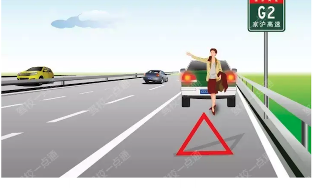
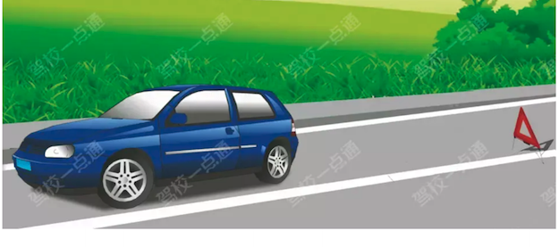
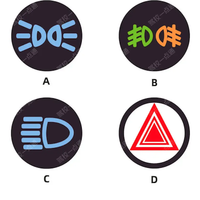
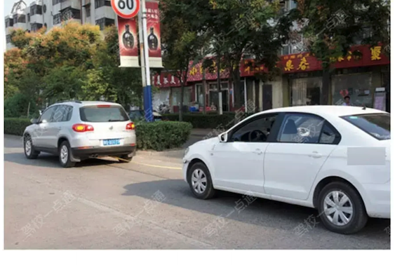

# 事故处置与救援

学习重点：先保命、再报警、再按规定设置警告和撤离。

- 覆盖口诀：36 条
- 覆盖原题：47 题
- 含图原题：5 题

## 本章速背

| 出现 | 口诀/技巧 | 怎么用 | 代表原题 |
|---:|---|---|---|
| 5 | [遇到故障有四步，一灯二停三标志，第四报警等救援](#01_事故处置与救援-tip-001) | 先看图形特征，再回到题干确认问的是名称、含义还是操作。 | P3-063：驾驶机动车在道路上发生故障，车辆难以移动时，以下做法正确的是什么？ |
| 4 | [有争议报警，无争议撤离](#01_事故处置与救援-tip-002) | 适用于安全常识考点总结相关题。做题时先抓题干关键词，再按口诀定位答案。 | P1-002：驾驶机动车发生以下交通事故，哪种情况适用自行协商解决？ |
| 3 | [交通肇事题，选项中三个未开头的选不一样的](#01_事故处置与救援-tip-003) | 这类题适合快速直选；但遇到“错误的是、不能、不得”要先看清正反问法。 | P1-075：交通肇事致一人以上重伤，负事故全部或者主要责任，并具有下列哪种行为的，构成交通肇事罪? |
| 2 | [交通肇事题，选项中三个未开头的，选不一样的](#01_事故处置与救援-tip-004) | 这类题适合快速直选；但遇到“错误的是、不能、不得”要先看清正反问法。 | P1-045：交通肇事致一人以上重伤，负事故全部或者主要责任，并具有下列哪种行为的，构成交通肇事罪? |
| 2 | [看到保护现场，选对](#01_事故处置与救援-tip-005) | 先圈出题干关键词，再到选项里找口诀提示的答案词。 | P2-016：驾驶机动车在道路上发生交通事故，当事人不能自行移动车辆的，应当保护现场并立即报警。 |
| 1 | [不美观不是禁止报废车上路的原因](#01_事故处置与救援-tip-006) | 由于报废车机械老化，极其不符合安全技术标准，因此很容易发生交通事故并影响驾驶人行车安全，需要强制报废。与是否影响城市形象无关。本题选择错误的说法，所以选择“不美观，影响城市形象”。 | P1-028：驾驶达到报废标准的机动车上道路行驶的，公安交通管理部门将会予以收缴。以下说法错误的是什么？ |
| 1 | [两车号牌互换时，要处理完交通违法和事故](#01_事故处置与救援-tip-007) | 适用于驾驶证考点总结相关题。做题时先抓题干关键词，再按口诀定位答案。 | P1-031：下列关于同一机动车所有人名下两辆机动车的号牌号码互换，以下说法正确的是什么？ |
| 1 | [伪造号牌属于违法，不可协商](#01_事故处置与救援-tip-008) | 发生财产损失事故，且双方无争议的可以自行协商解决，但如果事故中有使用伪造、变造的号牌的不可以自行协商，使用伪造、变造的号牌的行为是违法的，所以本题选正确。 《道路交通事故处理程序规定》第十三条：发生死亡事故、伤人事故的，或者发生财产损失事故有机动车无号牌或者使用伪造、变造的号牌的，当事人应当保护现场并立即报警。 | P2-005：机动车之间发生的造成财产损失、尚未造成人员伤亡，且车辆可以移动的交通事故，双方驾驶人对交通事故无争议，但其中一方使用伪造、变造的号牌，不可以自行协商解决。 |
| 1 | [先抢后救、先重后轻 先急后缓、先伤后病；流血的先止血](#01_事故处置与救援-tip-009) | 此技巧用于说明救治伤员的原则。 生命安全放在首位，先救命 | P1-006：行车中遇交通事故受伤者需要抢救时，应怎样做？ |
| 1 | [发生人身伤亡不可自行撤离](#01_事故处置与救援-tip-010) | 发生人身伤亡、事故后果非常严重的交通事故，不可以自行撤离，应该立即报警。所以本题选择错误。 《道路交通安全法》第七十条：在道路上发生交通事故，车辆驾驶人应当立即停车，保护现场；造成人身伤亡的，车辆驾驶人应当立即抢救受伤人员，并迅速报告执勤的交通警察或者公安机关交通管理部门。因抢救受伤人员变动现场的，应当标明位置。 | P2-021：发生人身伤亡、后果严重的交通事故，可自行撤离现场。 |
| 1 | [发生意外/危险，选危险报警闪光灯](#01_事故处置与救援-tip-011) | 这类题适合快速直选；但遇到“错误的是、不能、不得”要先看清正反问法。 | P2-070：车辆发生意外，要及时打开哪个灯？ |
| 1 | [只要有伤亡，就不能不承担责任，一定有责任关系](#01_事故处置与救援-tip-012) | 机动车与行人之间发生交通事故，机动车一方无过错，也要承担不超10%的赔偿责任。所以选择错误。 《道路交通安全法》第七十六条：机动车与非机动车驾驶人、行人之间发生交通事故，机动车一方没有过错的，承担不超过百分之十的赔偿责任。 | P1-083：驾驶机动车与行人之间发生交通事故造成人身伤亡、财产损失的，机动车一方没有过错的，不承担赔偿责任。 |
| 1 | [故意破坏要承担全部责任](#01_事故处置与救援-tip-013) | 发生交通事故后当事人逃逸的，故意破坏、伪造现场、毁灭证据的，均承担全部责任。所以选全部责任。 《道路交通安全法实施条例》第九十二条：发生交通事故后当事人故意破坏、伪造现场、毁灭证据的，承担全部责任。 | P1-004：驾驶机动车发生交通事故后当事人故意破坏、伪造现场、毁灭证据的，应当承担什么责任？ |
| 1 | [有争议报警，无争议收集证据后撤离](#01_事故处置与救援-tip-014) | 适用于安全常识考点总结相关题。做题时先抓题干关键词，再按口诀定位答案。 | P2-045：驾驶机动车发生财产损失交通事故后，当事人对事实及成因无争议移动车辆时需要对现场拍照或者标划停车位置。 |
| 1 | [死亡且逃逸，选3-7年；因逃逸致死，选7年以上](#01_事故处置与救援-tip-015) | 这类题适合快速直选；但遇到“错误的是、不能、不得”要先看清正反问法。 | P1-036：驾驶人违反交通运输管理法规发生重大事故后，因逃逸致人死亡的，处多少年有期徒刑？ |
| 1 | [清障车/道路救援车拖拽牵引事故车](#01_事故处置与救援-tip-016) | 车辆在高速发生故障需要牵引，应由救援车、清障车拖曳、牵引。过路车、大客车、同行车不具备牵引条件。 《道路交通安全法》第六十八条：机动车在高速公路上发生故障或者交通事故，无法正常行驶的，应当由救援车、清障车拖曳、牵引。 | P5-039：机动车在高速公路上发生故障或交通事故无法正常行驶时由什么车拖拽或牵引？ |
| 1 | [牵引车辆时前后车均应打开报警灯](#01_事故处置与救援-tip-017) | 适用于安全常识考点总结相关题。做题时先抓题干关键词，再按口诀定位答案。 | P1-003：车辆因故障等原因需要被牵引时，以下说法正确的是什么？ |
| 1 | [看到200，选对](#01_事故处置与救援-tip-018) | 先圈出题干关键词，再到选项里找口诀提示的答案词。 | P2-026：机动车发生财产损失交通事故，对应当自行撤离现场而未撤离造成交通堵塞的，可以对驾驶人处以200元罚款。 |
| 1 | [看到三轮汽车不得牵引挂车，选对](#01_事故处置与救援-tip-019) | 先圈出题干关键词，再到选项里找口诀提示的答案词。 | P4-018：驾驶机动车牵引挂车时，以下说法正确的是什么？ |
| 1 | [看到出现事故，立即移车，选错](#01_事故处置与救援-tip-020) | 先圈出题干关键词，再到选项里找口诀提示的答案词。 | P2-030：驾驶机动车在道路上发生交通事故要立即将车移到路边。 |
| 1 | [看到刑字结尾的，选错](#01_事故处置与救援-tip-021) | 先圈出题干关键词，再到选项里找口诀提示的答案词。 | P3-037：驾驶人违反交通运输管理法规发生重大事故后，逃逸或者有其他特别恶劣情节的，处7年以上有期徒刑。 |
| 1 | [看到协助，选对](#01_事故处置与救援-tip-022) | 先圈出题干关键词，再到选项里找口诀提示的答案词。 | P2-027：事故报警时，要向交警提供事故地点、人员伤情、车辆号牌等信息，协助交警快速定位到达现场。 |
| 1 | [看到发生事故，选保护现场](#01_事故处置与救援-tip-023) | 先圈出题干关键词，再到选项里找口诀提示的答案词。 | P1-009：行车中遇有前方发生交通事故，需要帮助时，应怎样做？ |
| 1 | [看到报警选酒驾情况](#01_事故处置与救援-tip-024) | 先圈出题干关键词，再到选项里找口诀提示的答案词。 | P1-011：发生交通事故时，下列哪种情况下当事人应当保护现场并立即报警？ |
| 1 | [看到无争议、自行撤离的目的，选避免](#01_事故处置与救援-tip-025) | 先圈出题干关键词，再到选项里找口诀提示的答案词。 | P1-008：机动车之间发生交通事故造成轻微财产损失，当事人对事实及成因无争议时，在确保安全的原则下，对现场拍照或标划事故车辆现场位置后，可自行撤离现场处理损害赔偿事宜，主要目的是什么？ |
| 1 | [看到有争议应报警，选对](#01_事故处置与救援-tip-026) | 先圈出题干关键词，再到选项里找口诀提示的答案词。 | P2-029：驾驶机动车发生未造成人身伤亡的交通事故后，当事人对事实及成因有争议的，应当立即报警。 |
| 1 | [看到标明位置，选对](#01_事故处置与救援-tip-027) | 先圈出题干关键词，再到选项里找口诀提示的答案词。 | P2-015：驾驶人在发生交通事故后因抢救伤员变动现场时要标明位置。 |
| 1 | [看到警察有权，选对](#01_事故处置与救援-tip-028) | 先圈出题干关键词，再到选项里找口诀提示的答案词。 | P2-036：机动车发生轻微财产损失的交通事故，对应当自行撤离现场而未撤离的，交通警察有权责令当事人撤离现场。 |
| 1 | [看到迅速报警，选对](#01_事故处置与救援-tip-029) | 先圈出题干关键词，再到选项里找口诀提示的答案词。 | P3-088：机动车在高速公路上发生故障时，将车上人员迅速转移到右侧路肩上或者应急车道内，并且迅速报警。 |
| 1 | [看到预防事故发生，选对](#01_事故处置与救援-tip-030) | 先圈出题干关键词，再到选项里找口诀提示的答案词。 | P3-051：机动车参加安全技术检验的主要目的是检查车辆各项性能系数，及时消除车辆安全隐患，减少事故发生。 |
| 1 | [警告标志应放在本车道](#01_事故处置与救援-tip-031) | 先看图形特征，再回到题干确认问的是名称、含义还是操作。 | P5-044：车辆在高速公路上发生故障后，为寻求其他车辆的帮助，可将警告标志放置在其他车道。 |
| 1 | [警报灯是为了让后车注意避让](#01_事故处置与救援-tip-032) | 先看图形特征，再回到题干确认问的是名称、含义还是操作。 | P4-054：高速公路上车辆发生故障后，开启危险警报闪光灯和摆放警告标志是为了向其他车辆求助。 |
| 1 | [车有问题报警灯才会亮，继续行车很危险](#01_事故处置与救援-tip-033) | 行车无小事，制动报警灯亮了，说明制动有问题，需要停车检查。如果再继续行驶有安全隐患。 | P3-081：行车中，制动报警灯亮，应试踩一下制动，只要有效可正常行车。 |
| 1 | [遇到交通事故要报警](#01_事故处置与救援-tip-034) | 先看图形特征，再回到题干确认问的是名称、含义还是操作。 | P1-001：如图所示，遇到这种单方交通事故，应当如何处理？ |
| 1 | [雾天开雾灯和危险报警闪光灯](#01_事故处置与救援-tip-035) | 本题考点为灯光的使用相关内容。雾天能见度低，为让其他车辆看到自己，要开启雾灯和危险报警闪光灯。 《道路交通安全法实施条例》规定：机动车在雾天行驶时，应当开启雾灯和危险报警闪光灯。 | P5-035：驾驶机动车在雾天行车开启雾灯和危险报警闪光灯。 |
| 1 | [高150外，普50-100](#01_事故处置与救援-tip-036) | 先看图形特征，再回到题干确认问的是名称、含义还是操作。 | P5-021：驾驶机动车在高速公路上发生故障时，应在来车方向多少米外设置警告标志？ |

## 口诀卡片

### 1. 遇到故障有四步，一灯二停三标志，第四报警等救援

> 记忆核心：此技巧用于说明机动车遇到故障时的四步操作。 第一步：打开危险报警闪光灯； 第二步：将车停到不妨碍交通的地方； 第三步：在车后方设置警告标志； 第四步：人下车去右侧安全地方报警等待救援
> 使用方法：先看图形特征，再回到题干确认问的是名称、含义还是操作。

- 类型/频次：速记口诀×5；共 5 题；含图 2 题
- 对应题号：P3-063、P4-059、P5-030、P5-058、P5-082

#### 代表原题

##### P5-030｜试卷5 冲刺100题

**原题**：如图所示，该机动车在应急车道内停车，以下说法正确的是什么？①未开启危险报警闪光灯②警告标志放置距离不足150米③车上人员未转移到安全区域

**选项**
- A. ①②
- B. ①②③
- C. ②③
- D. ①③

**答案**：C（②③）
**秒懂技巧**：遇到故障有四步，一灯二停三标志，第四报警等救援
**解释**：此技巧用于说明机动车遇到故障时的四步操作。 第一步：打开危险报警闪光灯； 第二步：将车停到不妨碍交通的地方； 第三步：在车后方设置警告标志； 第四步：人下车去右侧安全地方报警等待救援
**相关考点**：安全常识考点总结

##### P5-082｜试卷5 冲刺100题

**原题**：这辆停在路边的机动车没有违法行为。

**选项**
- A. 正确
- B. 错误

**答案**：B（错误）
**秒懂技巧**：遇到故障有四步，一灯二停三标志，第四报警等救援
**解释**：此技巧用于说明机动车遇到故障时的四步操作。 第一步：打开危险报警闪光灯； 第二步：将车停到不妨碍交通的地方； 第三步：在车后方设置警告标志； 第四步：人下车去右侧安全地方报警等待救援
**相关考点**：安全常识考点总结

##### P3-063｜试卷3 高频100题

**原题**：驾驶机动车在道路上发生故障，车辆难以移动时，以下做法正确的是什么？

**选项**
- A. 开启危险报警闪光灯
- B. 在车上长时间鸣喇叭警示
- C. 在车辆后方50米以内设置警告标志
- D. 所有乘员在车内等待救援

**答案**：A（开启危险报警闪光灯）
**秒懂技巧**：遇到故障有四步，一灯二停三标志，第四报警等救援
**解释**：此技巧用于说明机动车遇到故障时的四步操作。 第一步：打开危险报警闪光灯； 第二步：将车停到不妨碍交通的地方； 第三步：在车后方设置警告标志； 第四步：人下车去右侧安全地方报警等待救援
**相关考点**：安全常识考点总结

展开其余 2 道对应原题

##### P4-059｜试卷4 易错100题

**原题**：夜间驾驶机动车在高速公路上发生交通事故，以下做法正确的是什么？

**选项**
- A. 人员下车在原地等待处理交通事故
- B. 开启远光灯，在车内等待救援
- C. 开启危险报警闪光灯，人员转移到安全地带
- D. 关闭所有灯光，人员转移到右侧护栏以外

**答案**：C（开启危险报警闪光灯，人员转移到安全地带）
**秒懂技巧**：遇到故障有四步，一灯二停三标志，第四报警等救援
**解释**：此技巧用于说明机动车遇到故障时的四步操作。 第一步：打开危险报警闪光灯； 第二步：将车停到不妨碍交通的地方； 第三步：在车后方设置警告标志； 第四步：人下车去右侧安全地方报警等待救援
**相关考点**：安全常识考点总结

##### P5-058｜试卷5 冲刺100题

**原题**：驾驶机动车在高速公路发生故障，需要停车排除故障时，以下做法先后顺序正确的是？ ①放置警告标志，转移乘车人员至安全处，迅速报警②开启危险报警闪光灯③将车辆移至不妨碍交通的位置④等待救援

**选项**
- A. ④③①②
- B. ①②③④
- C. ③②①④
- D. ②③①④

**答案**：D（②③①④）
**秒懂技巧**：遇到故障有四步，一灯二停三标志，第四报警等救援
**解释**：此技巧用于说明机动车遇到故障时的四步操作。 第一步：打开危险报警闪光灯； 第二步：将车停到不妨碍交通的地方； 第三步：在车后方设置警告标志； 第四步：人下车去右侧安全地方报警等待救援
**相关考点**：安全常识考点总结

### 2. 有争议报警，无争议撤离

> 记忆核心：适用于安全常识考点总结相关题。做题时先抓题干关键词，再按口诀定位答案。
> 使用方法：适用于安全常识考点总结相关题。做题时先抓题干关键词，再按口诀定位答案。

- 类型/频次：秒懂技巧×4；共 4 题
- 对应题号：P1-002、P1-005、P1-007、P1-010

#### 代表原题

##### P1-002｜试卷1 高频100题

**原题**：驾驶机动车发生以下交通事故，哪种情况适用自行协商解决？

**选项**
- A. 对方饮酒的
- B. 对事实及成因有争议的
- C. 未造成人身伤亡，对事实及成因无争议的
- D. 造成人身伤亡的

**答案**：C（未造成人身伤亡，对事实及成因无争议的）
**秒懂技巧**：有争议报警，无争议撤离
**解释**：适用于安全常识考点总结相关题。做题时先抓题干关键词，再按口诀定位答案。
**相关考点**：安全常识考点总结

##### P1-005｜试卷1 高频100题

**原题**：在道路上发生未造成人员伤亡且无争议的轻微交通事故如何处置？

**选项**
- A. 保护好现场再协商
- B. 不要移动车辆
- C. 疏导其他车辆绕行
- D. 撤离现场自行协商

**答案**：D（撤离现场自行协商）
**秒懂技巧**：有争议报警，无争议撤离
**解释**：适用于安全常识考点总结相关题。做题时先抓题干关键词，再按口诀定位答案。
**相关考点**：安全常识考点总结

##### P1-007｜试卷1 高频100题

**原题**：发生无人员伤亡事故，当事人对事故事实及成因有争议时，以下做法正确的是（）。

**选项**
- A. 迅速报警
- B. 找人帮忙解决
- C. 逃离现场
- D. 占道继续和对方争辩

**答案**：A（迅速报警）
**秒懂技巧**：有争议报警，无争议撤离
**解释**：当事人一方对于事故成因有争议的，应及时报警处理。本题选迅速报警。 《道路交通安全法实施条例》第八十六条：机动车与机动车、机动车与非机动车在道路上发生未造成人身伤亡的交通事故，当事人对交通事故事实及成因有争议的，应当迅速报警。
**相关考点**：安全常识考点总结

展开其余 1 道对应原题

##### P1-010｜试卷1 高频100题

**原题**：驾驶机动车发生交通事故未造成人身伤亡的，责任明确双方无争议时，应当如何处置？

**选项**
- A. 保护好现场再协商
- B. 不要移动车辆
- C. 疏导其他车辆绕行
- D. 撤离现场自行协商

**答案**：D（撤离现场自行协商）
**秒懂技巧**：有争议报警，无争议撤离
**解释**：发生没有人员伤亡且责任明确的交通事故时，可以撤离现场自行协商。 《道路交通安全法》第七十条：在道路上发生交通事故，未造成人身伤亡，当事人对事实及成因无争议的，可以即行撤离现场，恢复交通，自行协商处理损害赔偿事宜；不即行撤离现场的，应当迅速报告执勤的交通警察或者公安机关交通管理部门。
**相关考点**：安全常识考点总结

### 3. 交通肇事题，选项中三个未开头的选不一样的

> 记忆核心：适用于判罚题考点总结相关题。做题时先抓题干关键词，再按口诀定位答案。
> 使用方法：这类题适合快速直选；但遇到“错误的是、不能、不得”要先看清正反问法。

- 类型/频次：速记口诀×3；共 3 题
- 对应题号：P1-075、P2-003、P2-012

#### 代表原题

##### P1-075｜试卷1 高频100题

**原题**：交通肇事致一人以上重伤，负事故全部或者主要责任，并具有下列哪种行为的，构成交通肇事罪?

**选项**
- A. 未带驾驶证
- B. 未报警
- C. 无驾驶资格驾驶机动车辆的
- D. 未抢救受伤人员

**答案**：C（无驾驶资格驾驶机动车辆的）
**秒懂技巧**：交通肇事题，选项中三个未开头的选不一样的
**解释**：适用于判罚题考点总结相关题。做题时先抓题干关键词，再按口诀定位答案。
**相关考点**：判罚题考点总结

##### P2-003｜试卷2 高频100题

**原题**：交通肇事致一人以上重伤，负事故全部或者主要责任，并具有下列哪种行为的，构成交通肇事罪?

**选项**
- A. 未带驾驶证
- B. 酒后、吸食毒品后驾驶机动车辆的
- C. 未报警
- D. 未抢救受伤人员

**答案**：B（酒后、吸食毒品后驾驶机动车辆的）
**秒懂技巧**：交通肇事题，选项中三个未开头的选不一样的
**解释**：适用于判罚题考点总结相关题。做题时先抓题干关键词，再按口诀定位答案。
**相关考点**：判罚题考点总结

##### P2-012｜试卷2 高频100题

**原题**：交通肇事致一人以上重伤，负事故全部或者主要责任，并具有下列哪种行为的，构成交通肇事罪?

**选项**
- A. 未带驾驶证
- B. 未及时报警
- C. 严重超载驾驶的
- D. 未抢救受伤人员

**答案**：C（严重超载驾驶的）
**秒懂技巧**：交通肇事题，选项中三个未开头的选不一样的
**解释**：适用于判罚题考点总结相关题。做题时先抓题干关键词，再按口诀定位答案。
**相关考点**：判罚题考点总结

### 4. 交通肇事题，选项中三个未开头的，选不一样的

> 记忆核心：适用于判罚题考点总结相关题。做题时先抓题干关键词，再按口诀定位答案。
> 使用方法：这类题适合快速直选；但遇到“错误的是、不能、不得”要先看清正反问法。

- 类型/频次：速记口诀×2；共 2 题
- 对应题号：P1-045、P2-014

#### 代表原题

##### P1-045｜试卷1 高频100题

**原题**：交通肇事致一人以上重伤，负事故全部或者主要责任，并具有下列哪种行为的，构成交通肇事罪?

**选项**
- A. 未带驾驶证
- B. 未报警
- C. 明知是安全装置不全或者安全机件失灵的机动车辆而驾驶的
- D. 未抢救受伤人员

**答案**：C（明知是安全装置不全或者安全机件失灵的机动车辆而驾驶的）
**秒懂技巧**：交通肇事题，选项中三个未开头的，选不一样的
**解释**：适用于判罚题考点总结相关题。做题时先抓题干关键词，再按口诀定位答案。
**相关考点**：判罚题考点总结

##### P2-014｜试卷2 高频100题

**原题**：交通肇事致一人以上重伤，负事故全部或者主要责任，并具有下列哪种行为的，构成交通肇事罪?

**选项**
- A. 未带驾驶证
- B. 未报警
- C. 明知是无牌证或者已报废的机动车辆而驾驶的
- D. 未抢救受伤人员

**答案**：C（明知是无牌证或者已报废的机动车辆而驾驶的）
**秒懂技巧**：交通肇事题，选项中三个未开头的，选不一样的
**解释**：适用于判罚题考点总结相关题。做题时先抓题干关键词，再按口诀定位答案。
**相关考点**：判罚题考点总结

### 5. 看到保护现场，选对

> 记忆核心：在道路上发生交通事故，车辆驾驶人应保护现场，立即停车处理，当事人不能自行移动车辆的，应报警处理。所以选择正确。 《道路交通事故处理程序规定》第十三条：发生死亡事故、伤人事故的，或者发生财产损失事故且有下列情形之一的，当事人应当保护现场并立即报警：当事人不能自行移动车辆的。
> 使用方法：先圈出题干关键词，再到选项里找口诀提示的答案词。

- 类型/频次：关键字答题×2；共 2 题
- 对应题号：P2-016、P2-053

#### 代表原题

##### P2-016｜试卷2 高频100题

**原题**：驾驶机动车在道路上发生交通事故，当事人不能自行移动车辆的，应当保护现场并立即报警。

**选项**
- A. 正确
- B. 错误

**答案**：A（正确）
**秒懂技巧**：看到保护现场，选对
**解释**：在道路上发生交通事故，车辆驾驶人应保护现场，立即停车处理，当事人不能自行移动车辆的，应报警处理。所以选择正确。 《道路交通事故处理程序规定》第十三条：发生死亡事故、伤人事故的，或者发生财产损失事故且有下列情形之一的，当事人应当保护现场并立即报警：当事人不能自行移动车辆的。
**相关考点**：安全常识考点总结

##### P2-053｜试卷2 高频100题

**原题**：道路交通事故中，机动车无号牌、检验合格标志、保险标志时，要保护现场并立即报警。

**选项**
- A. 正确
- B. 错误

**答案**：A（正确）
**秒懂技巧**：看到保护现场，选对
**解释**：在交通事故中，机动车无号牌、检验合格标志、保险标志，要保护现场并立即报警。 《道路交通事故处理程序规定》第十三条：发生死亡事故、伤人事故的，或者发生财产损失事故有机动车无号牌或者使用伪造、变造的号牌的，当事人应当保护现场并立即报警。
**相关考点**：安全常识考点总结

### 6. 不美观不是禁止报废车上路的原因

> 记忆核心：由于报废车机械老化，极其不符合安全技术标准，因此很容易发生交通事故并影响驾驶人行车安全，需要强制报废。与是否影响城市形象无关。本题选择错误的说法，所以选择“不美观，影响城市形象”。
> 使用方法：由于报废车机械老化，极其不符合安全技术标准，因此很容易发生交通事故并影响驾驶人行车安全，需要强制报废。与是否影响城市形象无关。本题选择错误的说法，所以选择“不美观，影响城市形象”。

- 类型/频次：秒懂技巧×1；共 1 题
- 对应题号：P1-028

#### 代表原题

##### P1-028｜试卷1 高频100题

**原题**：驾驶达到报废标准的机动车上道路行驶的，公安交通管理部门将会予以收缴。以下说法错误的是什么？

**选项**
- A. 驾驶报废车影响驾驶人行车安全
- B. 报废车机械老化、容易发生交通事故
- C. 车辆不符合安全技术标准，需要强制报废
- D. 不美观，影响城市形象

**答案**：D（不美观，影响城市形象）
**秒懂技巧**：不美观不是禁止报废车上路的原因
**解释**：由于报废车机械老化，极其不符合安全技术标准，因此很容易发生交通事故并影响驾驶人行车安全，需要强制报废。与是否影响城市形象无关。本题选择错误的说法，所以选择“不美观，影响城市形象”。
**相关考点**：安全常识考点总结

### 7. 两车号牌互换时，要处理完交通违法和事故

> 记忆核心：适用于驾驶证考点总结相关题。做题时先抓题干关键词，再按口诀定位答案。
> 使用方法：适用于驾驶证考点总结相关题。做题时先抓题干关键词，再按口诀定位答案。

- 类型/频次：秒懂技巧×1；共 1 题
- 对应题号：P1-031

#### 代表原题

##### P1-031｜试卷1 高频100题

**原题**：下列关于同一机动车所有人名下两辆机动车的号牌号码互换，以下说法正确的是什么？

**选项**
- A. 同一机动车在一年内可以多次互换变更机动车号牌号码
- B. 两辆机动车在不同辖区车辆管理所登记可以申请互换
- C. 两辆机动车使用性质为营运的可以申请互换
- D. 申请前两车无未处理的道路交通安全违法和交通事故记录

**答案**：D（申请前两车无未处理的道路交通安全违法和交通事故记录）
**秒懂技巧**：两车号牌互换时，要处理完交通违法和事故
**解释**：适用于驾驶证考点总结相关题。做题时先抓题干关键词，再按口诀定位答案。
**相关考点**：驾驶证考点总结

### 8. 伪造号牌属于违法，不可协商

> 记忆核心：发生财产损失事故，且双方无争议的可以自行协商解决，但如果事故中有使用伪造、变造的号牌的不可以自行协商，使用伪造、变造的号牌的行为是违法的，所以本题选正确。 《道路交通事故处理程序规定》第十三条：发生死亡事故、伤人事故的，或者发生财产损失事故有机动车无号牌或者使用伪造、变造的号牌的，当事人应当保护现场并立即报警。
> 使用方法：发生财产损失事故，且双方无争议的可以自行协商解决，但如果事故中有使用伪造、变造的号牌的不可以自行协商，使用伪造、变造的号牌的行为是违法的，所以本题选正确。 《道路交通事故处理程序规定》第十三条：发生死亡事故、伤人事故的，或者发生财产损失事故有机动车无号牌或者使用伪造、变造的号牌的，当事人应当保护现场并立即报警。

- 类型/频次：秒懂技巧×1；共 1 题
- 对应题号：P2-005

#### 代表原题

##### P2-005｜试卷2 高频100题

**原题**：机动车之间发生的造成财产损失、尚未造成人员伤亡，且车辆可以移动的交通事故，双方驾驶人对交通事故无争议，但其中一方使用伪造、变造的号牌，不可以自行协商解决。

**选项**
- A. 正确
- B. 错误

**答案**：A（正确）
**秒懂技巧**：伪造号牌属于违法，不可协商
**解释**：发生财产损失事故，且双方无争议的可以自行协商解决，但如果事故中有使用伪造、变造的号牌的不可以自行协商，使用伪造、变造的号牌的行为是违法的，所以本题选正确。 《道路交通事故处理程序规定》第十三条：发生死亡事故、伤人事故的，或者发生财产损失事故有机动车无号牌或者使用伪造、变造的号牌的，当事人应当保护现场并立即报警。
**相关考点**：安全常识考点总结

### 9. 先抢后救、先重后轻 先急后缓、先伤后病；流血的先止血

> 记忆核心：此技巧用于说明救治伤员的原则。 生命安全放在首位，先救命
> 使用方法：此技巧用于说明救治伤员的原则。 生命安全放在首位，先救命

- 类型/频次：速记口诀×1；共 1 题
- 对应题号：P1-006

#### 代表原题

##### P1-006｜试卷1 高频100题

**原题**：行车中遇交通事故受伤者需要抢救时，应怎样做？

**选项**
- A. 及时将伤者送医院抢救或拨打急救电话
- B. 尽量避开，少惹麻烦
- C. 绕过现场行驶
- D. 借故避开现场

**答案**：A（及时将伤者送医院抢救或拨打急救电话）
**秒懂技巧**：先抢后救、先重后轻 先急后缓、先伤后病；流血的先止血
**解释**：此技巧用于说明救治伤员的原则。 生命安全放在首位，先救命
**相关考点**：安全常识考点总结

### 10. 发生人身伤亡不可自行撤离

> 记忆核心：发生人身伤亡、事故后果非常严重的交通事故，不可以自行撤离，应该立即报警。所以本题选择错误。 《道路交通安全法》第七十条：在道路上发生交通事故，车辆驾驶人应当立即停车，保护现场；造成人身伤亡的，车辆驾驶人应当立即抢救受伤人员，并迅速报告执勤的交通警察或者公安机关交通管理部门。因抢救受伤人员变动现场的，应当标明位置。
> 使用方法：发生人身伤亡、事故后果非常严重的交通事故，不可以自行撤离，应该立即报警。所以本题选择错误。 《道路交通安全法》第七十条：在道路上发生交通事故，车辆驾驶人应当立即停车，保护现场；造成人身伤亡的，车辆驾驶人应当立即抢救受伤人员，并迅速报告执勤的交通警察或者公安机关交通管理部门。因抢救受伤人员变动现场的，应当标明位置。

- 类型/频次：秒懂技巧×1；共 1 题
- 对应题号：P2-021

#### 代表原题

##### P2-021｜试卷2 高频100题

**原题**：发生人身伤亡、后果严重的交通事故，可自行撤离现场。

**选项**
- A. 正确
- B. 错误

**答案**：B（错误）
**秒懂技巧**：发生人身伤亡不可自行撤离
**解释**：发生人身伤亡、事故后果非常严重的交通事故，不可以自行撤离，应该立即报警。所以本题选择错误。 《道路交通安全法》第七十条：在道路上发生交通事故，车辆驾驶人应当立即停车，保护现场；造成人身伤亡的，车辆驾驶人应当立即抢救受伤人员，并迅速报告执勤的交通警察或者公安机关交通管理部门。因抢救受伤人员变动现场的，应当标明位置。
**相关考点**：安全常识考点总结

### 11. 发生意外/危险，选危险报警闪光灯

> 记忆核心：适用于速度灯光考点总结相关题。做题时先抓题干关键词，再按口诀定位答案。
> 使用方法：这类题适合快速直选；但遇到“错误的是、不能、不得”要先看清正反问法。

- 类型/频次：关键字答题×1；共 1 题；含图 1 题
- 对应题号：P2-070

#### 代表原题

##### P2-070｜试卷2 高频100题

**原题**：车辆发生意外，要及时打开哪个灯？

**选项**
- A. 如图A所示
- B. 如图B所示
- C. 如图C所示
- D. 如图D所示

**答案**：D（如图D所示）
**秒懂技巧**：发生意外/危险，选危险报警闪光灯
**解释**：适用于速度灯光考点总结相关题。做题时先抓题干关键词，再按口诀定位答案。
**相关考点**：速度灯光考点总结

### 12. 只要有伤亡，就不能不承担责任，一定有责任关系

> 记忆核心：机动车与行人之间发生交通事故，机动车一方无过错，也要承担不超10%的赔偿责任。所以选择错误。 《道路交通安全法》第七十六条：机动车与非机动车驾驶人、行人之间发生交通事故，机动车一方没有过错的，承担不超过百分之十的赔偿责任。
> 使用方法：机动车与行人之间发生交通事故，机动车一方无过错，也要承担不超10%的赔偿责任。所以选择错误。 《道路交通安全法》第七十六条：机动车与非机动车驾驶人、行人之间发生交通事故，机动车一方没有过错的，承担不超过百分之十的赔偿责任。

- 类型/频次：秒懂技巧×1；共 1 题
- 对应题号：P1-083

#### 代表原题

##### P1-083｜试卷1 高频100题

**原题**：驾驶机动车与行人之间发生交通事故造成人身伤亡、财产损失的，机动车一方没有过错的，不承担赔偿责任。

**选项**
- A. 正确
- B. 错误

**答案**：B（错误）
**秒懂技巧**：只要有伤亡，就不能不承担责任，一定有责任关系
**解释**：机动车与行人之间发生交通事故，机动车一方无过错，也要承担不超10%的赔偿责任。所以选择错误。 《道路交通安全法》第七十六条：机动车与非机动车驾驶人、行人之间发生交通事故，机动车一方没有过错的，承担不超过百分之十的赔偿责任。
**相关考点**：安全常识考点总结

### 13. 故意破坏要承担全部责任

> 记忆核心：发生交通事故后当事人逃逸的，故意破坏、伪造现场、毁灭证据的，均承担全部责任。所以选全部责任。 《道路交通安全法实施条例》第九十二条：发生交通事故后当事人故意破坏、伪造现场、毁灭证据的，承担全部责任。
> 使用方法：发生交通事故后当事人逃逸的，故意破坏、伪造现场、毁灭证据的，均承担全部责任。所以选全部责任。 《道路交通安全法实施条例》第九十二条：发生交通事故后当事人故意破坏、伪造现场、毁灭证据的，承担全部责任。

- 类型/频次：秒懂技巧×1；共 1 题
- 对应题号：P1-004

#### 代表原题

##### P1-004｜试卷1 高频100题

**原题**：驾驶机动车发生交通事故后当事人故意破坏、伪造现场、毁灭证据的，应当承担什么责任？

**选项**
- A. 主要责任
- B. 次要责任
- C. 同等责任
- D. 全部责任

**答案**：D（全部责任）
**秒懂技巧**：故意破坏要承担全部责任
**解释**：发生交通事故后当事人逃逸的，故意破坏、伪造现场、毁灭证据的，均承担全部责任。所以选全部责任。 《道路交通安全法实施条例》第九十二条：发生交通事故后当事人故意破坏、伪造现场、毁灭证据的，承担全部责任。
**相关考点**：安全常识考点总结

### 14. 有争议报警，无争议收集证据后撤离

> 记忆核心：适用于安全常识考点总结相关题。做题时先抓题干关键词，再按口诀定位答案。
> 使用方法：适用于安全常识考点总结相关题。做题时先抓题干关键词，再按口诀定位答案。

- 类型/频次：秒懂技巧×1；共 1 题
- 对应题号：P2-045

#### 代表原题

##### P2-045｜试卷2 高频100题

**原题**：驾驶机动车发生财产损失交通事故后，当事人对事实及成因无争议移动车辆时需要对现场拍照或者标划停车位置。

**选项**
- A. 正确
- B. 错误

**答案**：A（正确）
**秒懂技巧**：有争议报警，无争议收集证据后撤离
**解释**：适用于安全常识考点总结相关题。做题时先抓题干关键词，再按口诀定位答案。
**相关考点**：安全常识考点总结

### 15. 死亡且逃逸，选3-7年；因逃逸致死，选7年以上

> 记忆核心：本题考点为肇事刑罚。因逃逸致人死亡，处七年以上有期徒刑。 《中华人民共和国刑法》第一百三十三条：因逃逸致人死亡的，处七年以上有期徒刑。 发生事故未逃逸：选3年以下；逃逸或情节特别恶劣：选3-7年；因逃逸致人死亡：选7年以上。
> 使用方法：这类题适合快速直选；但遇到“错误的是、不能、不得”要先看清正反问法。

- 类型/频次：秒懂技巧×1；共 1 题
- 对应题号：P1-036

#### 代表原题

##### P1-036｜试卷1 高频100题

**原题**：驾驶人违反交通运输管理法规发生重大事故后，因逃逸致人死亡的，处多少年有期徒刑？

**选项**
- A. 2年以下
- B. 3年以下
- C. 7年以下
- D. 7年以上

**答案**：D（7年以上）
**秒懂技巧**：死亡且逃逸，选3-7年；因逃逸致死，选7年以上
**解释**：本题考点为肇事刑罚。因逃逸致人死亡，处七年以上有期徒刑。 《中华人民共和国刑法》第一百三十三条：因逃逸致人死亡的，处七年以上有期徒刑。 发生事故未逃逸：选3年以下；逃逸或情节特别恶劣：选3-7年；因逃逸致人死亡：选7年以上。
**相关考点**：判罚题考点总结

### 16. 清障车/道路救援车拖拽牵引事故车

> 记忆核心：车辆在高速发生故障需要牵引，应由救援车、清障车拖曳、牵引。过路车、大客车、同行车不具备牵引条件。 《道路交通安全法》第六十八条：机动车在高速公路上发生故障或者交通事故，无法正常行驶的，应当由救援车、清障车拖曳、牵引。
> 使用方法：车辆在高速发生故障需要牵引，应由救援车、清障车拖曳、牵引。过路车、大客车、同行车不具备牵引条件。 《道路交通安全法》第六十八条：机动车在高速公路上发生故障或者交通事故，无法正常行驶的，应当由救援车、清障车拖曳、牵引。

- 类型/频次：秒懂技巧×1；共 1 题
- 对应题号：P5-039

#### 代表原题

##### P5-039｜试卷5 冲刺100题

**原题**：机动车在高速公路上发生故障或交通事故无法正常行驶时由什么车拖拽或牵引？

**选项**
- A. 过路车
- B. 大客车
- C. 同行车
- D. 清障车

**答案**：D（清障车）
**秒懂技巧**：清障车/道路救援车拖拽牵引事故车
**解释**：车辆在高速发生故障需要牵引，应由救援车、清障车拖曳、牵引。过路车、大客车、同行车不具备牵引条件。 《道路交通安全法》第六十八条：机动车在高速公路上发生故障或者交通事故，无法正常行驶的，应当由救援车、清障车拖曳、牵引。
**相关考点**：安全常识考点总结

### 17. 牵引车辆时前后车均应打开报警灯

> 记忆核心：适用于安全常识考点总结相关题。做题时先抓题干关键词，再按口诀定位答案。
> 使用方法：适用于安全常识考点总结相关题。做题时先抓题干关键词，再按口诀定位答案。

- 类型/频次：秒懂技巧×1；共 1 题；含图 1 题
- 对应题号：P1-003

#### 代表原题

##### P1-003｜试卷1 高频100题

**原题**：车辆因故障等原因需要被牵引时，以下说法正确的是什么？

**选项**
- A. 前后车均应打开报警灯
- B. 所有车辆都应让行
- C. 两车尽量快速行驶
- D. 不受交通信号限制

**答案**：A（前后车均应打开报警灯）
**秒懂技巧**：牵引车辆时前后车均应打开报警灯
**解释**：适用于安全常识考点总结相关题。做题时先抓题干关键词，再按口诀定位答案。
**相关考点**：安全常识考点总结

### 18. 看到200，选对

> 记忆核心：发生财产损失的交通事故，应当撤离现场而未撤离的，并造成交通拥堵，处罚款200。所以本题选择正确。 《道路交通事故处理程序规定》第十九条：对应当自行撤离现场而未撤离的，交通警察应当责令当事人撤离现场。造成交通堵塞的，对驾驶人处以200元罚款。
> 使用方法：先圈出题干关键词，再到选项里找口诀提示的答案词。

- 类型/频次：关键字答题×1；共 1 题
- 对应题号：P2-026

#### 代表原题

##### P2-026｜试卷2 高频100题

**原题**：机动车发生财产损失交通事故，对应当自行撤离现场而未撤离造成交通堵塞的，可以对驾驶人处以200元罚款。

**选项**
- A. 正确
- B. 错误

**答案**：A（正确）
**秒懂技巧**：看到200，选对
**解释**：发生财产损失的交通事故，应当撤离现场而未撤离的，并造成交通拥堵，处罚款200。所以本题选择正确。 《道路交通事故处理程序规定》第十九条：对应当自行撤离现场而未撤离的，交通警察应当责令当事人撤离现场。造成交通堵塞的，对驾驶人处以200元罚款。
**相关考点**：罚款题考点总结

### 19. 看到三轮汽车不得牵引挂车，选对

> 记忆核心：低速汽车、三轮汽车不得牵引挂车；半挂牵引车一次只可以牵引1辆挂车。题中问正确的，所以选三轮汽车不得牵引挂车。 《道路交通安全法实施条例》第五十六条：机动车牵引挂车应当符合下列规定：载货汽车、半挂牵引车、拖拉机只允许牵引1辆挂车；载货汽车所牵引挂车的载质量不得超过载货汽车本身的载质量；大型、中型载客汽车，低速载货汽车，三轮汽车以及其他机动车不得牵引挂车。
> 使用方法：先圈出题干关键词，再到选项里找口诀提示的答案词。

- 类型/频次：关键字答题×1；共 1 题
- 对应题号：P4-018

#### 代表原题

##### P4-018｜试卷4 易错100题

**原题**：驾驶机动车牵引挂车时，以下说法正确的是什么？

**选项**
- A. 低速载货汽车可以牵引挂车
- B. 三轮汽车不得牵引挂车
- C. 载货汽车所牵引挂车的载质量可以超过载货汽车本身的载质量
- D. 半挂牵引车可以牵引2辆挂车

**答案**：B（三轮汽车不得牵引挂车）
**秒懂技巧**：看到三轮汽车不得牵引挂车，选对
**解释**：低速汽车、三轮汽车不得牵引挂车；半挂牵引车一次只可以牵引1辆挂车。题中问正确的，所以选三轮汽车不得牵引挂车。 《道路交通安全法实施条例》第五十六条：机动车牵引挂车应当符合下列规定：载货汽车、半挂牵引车、拖拉机只允许牵引1辆挂车；载货汽车所牵引挂车的载质量不得超过载货汽车本身的载质量；大型、中型载客汽车，低速载货汽车，三轮汽车以及其他机动车不得牵引挂车。
**相关考点**：驾驶证考点总结

### 20. 看到出现事故，立即移车，选错

> 记忆核心：适用于安全常识考点总结相关题。做题时先抓题干关键词，再按口诀定位答案。
> 使用方法：先圈出题干关键词，再到选项里找口诀提示的答案词。

- 类型/频次：关键字答题×1；共 1 题
- 对应题号：P2-030

#### 代表原题

##### P2-030｜试卷2 高频100题

**原题**：驾驶机动车在道路上发生交通事故要立即将车移到路边。

**选项**
- A. 正确
- B. 错误

**答案**：B（错误）
**秒懂技巧**：看到出现事故，立即移车，选错
**解释**：适用于安全常识考点总结相关题。做题时先抓题干关键词，再按口诀定位答案。
**相关考点**：安全常识考点总结

### 21. 看到刑字结尾的，选错

> 记忆核心：发生重大事故后，逃逸或者有其他特别恶劣情节的，处三年以上七年以下有期徒刑，题中说处7年以上，所以选择错误。 《中华人民共和国刑法》第一百三十三条：交通运输肇事后逃逸或者有其他特别恶劣情节的，处三年以上七年以下有期徒刑。 发生事故未逃逸：选3年以下；逃逸或情节特别恶劣：选3-7年；因逃逸致人死亡：选7年以上。
> 使用方法：先圈出题干关键词，再到选项里找口诀提示的答案词。

- 类型/频次：关键字答题×1；共 1 题
- 对应题号：P3-037

#### 代表原题

##### P3-037｜试卷3 高频100题

**原题**：驾驶人违反交通运输管理法规发生重大事故后，逃逸或者有其他特别恶劣情节的，处7年以上有期徒刑。

**选项**
- A. 正确
- B. 错误

**答案**：B（错误）
**秒懂技巧**：看到刑字结尾的，选错
**解释**：发生重大事故后，逃逸或者有其他特别恶劣情节的，处三年以上七年以下有期徒刑，题中说处7年以上，所以选择错误。 《中华人民共和国刑法》第一百三十三条：交通运输肇事后逃逸或者有其他特别恶劣情节的，处三年以上七年以下有期徒刑。 发生事故未逃逸：选3年以下；逃逸或情节特别恶劣：选3-7年；因逃逸致人死亡：选7年以上。
**相关考点**：判罚题考点总结

### 22. 看到协助，选对

> 记忆核心：适用于安全常识考点总结相关题。做题时先抓题干关键词，再按口诀定位答案。
> 使用方法：先圈出题干关键词，再到选项里找口诀提示的答案词。

- 类型/频次：关键字答题×1；共 1 题
- 对应题号：P2-027

#### 代表原题

##### P2-027｜试卷2 高频100题

**原题**：事故报警时，要向交警提供事故地点、人员伤情、车辆号牌等信息，协助交警快速定位到达现场。

**选项**
- A. 正确
- B. 错误

**答案**：A（正确）
**秒懂技巧**：看到协助，选对
**解释**：适用于安全常识考点总结相关题。做题时先抓题干关键词，再按口诀定位答案。
**相关考点**：安全常识考点总结

### 23. 看到发生事故，选保护现场

> 记忆核心：适用于安全常识考点总结相关题。做题时先抓题干关键词，再按口诀定位答案。
> 使用方法：先圈出题干关键词，再到选项里找口诀提示的答案词。

- 类型/频次：关键字答题×1；共 1 题
- 对应题号：P1-009

#### 代表原题

##### P1-009｜试卷1 高频100题

**原题**：行车中遇有前方发生交通事故，需要帮助时，应怎样做？

**选项**
- A. 尽量绕道躲避
- B. 立即报警，停车观望
- C. 协助保护现场，并立即报警
- D. 加速通过，不予理睬

**答案**：C（协助保护现场，并立即报警）
**秒懂技巧**：看到发生事故，选保护现场
**解释**：适用于安全常识考点总结相关题。做题时先抓题干关键词，再按口诀定位答案。
**相关考点**：安全常识考点总结

### 24. 看到报警选酒驾情况

> 记忆核心：事故中驾驶人有酒后驾驶嫌疑时，要保护现场并立即报警。 《道路交通事故处理程序规定》第十三条：发生死亡事故、伤人事故的，或者发生财产损失事故且驾驶人有饮酒、服用国家管制的精神药品或者麻醉药品嫌疑的，当事人应当保护现场并立即报警。
> 使用方法：先圈出题干关键词，再到选项里找口诀提示的答案词。

- 类型/频次：关键字答题×1；共 1 题
- 对应题号：P1-011

#### 代表原题

##### P1-011｜试卷1 高频100题

**原题**：发生交通事故时，下列哪种情况下当事人应当保护现场并立即报警？

**选项**
- A. 未造成人员伤亡的
- B. 未发生财产损失事故
- C. 未损害公共设施及建筑物的
- D. 驾驶人有酒后驾驶嫌疑的

**答案**：D（驾驶人有酒后驾驶嫌疑的）
**秒懂技巧**：看到报警选酒驾情况
**解释**：事故中驾驶人有酒后驾驶嫌疑时，要保护现场并立即报警。 《道路交通事故处理程序规定》第十三条：发生死亡事故、伤人事故的，或者发生财产损失事故且驾驶人有饮酒、服用国家管制的精神药品或者麻醉药品嫌疑的，当事人应当保护现场并立即报警。
**相关考点**：安全常识考点总结

### 25. 看到无争议、自行撤离的目的，选避免

> 记忆核心：适用于安全常识考点总结相关题。做题时先抓题干关键词，再按口诀定位答案。
> 使用方法：先圈出题干关键词，再到选项里找口诀提示的答案词。

- 类型/频次：关键字答题×1；共 1 题
- 对应题号：P1-008

#### 代表原题

##### P1-008｜试卷1 高频100题

**原题**：机动车之间发生交通事故造成轻微财产损失，当事人对事实及成因无争议时，在确保安全的原则下，对现场拍照或标划事故车辆现场位置后，可自行撤离现场处理损害赔偿事宜，主要目的是什么？

**选项**
- A. 双方互有损失
- B. 找现场证人就行了，不必报警
- C. 为了及时恢复交通，避免造成交通拥堵
- D. 事故后果很小，无需赔偿

**答案**：C（为了及时恢复交通，避免造成交通拥堵）
**秒懂技巧**：看到无争议、自行撤离的目的，选避免
**解释**：适用于安全常识考点总结相关题。做题时先抓题干关键词，再按口诀定位答案。
**相关考点**：安全常识考点总结

### 26. 看到有争议应报警，选对

> 记忆核心：适用于安全常识考点总结相关题。做题时先抓题干关键词，再按口诀定位答案。
> 使用方法：先圈出题干关键词，再到选项里找口诀提示的答案词。

- 类型/频次：关键字答题×1；共 1 题
- 对应题号：P2-029

#### 代表原题

##### P2-029｜试卷2 高频100题

**原题**：驾驶机动车发生未造成人身伤亡的交通事故后，当事人对事实及成因有争议的，应当立即报警。

**选项**
- A. 正确
- B. 错误

**答案**：A（正确）
**秒懂技巧**：看到有争议应报警，选对
**解释**：适用于安全常识考点总结相关题。做题时先抓题干关键词，再按口诀定位答案。
**相关考点**：安全常识考点总结

### 27. 看到标明位置，选对

> 记忆核心：发生人员伤亡的交通事故，因抢救受伤人员导致现场位置变动的，要标明现场位置，所以本题选正确。 《道路交通安全法》第七十条：在道路上发生交通事故，车辆驾驶人应当立即停车，保护现场；造成人身伤亡的，车辆驾驶人应当立即抢救受伤人员，并迅速报告执勤的交通警察或者公安机关交通管理部门。因抢救受伤人员变动现场的，应当标明位置。
> 使用方法：先圈出题干关键词，再到选项里找口诀提示的答案词。

- 类型/频次：关键字答题×1；共 1 题
- 对应题号：P2-015

#### 代表原题

##### P2-015｜试卷2 高频100题

**原题**：驾驶人在发生交通事故后因抢救伤员变动现场时要标明位置。

**选项**
- A. 正确
- B. 错误

**答案**：A（正确）
**秒懂技巧**：看到标明位置，选对
**解释**：发生人员伤亡的交通事故，因抢救受伤人员导致现场位置变动的，要标明现场位置，所以本题选正确。 《道路交通安全法》第七十条：在道路上发生交通事故，车辆驾驶人应当立即停车，保护现场；造成人身伤亡的，车辆驾驶人应当立即抢救受伤人员，并迅速报告执勤的交通警察或者公安机关交通管理部门。因抢救受伤人员变动现场的，应当标明位置。
**相关考点**：安全常识考点总结

### 28. 看到警察有权，选对

> 记忆核心：发生财产损失的交通事故，应当撤离现场而未撤离的会对交通造成阻碍，应尽快撤离。所以本题选择正确。 《道路交通事故处理程序规定》第十九条：对应当自行撤离现场而未撤离的，交通警察应当责令当事人撤离现场。造成交通堵塞的，对驾驶人处以200元罚款。
> 使用方法：先圈出题干关键词，再到选项里找口诀提示的答案词。

- 类型/频次：关键字答题×1；共 1 题
- 对应题号：P2-036

#### 代表原题

##### P2-036｜试卷2 高频100题

**原题**：机动车发生轻微财产损失的交通事故，对应当自行撤离现场而未撤离的，交通警察有权责令当事人撤离现场。

**选项**
- A. 正确
- B. 错误

**答案**：A（正确）
**秒懂技巧**：看到警察有权，选对
**解释**：发生财产损失的交通事故，应当撤离现场而未撤离的会对交通造成阻碍，应尽快撤离。所以本题选择正确。 《道路交通事故处理程序规定》第十九条：对应当自行撤离现场而未撤离的，交通警察应当责令当事人撤离现场。造成交通堵塞的，对驾驶人处以200元罚款。
**相关考点**：安全常识考点总结

### 29. 看到迅速报警，选对

> 记忆核心：题干中主要说车上人员在发生故障后的做法，并没有提到首先要做什么，因此可以忽略开启危险报警闪光灯一项。选正确。 《道路交通安全法》：机动车在高速公路上发生故障时，车上人员应当迅速转移到右侧路肩上或者应急车道内，并且迅速报警。
> 使用方法：先圈出题干关键词，再到选项里找口诀提示的答案词。

- 类型/频次：关键字答题×1；共 1 题
- 对应题号：P3-088

#### 代表原题

##### P3-088｜试卷3 高频100题

**原题**：机动车在高速公路上发生故障时，将车上人员迅速转移到右侧路肩上或者应急车道内，并且迅速报警。

**选项**
- A. 正确
- B. 错误

**答案**：A（正确）
**秒懂技巧**：看到迅速报警，选对
**解释**：题干中主要说车上人员在发生故障后的做法，并没有提到首先要做什么，因此可以忽略开启危险报警闪光灯一项。选正确。 《道路交通安全法》：机动车在高速公路上发生故障时，车上人员应当迅速转移到右侧路肩上或者应急车道内，并且迅速报警。
**相关考点**：安全常识考点总结

### 30. 看到预防事故发生，选对

> 记忆核心：适用于安全常识考点总结相关题。做题时先抓题干关键词，再按口诀定位答案。
> 使用方法：先圈出题干关键词，再到选项里找口诀提示的答案词。

- 类型/频次：关键字答题×1；共 1 题
- 对应题号：P3-051

#### 代表原题

##### P3-051｜试卷3 高频100题

**原题**：机动车参加安全技术检验的主要目的是检查车辆各项性能系数，及时消除车辆安全隐患，减少事故发生。

**选项**
- A. 正确
- B. 错误

**答案**：A（正确）
**秒懂技巧**：看到预防事故发生，选对
**解释**：适用于安全常识考点总结相关题。做题时先抓题干关键词，再按口诀定位答案。
**相关考点**：安全常识考点总结

### 31. 警告标志应放在本车道

> 记忆核心：车辆发生故障后，应在本车道放置警告标志。题中说放置在其他车道是错误的。 《道路交通安全法》第六十八条：机动车在高速公路上发生故障时，警告标志应当设置在故障车来车方向一百五十米以外。
> 使用方法：先看图形特征，再回到题干确认问的是名称、含义还是操作。

- 类型/频次：秒懂技巧×1；共 1 题
- 对应题号：P5-044

#### 代表原题

##### P5-044｜试卷5 冲刺100题

**原题**：车辆在高速公路上发生故障后，为寻求其他车辆的帮助，可将警告标志放置在其他车道。

**选项**
- A. 正确
- B. 错误

**答案**：B（错误）
**秒懂技巧**：警告标志应放在本车道
**解释**：车辆发生故障后，应在本车道放置警告标志。题中说放置在其他车道是错误的。 《道路交通安全法》第六十八条：机动车在高速公路上发生故障时，警告标志应当设置在故障车来车方向一百五十米以外。
**相关考点**：安全常识考点总结

### 32. 警报灯是为了让后车注意避让

> 记忆核心：机动车在高速公路发生故障时应开启危险报警闪光灯并将警告标志放在车后150米以外的地方，这样做是为了提醒后方来车避让。 《道路交通安全法》第六十八条：机动车在高速公路上发生故障时，应当依照本法第五十二条的有关规定办理；但是，警告标志应当设置在故障车来车方向一百五十米以外，车上人员应当迅速转移到右侧路肩上或者应急车道内，并且迅速报警。
> 使用方法：先看图形特征，再回到题干确认问的是名称、含义还是操作。

- 类型/频次：秒懂技巧×1；共 1 题
- 对应题号：P4-054

#### 代表原题

##### P4-054｜试卷4 易错100题

**原题**：高速公路上车辆发生故障后，开启危险警报闪光灯和摆放警告标志是为了向其他车辆求助。

**选项**
- A. 正确
- B. 错误

**答案**：B（错误）
**秒懂技巧**：警报灯是为了让后车注意避让
**解释**：机动车在高速公路发生故障时应开启危险报警闪光灯并将警告标志放在车后150米以外的地方，这样做是为了提醒后方来车避让。 《道路交通安全法》第六十八条：机动车在高速公路上发生故障时，应当依照本法第五十二条的有关规定办理；但是，警告标志应当设置在故障车来车方向一百五十米以外，车上人员应当迅速转移到右侧路肩上或者应急车道内，并且迅速报警。
**相关考点**：安全常识考点总结

### 33. 车有问题报警灯才会亮，继续行车很危险

> 记忆核心：行车无小事，制动报警灯亮了，说明制动有问题，需要停车检查。如果再继续行驶有安全隐患。
> 使用方法：行车无小事，制动报警灯亮了，说明制动有问题，需要停车检查。如果再继续行驶有安全隐患。

- 类型/频次：秒懂技巧×1；共 1 题
- 对应题号：P3-081

#### 代表原题

##### P3-081｜试卷3 高频100题

**原题**：行车中，制动报警灯亮，应试踩一下制动，只要有效可正常行车。

**选项**
- A. 正确
- B. 错误

**答案**：B（错误）
**秒懂技巧**：车有问题报警灯才会亮，继续行车很危险
**解释**：行车无小事，制动报警灯亮了，说明制动有问题，需要停车检查。如果再继续行驶有安全隐患。

### 34. 遇到交通事故要报警

> 记忆核心：适用于安全常识考点总结相关题。做题时先抓题干关键词，再按口诀定位答案。
> 使用方法：先看图形特征，再回到题干确认问的是名称、含义还是操作。

- 类型/频次：秒懂技巧×1；共 1 题；含图 1 题
- 对应题号：P1-001

#### 代表原题

##### P1-001｜试卷1 高频100题

**原题**：如图所示，遇到这种单方交通事故，应当如何处理？

**选项**
- A. 不用报警
- B. 直接联系绿化部门
- C. 报警
- D. 直接联系路政部门进行理赔

**答案**：C（报警）
**秒懂技巧**：遇到交通事故要报警
**解释**：适用于安全常识考点总结相关题。做题时先抓题干关键词，再按口诀定位答案。
**相关考点**：安全常识考点总结

### 35. 雾天开雾灯和危险报警闪光灯

> 记忆核心：本题考点为灯光的使用相关内容。雾天能见度低，为让其他车辆看到自己，要开启雾灯和危险报警闪光灯。 《道路交通安全法实施条例》规定：机动车在雾天行驶时，应当开启雾灯和危险报警闪光灯。
> 使用方法：本题考点为灯光的使用相关内容。雾天能见度低，为让其他车辆看到自己，要开启雾灯和危险报警闪光灯。 《道路交通安全法实施条例》规定：机动车在雾天行驶时，应当开启雾灯和危险报警闪光灯。

- 类型/频次：秒懂技巧×1；共 1 题
- 对应题号：P5-035

#### 代表原题

##### P5-035｜试卷5 冲刺100题

**原题**：驾驶机动车在雾天行车开启雾灯和危险报警闪光灯。

**选项**
- A. 正确
- B. 错误

**答案**：A（正确）
**秒懂技巧**：雾天开雾灯和危险报警闪光灯
**解释**：本题考点为灯光的使用相关内容。雾天能见度低，为让其他车辆看到自己，要开启雾灯和危险报警闪光灯。 《道路交通安全法实施条例》规定：机动车在雾天行驶时，应当开启雾灯和危险报警闪光灯。
**相关考点**：特殊天气考点总结

### 36. 高150外，普50-100

> 记忆核心：此技巧用于发生故障或事故时警告标志放置距离。 高速公路上应在车后150米以外放置警告标志； 普通路段应在车后50-100米之间放置警告标志。
> 使用方法：先看图形特征，再回到题干确认问的是名称、含义还是操作。

- 类型/频次：速记口诀×1；共 1 题
- 对应题号：P5-021

#### 代表原题

##### P5-021｜试卷5 冲刺100题

**原题**：驾驶机动车在高速公路上发生故障时，应在来车方向多少米外设置警告标志？

**选项**
- A. 150
- B. 50
- C. 100
- D. 200

**答案**：A（150）
**秒懂技巧**：高150外，普50-100
**解释**：此技巧用于发生故障或事故时警告标志放置距离。 高速公路上应在车后150米以外放置警告标志； 普通路段应在车后50-100米之间放置警告标志。
**相关考点**：安全常识考点总结
