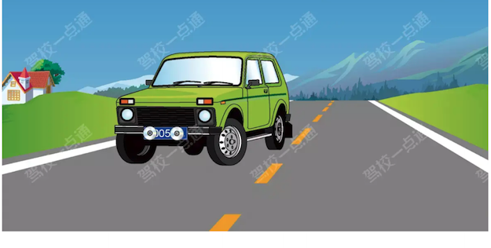
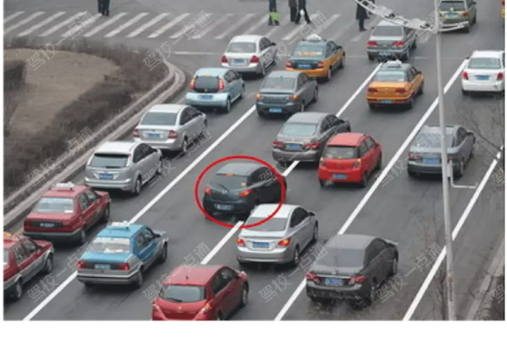
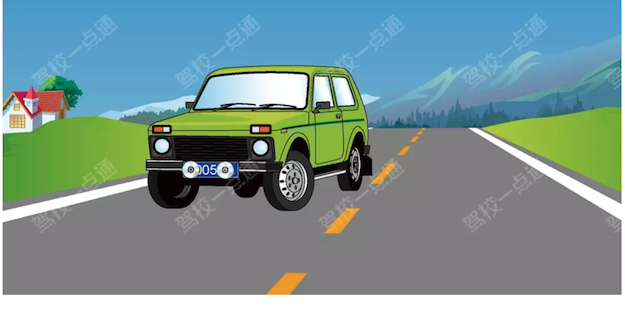

# 处罚扣分与法律责任

学习重点：数字题先认违法类型，再背分值、罚款、拘留、吊销和刑责。

- 覆盖口诀：88 条
- 覆盖原题：138 题
- 含图原题：4 题

## 本章速背

| 出现 | 口诀/技巧 | 怎么用 | 代表原题 |
|---:|---|---|---|
| 8 | [假1骗3毒3醉5逃终生](#02_处罚扣分与法律责任-tip-001) | 此技巧用于说明不同违法行为导致申请人不得再次申领驾驶证的年限。 假1：提供虚假材料或考试过程中有舞弊行为的一年； 骗3：有欺骗等不正当手段已取得驾驶证的三年； 毒3：有吸食、注射毒品后驾驶机动车的三年； 醉5：醉酒驾驶机动车或饮酒后驾驶营运机动车依法被吊销机动车驾驶证未满五年的； 逃终生：造成交通事故后逃逸后构成犯罪的终生 | P1-034：以欺骗、贿赂等不正当手段取得机动车登记的，申请人多久不得申请机动车登记？ |
| 8 | [扣留的判断题看到未携带身份证/扣留行驶证选错，其余都选对](#02_处罚扣分与法律责任-tip-002) | 先圈出题干关键词，再到选项里找口诀提示的答案词。 | P2-025：驾驶人有使用其他车辆号牌、行驶证嫌疑的，交通警察可依法扣留车辆。 |
| 6 | [两证两标一号牌](#02_处罚扣分与法律责任-tip-003) | 此技巧用于说明机动车上路必须随车携带的证件。 随车必须携带驾驶证和行驶证（两证）、保险标志和检验合格标志（两标）、机动车号牌（一号牌） | P1-022：下列哪种证件是驾驶机动车上路行驶应当随车携带？ |
| 5 | [禁灯掉盔会安检扣1分](#02_处罚扣分与法律责任-tip-004) | 把违法行为和数字绑定记忆，题干变换时只要认出行为即可。 | P1-047：下列交通违法行为，一次记1分的是什么？ |
| 4 | [拼装、报废不上路，上路吊销驾驶证](#02_处罚扣分与法律责任-tip-005) | 把违法行为和数字绑定记忆，题干变换时只要认出行为即可。 | P1-035：驾驶报废机动车上路行驶的驾驶人，除按规定罚款外，还要受到哪种处理？ |
| 3 | [伪造找12](#02_处罚扣分与法律责任-tip-006) | 先圈出题干关键词，再到选项里找口诀提示的答案词。 | P1-023：使用伪造、变造的机动车号牌的，一次记几分？ |
| 3 | [假审1、替审2、组3倍、高2万](#02_处罚扣分与法律责任-tip-007) | 此技巧用于说明审验教育过程中可能出现的各违法行为对应的处罚。 参加审验教育签注学习记录，学习记录弄虚作假的罚款1000元； 代替他人进行审验教育的罚款2000元； 组织他人进行审验教育，有违法所得三倍以下，没收违法所得，罚款最高不超过两万元 | P2-050：组织他人参加审验教育时在签注学习记录、学习过程中弄虚作假的，没有违法所得的，由公安机关交通管理部门处二万元以下罚款。 |
| 3 | [判断题中看到追究选对，不追究选错](#02_处罚扣分与法律责任-tip-008) | 先圈出题干关键词，再到选项里找口诀提示的答案词。 | P2-022：对未取得驾驶证驾驶机动车的，追究其法律责任。 |
| 3 | [号牌不安扣3分、未挂遮挡扣9分、伪造变造扣12](#02_处罚扣分与法律责任-tip-009) | 把违法行为和数字绑定记忆，题干变换时只要认出行为即可。 | P1-029：下列交通违法行为，一次记9分的是什么？ |
| 3 | [处罚题1罚2吊](#02_处罚扣分与法律责任-tip-010) | 把违法行为和数字绑定记忆，题干变换时只要认出行为即可。 | P1-013：将机动车交由未取得驾驶证的人驾驶的，除罚款外，可并处（）。 |
| 3 | [看到拘役，选对](#02_处罚扣分与法律责任-tip-011) | 先圈出题干关键词，再到选项里找口诀提示的答案词。 | P2-063：驾驶人员在行驶的公共交通工具上擅离职守，与他人互殴或者殴打他人，危及公共安全，构成犯罪的，处一年以下有期徒刑、拘役或者管制，并处或者单处罚金。 |
| 3 | [选项中看到拘役，直接选](#02_处罚扣分与法律责任-tip-012) | 先圈出题干关键词，再到选项里找口诀提示的答案词。 | P1-018：在道路上驾驶机动车追逐竞驶，情节恶劣的，或者在道路上醉酒驾驶机动车的如何处罚？ |
| 3 | [高速上倒掉逆12；普通路上倒掉1逆占3](#02_处罚扣分与法律责任-tip-013) | 此技巧用于说明在不同道路上倒车、掉头、逆行的扣分分值。 在高速公路上倒车、掉头、逆行的都扣12分； 在普通道路上倒车、掉头的扣1分，逆行、占道穿插的扣3分 | P1-015：下列交通违法行为，一次记12分的是什么？ |
| 2 | [一个周期内，记满12分，要学7天/重新考试](#02_处罚扣分与法律责任-tip-014) | 把违法行为和数字绑定记忆，题干变换时只要认出行为即可。 | P1-062：小型载客汽车驾驶人在一个记分周期内累积记分满12分的，应当参加为期多少天的道路交通安全法律、法规和相关知识学习？ |
| 2 | [不按规定车道行驶，记3分](#02_处罚扣分与法律责任-tip-015) | 把违法行为和数字绑定记忆，题干变换时只要认出行为即可。 | P1-054：驾驶机动车在高速公路或者城市快速路上不按规定车道行驶的，一次记几分？ |
| 2 | [校车、公路客运、旅游客运汽车超载未达20%/7座以上载客汽车超员20%-50%/其他载客汽车超员50%-100%，记6分](#02_处罚扣分与法律责任-tip-016) | 把违法行为和数字绑定记忆，题干变换时只要认出行为即可。 | P1-025：驾驶7座以上载客汽车载人超过核定人数百分之二十以上未达到百分之五十的，一次记几分？ |
| 2 | [看到审验教育学习过程中作假错误的，选暂扣驾驶证](#02_处罚扣分与法律责任-tip-017) | 先圈出题干关键词，再到选项里找口诀提示的答案词。 | P1-099：关于机动车驾驶人参加审验教育时在签注学习记录、学习过程中弄虚作假的会受到处罚，以下说法错误的是什么？ |
| 2 | [看到无需/即可，选错](#02_处罚扣分与法律责任-tip-018) | 先圈出题干关键词，再到选项里找口诀提示的答案词。 | P3-057：机动车驾驶人同时被处以暂扣机动车驾驶证的，经满分学习、考试合格且罚款已缴纳的，记分予以清除，无需等待暂扣期限届满即可发还机动车驾驶证。 |
| 2 | [超员扣分，校客旅上扣12下扣6](#02_处罚扣分与法律责任-tip-019) | 把违法行为和数字绑定记忆，题干变换时只要认出行为即可。 | P1-033：驾驶校车、公路客运汽车、旅游客运汽车载人超过核定人数多少以上的，一次记12分？ |
| 2 | [选项中看到12个月，直接选](#02_处罚扣分与法律责任-tip-020) | 先圈出题干关键词，再到选项里找口诀提示的答案词。 | P1-057：道路交通违法行为累积记分周期是多长时间？ |
| 2 | [饮酒、买卖分扣12分](#02_处罚扣分与法律责任-tip-021) | 把违法行为和数字绑定记忆，题干变换时只要认出行为即可。 | P1-030：代替实际机动车驾驶人接受交通违法行为处罚和记分牟取经济利益的，一次记12分。 |
| 1 | [10年内每个记分周期未达12分，换长期](#02_处罚扣分与法律责任-tip-022) | 把违法行为和数字绑定记忆，题干变换时只要认出行为即可。 | P4-060：驾驶人在机动车驾驶证的6年有效期内，每个记分周期均未达到12分的，换发长期有效的机动车驾驶证。 |
| 1 | [111](#02_处罚扣分与法律责任-tip-023) | 此技巧用于说明参加公益活动的时间、次数与扣减记分的对应关系。 扣减记分公益活动，满1小时为1次，可扣减1分 | P1-085：参加公安机关交通管理部门组织的交通安全公益活动的，满几小时为一次，一次扣减几分？ |
| 1 | [112](#02_处罚扣分与法律责任-tip-024) | 此技巧用于说明参加现场学习的时间、次数与扣减记分的对应关系。 扣减记分现场学习，满1小时且考试合格的，1次扣减2分 | P2-049：参加公安机关交通管理部门组织的道路交通安全法律、法规和相关知识现场学习满一小时且考试合格的，一次扣减12分。 |
| 1 | [331](#02_处罚扣分与法律责任-tip-025) | 此技巧用于说明参与网络学习的时间、次数与扣减记分的对应关系。 扣减记分网络学习，3日内，学习累积满30分钟且考试通过1次扣减1分 | P2-010：参加公安机关交通管理部门组织的道路交通安全法律、法规和相关知识网上学习三日内累计满三十分钟且考试合格的，一次扣减一分交通违法行为记分。 |
| 1 | [7座以上载客车超员50%-100%，记9分](#02_处罚扣分与法律责任-tip-026) | 把违法行为和数字绑定记忆，题干变换时只要认出行为即可。 | P2-011：下列交通违法行为，一次记9分的是什么？ |
| 1 | [两次满分教育不能扣减记分](#02_处罚扣分与法律责任-tip-027) | 把违法行为和数字绑定记忆，题干变换时只要认出行为即可。 | P2-041：在上一个记分周期内机动车驾驶人有二次以上参加满分教育记录的，可以在接受交通安全教育后扣减交通违法行为记分。 |
| 1 | [代罚三五，代审三二](#02_处罚扣分与法律责任-tip-028) | 把违法行为和数字绑定记忆，题干变换时只要认出行为即可。 | P1-067：机动车驾驶人请他人代为接受交通违法行为处罚和记分并支付经济利益的，由公安机关交通管理部门处所支付经济利益多少倍以下罚款，但最高不超过多少万元？ |
| 1 | [使用其他机动车号牌/行驶证，记12分](#02_处罚扣分与法律责任-tip-029) | 把违法行为和数字绑定记忆，题干变换时只要认出行为即可。 | P3-055：机动车驾驶人使用其他机动车号牌、行驶证的，一次记12分。 |
| 1 | [危险选醉驾](#02_处罚扣分与法律责任-tip-030) | 这类题适合快速直选；但遇到“错误的是、不能、不得”要先看清正反问法。 | P1-044：以下哪项行为可构成危险驾驶罪？ |
| 1 | [参加满分教育弄虚作假，罚款1000以下](#02_处罚扣分与法律责任-tip-031) | 把违法行为和数字绑定记忆，题干变换时只要认出行为即可。 | P2-018：机动车驾驶人在参加接受交通安全教育扣减交通违法行为记分中弄虚作假的，由公安机关交通管理部门撤销相应记分扣减记录，恢复相应记分，处多少元以下罚款？ |
| 1 | [图中号牌被遮挡，选遮挡号牌](#02_处罚扣分与法律责任-tip-032) | 这类题适合快速直选；但遇到“错误的是、不能、不得”要先看清正反问法。 | P1-090：这辆在道路上行驶的机动车有下列哪种违法行为？ |
| 1 | [图中红圈内的车压实线，属于违法行为](#02_处罚扣分与法律责任-tip-033) | 适用于通行原则考点总结相关题。做题时先抓题干关键词，再按口诀定位答案。 | P5-045：图中红圈内车辆变更车道的做法违法。 |
| 1 | [城市快速路违停，记9分](#02_处罚扣分与法律责任-tip-034) | 把违法行为和数字绑定记忆，题干变换时只要认出行为即可。 | P1-041：下列交通违法行为，一次记9分的是什么？ |
| 1 | [学习地考试，选对](#02_处罚扣分与法律责任-tip-035) | 这类题适合快速直选；但遇到“错误的是、不能、不得”要先看清正反问法。 | P4-064：机动车驾驶人可以在机动车驾驶证核发地或者交通违法行为发生地、处理地参加公安机关交通管理部门组织的道路交通安全法律、法规和相关知识学习，并在学习地参加考试。 |
| 1 | [学法减分每个周期最多扣6分](#02_处罚扣分与法律责任-tip-036) | 把违法行为和数字绑定记忆，题干变换时只要认出行为即可。 | P1-068：机动车驾驶人处理完交通违法行为记录后累积记分未满12分，参加公安机关交通管理部门组织的交通安全教育并达到规定要求的，可以申请在机动车驾驶人现有累积记分分值中扣减记分。在一个记分周期内累计最高扣减几分？ |
| 1 | [实习期不得扣减记分](#02_处罚扣分与法律责任-tip-037) | 把违法行为和数字绑定记忆，题干变换时只要认出行为即可。 | P2-034：机动车驾驶证在实习期内，驾驶人不得通过接受交通安全教育扣减交通违法行为记分。 |
| 1 | [实习期记满12分，注销实习资格](#02_处罚扣分与法律责任-tip-038) | 把违法行为和数字绑定记忆，题干变换时只要认出行为即可。 | P3-038：机动车驾驶人在实习期内有记满12分记录的，注销其实习的准驾车型驾驶资格。 |
| 1 | [小汽车高速公路超速20%-50%，记6分](#02_处罚扣分与法律责任-tip-039) | 把违法行为和数字绑定记忆，题干变换时只要认出行为即可。 | P1-040：驾驶校车、中型以上载客载货汽车、危险品运输车辆以外的机动车在高速公路上行驶超过规定时速百分之二十以上未达到百分之五十的，一次记几分？ |
| 1 | [应撤未撤会罚款，选对](#02_处罚扣分与法律责任-tip-040) | 这类题适合快速直选；但遇到“错误的是、不能、不得”要先看清正反问法。 | P2-038：车辆发生轻微剐蹭事故，双方驾驶人争执不下，坚持在原地等待警察来处理，造成路面堵塞，该行为会受到罚款的处罚。 |
| 1 | [急找6](#02_处罚扣分与法律责任-tip-041) | 先圈出题干关键词，再到选项里找口诀提示的答案词。 | P1-024：驾车在城市快速路上违法占用应急车道行驶的，一次记（）分。 |
| 1 | [情形中一般选最严重的情况，饮酒要扣留](#02_处罚扣分与法律责任-tip-042) | 这类题适合快速直选；但遇到“错误的是、不能、不得”要先看清正反问法。 | P1-080：驾驶人有哪种情形，交通警察可依法扣留机动车驾驶证？ |
| 1 | [提供虚假材料申领驾驶证，罚款500元以下](#02_处罚扣分与法律责任-tip-043) | 把违法行为和数字绑定记忆，题干变换时只要认出行为即可。 | P3-054：申请人隐瞒有关情况或者提供虚假材料申请校车驾驶资格的，公安机关交通管理部门不予受理或者不予办理，处五百元以下罚款。 |
| 1 | [提供虚假材料申领驾驶证，罚款500元以下，申请人在一年内不得再次申领机动车驾驶证](#02_处罚扣分与法律责任-tip-044) | 把违法行为和数字绑定记忆，题干变换时只要认出行为即可。 | P1-061：申请人隐瞒有关情况或者提供虚假材料申领机动车驾驶证的，会受到什么处罚？ |
| 1 | [故障后不按规定使用灯光/警示，记3分](#02_处罚扣分与法律责任-tip-045) | 把违法行为和数字绑定记忆，题干变换时只要认出行为即可。 | P3-027：在道路上车辆发生故障、事故停车后，不按规定使用灯光或者设置警告标志的，一次记1分。 |
| 1 | [未取得资格驾驶校车，记9分](#02_处罚扣分与法律责任-tip-046) | 把违法行为和数字绑定记忆，题干变换时只要认出行为即可。 | P2-006：未取得校车驾驶资格驾驶校车的，一次记几分？ |
| 1 | [未按时限办理变更登记，罚款二百元以下](#02_处罚扣分与法律责任-tip-047) | 把违法行为和数字绑定记忆，题干变换时只要认出行为即可。 | P2-090：改变车身颜色、更换发动机、车身或者车架，未按照规定的时限办理变更登记的，由公安机关交通管理部门处警告或者二百元以下罚款。 |
| 1 | [未按时限办理转让登记，罚款二百元以下](#02_处罚扣分与法律责任-tip-048) | 把违法行为和数字绑定记忆，题干变换时只要认出行为即可。 | P3-056：机动车所有权转让后，现机动车所有人未按照规定的时限办理转让登记的，由公安机关交通管理部门处警告或者一千元以下罚款。 |
| 1 | [机动车驾驶证被依法扣押/扣留/暂扣期间不补发](#02_处罚扣分与法律责任-tip-049) | 把违法行为和数字绑定记忆，题干变换时只要认出行为即可。 | P1-043：机动车驾驶证被依法扣押、扣留、暂扣期间能否申请补发？ |
| 1 | [校车以外车辆超员100%，记12分](#02_处罚扣分与法律责任-tip-050) | 把违法行为和数字绑定记忆，题干变换时只要认出行为即可。 | P3-060：驾驶校车、公路客运汽车、旅游客运汽车以外的其他载客汽车载人超过核定人数百分之百以上的，一次记12分。 |
| 1 | [校车以外车辆超速50%，记12分](#02_处罚扣分与法律责任-tip-051) | 把违法行为和数字绑定记忆，题干变换时只要认出行为即可。 | P2-009：驾驶校车、中型以上载客载货汽车、危险物品运输车辆以外的机动车在高速公路、城市快速路上行驶超过规定时速百分之五十以上的，一次记9分。 |
| 1 | [满分学习网络5天现场2天](#02_处罚扣分与法律责任-tip-052) | 把违法行为和数字绑定记忆，题干变换时只要认出行为即可。 | P2-092：机动车驾驶人参加满分教育现场学习、网络学习的天数累计不得少于五天，其中，现场学习的天数不得少于一天。 |
| 1 | [看到两个以外超速百分之五十以上，扣6分](#02_处罚扣分与法律责任-tip-053) | 先圈出题干关键词，再到选项里找口诀提示的答案词。 | P1-021：驾驶校车、中型以上载客载货汽车、危险品运输车辆以外的机动车在高速公路、城市快速路以外的道路上行驶超过规定时速百分之五十以上的，一次记几分？ |
| 1 | [看到信号灯，记6分](#02_处罚扣分与法律责任-tip-054) | 先圈出题干关键词，再到选项里找口诀提示的答案词。 | P2-028：驾驶机动车不按交通信号灯指示通行的，一次记3分。 |
| 1 | [看到口头警告，选错](#02_处罚扣分与法律责任-tip-055) | 先圈出题干关键词，再到选项里找口诀提示的答案词。 | P4-078：驾驶人将机动车交给驾驶证被暂扣的人驾驶的，交通警察给予口头警告。 |
| 1 | [看到只进行罚款，选错](#02_处罚扣分与法律责任-tip-056) | 先圈出题干关键词，再到选项里找口诀提示的答案词。 | P2-077：对有使用伪造或变造检验合格标志嫌疑的车辆，交通警察只进行罚款处罚。 |
| 1 | [看到处理完毕，选对](#02_处罚扣分与法律责任-tip-057) | 先圈出题干关键词，再到选项里找口诀提示的答案词。 | P4-066：机动车所有人申请转让登记前，应当将涉及该车的道路交通安全违法行为和交通事故处理完毕。 |
| 1 | [看到未验车处警告或二百元以下罚款，选对](#02_处罚扣分与法律责任-tip-058) | 先圈出题干关键词，再到选项里找口诀提示的答案词。 | P2-039：机动车未按照规定期限进行安全技术检验的，由公安机关交通管理部门处警告或者二百元以下罚款。 |
| 1 | [看到牟取经济利益，处三倍以上五倍以下罚款](#02_处罚扣分与法律责任-tip-059) | 先圈出题干关键词，再到选项里找口诀提示的答案词。 | P3-084：组织、参与实施欺骗、贿赂等不正当手段取得机动车驾驶证牟取经济利益的，由公安机关交通管理部门处违法所得三倍以上五倍以下罚款，但最高不超过十万元。 |
| 1 | [看到行政处罚，选记分](#02_处罚扣分与法律责任-tip-060) | 先圈出题干关键词，再到选项里找口诀提示的答案词。 | P1-070：公安交通管理部门对驾驶人的交通违法行为除依法给予行政处罚外，实行下列哪种制度？ |
| 1 | [看到被吊销驾驶证，不能申请驾驶证](#02_处罚扣分与法律责任-tip-061) | 先圈出题干关键词，再到选项里找口诀提示的答案词。 | P3-033：饮酒后驾驶营运机动车依法被吊销机动车驾驶证未满五年的，不得申请机动车驾驶证。 |
| 1 | [看到记分转入/累积，选对](#02_处罚扣分与法律责任-tip-062) | 先圈出题干关键词，再到选项里找口诀提示的答案词。 | P2-097：机动车驾驶人在一个记分周期内累积记分未满12分的，但有罚款逾期未缴纳的，该记分周期内尚未缴纳罚款的交通违法行为记分分值转入下一记分周期。 |
| 1 | [看到载运爆炸物品未悬挂警示标志，记6分](#02_处罚扣分与法律责任-tip-063) | 先圈出题干关键词，再到选项里找口诀提示的答案词。 | P5-016：驾驶机动车载运爆炸物品，未悬挂警示标志并采取必要的安全措施的，一次记12分。 |
| 1 | [累积记分达12分，拒绝考试，驾驶证停止使用](#02_处罚扣分与法律责任-tip-064) | 把违法行为和数字绑定记忆，题干变换时只要认出行为即可。 | P3-035：机动车驾驶人在一个记分周期内累积记分达到12分，拒不参加学习和考试的，将被公安机关交通管理部门公告其驾驶证停止使用。 |
| 1 | [组织作弊情节严重，选处三年以上七年以下有期徒刑，并处罚金](#02_处罚扣分与法律责任-tip-065) | 这类题适合快速直选；但遇到“错误的是、不能、不得”要先看清正反问法。 | P1-096：在驾驶人考试过程中组织作弊，情节严重构成犯罪的，会受到什么处罚？ |
| 1 | [经满分学习暂扣期满后发还驾驶证](#02_处罚扣分与法律责任-tip-066) | 把违法行为和数字绑定记忆，题干变换时只要认出行为即可。 | P3-014：机动车驾驶人同时被处以暂扣机动车驾驶证的，经满分学习、考试合格且罚款已缴纳的，记分予以清除，在暂扣期限届满后发还机动车驾驶证。 |
| 1 | [考试过程中贿赂，成绩无效](#02_处罚扣分与法律责任-tip-067) | 申请人在考试过程中有贿赂、舞弊行为的，取消考试资格，已经通过考试的其他科目成绩无效，所以选择正确。 《机动车驾驶证申领和使用规定》第九十三条：申请人在考试过程中有贿赂、舞弊行为的，取消考试资格，已经通过考试的其他科目成绩无效，公安机关交通管理部门处二千元以下罚款；申请人在一年内不得再次申领机动车驾驶证。 | P3-090：申请人在考试过程中有贿赂、舞弊行为的，取消考试资格，已经通过考试的其他科目成绩无效。 |
| 1 | [菱形表示人行横道预告](#02_处罚扣分与法律责任-tip-068) | 把口诀对应到题干关键词，优先排除与口诀相反或无关的选项。 | P5-083：这个地面标记的含义是预告前方设有交叉路口。 |
| 1 | [行为就考违法行为，只有违法选对，其余选错](#02_处罚扣分与法律责任-tip-069) | 这类题适合快速直选；但遇到“错误的是、不能、不得”要先看清正反问法。 | P2-096：驾驶机动车在人行横道上临时停车属于违法行为。 |
| 1 | [行为就考违法行为，选项中看见违法行为直接选](#02_处罚扣分与法律责任-tip-070) | 这类题适合快速直选；但遇到“错误的是、不能、不得”要先看清正反问法。 | P1-055：驾驶这种机动车上路行驶属于什么行为？ |
| 1 | [行政处罚撤销，记分也撤销](#02_处罚扣分与法律责任-tip-071) | 把违法行为和数字绑定记忆，题干变换时只要认出行为即可。 | P2-075：行政处罚决定被依法变更或者撤销的，相应记分不会变更或者撤销。 |
| 1 | [记24分考道路驾驶，不考场地驾驶](#02_处罚扣分与法律责任-tip-072) | 把违法行为和数字绑定记忆，题干变换时只要认出行为即可。 | P2-033：机动车驾驶人在一个记分周期内累积记分满24分未满36分的，应当在道路交通安全法律、法规和相关知识考试合格后，按规定预约参加场地驾驶技能考试。 |
| 1 | [记分周期，满分是12分](#02_处罚扣分与法律责任-tip-073) | 把违法行为和数字绑定记忆，题干变换时只要认出行为即可。 | P3-066：道路交通安全违法行为累积记分一个周期满分为12分。 |
| 1 | [记分未满12分，可以处理其他违法行为](#02_处罚扣分与法律责任-tip-074) | 把违法行为和数字绑定记忆，题干变换时只要认出行为即可。 | P2-007：交通违法行为累积记分未满多少分的，可以处理其驾驶的其他机动车的交通违法行为记录？ |
| 1 | [记分未满12分，周期结束后清除记分；记分满12分，扣证](#02_处罚扣分与法律责任-tip-075) | 把违法行为和数字绑定记忆，题干变换时只要认出行为即可。 | P2-042：机动车驾驶人在一个记分周期期限届满，累积记分未满12分的，该记分周期内的记分予以清除。 |
| 1 | [记满36分，参加法规/场地/道路三项考试](#02_处罚扣分与法律责任-tip-076) | 把违法行为和数字绑定记忆，题干变换时只要认出行为即可。 | P3-009：机动车驾驶人在一个记分周期内累积记分满36分的，应当在道路交通安全法律、法规和相关知识考试合格后，按规定预约参加场地驾驶技能和道路驾驶技能考试。 |
| 1 | [责任就考刑事责任，违法犯罪就是刑事责任](#02_处罚扣分与法律责任-tip-077) | 本题考点为刑事责任。《中华人民共和国道路交通安全法》第一百零一条：违反道路交通安全法律、法规的规定，发生重大交通事故，构成犯罪的，依法追究刑事责任，并由公安机关交通管理部门吊销机动车驾驶证。 | P1-069：机动车驾驶人违法驾驶造成重大交通事故构成犯罪的，依法追究什么责任？ |
| 1 | [货车长宽高扣1分](#02_处罚扣分与法律责任-tip-078) | 把违法行为和数字绑定记忆，题干变换时只要认出行为即可。 | P3-058：驾驶机动车载货长度、宽度、高度超过规定的，一次记1分。 |
| 1 | [轻伤财产扣6分；轻伤以上死亡扣12分](#02_处罚扣分与法律责任-tip-079) | 把违法行为和数字绑定记忆，题干变换时只要认出行为即可。 | P1-066：关于交通违法行为，以下说法错误的是什么？ |
| 1 | [载货超载136](#02_处罚扣分与法律责任-tip-080) | 此技巧用于说明货车超载不同程度的扣分分值。 载物超载30%以下，记1分； 载物超载30%-50%，记3分； 载物超载50%以上，记6分。 | P3-034：驾驶载货汽车载物超过最大允许总质量未达到百分之三十的，一次记1分。 |
| 1 | [追逐竞驶构成犯罪，被吊销驾驶证，未满五年不能申请驾驶证](#02_处罚扣分与法律责任-tip-081) | 把违法行为和数字绑定记忆，题干变换时只要认出行为即可。 | P2-059：驾驶机动车追逐竞驶、超员、超速、违反危险化学品安全管理规定运输危险化学品构成犯罪依法被吊销机动车驾驶证未满五年的，不得申请机动车驾驶证。 |
| 1 | [选项中出现2分不选](#02_处罚扣分与法律责任-tip-082) | 这类题适合快速直选；但遇到“错误的是、不能、不得”要先看清正反问法。 | P1-086：根据交通违法行为的严重程度，一次记分的分值为？ |
| 1 | [选项中看见再次饮酒，直接选](#02_处罚扣分与法律责任-tip-083) | 这类题适合快速直选；但遇到“错误的是、不能、不得”要先看清正反问法。 | P1-053：以下哪种行为处十日以下拘留，并处一千元以上二千元以下罚款，吊销机动车驾驶证？ |
| 1 | [速度题中看到两个低字，记3分](#02_处罚扣分与法律责任-tip-084) | 先圈出题干关键词，再到选项里找口诀提示的答案词。 | P5-047：驾驶机动车在高速路上行驶低于规定最低时速的，一次记3分。 |
| 1 | [饮酒3个记分周期内不得扣减记分](#02_处罚扣分与法律责任-tip-085) | 把违法行为和数字绑定记忆，题干变换时只要认出行为即可。 | P1-014：在最近几个记分周期内，机动车驾驶人饮酒后驾驶机动车受到过处罚的，不得通过接受交通安全教育扣减交通违法行为记分？ |
| 1 | [饮酒、醉酒同时出现，选饮酒](#02_处罚扣分与法律责任-tip-086) | 这类题适合快速直选；但遇到“错误的是、不能、不得”要先看清正反问法。 | P1-088：机动车驾驶人有以下哪种违法行为的，暂扣六个月机动车驾驶证？ |
| 1 | [饮酒不开车，饮酒后开车记12分](#02_处罚扣分与法律责任-tip-087) | 把违法行为和数字绑定记忆，题干变换时只要认出行为即可。 | P4-019：饮酒后只要不影响驾驶操作可以短距离驾驶机动车。 |
| 1 | [驾车打电话，记3分](#02_处罚扣分与法律责任-tip-088) | 把违法行为和数字绑定记忆，题干变换时只要认出行为即可。 | P2-017：驾车拨打、接听手持电话的，一次记（）分。 |

## 口诀卡片

### 1. 假1骗3毒3醉5逃终生

> 记忆核心：此技巧用于说明不同违法行为导致申请人不得再次申领驾驶证的年限。 假1：提供虚假材料或考试过程中有舞弊行为的一年； 骗3：有欺骗等不正当手段已取得驾驶证的三年； 毒3：有吸食、注射毒品后驾驶机动车的三年； 醉5：醉酒驾驶机动车或饮酒后驾驶营运机动车依法被吊销机动车驾驶证未满五年的； 逃终生：造成交通事故后逃逸后构成犯罪的终生
> 使用方法：此技巧用于说明不同违法行为导致申请人不得再次申领驾驶证的年限。 假1：提供虚假材料或考试过程中有舞弊行为的一年； 骗3：有欺骗等不正当手段已取得驾驶证的三年； 毒3：有吸食、注射毒品后驾驶机动车的三年； 醉5：醉酒驾驶机动车或饮酒后驾驶营运机动车依法被吊销机动车驾驶证未满五年的； 逃终生：造成交通事故后逃逸后构成犯罪的终生

- 类型/频次：速记口诀×8；共 8 题
- 对应题号：P1-034、P1-048、P1-052、P1-072、P2-023、P2-043、P3-085、P3-092

#### 代表原题

##### P1-034｜试卷1 高频100题

**原题**：以欺骗、贿赂等不正当手段取得机动车登记的，申请人多久不得申请机动车登记？

**选项**
- A. 三年内
- B. 终身
- C. 五年内
- D. 一年内

**答案**：A（三年内）
**秒懂技巧**：假1骗3毒3醉5逃终生
**解释**：此技巧用于说明不同违法行为导致申请人不得再次申领驾驶证的年限。 假1：提供虚假材料或考试过程中有舞弊行为的一年； 骗3：有欺骗等不正当手段已取得驾驶证的三年； 毒3：有吸食、注射毒品后驾驶机动车的三年； 醉5：醉酒驾驶机动车或饮酒后驾驶营运机动车依法被吊销机动车驾驶证未满五年的； 逃终生：造成交通事故后逃逸后构成犯罪的终生
**相关考点**：驾驶证考点总结

##### P1-048｜试卷1 高频100题

**原题**：机动车驾驶人造成事故后逃逸构成犯罪的，吊销驾驶证且多长时间不得重新取得驾驶证？

**选项**
- A. 5年内
- B. 10年内
- C. 终生
- D. 20年内

**答案**：C（终生）
**秒懂技巧**：假1骗3毒3醉5逃终生
**解释**：此技巧用于说明不同违法行为导致申请人不得再次申领驾驶证的年限。 假1：隐瞒有关情况或者提供虚假驾照申领信息的一年； 骗3：欺骗、贿赂等不正当手段取得驾驶证的三年； 毒3：有吸食、注射毒品后驾驶机动车的三年； 醉5：醉酒驾驶机动车或饮酒后驾驶营运机动车依法被吊销机动车驾驶证未满五年的； 逃终生：造成交通事故后逃逸后构成犯罪的终生
**相关考点**：驾驶证考点总结

##### P1-052｜试卷1 高频100题

**原题**：提供虚假材料申领驾驶证的申请人会承担下列哪种法律责任？

**选项**
- A. 处20元以上200元以下罚款
- B. 取消申领驾驶证资格
- C. 1年内不得再次申领驾驶证
- D. 2年内不能再次申领驾驶证

**答案**：C（1年内不得再次申领驾驶证）
**秒懂技巧**：假1骗3毒3醉5逃终生
**解释**：此技巧用于说明不同违法行为导致申请人不得再次申领驾驶证的年限。 假1：隐瞒有关情况或者提供虚假驾照申领信息的一年； 骗3：欺骗、贿赂等不正当手段取得驾驶证的三年； 毒3：有吸食、注射毒品后驾驶机动车的三年； 醉5：醉酒驾驶机动车或饮酒后驾驶营运机动车依法被吊销机动车驾驶证未满五年的； 逃终生：造成交通事故后逃逸后构成犯罪的终生
**相关考点**：驾驶证考点总结

展开其余 5 道对应原题

##### P1-072｜试卷1 高频100题

**原题**：3年内有下列哪种行为的人不得申请机动车驾驶证？

**选项**
- A. 吸食毒品、注射毒品
- B. 酒醉经历
- C. 注射胰岛素
- D. 吸烟成瘾

**答案**：A（吸食毒品、注射毒品）
**秒懂技巧**：假1骗3毒3醉5逃终生
**解释**：此技巧用于说明不同违法行为导致申请人不得再次申领驾驶证的年限。 假1：隐瞒有关情况或者提供虚假驾照申领信息的一年； 骗3：欺骗、贿赂等不正当手段取得驾驶证的三年； 毒3：有吸食、注射毒品后驾驶机动车的三年； 醉5：醉酒驾驶机动车或饮酒后驾驶营运机动车依法被吊销机动车驾驶证未满五年的； 逃终生：造成交通事故后逃逸后构成犯罪的终生
**相关考点**：驾驶证考点总结

##### P2-023｜试卷2 高频100题

**原题**：以欺骗、贿赂等不正当手段取得驾驶证被依法撤销驾驶许可的，（）不得重新申请驾驶许可？

**选项**
- A. 3年内
- B. 5年内
- C. 1年内
- D. 终生

**答案**：A（3年内）
**秒懂技巧**：假1骗3毒3醉5逃终生
**解释**：此技巧用于说明不同违法行为导致申请人不得再次申领驾驶证的年限。 假1：提供虚假材料或考试过程中有舞弊行为的一年； 骗3：有欺骗等不正当手段已取得驾驶证的三年； 毒3：有吸食、注射毒品后驾驶机动车的三年； 醉5：醉酒驾驶机动车或饮酒后驾驶营运机动车依法被吊销机动车驾驶证未满五年的； 逃终生：造成交通事故后逃逸后构成犯罪的终生
**相关考点**：驾驶证考点总结

##### P2-043｜试卷2 高频100题

**原题**：造成交通事故后逃逸且构成犯罪的驾驶人，将吊销驾驶证且终生不得重新取得驾驶证。

**选项**
- A. 正确
- B. 错误

**答案**：A（正确）
**秒懂技巧**：假1骗3毒3醉5逃终生
**解释**：此技巧用于说明不同违法行为导致申请人不得再次申领驾驶证的年限。 假1：隐瞒有关情况或者提供虚假驾照申领信息的一年； 骗3：欺骗、贿赂等不正当手段取得驾驶证的三年； 毒3：有吸食、注射毒品后驾驶机动车的三年； 醉5：醉酒驾驶机动车或饮酒后驾驶营运机动车依法被吊销机动车驾驶证未满五年的； 逃终生：造成交通事故后逃逸后构成犯罪的终生
**相关考点**：驾驶证考点总结

##### P3-085｜试卷3 高频100题

**原题**：申请人在考试过程中有贿赂、舞弊行为的，已经通过考试的其他科目成绩无效，处两千元以下罚款，申请人在一年内不得再次申领机动车驾驶证。

**选项**
- A. 正确
- B. 错误

**答案**：A（正确）
**秒懂技巧**：假1骗3毒3醉5逃终生
**解释**：此技巧用于说明不同违法行为导致申请人不得再次申领驾驶证的年限。 假1：提供虚假材料或考试过程中有舞弊行为的一年； 骗3：有欺骗等不正当手段已取得驾驶证的三年； 毒3：有吸食、注射毒品后驾驶机动车的三年； 醉5：醉酒驾驶机动车或饮酒后驾驶营运机动车依法被吊销机动车驾驶证未满五年的； 逃终生：造成交通事故后逃逸后构成犯罪的终生
**相关考点**：罚款题考点总结

##### P3-092｜试卷3 高频100题

**原题**：造成交通事故后逃逸构成犯罪的人不能申请机动车驾驶证。

**选项**
- A. 正确
- B. 错误

**答案**：A（正确）
**秒懂技巧**：假1骗3毒3醉5逃终生
**解释**：此技巧用于说明不同违法行为导致申请人不得再次申领驾驶证的年限。 假1：隐瞒有关情况或者提供虚假驾照申领信息的一年； 骗3：欺骗、贿赂等不正当手段取得驾驶证的三年； 毒3：有吸食、注射毒品后驾驶机动车的三年； 醉5：醉酒驾驶机动车或饮酒后驾驶营运机动车依法被吊销机动车驾驶证未满五年的； 逃终生：造成交通事故后逃逸后构成犯罪的终生
**相关考点**：驾驶证考点总结

### 2. 扣留的判断题看到未携带身份证/扣留行驶证选错，其余都选对

> 记忆核心：本题考点为扣留机动车。 《道路交通安全法》第九十六条：使用其他车辆的机动车登记证书、号牌、行驶证、检验合格标志、保险标志的，由公安机关交通管理部门予以收缴，扣留该机动车，处二千元以上五千元以下罚款。
> 使用方法：先圈出题干关键词，再到选项里找口诀提示的答案词。

- 类型/频次：关键字答题×8；共 8 题
- 对应题号：P2-025、P2-032、P2-044、P2-052、P2-076、P2-078、P3-065、P3-091

#### 代表原题

##### P2-025｜试卷2 高频100题

**原题**：驾驶人有使用其他车辆号牌、行驶证嫌疑的，交通警察可依法扣留车辆。

**选项**
- A. 正确
- B. 错误

**答案**：A（正确）
**秒懂技巧**：扣留的判断题看到未携带身份证/扣留行驶证选错，其余都选对
**解释**：本题考点为扣留机动车。 《道路交通安全法》第九十六条：使用其他车辆的机动车登记证书、号牌、行驶证、检验合格标志、保险标志的，由公安机关交通管理部门予以收缴，扣留该机动车，处二千元以上五千元以下罚款。
**相关考点**：判罚题考点总结

##### P2-032｜试卷2 高频100题

**原题**：驾驶人有使用其他车辆检验合格标志嫌疑的，交通警察可依法扣留车辆。

**选项**
- A. 正确
- B. 错误

**答案**：A（正确）
**秒懂技巧**：扣留的判断题看到未携带身份证/扣留行驶证选错，其余都选对
**解释**：本题考点为扣留机动车。 《道路交通安全法》第九十六条：使用其他车辆的机动车登记证书、号牌、行驶证、检验合格标志、保险标志的，由公安机关交通管理部门予以收缴，扣留该机动车，处二千元以上五千元以下罚款。
**相关考点**：判罚题考点总结

##### P2-044｜试卷2 高频100题

**原题**：上路行驶的机动车未随车携带身份证的，交通警察可依法扣留机动车。

**选项**
- A. 正确
- B. 错误

**答案**：B（错误）
**秒懂技巧**：扣留的判断题看到未携带身份证/扣留行驶证选错，其余都选对
**解释**：上道路行驶的机动车必须随车携带行驶证、驾驶证，没有规定必须携带身份证。题中说未携带身份证可以扣留机动车，是错误的。 《道路交通安全法》第九十五条：上道路行驶的机动车未悬挂机动车号牌，未放置检验合格标志、保险标志，或者未随车携带行驶证、驾驶证的，公安机关交通管理部门应当扣留机动车。
**相关考点**：判罚题考点总结

展开其余 5 道对应原题

##### P2-052｜试卷2 高频100题

**原题**：对未按照国家规定投保交强险的车辆，交通警察可依法予以扣留。

**选项**
- A. 正确
- B. 错误

**答案**：A（正确）
**秒懂技巧**：扣留的判断题看到未携带身份证/扣留行驶证选错，其余都选对
**解释**：本题考点为未按规定交强险处罚。 《道路交通安全法》第九十八条：机动车所有人、管理人未按照国家规定投保机动车第三者责任强制保险的，由公安机关交通管理部门扣留车辆至依照规定投保后，并处依照规定投保最低责任限额应缴纳的保险费的二倍罚款。
**相关考点**：判罚题考点总结

##### P2-076｜试卷2 高频100题

**原题**：上路行驶的机动车未放置检验合格标志的，交通警察可依法扣留机动车。

**选项**
- A. 正确
- B. 错误

**答案**：A（正确）
**秒懂技巧**：扣留的判断题看到未携带身份证/扣留行驶证选错，其余都选对
**解释**：本题考点为机动车上路携带证件。 《道路交通安全法》第九十五条：上道路行驶的机动车未悬挂机动车号牌，未放置检验合格标志、保险标志，或者未随车携带行驶证、驾驶证的，公安机关交通管理部门应当扣留机动车。
**相关考点**：判罚题考点总结

##### P2-078｜试卷2 高频100题

**原题**：对发生道路交通事故需要收集证据的事故车，交通警察可以依法扣留。

**选项**
- A. 正确
- B. 错误

**答案**：A（正确）
**秒懂技巧**：扣留的判断题看到未携带身份证/扣留行驶证选错，其余都选对
**解释**：因收集证据的需要，交通警察可以扣留事故车辆，但是应当妥善保管，以备核查，所以选择正确。 《道路交通安全法》第七十二条：交通警察应当对交通事故现场进行勘验、检查，收集证据；因收集证据的需要，可以扣留事故车辆，但是应当妥善保管，以备核查。
**相关考点**：判罚题考点总结

##### P3-065｜试卷3 高频100题

**原题**：交通警察对未放置保险标志上道路行驶的车辆可依法扣留行驶证。

**选项**
- A. 正确
- B. 错误

**答案**：B（错误）
**秒懂技巧**：扣留的判断题看到未携带身份证/扣留行驶证选错，其余都选对
**解释**：本题考点为扣留机动车。未放置保险标志上道路行驶，交警应当扣留机动车，而不是扣留行驶证，所以选择错误。 《道路交通安全法》第九十五条：上道路行驶的机动车未悬挂机动车号牌，未放置检验合格标志、保险标志，或者未随车携带行驶证、驾驶证的，公安机关交通管理部门应当扣留机动车。
**相关考点**：判罚题考点总结

##### P3-091｜试卷3 高频100题

**原题**：驾驶人有使用其他车辆保险标志嫌疑的，交通警察可依法扣留车辆。

**选项**
- A. 正确
- B. 错误

**答案**：A（正确）
**秒懂技巧**：扣留的判断题看到未携带身份证/扣留行驶证选错，其余都选对
**解释**：本题考点为扣留机动车。 《道路交通安全法》第九十六条：使用其他车辆的机动车登记证书、号牌、行驶证、检验合格标志、保险标志的，由公安机关交通管理部门予以收缴，扣留该机动车，处二千元以上五千元以下罚款。
**相关考点**：判罚题考点总结

### 3. 两证两标一号牌

> 记忆核心：此技巧用于说明机动车上路必须随车携带的证件。 随车必须携带驾驶证和行驶证（两证）、保险标志和检验合格标志（两标）、机动车号牌（一号牌）
> 使用方法：此技巧用于说明机动车上路必须随车携带的证件。 随车必须携带驾驶证和行驶证（两证）、保险标志和检验合格标志（两标）、机动车号牌（一号牌）

- 类型/频次：速记口诀×6；共 6 题
- 对应题号：P1-022、P1-051、P1-059、P1-064、P1-084、P1-094

#### 代表原题

##### P1-022｜试卷1 高频100题

**原题**：下列哪种证件是驾驶机动车上路行驶应当随车携带？

**选项**
- A. 机动车登记证
- B. 机动车保险单
- C. 机动车行驶证
- D. 出厂合格证明

**答案**：C（机动车行驶证）
**秒懂技巧**：两证两标一号牌
**解释**：此技巧用于说明机动车上路必须随车携带的证件。 随车必须携带驾驶证和行驶证（两证）、保险标志和检验合格标志（两标）、机动车号牌（一号牌）
**相关考点**：判罚题考点总结

##### P1-051｜试卷1 高频100题

**原题**：驾驶人未携带哪种证件驾驶机动车上路，交通警察可依法扣留车辆？

**选项**
- A. 机动车驾驶证
- B. 居民身份证
- C. 从业资格证
- D. 机动车通行证

**答案**：A（机动车驾驶证）
**秒懂技巧**：两证两标一号牌
**解释**：此技巧用于说明机动车上路必须随车携带的证件。 随车必须携带驾驶证和行驶证（两证）、保险标志和检验合格标志（两标）、机动车号牌（一号牌）
**相关考点**：判罚题考点总结

##### P1-059｜试卷1 高频100题

**原题**：上道路行驶的机动车有哪种情形交通警察可依法扣留车辆？

**选项**
- A. 未放置城市环保标志
- B. 未携带行驶证
- C. 未携带机动车登记证书
- D. 未携带身份证

**答案**：B（未携带行驶证）
**秒懂技巧**：两证两标一号牌
**解释**：此技巧用于说明机动车上路必须随车携带的证件。 随车必须携带驾驶证和行驶证（两证）、保险标志和检验合格标志（两标）、机动车号牌（一号牌）
**相关考点**：判罚题考点总结

展开其余 3 道对应原题

##### P1-064｜试卷1 高频100题

**原题**：上道路行驶的机动车有哪种情形交通警察可依法扣留车辆？

**选项**
- A. 未悬挂机动车号牌
- B. 未携带身份证
- C. 未携带保险合同
- D. 未放置城市环保标志

**答案**：A（未悬挂机动车号牌）
**秒懂技巧**：两证两标一号牌
**解释**：此技巧用于说明机动车上路必须随车携带的证件。 随车必须携带驾驶证和行驶证（两证）、保险标志和检验合格标志（两标）、机动车号牌（一号牌）
**相关考点**：判罚题考点总结

##### P1-084｜试卷1 高频100题

**原题**：以下属于依法扣留车辆情形的是（）。

**选项**
- A. 未携带保险合同
- B. 未放置城市环保标志
- C. 悬挂变造的机动车号牌
- D. 未携带机动车登记证书

**答案**：C（悬挂变造的机动车号牌）
**秒懂技巧**：两证两标一号牌
**解释**：此技巧用于说明机动车上路必须随车携带的证件。 随车必须携带驾驶证和行驶证（两证）、保险标志和检验合格标志（两标）、机动车号牌（一号牌）
**相关考点**：判罚题考点总结

##### P1-094｜试卷1 高频100题

**原题**：以下哪种情形不会被扣留车辆？

**选项**
- A. 没有按规定悬挂号牌
- B. 未按规定购买第三者责任强制保险
- C. 未随车携带灭火器
- D. 未随车携带行驶证

**答案**：C（未随车携带灭火器）
**秒懂技巧**：两证两标一号牌
**解释**：此技巧用于说明机动车上路必须随车携带的证件。 随车必须携带驾驶证和行驶证（两证）、保险标志和检验合格标志（两标）、机动车号牌（一号牌）
**相关考点**：判罚题考点总结

### 4. 禁灯掉盔会安检扣1分

> 记忆核心：此技巧用于说明扣1分的违法行为。 违反禁令标志/禁止标线的，扣1分； 不按规定使用灯光的，扣1分； 普通路段不按规定倒车/掉头的，扣1分； 驾驶摩托车不戴安全头盔的，扣1分； 不按规定会车的，扣1分； 不按规定系安全带的，扣1分； 小型机动车不按规定进行安全检验的，扣1分。
> 使用方法：把违法行为和数字绑定记忆，题干变换时只要认出行为即可。

- 类型/频次：速记口诀×5；共 5 题
- 对应题号：P1-047、P1-089、P2-074、P3-029、P4-016

#### 代表原题

##### P1-047｜试卷1 高频100题

**原题**：下列交通违法行为，一次记1分的是什么？

**选项**
- A. 驾驶校车在高速公路、城市快速路以外的道路上行驶超过规定时速百分之二十以上未达到百分之五十的
- B. 驾驶机动车不按规定使用灯光
- C. 驾驶机动车不按规定超车、让行
- D. 驾驶机动车在高速公路、城市快速路上违法停车的

**答案**：B（驾驶机动车不按规定使用灯光）
**秒懂技巧**：禁灯掉盔会安检扣1分
**解释**：此技巧用于说明扣1分的违法行为。 违反禁令标志/禁止标线的，扣1分； 不按规定使用灯光的，扣1分； 普通路段不按规定倒车/掉头的，扣1分； 驾驶摩托车不戴安全头盔的，扣1分； 不按规定会车的，扣1分； 不按规定系安全带的，扣1分； 小型机动车不按规定进行安全检验的，扣1分。
**相关考点**：扣分题考点总结

##### P1-089｜试卷1 高频100题

**原题**：下列交通违法行为，一次记1分的是什么？

**选项**
- A. 驾驶机动车在道路上行驶时，机动车驾驶人未按规定系安全带的
- B. 驾驶与准驾车型不符的机动车的
- C. 驾驶载货汽车载物超过最大允许总质量的百分之五十以上的
- D. 驾驶机动车不按交通信号灯指示通行的

**答案**：A（驾驶机动车在道路上行驶时，机动车驾驶人未按规定系安全带的）
**秒懂技巧**：禁灯掉盔会安检扣1分
**解释**：此技巧用于说明扣1分的违法行为。 违反禁令标志/禁止标线的，扣1分； 不按规定使用灯光的，扣1分； 普通路段不按规定倒车/掉头的，扣1分； 驾驶摩托车不戴安全头盔的，扣1分； 不按规定会车的，扣1分； 不按规定系安全带的，扣1分； 小型机动车不按规定进行安全检验的，扣1分。
**相关考点**：扣分题考点总结

##### P2-074｜试卷2 高频100题

**原题**：驾驶未按规定定期进行安全技术检验的公路客运汽车、旅游客运汽车、危险品运输车辆以外的机动车上路行驶的，一次记1分。

**选项**
- A. 正确
- B. 错误

**答案**：A（正确）
**秒懂技巧**：禁灯掉盔会安检扣1分
**解释**：此技巧用于说明扣1分的违法行为。 违反禁令标志/禁止标线的，扣1分； 不按规定使用灯光的，扣1分； 普通路段不按规定倒车/掉头的，扣1分； 驾驶摩托车不戴安全头盔的，扣1分； 不按规定会车的，扣1分； 不按规定系安全带的，扣1分； 小型机动车不按规定进行安全检验的，扣1分。
**相关考点**：扣分题考点总结

展开其余 2 道对应原题

##### P3-029｜试卷3 高频100题

**原题**：驾驶机动车不按规定会车，或者在高速公路、城市快速路以外的道路上不按规定倒车、掉头的，一次记3分。

**选项**
- A. 正确
- B. 错误

**答案**：B（错误）
**秒懂技巧**：禁灯掉盔会安检扣1分
**解释**：此技巧用于说明扣1分的违法行为。 违反禁令标志/禁止标线的，扣1分； 不按规定使用灯光的，扣1分； 普通路段不按规定倒车/掉头的，扣1分； 驾驶摩托车不戴安全头盔的，扣1分； 不按规定会车的，扣1分； 不按规定系安全带的，扣1分； 小型机动车不按规定进行安全检验的，扣1分。
**相关考点**：扣分题考点总结

##### P4-016｜试卷4 易错100题

**原题**：驾驶机动车违反禁令标志、禁止标线指示的，一次记6分。

**选项**
- A. 正确
- B. 错误

**答案**：B（错误）
**秒懂技巧**：禁灯掉盔会安检扣1分
**解释**：此技巧用于说明扣1分的违法行为。 违反禁令标志/禁止标线的，扣1分； 不按规定使用灯光的，扣1分； 普通路段不按规定倒车/掉头的，扣1分； 驾驶摩托车不戴安全头盔的，扣1分； 不按规定会车的，扣1分； 不按规定系安全带的，扣1分； 小型机动车不按规定进行安全检验的，扣1分。
**相关考点**：扣分题考点总结

### 5. 拼装、报废不上路，上路吊销驾驶证

> 记忆核心：此技巧用于说明驾驶拼装车或报废车上路的处罚。 驾驶拼装车或者报废车上路的，应当予以收缴，强制报废，并处200-2000元罚款，吊销机动车驾驶证。
> 使用方法：把违法行为和数字绑定记忆，题干变换时只要认出行为即可。

- 类型/频次：速记口诀×4；共 4 题
- 对应题号：P1-035、P1-046、P3-015、P5-014

#### 代表原题

##### P1-035｜试卷1 高频100题

**原题**：驾驶报废机动车上路行驶的驾驶人，除按规定罚款外，还要受到哪种处理？

**选项**
- A. 撤销驾驶许可
- B. 收缴驾驶证
- C. 强制恢复车况
- D. 吊销驾驶证

**答案**：D（吊销驾驶证）
**秒懂技巧**：拼装、报废不上路，上路吊销驾驶证
**解释**：此技巧用于说明驾驶拼装车或报废车上路的处罚。 驾驶拼装车或者报废车上路的，应当予以收缴，强制报废，并处200-2000元罚款，吊销机动车驾驶证。
**相关考点**：驾驶证考点总结

##### P1-046｜试卷1 高频100题

**原题**：驾驶拼装机动车上路行驶的驾驶人，除按规定接受罚款外，还要受到哪种处理？

**选项**
- A. 吊销驾驶证
- B. 暂扣驾驶证
- C. 追究刑事责任
- D. 处10日以下拘留

**答案**：A（吊销驾驶证）
**秒懂技巧**：拼装、报废不上路，上路吊销驾驶证
**解释**：此技巧用于说明驾驶拼装车或报废车上路的处罚。 驾驶拼装车或者报废车上路的，应当予以收缴，强制报废，并处200-2000元罚款，吊销机动车驾驶证。
**相关考点**：驾驶证考点总结

##### P3-015｜试卷3 高频100题

**原题**：拼装的机动车只要认为安全就可以上路行驶。

**选项**
- A. 正确
- B. 错误

**答案**：B（错误）
**秒懂技巧**：拼装、报废不上路，上路吊销驾驶证
**解释**：此技巧用于说明驾驶拼装车或报废车上路的处罚。 驾驶拼装车或者报废车上路的，应当予以收缴，强制报废，并处200-2000元罚款，吊销机动车驾驶证。
**相关考点**：安全常识考点总结

展开其余 1 道对应原题

##### P5-014｜试卷5 冲刺100题

**原题**：已经达到报废标准的机动车经大修后也不可以上路行驶。

**选项**
- A. 正确
- B. 错误

**答案**：A（正确）
**秒懂技巧**：拼装、报废不上路，上路吊销驾驶证
**解释**：此技巧用于说明驾驶拼装车或报废车上路的处罚。 驾驶拼装车或者报废车上路的，应当予以收缴，强制报废，并处200-2000元罚款，吊销机动车驾驶证。
**相关考点**：安全常识考点总结

### 6. 伪造找12

> 记忆核心：此技巧用于说明伪造行为的扣分分值。 伪造找12，不管伪造什么，只要看到伪造就找12分
> 使用方法：先圈出题干关键词，再到选项里找口诀提示的答案词。

- 类型/频次：速记口诀×3；共 3 题
- 对应题号：P1-023、P1-032、P2-087

#### 代表原题

##### P1-023｜试卷1 高频100题

**原题**：使用伪造、变造的机动车号牌的，一次记几分？

**选项**
- A. 2分
- B. 3分
- C. 6分
- D. 12分

**答案**：D（12分）
**秒懂技巧**：伪造找12
**解释**：此技巧用于说明伪造行为的扣分分值。 伪造找12，不管伪造什么，只要看到伪造就找12分
**相关考点**：扣分题考点总结

##### P1-032｜试卷1 高频100题

**原题**：使用伪造、变造的行驶证、驾驶证的，一次记几分？

**选项**
- A. 3分
- B. 6分
- C. 9分
- D. 12分

**答案**：D（12分）
**秒懂技巧**：伪造找12
**解释**：此技巧用于说明伪造行为的扣分分值。 伪造找12，不管伪造什么，只要看到伪造就找12分
**相关考点**：扣分题考点总结

##### P2-087｜试卷2 高频100题

**原题**：机动车驾驶人使用伪造、变造的行驶证的， 一次记9分。

**选项**
- A. 正确
- B. 错误

**答案**：B（错误）
**秒懂技巧**：伪造找12
**解释**：此技巧用于说明伪造行为的扣分分值。 伪造找12，不管伪造什么，只要看到伪造就找12分
**相关考点**：扣分题考点总结

### 7. 假审1、替审2、组3倍、高2万

> 记忆核心：此技巧用于说明审验教育过程中可能出现的各违法行为对应的处罚。 参加审验教育签注学习记录，学习记录弄虚作假的罚款1000元； 代替他人进行审验教育的罚款2000元； 组织他人进行审验教育，有违法所得三倍以下，没收违法所得，罚款最高不超过两万元
> 使用方法：此技巧用于说明审验教育过程中可能出现的各违法行为对应的处罚。 参加审验教育签注学习记录，学习记录弄虚作假的罚款1000元； 代替他人进行审验教育的罚款2000元； 组织他人进行审验教育，有违法所得三倍以下，没收违法所得，罚款最高不超过两万元

- 类型/频次：速记口诀×3；共 3 题
- 对应题号：P2-050、P2-062、P5-017

#### 代表原题

##### P2-050｜试卷2 高频100题

**原题**：组织他人参加审验教育时在签注学习记录、学习过程中弄虚作假的，没有违法所得的，由公安机关交通管理部门处二万元以下罚款。

**选项**
- A. 正确
- B. 错误

**答案**：A（正确）
**秒懂技巧**：假审1、替审2、组3倍、高2万
**解释**：此技巧用于说明审验教育过程中可能出现的各违法行为对应的处罚。 参加审验教育签注学习记录，学习记录弄虚作假的罚款1000元； 代替他人进行审验教育的罚款2000元； 组织他人进行审验教育，有违法所得三倍以下，没收违法所得，罚款最高不超过两万元
**相关考点**：罚款题考点总结

##### P2-062｜试卷2 高频100题

**原题**：组织他人代替实际机动车驾驶人参加审验教育的，有违法所得的，由公安机关交通管理部门处违法所得三倍以下罚款，但最高不超过二万元。

**选项**
- A. 正确
- B. 错误

**答案**：A（正确）
**秒懂技巧**：假审1、替审2、组3倍、高2万
**解释**：此技巧用于说明审验教育过程中可能出现的各违法行为对应的处罚。 参加审验教育签注学习记录，学习记录弄虚作假的罚款1000元； 代替他人进行审验教育的罚款2000元； 组织他人进行审验教育，有违法所得三倍以下，没收违法所得，罚款最高不超过两万元
**相关考点**：罚款题考点总结

##### P5-017｜试卷5 冲刺100题

**原题**：代替实际驾驶人参加审验教育的，处2000元以下罚款。

**选项**
- A. 正确
- B. 错误

**答案**：A（正确）
**秒懂技巧**：假审1、替审2、组3倍、高2万
**解释**：此技巧用于说明审验教育过程中可能出现的各违法行为对应的处罚。 参加审验教育签注学习记录，学习记录弄虚作假的罚款1000元； 代替他人进行审验教育的罚款2000元； 组织他人进行审验教育，有违法所得三倍以下，没收违法所得，罚款最高不超过两万元
**相关考点**：罚款题考点总结

### 8. 判断题中看到追究选对，不追究选错

> 记忆核心：未取得驾驶证驾驶机动车的，违反《道路交通安全法》，追究法律责任，由公安机关交通管理部门处二百元以上二千元以下罚款，可以并处十五日以下拘留，所以选择正确。 《中华人民共和国道路交通安全法》第九十九条：未取得机动车驾驶证、机动车驾驶证被吊销或者机动车驾驶证被暂扣期间驾驶机动车的，由公安机关交通管理部门处二百元以上二千元以下罚款。
> 使用方法：先圈出题干关键词，再到选项里找口诀提示的答案词。

- 类型/频次：关键字答题×3；共 3 题
- 对应题号：P2-022、P2-064、P3-016

#### 代表原题

##### P2-022｜试卷2 高频100题

**原题**：对未取得驾驶证驾驶机动车的，追究其法律责任。

**选项**
- A. 正确
- B. 错误

**答案**：A（正确）
**秒懂技巧**：判断题中看到追究选对，不追究选错
**解释**：未取得驾驶证驾驶机动车的，违反《道路交通安全法》，追究法律责任，由公安机关交通管理部门处二百元以上二千元以下罚款，可以并处十五日以下拘留，所以选择正确。 《中华人民共和国道路交通安全法》第九十九条：未取得机动车驾驶证、机动车驾驶证被吊销或者机动车驾驶证被暂扣期间驾驶机动车的，由公安机关交通管理部门处二百元以上二千元以下罚款。

##### P2-064｜试卷2 高频100题

**原题**：酒后驾驶发生重大交通事故被依法追究刑事责任的人不能申请机动车驾驶证。

**选项**
- A. 正确
- B. 错误

**答案**：A（正确）
**秒懂技巧**：判断题中看到追究选对，不追究选错
**解释**：酒后驾驶发生重大交通事故被依法追究刑事责任的人不能申请机动车驾驶证，所以选择正确。 《机动车驾驶证申领和使用规定》第十五条：饮酒后或者醉酒驾驶机动车发生重大交通事故构成犯罪的，不得申请机动车驾驶证。
**相关考点**：驾驶证考点总结

##### P3-016｜试卷3 高频100题

**原题**：伪造、变造或者使用伪造、变造驾驶证的驾驶人构成犯罪的，将依法追究刑事责任。

**选项**
- A. 正确
- B. 错误

**答案**：A（正确）
**秒懂技巧**：判断题中看到追究选对，不追究选错
**解释**：本题考点为伪造、变造驾驶证相关内容。 《道路交通安全法》第九十六条：伪造、变造或者使用伪造、变造的机动车登记证书、号牌、行驶证、驾驶证的，由公安机关交通管理部门予以收缴，扣留该机动车，处十五日以下拘留，并处二千元以上五千元以下罚款；构成犯罪的，依法追究刑事责任。
**相关考点**：判罚题考点总结

### 9. 号牌不安扣3分、未挂遮挡扣9分、伪造变造扣12

> 记忆核心：此技巧用于说明驾驶机动车上道路行驶，与号牌相关的不同违法行为的扣分分值。 不按规定安装号牌扣3分； 未悬挂或故意遮挡号牌扣9分； 伪造、变造号牌扣12分。
> 使用方法：把违法行为和数字绑定记忆，题干变换时只要认出行为即可。

- 类型/频次：速记口诀×3；共 3 题
- 对应题号：P1-029、P2-051、P4-062

#### 代表原题

##### P1-029｜试卷1 高频100题

**原题**：下列交通违法行为，一次记9分的是什么？

**选项**
- A. 驾驶机动车不按交通信号灯指示通行的
- B. 驾驶故意遮挡、污损机动车号牌的机动车上道路行驶的
- C. 造成致人轻微伤或者财产损失的交通事故后逃逸，尚不构成犯罪的
- D. 机动车驾驶证被暂扣或者扣留期间驾驶机动车的

**答案**：B（驾驶故意遮挡、污损机动车号牌的机动车上道路行驶的）
**秒懂技巧**：号牌不安扣3分、未挂遮挡扣9分、伪造变造扣12
**解释**：此技巧用于说明驾驶机动车上道路行驶，与号牌相关的不同违法行为的扣分分值。 不按规定安装号牌扣3分； 未悬挂或故意遮挡号牌扣9分； 伪造、变造号牌扣12分。
**相关考点**：扣分题考点总结

##### P2-051｜试卷2 高频100题

**原题**：驾驶不按规定安装机动车号牌的机动车上道路行驶的，一次记1分。

**选项**
- A. 正确
- B. 错误

**答案**：B（错误）
**秒懂技巧**：号牌不安扣3分、未挂遮挡扣9分、伪造变造扣12
**解释**：此技巧用于说明驾驶机动车上道路行驶，与号牌相关的不同违法行为的扣分分值。 不按规定安装号牌扣3分； 未悬挂或故意遮挡号牌扣9分； 伪造、变造号牌扣12分。
**相关考点**：扣分题考点总结

##### P4-062｜试卷4 易错100题

**原题**：驾驶未悬挂机动车号牌的机动车上道路行驶的，一次记12分。

**选项**
- A. 正确
- B. 错误

**答案**：B（错误）
**秒懂技巧**：号牌不安扣3分、未挂遮挡扣9分、伪造变造扣12
**解释**：此技巧用于说明驾驶机动车上道路行驶，与号牌相关的不同违法行为的扣分分值。 不按规定安装号牌扣3分； 未悬挂或故意遮挡号牌扣9分； 伪造、变造号牌扣12分。
**相关考点**：扣分题考点总结

### 10. 处罚题1罚2吊

> 记忆核心：此技巧用于辅助解决处罚题。 处罚题1罚2吊：表示题中遇到罚款相关题目，选项中有罚款选罚款除20罚款不选；没有罚款选吊销
> 使用方法：把违法行为和数字绑定记忆，题干变换时只要认出行为即可。

- 类型/频次：速记口诀×3；共 3 题
- 对应题号：P1-013、P1-017、P2-004

#### 代表原题

##### P1-013｜试卷1 高频100题

**原题**：将机动车交由未取得驾驶证的人驾驶的，除罚款外，可并处（）。

**选项**
- A. 拘留
- B. 吊销驾驶证
- C. 暂扣驾驶证
- D. 扣留车辆

**答案**：B（吊销驾驶证）
**秒懂技巧**：处罚题1罚2吊
**解释**：此技巧用于辅助解决处罚题。 处罚题1罚2吊：表示题中遇到罚款相关题目，选项中有罚款选罚款除20罚款不选；没有罚款选吊销
**相关考点**：罚款题考点总结

##### P1-017｜试卷1 高频100题

**原题**：上道路行驶的机动车驾驶人未携带机动车驾驶证、行驶证的，除扣留机动车外，并受到什么处罚？

**选项**
- A. 警告
- B. 罚款
- C. 拘留
- D. 吊销驾驶证

**答案**：B（罚款）
**秒懂技巧**：处罚题1罚2吊
**解释**：此技巧用于辅助解决处罚题。 处罚题1罚2吊：表示题中遇到罚款相关题目，选项中有罚款选罚款除20罚款不选；没有罚款选吊销
**相关考点**：判罚题考点总结

##### P2-004｜试卷2 高频100题

**原题**：驾驶人补领驾驶证后，使用原驾驶证驾驶的，除收回原机动车驾驶证外，还应当受到何种处罚？

**选项**
- A. 吊销驾驶证
- B. 拘留驾驶人
- C. 警告
- D. 罚款

**答案**：D（罚款）
**秒懂技巧**：处罚题1罚2吊
**解释**：此技巧用于辅助解决处罚题。 处罚题1罚2吊：表示题中遇到罚款相关题目，选项中有罚款选罚款除20罚款不选；没有罚款选吊销
**相关考点**：罚款题考点总结

### 11. 看到拘役，选对

> 记忆核心：本题考点为交通违法行为的处罚相关内容。 《刑法》第一百三十三条之二：妨害安全驾驶罪：对行驶中的公共交通工具的驾驶人员使用暴力或者抢控驾驶操纵装置，干扰公共交通工具正常行驶，危及公共安全的，处一年以下有期徒刑、拘役或者管制，并处或者单处罚金。前款规定的驾驶人员在行驶的公共交通工具上擅离职守，与他人互殴或者殴打他人，危及公共安全的，依照前款的规定处罚。
> 使用方法：先圈出题干关键词，再到选项里找口诀提示的答案词。

- 类型/频次：关键字答题×3；共 3 题
- 对应题号：P2-063、P2-093、P3-008

#### 代表原题

##### P2-063｜试卷2 高频100题

**原题**：驾驶人员在行驶的公共交通工具上擅离职守，与他人互殴或者殴打他人，危及公共安全，构成犯罪的，处一年以下有期徒刑、拘役或者管制，并处或者单处罚金。

**选项**
- A. 正确
- B. 错误

**答案**：A（正确）
**秒懂技巧**：看到拘役，选对
**解释**：本题考点为交通违法行为的处罚相关内容。 《刑法》第一百三十三条之二：妨害安全驾驶罪：对行驶中的公共交通工具的驾驶人员使用暴力或者抢控驾驶操纵装置，干扰公共交通工具正常行驶，危及公共安全的，处一年以下有期徒刑、拘役或者管制，并处或者单处罚金。前款规定的驾驶人员在行驶的公共交通工具上擅离职守，与他人互殴或者殴打他人，危及公共安全的，依照前款的规定处罚。
**相关考点**：判罚题考点总结

##### P2-093｜试卷2 高频100题

**原题**：代替他人或者让他人代替自己参加机动车驾驶人考试，构成犯罪的，处拘役或者管制，并处或者单处罚金。

**选项**
- A. 正确
- B. 错误

**答案**：A（正确）
**秒懂技巧**：看到拘役，选对
**解释**：本题考点为不正当取得驾驶证行为相关内容。 《刑法》第二百八十四条：代替考试罪：代替他人或者让他人代替自己参加第一款规定的考试的，处拘役或者管制，并处或者单处罚金。
**相关考点**：判罚题考点总结

##### P3-008｜试卷3 高频100题

**原题**：在驾驶人考试过程中组织作弊，构成犯罪的，处3年以下有期徒刑或者拘役。

**选项**
- A. 正确
- B. 错误

**答案**：A（正确）
**秒懂技巧**：看到拘役，选对
**解释**：申请人在机动车驾驶人考试过程中组织作弊的，构成犯罪的，处三年以下有期徒刑或者拘役，并处或单处罚金，所以选择正确。 《刑法》中规定：在法律规定的国家考试中，组织作弊的，处三年以下有期徒刑或者拘役，并处或者单处罚金。
**相关考点**：判罚题考点总结

### 12. 选项中看到拘役，直接选

> 记忆核心：本题考点为危险驾驶罪相关内容。 《刑法》第一百三十三条：在道路上驾驶机动车追逐竞驶，情节恶劣的，或者在道路上醉酒驾驶机动车的，处拘役，并处罚金。
> 使用方法：先圈出题干关键词，再到选项里找口诀提示的答案词。

- 类型/频次：关键字答题×3；共 3 题
- 对应题号：P1-018、P1-037、P2-002

#### 代表原题

##### P1-018｜试卷1 高频100题

**原题**：在道路上驾驶机动车追逐竞驶，情节恶劣的，或者在道路上醉酒驾驶机动车的如何处罚？

**选项**
- A. 3年以下有期徒刑
- B. 7年以下有期徒刑
- C. 处拘役，并处罚金
- D. 10年以下有期徒刑

**答案**：C（处拘役，并处罚金）
**秒懂技巧**：选项中看到拘役，直接选
**解释**：本题考点为危险驾驶罪相关内容。 《刑法》第一百三十三条：在道路上驾驶机动车追逐竞驶，情节恶劣的，或者在道路上醉酒驾驶机动车的，处拘役，并处罚金。
**相关考点**：判罚题考点总结

##### P1-037｜试卷1 高频100题

**原题**：醉酒驾驶机动车在道路上行驶会受到什么处罚？

**选项**
- A. 处2年以下徒刑
- B. 处拘役，并处罚金
- C. 处2年以上徒刑
- D. 处管制，并处罚金

**答案**：B（处拘役，并处罚金）
**秒懂技巧**：选项中看到拘役，直接选
**解释**：本题考点为危险驾驶罪。 《中华人民共和国刑法》第一百三十三条：醉酒驾驶机动车的，处拘役，并处罚金。
**相关考点**：判罚题考点总结

##### P2-002｜试卷2 高频100题

**原题**：驾驶人违反交通运输管理法规发生重大事故使公私财产遭受重大损失，可能会受到什么刑罚？

**选项**
- A. 处5年以上徒刑
- B. 处3年以下徒刑或者拘役
- C. 处3年以上徒刑
- D. 处3年以上7年以下徒刑

**答案**：B（处3年以下徒刑或者拘役）
**秒懂技巧**：选项中看到拘役，直接选
**解释**：本题考点为肇事刑罚。 《中华人民共和国刑法》第一百三十三条：违反交通运输管理法规，因而发生重大事故，致人重伤、死亡或者使公私财产遭受重大损失的，处三年以下有期徒刑或者拘役。
**相关考点**：判罚题考点总结

### 13. 高速上倒掉逆12；普通路上倒掉1逆占3

> 记忆核心：此技巧用于说明在不同道路上倒车、掉头、逆行的扣分分值。 在高速公路上倒车、掉头、逆行的都扣12分； 在普通道路上倒车、掉头的扣1分，逆行、占道穿插的扣3分
> 使用方法：此技巧用于说明在不同道路上倒车、掉头、逆行的扣分分值。 在高速公路上倒车、掉头、逆行的都扣12分； 在普通道路上倒车、掉头的扣1分，逆行、占道穿插的扣3分

- 类型/频次：速记口诀×3；共 3 题
- 对应题号：P1-015、P2-071、P2-073

#### 代表原题

##### P1-015｜试卷1 高频100题

**原题**：下列交通违法行为，一次记12分的是什么？

**选项**
- A. 驾车运载超限的不可解体的物品，未按指定时间、路线行驶的
- B. 驾驶小型客车在高速公路上行驶超过规定时速30%的
- C. 驾车在高速公路上倒车的
- D. 驾车不按交通信号灯指示通行的

**答案**：C（驾车在高速公路上倒车的）
**秒懂技巧**：高速上倒掉逆12；普通路上倒掉1逆占3
**解释**：此技巧用于说明在不同道路上倒车、掉头、逆行的扣分分值。 在高速公路上倒车、掉头、逆行的都扣12分； 在普通道路上倒车、掉头的扣1分，逆行、占道穿插的扣3分
**相关考点**：扣分题考点总结

##### P2-071｜试卷2 高频100题

**原题**：驾驶机动车不按规定超车、让行，或者在高速公路、城市快速路以外的道路上逆行的，一次记3分。

**选项**
- A. 正确
- B. 错误

**答案**：A（正确）
**秒懂技巧**：高速上倒掉逆12；普通路上倒掉1逆占3
**解释**：此技巧用于说明在不同道路上倒车、掉头、逆行的扣分分值。 在高速公路上倒车、掉头、逆行的都扣12分； 在普通道路上倒车、掉头的扣1分，逆行、占道穿插的扣3分
**相关考点**：扣分题考点总结

##### P2-073｜试卷2 高频100题

**原题**：驾驶机动车遇前方机动车停车排队或者缓慢行驶时，借道超车或者占用对面车道、穿插等候车辆的，将被一次记1分。

**选项**
- A. 正确
- B. 错误

**答案**：B（错误）
**秒懂技巧**：高速上倒掉逆12；普通路上倒掉1逆占3
**解释**：此技巧用于说明在不同道路上倒车、掉头、逆行的扣分分值。 在高速公路上倒车、掉头、逆行的都扣12分； 在普通道路上倒车、掉头的扣1分，逆行、占道穿插的扣3分
**相关考点**：扣分题考点总结

### 14. 一个周期内，记满12分，要学7天/重新考试

> 记忆核心：小型载客汽车驾驶人一个记分周期记满12分需要参加为期7天的满分学习并通过考试。大中型客货车、城市公交车、重型牵引挂车，满分学习应满30天。 《道路交通安全违法行为记分管理办法》第十八条：机动车驾驶人在一个记分周期内累积记分满12分的，应当参加为期七天的道路交通安全法律、法规和相关知识学习。
> 使用方法：把违法行为和数字绑定记忆，题干变换时只要认出行为即可。

- 类型/频次：秒懂技巧×2；共 2 题
- 对应题号：P1-062、P1-087

#### 代表原题

##### P1-062｜试卷1 高频100题

**原题**：小型载客汽车驾驶人在一个记分周期内累积记分满12分的，应当参加为期多少天的道路交通安全法律、法规和相关知识学习？

**选项**
- A. 3天
- B. 5天
- C. 7天
- D. 10天

**答案**：C（7天）
**秒懂技巧**：一个周期内，记满12分，要学7天/重新考试
**解释**：小型载客汽车驾驶人一个记分周期记满12分需要参加为期7天的满分学习并通过考试。大中型客货车、城市公交车、重型牵引挂车，满分学习应满30天。 《道路交通安全违法行为记分管理办法》第十八条：机动车驾驶人在一个记分周期内累积记分满12分的，应当参加为期七天的道路交通安全法律、法规和相关知识学习。
**相关考点**：周期题考点总结

##### P1-087｜试卷1 高频100题

**原题**：机动车驾驶人在一个记分周期内累积记满多少分的，公安机关交通管理部门将通知其参加满分学习、考试？

**选项**
- A. 6分
- B. 9分
- C. 12分
- D. 24分

**答案**：C（12分）
**秒懂技巧**：一个周期内，记满12分，要学7天/重新考试
**解释**：本题考点为记12分相关内容。 《道路交通安全违法行为记分管理办法》第十七条：机动车驾驶人在一个记分周期内累积记分满12分的，公安机关交通管理部门应当扣留其机动车驾驶证，开具强制措施凭证，并送达满分教育通知书，通知机动车驾驶人参加满分学习、考试。
**相关考点**：周期题考点总结

### 15. 不按规定车道行驶，记3分

> 记忆核心：驾驶机动车在高速公路或者城市快速路上不按规定车道行驶的记3分。 《道路交通安全违法行为记分管理办法》规定：驾驶机动车在高速公路或者城市快速路上不按规定车道行驶的，一次记3分。
> 使用方法：把违法行为和数字绑定记忆，题干变换时只要认出行为即可。

- 类型/频次：关键字答题×2；共 2 题
- 对应题号：P1-054、P3-083

#### 代表原题

##### P1-054｜试卷1 高频100题

**原题**：驾驶机动车在高速公路或者城市快速路上不按规定车道行驶的，一次记几分？

**选项**
- A. 3分
- B. 6分
- C. 9分
- D. 12分

**答案**：A（3分）
**秒懂技巧**：不按规定车道行驶，记3分
**解释**：驾驶机动车在高速公路或者城市快速路上不按规定车道行驶的记3分。 《道路交通安全违法行为记分管理办法》规定：驾驶机动车在高速公路或者城市快速路上不按规定车道行驶的，一次记3分。
**相关考点**：扣分题考点总结

##### P3-083｜试卷3 高频100题

**原题**：驾驶机动车在高速公路或者城市快速路上不按规定车道行驶的，一次记3分。

**选项**
- A. 正确
- B. 错误

**答案**：A（正确）
**秒懂技巧**：不按规定车道行驶，记3分
**解释**：《道路交通安全违法行为记分管理办法》第十一条：驾驶机动车在高速公路或者城市快速路上不按规定车道行驶的，一次记3分。
**相关考点**：扣分题考点总结

### 16. 校车、公路客运、旅游客运汽车超载未达20%/7座以上载客汽车超员20%-50%/其他载客汽车超员50%-100%，记6分

> 记忆核心：适用于扣分题考点总结相关题。做题时先抓题干关键词，再按口诀定位答案。
> 使用方法：把违法行为和数字绑定记忆，题干变换时只要认出行为即可。

- 类型/频次：关键字答题×2；共 2 题
- 对应题号：P1-025、P2-040

#### 代表原题

##### P1-025｜试卷1 高频100题

**原题**：驾驶7座以上载客汽车载人超过核定人数百分之二十以上未达到百分之五十的，一次记几分？

**选项**
- A. 3分
- B. 6分
- C. 9分
- D. 12分

**答案**：B（6分）
**秒懂技巧**：校车、公路客运、旅游客运汽车超载未达20%/7座以上载客汽车超员20%-50%/其他载客汽车超员50%-100%，记6分
**解释**：适用于扣分题考点总结相关题。做题时先抓题干关键词，再按口诀定位答案。
**相关考点**：扣分题考点总结

##### P2-040｜试卷2 高频100题

**原题**：驾驶校车、公路客运汽车、旅游客运汽车、7座以上载客汽车以外的其他载客汽车载人超过核定人数百分之五十以上未达到百分之百的，一次记9分。

**选项**
- A. 正确
- B. 错误

**答案**：B（错误）
**秒懂技巧**：校车、公路客运、旅游客运汽车超载未达20%/7座以上载客汽车超员20%-50%/其他载客汽车超员50%-100%，记6分
**解释**：注意题干中说校车、公路客运汽车、旅游客运汽车、7座以上载客汽车以外的其他载客汽车。本题说一次记9分，所以选错误。 《道路交通安全违法行为记分管理办法》规定：驾驶校车、公路客运汽车、旅游客运汽车、7座以上载客汽车以外的其他载客汽车载人超过核定人数百分之五十以上未达到百分之百的，一次记6分。
**相关考点**：扣分题考点总结

### 17. 看到审验教育学习过程中作假错误的，选暂扣驾驶证

> 记忆核心：注意题中问的是哪个选项是错误的。驾驶人参加审验教育时，已经被暂扣驾驶证，无法再次被暂扣机动车驾驶证。 《机动车驾驶证申领和使用规定》第一百条：机动车驾驶人参加审验教育时在签注学习记录、学习过程中弄虚作假的，相应学习记录无效，重新参加审验学习，由公安机关交通管理部门处一千元以下罚款。
> 使用方法：先圈出题干关键词，再到选项里找口诀提示的答案词。

- 类型/频次：关键字答题×2；共 2 题
- 对应题号：P1-099、P1-100

#### 代表原题

##### P1-099｜试卷1 高频100题

**原题**：关于机动车驾驶人参加审验教育时在签注学习记录、学习过程中弄虚作假的会受到处罚，以下说法错误的是什么？

**选项**
- A. 暂扣机动车驾驶证
- B. 处一千元以下罚款
- C. 相应学习记录无效
- D. 重新参加审验学习

**答案**：A（暂扣机动车驾驶证）
**秒懂技巧**：看到审验教育学习过程中作假错误的，选暂扣驾驶证
**解释**：注意题中问的是哪个选项是错误的。驾驶人参加审验教育时，已经被暂扣驾驶证，无法再次被暂扣机动车驾驶证。 《机动车驾驶证申领和使用规定》第一百条：机动车驾驶人参加审验教育时在签注学习记录、学习过程中弄虚作假的，相应学习记录无效，重新参加审验学习，由公安机关交通管理部门处一千元以下罚款。
**相关考点**：罚款题考点总结

##### P1-100｜试卷1 高频100题

**原题**：关于机动车驾驶人参加审验教育时在签注学习记录、学习过程中弄虚作假的会受到处罚，以下说法错误的是什么？

**选项**
- A. 暂扣机动车驾驶证
- B. 处一千元以下罚款
- C. 相应学习记录无效
- D. 重新参加审验学习

**答案**：A（暂扣机动车驾驶证）
**秒懂技巧**：看到审验教育学习过程中作假错误的，选暂扣驾驶证
**解释**：注意题中问的是哪个选项是错误的。驾驶人参加审验教育时，已经被暂扣驾驶证，无法再次被暂扣机动车驾驶证。 《机动车驾驶证申领和使用规定》第一百条：机动车驾驶人参加审验教育时在签注学习记录、学习过程中弄虚作假的，相应学习记录无效，重新参加审验学习，由公安机关交通管理部门处一千元以下罚款。
**相关考点**：罚款题考点总结

### 18. 看到无需/即可，选错

> 记忆核心：驾驶人被处罚要进行满分学习同时驾驶证也要被暂扣。应先通过满分学习，然后等暂扣期限到期方可取回机动车驾驶证。 《道路交通安全违法行为记分管理办法》第二十三条：机动车驾驶人经满分学习、考试合格且罚款已缴纳的，记分予以清除，发还机动车驾驶证。机动车驾驶人同时被处以暂扣机动车驾驶证的，在暂扣期限届满后发还机动车驾驶证。
> 使用方法：先圈出题干关键词，再到选项里找口诀提示的答案词。

- 类型/频次：关键字答题×2；共 2 题
- 对应题号：P3-057、P5-060

#### 代表原题

##### P3-057｜试卷3 高频100题

**原题**：机动车驾驶人同时被处以暂扣机动车驾驶证的，经满分学习、考试合格且罚款已缴纳的，记分予以清除，无需等待暂扣期限届满即可发还机动车驾驶证。

**选项**
- A. 正确
- B. 错误

**答案**：B（错误）
**秒懂技巧**：看到无需/即可，选错
**解释**：驾驶人被处罚要进行满分学习同时驾驶证也要被暂扣。应先通过满分学习，然后等暂扣期限到期方可取回机动车驾驶证。 《道路交通安全违法行为记分管理办法》第二十三条：机动车驾驶人经满分学习、考试合格且罚款已缴纳的，记分予以清除，发还机动车驾驶证。机动车驾驶人同时被处以暂扣机动车驾驶证的，在暂扣期限届满后发还机动车驾驶证。
**相关考点**：驾驶证考点总结

##### P5-060｜试卷5 冲刺100题

**原题**：驾驶机动车在高速公路上车辆发生故障，需要停车排除故障时，若能将机动车移至应急车道内，则不需要开启危险报警闪光灯。

**选项**
- A. 正确
- B. 错误

**答案**：B（错误）
**秒懂技巧**：看到无需/即可，选错
**解释**：机动车在高速公路上发生故障，首先应该开启危险报警闪光灯；将警告标志放置在车后150以外；车上人员迅速转移到右侧路肩或应急车道内迅速报警。题中说在不需要开启危险报警灯，所以本题选错误。 《道路交通安全法》第五十二条：机动车在道路上发生故障，需要停车排除故障时，驾驶人应当立即开启危险报警闪光灯，将机动车移至不妨碍交通的地方停放。
**相关考点**：安全常识考点总结

### 19. 超员扣分，校客旅上扣12下扣6

> 记忆核心：此技巧用于说明校车、公路客运汽车、旅游客运汽车载人超员不同程度的扣分分值。 载人超员20%以上，扣12分； 载人超员20%以下，扣6分。
> 使用方法：把违法行为和数字绑定记忆，题干变换时只要认出行为即可。

- 类型/频次：速记口诀×2；共 2 题
- 对应题号：P1-033、P2-019

#### 代表原题

##### P1-033｜试卷1 高频100题

**原题**：驾驶校车、公路客运汽车、旅游客运汽车载人超过核定人数多少以上的，一次记12分？

**选项**
- A. 百分之五
- B. 百分之十
- C. 百分之十五
- D. 百分之二十

**答案**：D（百分之二十）
**秒懂技巧**：超员扣分，校客旅上扣12下扣6
**解释**：此技巧用于说明校车、公路客运汽车、旅游客运汽车载人超员不同程度的扣分分值。 载人超员20%以上，扣12分； 载人超员20%以下，扣6分。
**相关考点**：扣分题考点总结

##### P2-019｜试卷2 高频100题

**原题**：驾驶校车、公路客运汽车、旅游客运汽车载人超过核定人数未达到百分之二十的，一次记几分？

**选项**
- A. 3分
- B. 9分
- C. 6分
- D. 12分

**答案**：C（6分）
**秒懂技巧**：超员扣分，校客旅上扣12下扣6
**解释**：此技巧用于说明校车、公路客运汽车、旅游客运汽车载人超员不同程度的扣分分值。 载人超员20%以上，扣12分； 载人超员20%以下，扣6分。
**相关考点**：扣分题考点总结

### 20. 选项中看到12个月，直接选

> 记忆核心：对驾驶人的道路交通安全违法行为，实行道路交通安全违法行为累积记分制度，记分周期为12个月，满分为12分，所以选择12个月。 《机动车驾驶证申领和使用规定》第七十一条：公安机关交通管理部门对机动车驾驶人的道路交通安全违法行为，除依法给予行政处罚外，实行道路交通安全违法行为累积记分制度，记分周期为12个月，满分为12分。
> 使用方法：先圈出题干关键词，再到选项里找口诀提示的答案词。

- 类型/频次：关键字答题×2；共 2 题
- 对应题号：P1-057、P1-082

#### 代表原题

##### P1-057｜试卷1 高频100题

**原题**：道路交通违法行为累积记分周期是多长时间？

**选项**
- A. 14个月
- B. 12个月
- C. 10个月
- D. 6个月

**答案**：B（12个月）
**秒懂技巧**：选项中看到12个月，直接选
**解释**：对驾驶人的道路交通安全违法行为，实行道路交通安全违法行为累积记分制度，记分周期为12个月，满分为12分，所以选择12个月。 《机动车驾驶证申领和使用规定》第七十一条：公安机关交通管理部门对机动车驾驶人的道路交通安全违法行为，除依法给予行政处罚外，实行道路交通安全违法行为累积记分制度，记分周期为12个月，满分为12分。
**相关考点**：周期题考点总结

##### P1-082｜试卷1 高频100题

**原题**：驾驶人初次取得汽车类准驾车型后的实习期是（）个月。

**选项**
- A. 16个月
- B. 12个月
- C. 6个月
- D. 18个月

**答案**：B（12个月）
**秒懂技巧**：选项中看到12个月，直接选
**解释**：机动车驾驶人初次取得汽车类准驾车型或者初次取得摩托车类准驾车型后的12个月为实习期，所以选择12个月。 《机动车驾驶证申领和使用规定》第七十六条：机动车驾驶人初次取得汽车类准驾车型或者初次取得摩托车类准驾车型后的12个月为实习期。
**相关考点**：驾驶证考点总结

### 21. 饮酒、买卖分扣12分

> 记忆核心：此技巧用于说明酒后驾车、伪造证件、代替扣分牟利的扣分分值。 饮酒后驾驶机动车的，扣12分； 使用伪造、变造号牌、驾驶证、行驶证的，扣12分； 代替他人扣分，牟取了利益的，扣12分
> 使用方法：把违法行为和数字绑定记忆，题干变换时只要认出行为即可。

- 类型/频次：速记口诀×2；共 2 题
- 对应题号：P1-030、P3-093

#### 代表原题

##### P1-030｜试卷1 高频100题

**原题**：代替实际机动车驾驶人接受交通违法行为处罚和记分牟取经济利益的，一次记12分。

**选项**
- A. 正确
- B. 错误

**答案**：A（正确）
**秒懂技巧**：饮酒、买卖分扣12分
**解释**：此技巧用于说明酒后驾车、伪造证件、代替扣分牟利的扣分分值。 饮酒后驾驶机动车的，扣12分； 使用伪造、变造号牌、驾驶证、行驶证的，扣12分； 代替他人扣分，牟取了利益的，扣12分
**相关考点**：扣分题考点总结

##### P3-093｜试卷3 高频100题

**原题**：饮酒后驾驶机动车的，一次记12分。

**选项**
- A. 正确
- B. 错误

**答案**：A（正确）
**秒懂技巧**：饮酒、买卖分扣12分
**解释**：此技巧用于说明酒后驾车、伪造证件、代替扣分牟利的扣分分值。 饮酒后驾驶机动车的，扣12分； 使用伪造、变造号牌、驾驶证、行驶证的，扣12分； 代替他人扣分，牟取了利益的，扣12分
**相关考点**：扣分题考点总结

### 22. 10年内每个记分周期未达12分，换长期

> 记忆核心：在驾驶证的6年有效期内，每个记分周期均未达到12分的，换发10年有效期的机动车驾驶证。 《道路交通安全法实施条例》规定：机动车驾驶人在机动车驾驶证的6年有效期内，每个记分周期均未达到12分的，换发10年有效期的机动车驾驶证，而不是长期有效的机动车驾驶证，因此选择“错误”。
> 使用方法：把违法行为和数字绑定记忆，题干变换时只要认出行为即可。

- 类型/频次：秒懂技巧×1；共 1 题
- 对应题号：P4-060

#### 代表原题

##### P4-060｜试卷4 易错100题

**原题**：驾驶人在机动车驾驶证的6年有效期内，每个记分周期均未达到12分的，换发长期有效的机动车驾驶证。

**选项**
- A. 正确
- B. 错误

**答案**：B（错误）
**秒懂技巧**：10年内每个记分周期未达12分，换长期
**解释**：在驾驶证的6年有效期内，每个记分周期均未达到12分的，换发10年有效期的机动车驾驶证。 《道路交通安全法实施条例》规定：机动车驾驶人在机动车驾驶证的6年有效期内，每个记分周期均未达到12分的，换发10年有效期的机动车驾驶证，而不是长期有效的机动车驾驶证，因此选择“错误”。
**相关考点**：周期题考点总结

### 23. 111

> 记忆核心：此技巧用于说明参加公益活动的时间、次数与扣减记分的对应关系。 扣减记分公益活动，满1小时为1次，可扣减1分
> 使用方法：此技巧用于说明参加公益活动的时间、次数与扣减记分的对应关系。 扣减记分公益活动，满1小时为1次，可扣减1分

- 类型/频次：速记口诀×1；共 1 题
- 对应题号：P1-085

#### 代表原题

##### P1-085｜试卷1 高频100题

**原题**：参加公安机关交通管理部门组织的交通安全公益活动的，满几小时为一次，一次扣减几分？

**选项**
- A. 1小时，1分
- B. 2小时，2分
- C. 1小时，2分
- D. 2小时，1分

**答案**：A（1小时，1分）
**秒懂技巧**：111
**解释**：此技巧用于说明参加公益活动的时间、次数与扣减记分的对应关系。 扣减记分公益活动，满1小时为1次，可扣减1分
**相关考点**：周期题考点总结

### 24. 112

> 记忆核心：此技巧用于说明参加现场学习的时间、次数与扣减记分的对应关系。 扣减记分现场学习，满1小时且考试合格的，1次扣减2分
> 使用方法：此技巧用于说明参加现场学习的时间、次数与扣减记分的对应关系。 扣减记分现场学习，满1小时且考试合格的，1次扣减2分

- 类型/频次：速记口诀×1；共 1 题
- 对应题号：P2-049

#### 代表原题

##### P2-049｜试卷2 高频100题

**原题**：参加公安机关交通管理部门组织的道路交通安全法律、法规和相关知识现场学习满一小时且考试合格的，一次扣减12分。

**选项**
- A. 正确
- B. 错误

**答案**：B（错误）
**秒懂技巧**：112
**解释**：此技巧用于说明参加现场学习的时间、次数与扣减记分的对应关系。 扣减记分现场学习，满1小时且考试合格的，1次扣减2分
**相关考点**：周期题考点总结

### 25. 331

> 记忆核心：此技巧用于说明参与网络学习的时间、次数与扣减记分的对应关系。 扣减记分网络学习，3日内，学习累积满30分钟且考试通过1次扣减1分
> 使用方法：此技巧用于说明参与网络学习的时间、次数与扣减记分的对应关系。 扣减记分网络学习，3日内，学习累积满30分钟且考试通过1次扣减1分

- 类型/频次：速记口诀×1；共 1 题
- 对应题号：P2-010

#### 代表原题

##### P2-010｜试卷2 高频100题

**原题**：参加公安机关交通管理部门组织的道路交通安全法律、法规和相关知识网上学习三日内累计满三十分钟且考试合格的，一次扣减一分交通违法行为记分。

**选项**
- A. 正确
- B. 错误

**答案**：A（正确）
**秒懂技巧**：331
**解释**：此技巧用于说明参与网络学习的时间、次数与扣减记分的对应关系。 扣减记分网络学习，3日内，学习累积满30分钟且考试通过1次扣减1分
**相关考点**：周期题考点总结

### 26. 7座以上载客车超员50%-100%，记9分

> 记忆核心：驾驶7座以上载客汽车载人超过核定人数百分之五十以上未达到百分之百的记9分； 驾驶校车载人超过核定人数百分之二十以上的记12分； 代替实际机动车驾驶人接受交通违法行为处罚和记分牟取经济利益的记12分； 使用伪造、变造的机动车号牌或者使用其他机动车号牌的记12分。 《道路交通安全违法行为记分管理办法》规定：驾驶7座以上载客汽车载人超过核定人数百分之五十以上未达到百分之百的，一次记9分。
> 使用方法：把违法行为和数字绑定记忆，题干变换时只要认出行为即可。

- 类型/频次：关键字答题×1；共 1 题
- 对应题号：P2-011

#### 代表原题

##### P2-011｜试卷2 高频100题

**原题**：下列交通违法行为，一次记9分的是什么？

**选项**
- A. 使用伪造、变造的机动车号牌或者使用其他机动车号牌的
- B. 驾驶校车载人超过核定载人数百分之二十以上的
- C. 代替实际机动车驾驶人接受违法行为处罚和记分谋取经济利益的
- D. 驾驶7座以上载客汽车载人超过核定载人数百分之五十以上未达到百分百的

**答案**：D（驾驶7座以上载客汽车载人超过核定载人数百分之五十以上未达到百分百的）
**秒懂技巧**：7座以上载客车超员50%-100%，记9分
**解释**：驾驶7座以上载客汽车载人超过核定人数百分之五十以上未达到百分之百的记9分； 驾驶校车载人超过核定人数百分之二十以上的记12分； 代替实际机动车驾驶人接受交通违法行为处罚和记分牟取经济利益的记12分； 使用伪造、变造的机动车号牌或者使用其他机动车号牌的记12分。 《道路交通安全违法行为记分管理办法》规定：驾驶7座以上载客汽车载人超过核定人数百分之五十以上未达到百分之百的，一次记9分。
**相关考点**：扣分题考点总结

### 27. 两次满分教育不能扣减记分

> 记忆核心：在本周期或上一个记分周期有二次以上累积记分满12分的，不可以再参加学法减分。 《道路交通安全违法行为记分管理办法》第二十六条：机动车驾驶人申请接受交通安全教育扣减交通违法行为记分的，公安机关交通管理部门应当受理。在本记分周期内或者上一个记分周期内，机动车驾驶人有二次以上参加满分教育记录的，不予受理。
> 使用方法：把违法行为和数字绑定记忆，题干变换时只要认出行为即可。

- 类型/频次：秒懂技巧×1；共 1 题
- 对应题号：P2-041

#### 代表原题

##### P2-041｜试卷2 高频100题

**原题**：在上一个记分周期内机动车驾驶人有二次以上参加满分教育记录的，可以在接受交通安全教育后扣减交通违法行为记分。

**选项**
- A. 正确
- B. 错误

**答案**：B（错误）
**秒懂技巧**：两次满分教育不能扣减记分
**解释**：在本周期或上一个记分周期有二次以上累积记分满12分的，不可以再参加学法减分。 《道路交通安全违法行为记分管理办法》第二十六条：机动车驾驶人申请接受交通安全教育扣减交通违法行为记分的，公安机关交通管理部门应当受理。在本记分周期内或者上一个记分周期内，机动车驾驶人有二次以上参加满分教育记录的，不予受理。
**相关考点**：周期题考点总结

### 28. 代罚三五，代审三二

> 记忆核心：此技巧用于说明代替审验和代替接受处罚的罚款额度。 代审三二：代替他人参加审验教育，处违法所得的三倍以下罚款，最高不超二万； 代罚三五：代替他人接受处罚，处违法所得的三倍以下罚款，最高不超过五万元
> 使用方法：把违法行为和数字绑定记忆，题干变换时只要认出行为即可。

- 类型/频次：速记口诀×1；共 1 题
- 对应题号：P1-067

#### 代表原题

##### P1-067｜试卷1 高频100题

**原题**：机动车驾驶人请他人代为接受交通违法行为处罚和记分并支付经济利益的，由公安机关交通管理部门处所支付经济利益多少倍以下罚款，但最高不超过多少万元？

**选项**
- A. 两，两
- B. 三、三
- C. 两，五
- D. 三、五

**答案**：D（三、五）
**秒懂技巧**：代罚三五，代审三二
**解释**：此技巧用于说明代替审验和代替接受处罚的罚款额度。 代审三二：代替他人参加审验教育，处违法所得的三倍以下罚款，最高不超二万； 代罚三五：代替他人接受处罚，处违法所得的三倍以下罚款，最高不超过五万元
**相关考点**：罚款题考点总结

### 29. 使用其他机动车号牌/行驶证，记12分

> 记忆核心：《道路交通安全违法行为记分管理办法》第八条：使用伪造、变造的机动车号牌、行驶证、驾驶证、校车标牌或者使用其他机动车号牌、行驶证的，一次记12分。
> 使用方法：把违法行为和数字绑定记忆，题干变换时只要认出行为即可。

- 类型/频次：关键字答题×1；共 1 题
- 对应题号：P3-055

#### 代表原题

##### P3-055｜试卷3 高频100题

**原题**：机动车驾驶人使用其他机动车号牌、行驶证的，一次记12分。

**选项**
- A. 正确
- B. 错误

**答案**：A（正确）
**秒懂技巧**：使用其他机动车号牌/行驶证，记12分
**解释**：《道路交通安全违法行为记分管理办法》第八条：使用伪造、变造的机动车号牌、行驶证、驾驶证、校车标牌或者使用其他机动车号牌、行驶证的，一次记12分。
**相关考点**：扣分题考点总结

### 30. 危险选醉驾

> 记忆核心：适用于判罚题考点总结相关题。做题时先抓题干关键词，再按口诀定位答案。
> 使用方法：这类题适合快速直选；但遇到“错误的是、不能、不得”要先看清正反问法。

- 类型/频次：关键字答题×1；共 1 题
- 对应题号：P1-044

#### 代表原题

##### P1-044｜试卷1 高频100题

**原题**：以下哪项行为可构成危险驾驶罪？

**选项**
- A. 闯红灯
- B. 无证驾驶
- C. 疲劳驾驶
- D. 醉驾

**答案**：D（醉驾）
**秒懂技巧**：危险选醉驾
**解释**：适用于判罚题考点总结相关题。做题时先抓题干关键词，再按口诀定位答案。
**相关考点**：判罚题考点总结

### 31. 参加满分教育弄虚作假，罚款1000以下

> 记忆核心：参加交通安全教育扣减交通违法行为记分中弄虚作假的，由公安机关交通管理部门撤销扣减记录并处一千元以下罚款。 《道路交通安全违法行为记分管理办法》第三十一条：机动车驾驶人参加满分教育时在签注学习记录、满分学习考试中弄虚作假的，相应学习记录、考试成绩无效，由公安机关交通管理部门处一千元以下罚款。
> 使用方法：把违法行为和数字绑定记忆，题干变换时只要认出行为即可。

- 类型/频次：秒懂技巧×1；共 1 题
- 对应题号：P2-018

#### 代表原题

##### P2-018｜试卷2 高频100题

**原题**：机动车驾驶人在参加接受交通安全教育扣减交通违法行为记分中弄虚作假的，由公安机关交通管理部门撤销相应记分扣减记录，恢复相应记分，处多少元以下罚款？

**选项**
- A. 一千
- B. 五百
- C. 两千
- D. 三千

**答案**：A（一千）
**秒懂技巧**：参加满分教育弄虚作假，罚款1000以下
**解释**：参加交通安全教育扣减交通违法行为记分中弄虚作假的，由公安机关交通管理部门撤销扣减记录并处一千元以下罚款。 《道路交通安全违法行为记分管理办法》第三十一条：机动车驾驶人参加满分教育时在签注学习记录、满分学习考试中弄虚作假的，相应学习记录、考试成绩无效，由公安机关交通管理部门处一千元以下罚款。
**相关考点**：罚款题考点总结

### 32. 图中号牌被遮挡，选遮挡号牌

> 记忆核心：适用于扣分题考点总结相关题。做题时先抓题干关键词，再按口诀定位答案。
> 使用方法：这类题适合快速直选；但遇到“错误的是、不能、不得”要先看清正反问法。

- 类型/频次：关键字答题×1；共 1 题；含图 1 题
- 对应题号：P1-090

#### 代表原题

##### P1-090｜试卷1 高频100题

**原题**：这辆在道路上行驶的机动车有下列哪种违法行为？

**选项**
- A. 逆向行驶
- B. 未按规定悬挂号牌
- C. 故意遮挡号牌
- D. 占用非机动车道

**答案**：C（故意遮挡号牌）
**秒懂技巧**：图中号牌被遮挡，选遮挡号牌
**解释**：适用于扣分题考点总结相关题。做题时先抓题干关键词，再按口诀定位答案。
**相关考点**：扣分题考点总结

### 33. 图中红圈内的车压实线，属于违法行为

> 记忆核心：适用于通行原则考点总结相关题。做题时先抓题干关键词，再按口诀定位答案。
> 使用方法：适用于通行原则考点总结相关题。做题时先抓题干关键词，再按口诀定位答案。

- 类型/频次：秒懂技巧×1；共 1 题；含图 1 题
- 对应题号：P5-045

#### 代表原题

##### P5-045｜试卷5 冲刺100题

**原题**：图中红圈内车辆变更车道的做法违法。

**选项**
- A. 正确
- B. 错误

**答案**：A（正确）
**秒懂技巧**：图中红圈内的车压实线，属于违法行为
**解释**：适用于通行原则考点总结相关题。做题时先抓题干关键词，再按口诀定位答案。
**相关考点**：通行原则考点总结

### 34. 城市快速路违停，记9分

> 记忆核心：驾驶机动车在城市快速路上违法停车的记9分； 驾驶机动车在高速公路上逆行的记12分； 驾驶机动车在高速公路上穿越中央分隔带掉头的记12分； 驾驶载货汽车违反规定载客的记3分。 《道路交通安全违法行为记分管理办法》第九条：驾驶机动车在高速公路或者城市快速路上违法停车的，一次记9分。
> 使用方法：把违法行为和数字绑定记忆，题干变换时只要认出行为即可。

- 类型/频次：关键字答题×1；共 1 题
- 对应题号：P1-041

#### 代表原题

##### P1-041｜试卷1 高频100题

**原题**：下列交通违法行为，一次记9分的是什么？

**选项**
- A. 驾驶机动车在高速公路上逆行的
- B. 驾驶机动车在高速公路上穿越中央分隔带掉头的
- C. 驾驶机动车在城市快速路上违法停车
- D. 驾驶载货汽车违反规定载客的

**答案**：C（驾驶机动车在城市快速路上违法停车）
**秒懂技巧**：城市快速路违停，记9分
**解释**：驾驶机动车在城市快速路上违法停车的记9分； 驾驶机动车在高速公路上逆行的记12分； 驾驶机动车在高速公路上穿越中央分隔带掉头的记12分； 驾驶载货汽车违反规定载客的记3分。 《道路交通安全违法行为记分管理办法》第九条：驾驶机动车在高速公路或者城市快速路上违法停车的，一次记9分。
**相关考点**：扣分题考点总结

### 35. 学习地考试，选对

> 记忆核心：《道路交通安全违法行为记分管理办法》第二十条：机动车驾驶人可以在机动车驾驶证核发地或者交通违法行为发生地、处理地参加公安机关交通管理部门组织的道路交通安全法律、法规和相关知识学习，并在学习地参加考试。
> 使用方法：这类题适合快速直选；但遇到“错误的是、不能、不得”要先看清正反问法。

- 类型/频次：关键字答题×1；共 1 题
- 对应题号：P4-064

#### 代表原题

##### P4-064｜试卷4 易错100题

**原题**：机动车驾驶人可以在机动车驾驶证核发地或者交通违法行为发生地、处理地参加公安机关交通管理部门组织的道路交通安全法律、法规和相关知识学习，并在学习地参加考试。

**选项**
- A. 正确
- B. 错误

**答案**：A（正确）
**秒懂技巧**：学习地考试，选对
**解释**：《道路交通安全违法行为记分管理办法》第二十条：机动车驾驶人可以在机动车驾驶证核发地或者交通违法行为发生地、处理地参加公安机关交通管理部门组织的道路交通安全法律、法规和相关知识学习，并在学习地参加考试。
**相关考点**：驾驶证考点总结

### 36. 学法减分每个周期最多扣6分

> 记忆核心：适用于周期题考点总结相关题。做题时先抓题干关键词，再按口诀定位答案。
> 使用方法：把违法行为和数字绑定记忆，题干变换时只要认出行为即可。

- 类型/频次：秒懂技巧×1；共 1 题
- 对应题号：P1-068

#### 代表原题

##### P1-068｜试卷1 高频100题

**原题**：机动车驾驶人处理完交通违法行为记录后累积记分未满12分，参加公安机关交通管理部门组织的交通安全教育并达到规定要求的，可以申请在机动车驾驶人现有累积记分分值中扣减记分。在一个记分周期内累计最高扣减几分？

**选项**
- A. 3分
- B. 5分
- C. 6分
- D. 12分

**答案**：C（6分）
**秒懂技巧**：学法减分每个周期最多扣6分
**解释**：适用于周期题考点总结相关题。做题时先抓题干关键词，再按口诀定位答案。
**相关考点**：周期题考点总结

### 37. 实习期不得扣减记分

> 记忆核心：实习期内的记分，不得通过学法减分扣减。 《道路交通安全违法行为记分管理办法》规定：机动车驾驶人申请接受交通安全教育扣减交通违法行为记分的，机动车驾驶证在实习期内的不予受理。
> 使用方法：把违法行为和数字绑定记忆，题干变换时只要认出行为即可。

- 类型/频次：秒懂技巧×1；共 1 题
- 对应题号：P2-034

#### 代表原题

##### P2-034｜试卷2 高频100题

**原题**：机动车驾驶证在实习期内，驾驶人不得通过接受交通安全教育扣减交通违法行为记分。

**选项**
- A. 正确
- B. 错误

**答案**：A（正确）
**秒懂技巧**：实习期不得扣减记分
**解释**：实习期内的记分，不得通过学法减分扣减。 《道路交通安全违法行为记分管理办法》规定：机动车驾驶人申请接受交通安全教育扣减交通违法行为记分的，机动车驾驶证在实习期内的不予受理。
**相关考点**：驾驶证考点总结

### 38. 实习期记满12分，注销实习资格

> 记忆核心：机动车驾驶人在实习期内发生的道路交通安全违法行为被记满12分的，注销其实习的准驾车型驾驶资格，所以选择正确。 《机动车驾驶证申领和使用规定》第八十条：机动车驾驶人在实习期内发生的道路交通安全违法行为被记满12分的，注销其实习的准驾车型驾驶资格。
> 使用方法：把违法行为和数字绑定记忆，题干变换时只要认出行为即可。

- 类型/频次：秒懂技巧×1；共 1 题
- 对应题号：P3-038

#### 代表原题

##### P3-038｜试卷3 高频100题

**原题**：机动车驾驶人在实习期内有记满12分记录的，注销其实习的准驾车型驾驶资格。

**选项**
- A. 正确
- B. 错误

**答案**：A（正确）
**秒懂技巧**：实习期记满12分，注销实习资格
**解释**：机动车驾驶人在实习期内发生的道路交通安全违法行为被记满12分的，注销其实习的准驾车型驾驶资格，所以选择正确。 《机动车驾驶证申领和使用规定》第八十条：机动车驾驶人在实习期内发生的道路交通安全违法行为被记满12分的，注销其实习的准驾车型驾驶资格。
**相关考点**：驾驶证考点总结

### 39. 小汽车高速公路超速20%-50%，记6分

> 记忆核心：《道路交通安全违法行为记分管理办法》第十条：驾驶校车、中型以上载客载货汽车、危险物品运输车辆以外的机动车在高速公路、城市快速路上行驶超过规定时速百分之二十以上未达到百分之五十，一次记6分。
> 使用方法：把违法行为和数字绑定记忆，题干变换时只要认出行为即可。

- 类型/频次：关键字答题×1；共 1 题
- 对应题号：P1-040

#### 代表原题

##### P1-040｜试卷1 高频100题

**原题**：驾驶校车、中型以上载客载货汽车、危险品运输车辆以外的机动车在高速公路上行驶超过规定时速百分之二十以上未达到百分之五十的，一次记几分？

**选项**
- A. 1分
- B. 3分
- C. 6分
- D. 9分

**答案**：C（6分）
**秒懂技巧**：小汽车高速公路超速20%-50%，记6分
**解释**：《道路交通安全违法行为记分管理办法》第十条：驾驶校车、中型以上载客载货汽车、危险物品运输车辆以外的机动车在高速公路、城市快速路上行驶超过规定时速百分之二十以上未达到百分之五十，一次记6分。
**相关考点**：扣分题考点总结

### 40. 应撤未撤会罚款，选对

> 记忆核心：车辆发生轻微剐蹭事故，双方争执不下，坚持在原地等待警察来处理，造成路面堵塞，这种行为会受到罚款200的处罚。 《道路交通事故处理程序规定》第十九条：对应当自行撤离现场而未撤离的，交通警察应当责令当事人撤离现场；造成交通堵塞的，对驾驶人处以200元罚款。
> 使用方法：这类题适合快速直选；但遇到“错误的是、不能、不得”要先看清正反问法。

- 类型/频次：秒懂技巧×1；共 1 题
- 对应题号：P2-038

#### 代表原题

##### P2-038｜试卷2 高频100题

**原题**：车辆发生轻微剐蹭事故，双方驾驶人争执不下，坚持在原地等待警察来处理，造成路面堵塞，该行为会受到罚款的处罚。

**选项**
- A. 正确
- B. 错误

**答案**：A（正确）
**秒懂技巧**：应撤未撤会罚款，选对
**解释**：车辆发生轻微剐蹭事故，双方争执不下，坚持在原地等待警察来处理，造成路面堵塞，这种行为会受到罚款200的处罚。 《道路交通事故处理程序规定》第十九条：对应当自行撤离现场而未撤离的，交通警察应当责令当事人撤离现场；造成交通堵塞的，对驾驶人处以200元罚款。
**相关考点**：安全常识考点总结

### 41. 急找6

> 记忆核心：此技巧用于说明违法占用应急车道的扣分分值。 急找6：高速/城市快速路上违法占用应急车道，扣6分
> 使用方法：先圈出题干关键词，再到选项里找口诀提示的答案词。

- 类型/频次：速记口诀×1；共 1 题
- 对应题号：P1-024

#### 代表原题

##### P1-024｜试卷1 高频100题

**原题**：驾车在城市快速路上违法占用应急车道行驶的，一次记（）分。

**选项**
- A. 12
- B. 3
- C. 9
- D. 6

**答案**：D（6）
**秒懂技巧**：急找6
**解释**：此技巧用于说明违法占用应急车道的扣分分值。 急找6：高速/城市快速路上违法占用应急车道，扣6分
**相关考点**：扣分题考点总结

### 42. 情形中一般选最严重的情况，饮酒要扣留

> 记忆核心：适用于判罚题考点总结相关题。做题时先抓题干关键词，再按口诀定位答案。
> 使用方法：这类题适合快速直选；但遇到“错误的是、不能、不得”要先看清正反问法。

- 类型/频次：秒懂技巧×1；共 1 题
- 对应题号：P1-080

#### 代表原题

##### P1-080｜试卷1 高频100题

**原题**：驾驶人有哪种情形，交通警察可依法扣留机动车驾驶证？

**选项**
- A. 饮酒后驾驶机动车
- B. 超过规定速度10%
- C. 疲劳后驾驶机动车
- D. 行车中未系安全带

**答案**：A（饮酒后驾驶机动车）
**秒懂技巧**：情形中一般选最严重的情况，饮酒要扣留
**解释**：适用于判罚题考点总结相关题。做题时先抓题干关键词，再按口诀定位答案。
**相关考点**：判罚题考点总结

### 43. 提供虚假材料申领驾驶证，罚款500元以下

> 记忆核心：隐瞒情况或提供虚假资料获得的校车资格是违法的，会被取消驾驶资格，处五百元以下罚款。 《机动车驾驶证申领和使用规定》第九十三条：申请人隐瞒有关情况或者提供虚假材料申请校车驾驶资格的，公安机关交通管理部门不予受理或者不予办理，处五百元以下罚款。
> 使用方法：把违法行为和数字绑定记忆，题干变换时只要认出行为即可。

- 类型/频次：秒懂技巧×1；共 1 题
- 对应题号：P3-054

#### 代表原题

##### P3-054｜试卷3 高频100题

**原题**：申请人隐瞒有关情况或者提供虚假材料申请校车驾驶资格的，公安机关交通管理部门不予受理或者不予办理，处五百元以下罚款。

**选项**
- A. 正确
- B. 错误

**答案**：A（正确）
**秒懂技巧**：提供虚假材料申领驾驶证，罚款500元以下
**解释**：隐瞒情况或提供虚假资料获得的校车资格是违法的，会被取消驾驶资格，处五百元以下罚款。 《机动车驾驶证申领和使用规定》第九十三条：申请人隐瞒有关情况或者提供虚假材料申请校车驾驶资格的，公安机关交通管理部门不予受理或者不予办理，处五百元以下罚款。
**相关考点**：罚款题考点总结

### 44. 提供虚假材料申领驾驶证，罚款500元以下，申请人在一年内不得再次申领机动车驾驶证

> 记忆核心：处五百元以上两千元以下罚款，申请人终身不得再次申领机动车驾驶证
> 使用方法：把违法行为和数字绑定记忆，题干变换时只要认出行为即可。

- 类型/频次：秒懂技巧×1；共 1 题
- 对应题号：P1-061

#### 代表原题

##### P1-061｜试卷1 高频100题

**原题**：申请人隐瞒有关情况或者提供虚假材料申领机动车驾驶证的，会受到什么处罚？

**选项**
- A. 处五百元以下罚款，申请人在一年内不得再次申领机动车驾驶证
- B. 处五百元以上两千元以下罚款，申请人终身不得再次申领机动车驾驶证
- C. 处两千元以下罚款，申请人在一年内不得再次申领机动车驾驶证
- D. 申请人终身不得再次申领机动车驾驶证

**答案**：A（处五百元以下罚款，申请人在一年内不得再次申领机动车驾驶证）
**秒懂技巧**：提供虚假材料申领驾驶证，罚款500元以下，申请人在一年内不得再次申领机动车驾驶证
**解释**：处五百元以上两千元以下罚款，申请人终身不得再次申领机动车驾驶证
**相关考点**：罚款题考点总结

### 45. 故障后不按规定使用灯光/警示，记3分

> 记忆核心：在道路上车辆发生故障、事故停车后，不按规定使用灯光或者设置警告标志的，记3分。题中说1分，是错误的。 《道路交通安全违法行为记分管理办法》第十一条：在道路上车辆发生故障、事故停车后，不按规定使用灯光或者设置警告标志的，一次记3分。
> 使用方法：把违法行为和数字绑定记忆，题干变换时只要认出行为即可。

- 类型/频次：关键字答题×1；共 1 题
- 对应题号：P3-027

#### 代表原题

##### P3-027｜试卷3 高频100题

**原题**：在道路上车辆发生故障、事故停车后，不按规定使用灯光或者设置警告标志的，一次记1分。

**选项**
- A. 正确
- B. 错误

**答案**：B（错误）
**秒懂技巧**：故障后不按规定使用灯光/警示，记3分
**解释**：在道路上车辆发生故障、事故停车后，不按规定使用灯光或者设置警告标志的，记3分。题中说1分，是错误的。 《道路交通安全违法行为记分管理办法》第十一条：在道路上车辆发生故障、事故停车后，不按规定使用灯光或者设置警告标志的，一次记3分。
**相关考点**：扣分题考点总结

### 46. 未取得资格驾驶校车，记9分

> 记忆核心：《道路交通安全违法行为记分管理办法》规定：未取得校车驾驶资格驾驶校车的，一次记9分。
> 使用方法：把违法行为和数字绑定记忆，题干变换时只要认出行为即可。

- 类型/频次：关键字答题×1；共 1 题
- 对应题号：P2-006

#### 代表原题

##### P2-006｜试卷2 高频100题

**原题**：未取得校车驾驶资格驾驶校车的，一次记几分？

**选项**
- A. 12分
- B. 3分
- C. 6分
- D. 9分

**答案**：D（9分）
**秒懂技巧**：未取得资格驾驶校车，记9分
**解释**：《道路交通安全违法行为记分管理办法》规定：未取得校车驾驶资格驾驶校车的，一次记9分。
**相关考点**：扣分题考点总结

### 47. 未按时限办理变更登记，罚款二百元以下

> 记忆核心：《机动车登记规定》第七十八条：改变车身颜色、更换发动机、车身或者车架，未按照第十六条规定的时限办理变更登记的，由公安机关交通管理部门处警告或者二百元以下罚款。
> 使用方法：把违法行为和数字绑定记忆，题干变换时只要认出行为即可。

- 类型/频次：秒懂技巧×1；共 1 题
- 对应题号：P2-090

#### 代表原题

##### P2-090｜试卷2 高频100题

**原题**：改变车身颜色、更换发动机、车身或者车架，未按照规定的时限办理变更登记的，由公安机关交通管理部门处警告或者二百元以下罚款。

**选项**
- A. 正确
- B. 错误

**答案**：A（正确）
**秒懂技巧**：未按时限办理变更登记，罚款二百元以下
**解释**：《机动车登记规定》第七十八条：改变车身颜色、更换发动机、车身或者车架，未按照第十六条规定的时限办理变更登记的，由公安机关交通管理部门处警告或者二百元以下罚款。
**相关考点**：罚款题考点总结

### 48. 未按时限办理转让登记，罚款二百元以下

> 记忆核心：所有权转让后，现机动车所有人未按规定时限办理转让登记的，由公安机关交通管理部门处警告或二百元以下罚款。题中说一千元以下，是错误的。 《机动车登记规定》规定：机动车所有权转让后，现机动车所有人未在机动车交付之日起三十日内向登记地车辆管理所申请转让登记的，由公安机关交通管理部门处警告或者二百元以下罚款。
> 使用方法：把违法行为和数字绑定记忆，题干变换时只要认出行为即可。

- 类型/频次：秒懂技巧×1；共 1 题
- 对应题号：P3-056

#### 代表原题

##### P3-056｜试卷3 高频100题

**原题**：机动车所有权转让后，现机动车所有人未按照规定的时限办理转让登记的，由公安机关交通管理部门处警告或者一千元以下罚款。

**选项**
- A. 正确
- B. 错误

**答案**：B（错误）
**秒懂技巧**：未按时限办理转让登记，罚款二百元以下
**解释**：所有权转让后，现机动车所有人未按规定时限办理转让登记的，由公安机关交通管理部门处警告或二百元以下罚款。题中说一千元以下，是错误的。 《机动车登记规定》规定：机动车所有权转让后，现机动车所有人未在机动车交付之日起三十日内向登记地车辆管理所申请转让登记的，由公安机关交通管理部门处警告或者二百元以下罚款。
**相关考点**：罚款题考点总结

### 49. 机动车驾驶证被依法扣押/扣留/暂扣期间不补发

> 记忆核心：机动车驾驶证被依法扣押、扣留或者暂扣期间，机动车驾驶人不得申请补发。 《机动车驾驶证申领和使用规定》第六十九条：机动车驾驶证被依法扣押、扣留或者暂扣期间，机动车驾驶人不得申请补发。
> 使用方法：把违法行为和数字绑定记忆，题干变换时只要认出行为即可。

- 类型/频次：秒懂技巧×1；共 1 题
- 对应题号：P1-043

#### 代表原题

##### P1-043｜试卷1 高频100题

**原题**：机动车驾驶证被依法扣押、扣留、暂扣期间能否申请补发？

**选项**
- A. 可以申请
- B. 扣留期间可以临时申请
- C. 暂扣期间可以临时申请
- D. 不得申请补发

**答案**：D（不得申请补发）
**秒懂技巧**：机动车驾驶证被依法扣押/扣留/暂扣期间不补发
**解释**：机动车驾驶证被依法扣押、扣留或者暂扣期间，机动车驾驶人不得申请补发。 《机动车驾驶证申领和使用规定》第六十九条：机动车驾驶证被依法扣押、扣留或者暂扣期间，机动车驾驶人不得申请补发。
**相关考点**：判罚题考点总结

### 50. 校车以外车辆超员100%，记12分

> 记忆核心：注意题中关键词以外。 《道路交通安全违法行为记分管理办法》第八条：驾驶校车、公路客运汽车、旅游客运汽车以外的其他载客汽车载人超过核定人数百分之百以上的，一次记12分。
> 使用方法：把违法行为和数字绑定记忆，题干变换时只要认出行为即可。

- 类型/频次：关键字答题×1；共 1 题
- 对应题号：P3-060

#### 代表原题

##### P3-060｜试卷3 高频100题

**原题**：驾驶校车、公路客运汽车、旅游客运汽车以外的其他载客汽车载人超过核定人数百分之百以上的，一次记12分。

**选项**
- A. 正确
- B. 错误

**答案**：A（正确）
**秒懂技巧**：校车以外车辆超员100%，记12分
**解释**：注意题中关键词以外。 《道路交通安全违法行为记分管理办法》第八条：驾驶校车、公路客运汽车、旅游客运汽车以外的其他载客汽车载人超过核定人数百分之百以上的，一次记12分。
**相关考点**：扣分题考点总结

### 51. 校车以外车辆超速50%，记12分

> 记忆核心：注意题中关键词以外的机动车。题中说记9分，是错误的。 《道路交通安全违法行为记分管理办法》规定：驾驶校车、中型以上载客载货汽车、危险物品运输车辆以外的机动车在高速公路、城市快速路上行驶超过规定时速百分之五十以上的，一次记12分。
> 使用方法：把违法行为和数字绑定记忆，题干变换时只要认出行为即可。

- 类型/频次：关键字答题×1；共 1 题
- 对应题号：P2-009

#### 代表原题

##### P2-009｜试卷2 高频100题

**原题**：驾驶校车、中型以上载客载货汽车、危险物品运输车辆以外的机动车在高速公路、城市快速路上行驶超过规定时速百分之五十以上的，一次记9分。

**选项**
- A. 正确
- B. 错误

**答案**：B（错误）
**秒懂技巧**：校车以外车辆超速50%，记12分
**解释**：注意题中关键词以外的机动车。题中说记9分，是错误的。 《道路交通安全违法行为记分管理办法》规定：驾驶校车、中型以上载客载货汽车、危险物品运输车辆以外的机动车在高速公路、城市快速路上行驶超过规定时速百分之五十以上的，一次记12分。
**相关考点**：扣分题考点总结

### 52. 满分学习网络5天现场2天

> 记忆核心：参加满分教育时，现场学习和网络学习累积不得少于5天，现场学习不得少于2天。 《道路交通安全违法行为记分管理办法》第十九条：机动车驾驶人参加现场学习、网络学习的天数累计不得少于五天，其中，现场学习的天数不得少于二天。
> 使用方法：把违法行为和数字绑定记忆，题干变换时只要认出行为即可。

- 类型/频次：关键字答题×1；共 1 题
- 对应题号：P2-092

#### 代表原题

##### P2-092｜试卷2 高频100题

**原题**：机动车驾驶人参加满分教育现场学习、网络学习的天数累计不得少于五天，其中，现场学习的天数不得少于一天。

**选项**
- A. 正确
- B. 错误

**答案**：B（错误）
**秒懂技巧**：满分学习网络5天现场2天
**解释**：参加满分教育时，现场学习和网络学习累积不得少于5天，现场学习不得少于2天。 《道路交通安全违法行为记分管理办法》第十九条：机动车驾驶人参加现场学习、网络学习的天数累计不得少于五天，其中，现场学习的天数不得少于二天。
**相关考点**：驾驶证考点总结

### 53. 看到两个以外超速百分之五十以上，扣6分

> 记忆核心：注意题干中有2个以外。 《道路交通安全违法行为记分管理办法》规定：驾驶校车、中型以上载客载货汽车、危险物品运输车辆以外的机动车在高速公路、城市快速路以外的道路上行驶超过规定时速百分之五十以上的，一次记6分。
> 使用方法：先圈出题干关键词，再到选项里找口诀提示的答案词。

- 类型/频次：关键字答题×1；共 1 题
- 对应题号：P1-021

#### 代表原题

##### P1-021｜试卷1 高频100题

**原题**：驾驶校车、中型以上载客载货汽车、危险品运输车辆以外的机动车在高速公路、城市快速路以外的道路上行驶超过规定时速百分之五十以上的，一次记几分？

**选项**
- A. 1分
- B. 3分
- C. 6分
- D. 9分

**答案**：C（6分）
**秒懂技巧**：看到两个以外超速百分之五十以上，扣6分
**解释**：注意题干中有2个以外。 《道路交通安全违法行为记分管理办法》规定：驾驶校车、中型以上载客载货汽车、危险物品运输车辆以外的机动车在高速公路、城市快速路以外的道路上行驶超过规定时速百分之五十以上的，一次记6分。
**相关考点**：扣分题考点总结

### 54. 看到信号灯，记6分

> 记忆核心：不按交通信号灯指示通行，记6分。 《道路交通安全违法行为记分管理办法》第十条：驾驶机动车不按交通信号灯指示通行的，一次记6分。
> 使用方法：先圈出题干关键词，再到选项里找口诀提示的答案词。

- 类型/频次：关键字答题×1；共 1 题
- 对应题号：P2-028

#### 代表原题

##### P2-028｜试卷2 高频100题

**原题**：驾驶机动车不按交通信号灯指示通行的，一次记3分。

**选项**
- A. 正确
- B. 错误

**答案**：B（错误）
**秒懂技巧**：看到信号灯，记6分
**解释**：不按交通信号灯指示通行，记6分。 《道路交通安全违法行为记分管理办法》第十条：驾驶机动车不按交通信号灯指示通行的，一次记6分。
**相关考点**：扣分题考点总结

### 55. 看到口头警告，选错

> 记忆核心：本题考点为将机动车交给无证人员驾驶的处罚相关内容。驾驶证被暂扣属于无证。 把机动车交给驾驶证被暂扣的人驾驶，会追究连带责任，处200-2000元罚款。 题中说口头警告，所以选错误。 《道路交通安全法》 第九十九条：将机动车交由未取得机动车驾驶证或者机动车驾驶证被吊销、暂扣的人驾驶的，由公安机关交通管理部门处二百元以上二千元以下罚款，可以并处吊销机动车驾驶证。
> 使用方法：先圈出题干关键词，再到选项里找口诀提示的答案词。

- 类型/频次：关键字答题×1；共 1 题
- 对应题号：P4-078

#### 代表原题

##### P4-078｜试卷4 易错100题

**原题**：驾驶人将机动车交给驾驶证被暂扣的人驾驶的，交通警察给予口头警告。

**选项**
- A. 正确
- B. 错误

**答案**：B（错误）
**秒懂技巧**：看到口头警告，选错
**解释**：本题考点为将机动车交给无证人员驾驶的处罚相关内容。驾驶证被暂扣属于无证。 把机动车交给驾驶证被暂扣的人驾驶，会追究连带责任，处200-2000元罚款。 题中说口头警告，所以选错误。 《道路交通安全法》 第九十九条：将机动车交由未取得机动车驾驶证或者机动车驾驶证被吊销、暂扣的人驾驶的，由公安机关交通管理部门处二百元以上二千元以下罚款，可以并处吊销机动车驾驶证。
**相关考点**：罚款题考点总结

### 56. 看到只进行罚款，选错

> 记忆核心：除了处1000-3000元罚款以外，还将由公安机关交通管理部门收缴伪造合格标志、扣留该机动车，处十日以下拘留，构成犯罪的，依法追究刑事责任，题中说只进行罚款，所以选择错误。 《道路交通安全法》第九十六条：伪造、变造或者使用伪造、变造的检验合格标志、保险标志的，由公安机关交通管理部门予以收缴，扣留该机动车，处十日以下拘留，并处一千元以上三千元以下罚款；构成犯罪的，依法追究刑事责任。
> 使用方法：先圈出题干关键词，再到选项里找口诀提示的答案词。

- 类型/频次：关键字答题×1；共 1 题
- 对应题号：P2-077

#### 代表原题

##### P2-077｜试卷2 高频100题

**原题**：对有使用伪造或变造检验合格标志嫌疑的车辆，交通警察只进行罚款处罚。

**选项**
- A. 正确
- B. 错误

**答案**：B（错误）
**秒懂技巧**：看到只进行罚款，选错
**解释**：除了处1000-3000元罚款以外，还将由公安机关交通管理部门收缴伪造合格标志、扣留该机动车，处十日以下拘留，构成犯罪的，依法追究刑事责任，题中说只进行罚款，所以选择错误。 《道路交通安全法》第九十六条：伪造、变造或者使用伪造、变造的检验合格标志、保险标志的，由公安机关交通管理部门予以收缴，扣留该机动车，处十日以下拘留，并处一千元以上三千元以下罚款；构成犯罪的，依法追究刑事责任。
**相关考点**：判罚题考点总结

### 57. 看到处理完毕，选对

> 记忆核心：本题考点为机动车登记相关内容。机动车所有人申请转让之前必须要把该车所有的违法行为和事故处理完毕。 《机动车登记规定》第二十五条：机动车所有人申请转让登记前，应当将涉及该车的道路交通安全违法行为和交通事故处理完毕。
> 使用方法：先圈出题干关键词，再到选项里找口诀提示的答案词。

- 类型/频次：关键字答题×1；共 1 题
- 对应题号：P4-066

#### 代表原题

##### P4-066｜试卷4 易错100题

**原题**：机动车所有人申请转让登记前，应当将涉及该车的道路交通安全违法行为和交通事故处理完毕。

**选项**
- A. 正确
- B. 错误

**答案**：A（正确）
**秒懂技巧**：看到处理完毕，选对
**解释**：本题考点为机动车登记相关内容。机动车所有人申请转让之前必须要把该车所有的违法行为和事故处理完毕。 《机动车登记规定》第二十五条：机动车所有人申请转让登记前，应当将涉及该车的道路交通安全违法行为和交通事故处理完毕。
**相关考点**：驾驶证考点总结

### 58. 看到未验车处警告或二百元以下罚款，选对

> 记忆核心：《机动车登记规定》第七十八条：机动车未按照规定期限进行安全技术检验的，由公安机关交通管理部门处警告或者二百元以下罚款。
> 使用方法：先圈出题干关键词，再到选项里找口诀提示的答案词。

- 类型/频次：关键字答题×1；共 1 题
- 对应题号：P2-039

#### 代表原题

##### P2-039｜试卷2 高频100题

**原题**：机动车未按照规定期限进行安全技术检验的，由公安机关交通管理部门处警告或者二百元以下罚款。

**选项**
- A. 正确
- B. 错误

**答案**：A（正确）
**秒懂技巧**：看到未验车处警告或二百元以下罚款，选对
**解释**：《机动车登记规定》第七十八条：机动车未按照规定期限进行安全技术检验的，由公安机关交通管理部门处警告或者二百元以下罚款。
**相关考点**：罚款题考点总结

### 59. 看到牟取经济利益，处三倍以上五倍以下罚款

> 记忆核心：本题考点为不正当取得驾驶证行为相关内容。注意题中说的是组织、参与实施欺骗、贿赂等不正当手段取得机动车驾驶证牟取经济利益的，以上行为的处罚与本人通过不正当手段取得驾驶证是不一样的。 《机动车驾驶证申领和使用规定》：组织、参与实施申请人以欺骗、贿赂等不正当手段取得机动车驾驶证的，并牟取经济利益的，由公安机关交通管理部门处违法所得三倍以上五倍以下罚款，但最高不超过十万元。
> 使用方法：先圈出题干关键词，再到选项里找口诀提示的答案词。

- 类型/频次：关键字答题×1；共 1 题
- 对应题号：P3-084

#### 代表原题

##### P3-084｜试卷3 高频100题

**原题**：组织、参与实施欺骗、贿赂等不正当手段取得机动车驾驶证牟取经济利益的，由公安机关交通管理部门处违法所得三倍以上五倍以下罚款，但最高不超过十万元。

**选项**
- A. 正确
- B. 错误

**答案**：A（正确）
**秒懂技巧**：看到牟取经济利益，处三倍以上五倍以下罚款
**解释**：本题考点为不正当取得驾驶证行为相关内容。注意题中说的是组织、参与实施欺骗、贿赂等不正当手段取得机动车驾驶证牟取经济利益的，以上行为的处罚与本人通过不正当手段取得驾驶证是不一样的。 《机动车驾驶证申领和使用规定》：组织、参与实施申请人以欺骗、贿赂等不正当手段取得机动车驾驶证的，并牟取经济利益的，由公安机关交通管理部门处违法所得三倍以上五倍以下罚款，但最高不超过十万元。
**相关考点**：罚款题考点总结

### 60. 看到行政处罚，选记分

> 记忆核心：驾驶人的交通违法行为，在一个周期内累积记分，所以选择累积记分制度。 《中华人民共和国道路交通安全法》第二十四条：公安机关交通管理部门对机动车驾驶人违反道路交通安全法律、法规的行为，除依法给予行政处罚外，实行累积记分制度。
> 使用方法：先圈出题干关键词，再到选项里找口诀提示的答案词。

- 类型/频次：关键字答题×1；共 1 题
- 对应题号：P1-070

#### 代表原题

##### P1-070｜试卷1 高频100题

**原题**：公安交通管理部门对驾驶人的交通违法行为除依法给予行政处罚外，实行下列哪种制度？

**选项**
- A. 违法登记制度
- B. 奖励里程制度
- C. 累积记分制度
- D. 强制报废制度

**答案**：C（累积记分制度）
**秒懂技巧**：看到行政处罚，选记分
**解释**：驾驶人的交通违法行为，在一个周期内累积记分，所以选择累积记分制度。 《中华人民共和国道路交通安全法》第二十四条：公安机关交通管理部门对机动车驾驶人违反道路交通安全法律、法规的行为，除依法给予行政处罚外，实行累积记分制度。
**相关考点**：周期题考点总结

### 61. 看到被吊销驾驶证，不能申请驾驶证

> 记忆核心：本题考点为饮酒后不得申请驾驶证相关情形。《机动车驾驶证申领和使用规定》规定：醉酒驾驶机动车或者饮酒后驾驶营运机动车依法被吊销机动车驾驶证未满五年的，不得申请机动车驾驶证。
> 使用方法：先圈出题干关键词，再到选项里找口诀提示的答案词。

- 类型/频次：秒懂技巧×1；共 1 题
- 对应题号：P3-033

#### 代表原题

##### P3-033｜试卷3 高频100题

**原题**：饮酒后驾驶营运机动车依法被吊销机动车驾驶证未满五年的，不得申请机动车驾驶证。

**选项**
- A. 正确
- B. 错误

**答案**：A（正确）
**秒懂技巧**：看到被吊销驾驶证，不能申请驾驶证
**解释**：本题考点为饮酒后不得申请驾驶证相关情形。《机动车驾驶证申领和使用规定》规定：醉酒驾驶机动车或者饮酒后驾驶营运机动车依法被吊销机动车驾驶证未满五年的，不得申请机动车驾驶证。
**相关考点**：驾驶证考点总结

### 62. 看到记分转入/累积，选对

> 记忆核心：累积记分虽未满12分，但有罚款逾期未缴纳的，该记分周期内尚未缴纳罚款的交通违法行为记分分值转入下一记分周期，所以选择正确。 《道路交通安全违法行为记分管理办法》第十五条：机动车驾驶人在一个记分周期期限届满，累积记分未满12分的，该记分周期内的记分予以清除；累积记分虽未满12分，但有罚款逾期未缴纳的，该记分周期内尚未缴纳罚款的交通违法行为记分分值转入下一记分周期。
> 使用方法：先圈出题干关键词，再到选项里找口诀提示的答案词。

- 类型/频次：关键字答题×1；共 1 题
- 对应题号：P2-097

#### 代表原题

##### P2-097｜试卷2 高频100题

**原题**：机动车驾驶人在一个记分周期内累积记分未满12分的，但有罚款逾期未缴纳的，该记分周期内尚未缴纳罚款的交通违法行为记分分值转入下一记分周期。

**选项**
- A. 正确
- B. 错误

**答案**：A（正确）
**秒懂技巧**：看到记分转入/累积，选对
**解释**：累积记分虽未满12分，但有罚款逾期未缴纳的，该记分周期内尚未缴纳罚款的交通违法行为记分分值转入下一记分周期，所以选择正确。 《道路交通安全违法行为记分管理办法》第十五条：机动车驾驶人在一个记分周期期限届满，累积记分未满12分的，该记分周期内的记分予以清除；累积记分虽未满12分，但有罚款逾期未缴纳的，该记分周期内尚未缴纳罚款的交通违法行为记分分值转入下一记分周期。
**相关考点**：周期题考点总结

### 63. 看到载运爆炸物品未悬挂警示标志，记6分

> 记忆核心：爆炸物品属于危险物品。驾驶机动车载运爆炸物品，未悬挂警示标志并采取必要的安全措施的会被记6分。 《道路交通安全违法行为记分管理办法》第十条：驾驶机动车载运爆炸物品、易燃易爆化学物品以及剧毒、放射性等危险物品，未按指定的时间、路线、速度行驶或者未悬挂警示标志并采取必要的安全措施的，一次记6分。
> 使用方法：先圈出题干关键词，再到选项里找口诀提示的答案词。

- 类型/频次：关键字答题×1；共 1 题
- 对应题号：P5-016

#### 代表原题

##### P5-016｜试卷5 冲刺100题

**原题**：驾驶机动车载运爆炸物品，未悬挂警示标志并采取必要的安全措施的，一次记12分。

**选项**
- A. 正确
- B. 错误

**答案**：B（错误）
**秒懂技巧**：看到载运爆炸物品未悬挂警示标志，记6分
**解释**：爆炸物品属于危险物品。驾驶机动车载运爆炸物品，未悬挂警示标志并采取必要的安全措施的会被记6分。 《道路交通安全违法行为记分管理办法》第十条：驾驶机动车载运爆炸物品、易燃易爆化学物品以及剧毒、放射性等危险物品，未按指定的时间、路线、速度行驶或者未悬挂警示标志并采取必要的安全措施的，一次记6分。
**相关考点**：扣分题考点总结

### 64. 累积记分达12分，拒绝考试，驾驶证停止使用

> 记忆核心：驾驶人一个周期内累积积分达到12分，拒不参加学习和考试的，驾驶证将被停止使用，所以选择正确。 《中华人民共和国道路交通安全法实施条例》第二十五条：机动车驾驶人记分达到12分，拒不参加公安机关交通管理部门通知的学习，也不接受考试的，由公安机关交通管理部门公告其机动车驾驶证停止使用。
> 使用方法：把违法行为和数字绑定记忆，题干变换时只要认出行为即可。

- 类型/频次：秒懂技巧×1；共 1 题
- 对应题号：P3-035

#### 代表原题

##### P3-035｜试卷3 高频100题

**原题**：机动车驾驶人在一个记分周期内累积记分达到12分，拒不参加学习和考试的，将被公安机关交通管理部门公告其驾驶证停止使用。

**选项**
- A. 正确
- B. 错误

**答案**：A（正确）
**秒懂技巧**：累积记分达12分，拒绝考试，驾驶证停止使用
**解释**：驾驶人一个周期内累积积分达到12分，拒不参加学习和考试的，驾驶证将被停止使用，所以选择正确。 《中华人民共和国道路交通安全法实施条例》第二十五条：机动车驾驶人记分达到12分，拒不参加公安机关交通管理部门通知的学习，也不接受考试的，由公安机关交通管理部门公告其机动车驾驶证停止使用。
**相关考点**：周期题考点总结

### 65. 组织作弊情节严重，选处三年以上七年以下有期徒刑，并处罚金

> 记忆核心：本题考点为考试过程中作弊受到处罚相关内容。 《刑法》规定：在法律规定的国家考试中，组织作弊且情节严重的，处三年以上七年以下有期徒刑，并处罚金。
> 使用方法：这类题适合快速直选；但遇到“错误的是、不能、不得”要先看清正反问法。

- 类型/频次：关键字答题×1；共 1 题
- 对应题号：P1-096

#### 代表原题

##### P1-096｜试卷1 高频100题

**原题**：在驾驶人考试过程中组织作弊，情节严重构成犯罪的，会受到什么处罚？

**选项**
- A. 处三年以下有期徒刑，并处罚金
- B. 处三年以上七年以下有期徒刑，并处罚金
- C. 处七年以上有期徒刑，并处罚金
- D. 处管制，并处罚金

**答案**：B（处三年以上七年以下有期徒刑，并处罚金）
**秒懂技巧**：组织作弊情节严重，选处三年以上七年以下有期徒刑，并处罚金
**解释**：本题考点为考试过程中作弊受到处罚相关内容。 《刑法》规定：在法律规定的国家考试中，组织作弊且情节严重的，处三年以上七年以下有期徒刑，并处罚金。
**相关考点**：判罚题考点总结

### 66. 经满分学习暂扣期满后发还驾驶证

> 记忆核心：本题考点为满分学习相关内容。 《道路交通安全违法行为记分管理办法》第二十三条：机动车驾驶人经满分学习、考试合格且罚款已缴纳的，记分予以清除，发还机动车驾驶证。机动车驾驶人同时被处以暂扣机动车驾驶证的，在暂扣期限届满后发还机动车驾驶证。
> 使用方法：把违法行为和数字绑定记忆，题干变换时只要认出行为即可。

- 类型/频次：秒懂技巧×1；共 1 题
- 对应题号：P3-014

#### 代表原题

##### P3-014｜试卷3 高频100题

**原题**：机动车驾驶人同时被处以暂扣机动车驾驶证的，经满分学习、考试合格且罚款已缴纳的，记分予以清除，在暂扣期限届满后发还机动车驾驶证。

**选项**
- A. 正确
- B. 错误

**答案**：A（正确）
**秒懂技巧**：经满分学习暂扣期满后发还驾驶证
**解释**：本题考点为满分学习相关内容。 《道路交通安全违法行为记分管理办法》第二十三条：机动车驾驶人经满分学习、考试合格且罚款已缴纳的，记分予以清除，发还机动车驾驶证。机动车驾驶人同时被处以暂扣机动车驾驶证的，在暂扣期限届满后发还机动车驾驶证。
**相关考点**：驾驶证考点总结

### 67. 考试过程中贿赂，成绩无效

> 记忆核心：申请人在考试过程中有贿赂、舞弊行为的，取消考试资格，已经通过考试的其他科目成绩无效，所以选择正确。 《机动车驾驶证申领和使用规定》第九十三条：申请人在考试过程中有贿赂、舞弊行为的，取消考试资格，已经通过考试的其他科目成绩无效，公安机关交通管理部门处二千元以下罚款；申请人在一年内不得再次申领机动车驾驶证。
> 使用方法：申请人在考试过程中有贿赂、舞弊行为的，取消考试资格，已经通过考试的其他科目成绩无效，所以选择正确。 《机动车驾驶证申领和使用规定》第九十三条：申请人在考试过程中有贿赂、舞弊行为的，取消考试资格，已经通过考试的其他科目成绩无效，公安机关交通管理部门处二千元以下罚款；申请人在一年内不得再次申领机动车驾驶证。

- 类型/频次：秒懂技巧×1；共 1 题
- 对应题号：P3-090

#### 代表原题

##### P3-090｜试卷3 高频100题

**原题**：申请人在考试过程中有贿赂、舞弊行为的，取消考试资格，已经通过考试的其他科目成绩无效。

**选项**
- A. 正确
- B. 错误

**答案**：A（正确）
**秒懂技巧**：考试过程中贿赂，成绩无效
**解释**：申请人在考试过程中有贿赂、舞弊行为的，取消考试资格，已经通过考试的其他科目成绩无效，所以选择正确。 《机动车驾驶证申领和使用规定》第九十三条：申请人在考试过程中有贿赂、舞弊行为的，取消考试资格，已经通过考试的其他科目成绩无效，公安机关交通管理部门处二千元以下罚款；申请人在一年内不得再次申领机动车驾驶证。
**相关考点**：驾驶证考点总结

### 68. 菱形表示人行横道预告

> 记忆核心：把口诀对应到题干关键词，优先排除与口诀相反或无关的选项。
> 使用方法：把口诀对应到题干关键词，优先排除与口诀相反或无关的选项。

- 类型/频次：秒懂技巧×1；共 1 题；含图 1 题
- 对应题号：P5-083

#### 代表原题

##### P5-083｜试卷5 冲刺100题

**原题**：这个地面标记的含义是预告前方设有交叉路口。

**选项**
- A. 正确
- B. 错误

**答案**：B（错误）
**秒懂技巧**：菱形表示人行横道预告
**解释**：把口诀对应到题干关键词，优先排除与口诀相反或无关的选项。

### 69. 行为就考违法行为，只有违法选对，其余选错

> 记忆核心：人行横道是供行人通行的，机动车占用停车是违法行为。 《道路交通安全法实施条例》第六十三条：在设有禁停标志、标线的路段，在机动车道与非机动车道、人行道之间设有隔离设施的路段以及人行横道、施工地段，不得停车。
> 使用方法：这类题适合快速直选；但遇到“错误的是、不能、不得”要先看清正反问法。

- 类型/频次：关键字答题×1；共 1 题
- 对应题号：P2-096

#### 代表原题

##### P2-096｜试卷2 高频100题

**原题**：驾驶机动车在人行横道上临时停车属于违法行为。

**选项**
- A. 正确
- B. 错误

**答案**：A（正确）
**秒懂技巧**：行为就考违法行为，只有违法选对，其余选错
**解释**：人行横道是供行人通行的，机动车占用停车是违法行为。 《道路交通安全法实施条例》第六十三条：在设有禁停标志、标线的路段，在机动车道与非机动车道、人行道之间设有隔离设施的路段以及人行横道、施工地段，不得停车。
**相关考点**：安全常识考点总结

### 70. 行为就考违法行为，选项中看见违法行为直接选

> 记忆核心：适用于判罚题考点总结相关题。做题时先抓题干关键词，再按口诀定位答案。
> 使用方法：这类题适合快速直选；但遇到“错误的是、不能、不得”要先看清正反问法。

- 类型/频次：关键字答题×1；共 1 题；含图 1 题
- 对应题号：P1-055

#### 代表原题

##### P1-055｜试卷1 高频100题

**原题**：驾驶这种机动车上路行驶属于什么行为？

**选项**
- A. 违规行为
- B. 违章行为
- C. 违法行为
- D. 犯罪行为

**答案**：C（违法行为）
**秒懂技巧**：行为就考违法行为，选项中看见违法行为直接选
**解释**：适用于判罚题考点总结相关题。做题时先抓题干关键词，再按口诀定位答案。
**相关考点**：判罚题考点总结

### 71. 行政处罚撤销，记分也撤销

> 记忆核心：行政处罚依法变更或撤销，对应的记分也会被变更或撤销。题干中说不会变更或者撤销，所以错误。 《道路交通安全违法行为记分管理办法》规定：行政处罚决定被依法变更或者撤销的，相应记分应当变更或者撤销。
> 使用方法：把违法行为和数字绑定记忆，题干变换时只要认出行为即可。

- 类型/频次：秒懂技巧×1；共 1 题
- 对应题号：P2-075

#### 代表原题

##### P2-075｜试卷2 高频100题

**原题**：行政处罚决定被依法变更或者撤销的，相应记分不会变更或者撤销。

**选项**
- A. 正确
- B. 错误

**答案**：B（错误）
**秒懂技巧**：行政处罚撤销，记分也撤销
**解释**：行政处罚依法变更或撤销，对应的记分也会被变更或撤销。题干中说不会变更或者撤销，所以错误。 《道路交通安全违法行为记分管理办法》规定：行政处罚决定被依法变更或者撤销的，相应记分应当变更或者撤销。
**相关考点**：周期题考点总结

### 72. 记24分考道路驾驶，不考场地驾驶

> 记忆核心：适用于周期题考点总结相关题。做题时先抓题干关键词，再按口诀定位答案。
> 使用方法：把违法行为和数字绑定记忆，题干变换时只要认出行为即可。

- 类型/频次：秒懂技巧×1；共 1 题
- 对应题号：P2-033

#### 代表原题

##### P2-033｜试卷2 高频100题

**原题**：机动车驾驶人在一个记分周期内累积记分满24分未满36分的，应当在道路交通安全法律、法规和相关知识考试合格后，按规定预约参加场地驾驶技能考试。

**选项**
- A. 正确
- B. 错误

**答案**：B（错误）
**秒懂技巧**：记24分考道路驾驶，不考场地驾驶
**解释**：适用于周期题考点总结相关题。做题时先抓题干关键词，再按口诀定位答案。
**相关考点**：周期题考点总结

### 73. 记分周期，满分是12分

> 记忆核心：对驾驶人的道路交通安全违法行为，实行道路交通安全违法行为累积记分制度，记分周期为12个月，满分为12分，所以选择正确。 《机动车驾驶证申领和使用规定》第七十一条：公安机关交通管理部门对机动车驾驶人的道路交通安全违法行为，除依法给予行政处罚外，实行道路交通安全违法行为累积记分制度，记分周期为12个月，满分为12分。
> 使用方法：把违法行为和数字绑定记忆，题干变换时只要认出行为即可。

- 类型/频次：秒懂技巧×1；共 1 题
- 对应题号：P3-066

#### 代表原题

##### P3-066｜试卷3 高频100题

**原题**：道路交通安全违法行为累积记分一个周期满分为12分。

**选项**
- A. 正确
- B. 错误

**答案**：A（正确）
**秒懂技巧**：记分周期，满分是12分
**解释**：对驾驶人的道路交通安全违法行为，实行道路交通安全违法行为累积记分制度，记分周期为12个月，满分为12分，所以选择正确。 《机动车驾驶证申领和使用规定》第七十一条：公安机关交通管理部门对机动车驾驶人的道路交通安全违法行为，除依法给予行政处罚外，实行道路交通安全违法行为累积记分制度，记分周期为12个月，满分为12分。
**相关考点**：周期题考点总结

### 74. 记分未满12分，可以处理其他违法行为

> 记忆核心：驾驶人可以一次处理同一车辆的多起交通违法行为，记分未满12分的还可以处理其他的车辆违法记录，但是记满12分则不可以再处理。 《道路交通安全违法行为记分管理办法》第十四条：累积记分未满12分的，可以处理其驾驶的其他机动车的交通违法行为记录；累积记分满12分的，不得再处理其他机动车的交通违法行为记录。
> 使用方法：把违法行为和数字绑定记忆，题干变换时只要认出行为即可。

- 类型/频次：秒懂技巧×1；共 1 题
- 对应题号：P2-007

#### 代表原题

##### P2-007｜试卷2 高频100题

**原题**：交通违法行为累积记分未满多少分的，可以处理其驾驶的其他机动车的交通违法行为记录？

**选项**
- A. 6分
- B. 9分
- C. 12分
- D. 24分

**答案**：C（12分）
**秒懂技巧**：记分未满12分，可以处理其他违法行为
**解释**：驾驶人可以一次处理同一车辆的多起交通违法行为，记分未满12分的还可以处理其他的车辆违法记录，但是记满12分则不可以再处理。 《道路交通安全违法行为记分管理办法》第十四条：累积记分未满12分的，可以处理其驾驶的其他机动车的交通违法行为记录；累积记分满12分的，不得再处理其他机动车的交通违法行为记录。
**相关考点**：周期题考点总结

### 75. 记分未满12分，周期结束后清除记分；记分满12分，扣证

> 记忆核心：机动车驾驶人在一个记分周期没有记满12分，在记分周期结束后是可以予以清除的。所以本题正确。 《道路交通安全违法行为记分管理办法》第十五条：机动车驾驶人在一个记分周期期限届满，累积记分未满12分的，该记分周期内的记分予以清除；累积记分虽未满12分，但有罚款逾期未缴纳的，该记分周期内尚未缴纳罚款的交通违法行为记分分值转入下一记分周期。
> 使用方法：把违法行为和数字绑定记忆，题干变换时只要认出行为即可。

- 类型/频次：秒懂技巧×1；共 1 题
- 对应题号：P2-042

#### 代表原题

##### P2-042｜试卷2 高频100题

**原题**：机动车驾驶人在一个记分周期期限届满，累积记分未满12分的，该记分周期内的记分予以清除。

**选项**
- A. 正确
- B. 错误

**答案**：A（正确）
**秒懂技巧**：记分未满12分，周期结束后清除记分；记分满12分，扣证
**解释**：机动车驾驶人在一个记分周期没有记满12分，在记分周期结束后是可以予以清除的。所以本题正确。 《道路交通安全违法行为记分管理办法》第十五条：机动车驾驶人在一个记分周期期限届满，累积记分未满12分的，该记分周期内的记分予以清除；累积记分虽未满12分，但有罚款逾期未缴纳的，该记分周期内尚未缴纳罚款的交通违法行为记分分值转入下一记分周期。
**相关考点**：周期题考点总结

### 76. 记满36分，参加法规/场地/道路三项考试

> 记忆核心：《道路交通安全违法行为记分管理办法》规定：机动车驾驶人累积记分满36分的，应当在道路交通安全法律、法规和相关知识考试合格后，按照《机动车驾驶证申领和使用规定》规定预约参加场地驾驶技能和道路驾驶技能考试。
> 使用方法：把违法行为和数字绑定记忆，题干变换时只要认出行为即可。

- 类型/频次：关键字答题×1；共 1 题
- 对应题号：P3-009

#### 代表原题

##### P3-009｜试卷3 高频100题

**原题**：机动车驾驶人在一个记分周期内累积记分满36分的，应当在道路交通安全法律、法规和相关知识考试合格后，按规定预约参加场地驾驶技能和道路驾驶技能考试。

**选项**
- A. 正确
- B. 错误

**答案**：A（正确）
**秒懂技巧**：记满36分，参加法规/场地/道路三项考试
**解释**：《道路交通安全违法行为记分管理办法》规定：机动车驾驶人累积记分满36分的，应当在道路交通安全法律、法规和相关知识考试合格后，按照《机动车驾驶证申领和使用规定》规定预约参加场地驾驶技能和道路驾驶技能考试。
**相关考点**：周期题考点总结

### 77. 责任就考刑事责任，违法犯罪就是刑事责任

> 记忆核心：本题考点为刑事责任。《中华人民共和国道路交通安全法》第一百零一条：违反道路交通安全法律、法规的规定，发生重大交通事故，构成犯罪的，依法追究刑事责任，并由公安机关交通管理部门吊销机动车驾驶证。
> 使用方法：本题考点为刑事责任。《中华人民共和国道路交通安全法》第一百零一条：违反道路交通安全法律、法规的规定，发生重大交通事故，构成犯罪的，依法追究刑事责任，并由公安机关交通管理部门吊销机动车驾驶证。

- 类型/频次：秒懂技巧×1；共 1 题
- 对应题号：P1-069

#### 代表原题

##### P1-069｜试卷1 高频100题

**原题**：机动车驾驶人违法驾驶造成重大交通事故构成犯罪的，依法追究什么责任？

**选项**
- A. 刑事责任
- B. 民事责任
- C. 经济责任
- D. 直接责任

**答案**：A（刑事责任）
**秒懂技巧**：责任就考刑事责任，违法犯罪就是刑事责任
**解释**：本题考点为刑事责任。《中华人民共和国道路交通安全法》第一百零一条：违反道路交通安全法律、法规的规定，发生重大交通事故，构成犯罪的，依法追究刑事责任，并由公安机关交通管理部门吊销机动车驾驶证。
**相关考点**：安全常识考点总结

### 78. 货车长宽高扣1分

> 记忆核心：此技巧用于说明货车长宽高超限的扣分分值。 货车的长度、宽度和高度超过限制的，扣1分。
> 使用方法：把违法行为和数字绑定记忆，题干变换时只要认出行为即可。

- 类型/频次：速记口诀×1；共 1 题
- 对应题号：P3-058

#### 代表原题

##### P3-058｜试卷3 高频100题

**原题**：驾驶机动车载货长度、宽度、高度超过规定的，一次记1分。

**选项**
- A. 正确
- B. 错误

**答案**：A（正确）
**秒懂技巧**：货车长宽高扣1分
**解释**：此技巧用于说明货车长宽高超限的扣分分值。 货车的长度、宽度和高度超过限制的，扣1分。
**相关考点**：扣分题考点总结

### 79. 轻伤财产扣6分；轻伤以上死亡扣12分

> 记忆核心：此技巧用于说明造成不同严重程度的事故逃逸后的扣分分值。 致人轻微伤或者财产损失的交通事故后逃逸的，扣6分； 致人轻伤以上或者死亡的交通事故后逃逸的，扣12分
> 使用方法：把违法行为和数字绑定记忆，题干变换时只要认出行为即可。

- 类型/频次：秒懂技巧×1；共 1 题
- 对应题号：P1-066

#### 代表原题

##### P1-066｜试卷1 高频100题

**原题**：关于交通违法行为，以下说法错误的是什么？

**选项**
- A. 机动车驾驶证被暂扣或者扣留期间驾驶机动车的，一次记6分
- B. 造成致人轻微伤或者财产损失的交通事故后逃逸，尚不构成犯罪的，一次记9分
- C. 驾驶机动车在高速公路违法占用应急车道行驶的，一次记6分
- D. 驾驶机动车在高速公路或者城市快速路上违法停车的，一次记9分

**答案**：B（造成致人轻微伤或者财产损失的交通事故后逃逸，尚不构成犯罪的，一次记9分）
**秒懂技巧**：轻伤财产扣6分；轻伤以上死亡扣12分
**解释**：此技巧用于说明造成不同严重程度的事故逃逸后的扣分分值。 致人轻微伤或者财产损失的交通事故后逃逸的，扣6分； 致人轻伤以上或者死亡的交通事故后逃逸的，扣12分
**相关考点**：扣分题考点总结

### 80. 载货超载136

> 记忆核心：此技巧用于说明货车超载不同程度的扣分分值。 载物超载30%以下，记1分； 载物超载30%-50%，记3分； 载物超载50%以上，记6分。
> 使用方法：此技巧用于说明货车超载不同程度的扣分分值。 载物超载30%以下，记1分； 载物超载30%-50%，记3分； 载物超载50%以上，记6分。

- 类型/频次：速记口诀×1；共 1 题
- 对应题号：P3-034

#### 代表原题

##### P3-034｜试卷3 高频100题

**原题**：驾驶载货汽车载物超过最大允许总质量未达到百分之三十的，一次记1分。

**选项**
- A. 正确
- B. 错误

**答案**：A（正确）
**秒懂技巧**：载货超载136
**解释**：此技巧用于说明货车超载不同程度的扣分分值。 载物超载30%以下，记1分； 载物超载30%-50%，记3分； 载物超载50%以上，记6分。
**相关考点**：扣分题考点总结

### 81. 追逐竞驶构成犯罪，被吊销驾驶证，未满五年不能申请驾驶证

> 记忆核心：《机动车驾驶证申领和使用规定》：驾驶机动车追逐竞驶、超员、超速、违反危险化学品安全管理规定运输危险化学品构成犯罪依法被吊销机动车驾驶证未满五年的，不得申请机动车驾驶证。
> 使用方法：把违法行为和数字绑定记忆，题干变换时只要认出行为即可。

- 类型/频次：秒懂技巧×1；共 1 题
- 对应题号：P2-059

#### 代表原题

##### P2-059｜试卷2 高频100题

**原题**：驾驶机动车追逐竞驶、超员、超速、违反危险化学品安全管理规定运输危险化学品构成犯罪依法被吊销机动车驾驶证未满五年的，不得申请机动车驾驶证。

**选项**
- A. 正确
- B. 错误

**答案**：A（正确）
**秒懂技巧**：追逐竞驶构成犯罪，被吊销驾驶证，未满五年不能申请驾驶证
**解释**：《机动车驾驶证申领和使用规定》：驾驶机动车追逐竞驶、超员、超速、违反危险化学品安全管理规定运输危险化学品构成犯罪依法被吊销机动车驾驶证未满五年的，不得申请机动车驾驶证。
**相关考点**：驾驶证考点总结

### 82. 选项中出现2分不选

> 记忆核心：交通违法行为记分的分值为：12分、9分、6分、3分、1分。 《道路交通安全违法行为记分管理办法》第七条：根据交通违法行为的严重程度，一次记分的分值为12分、9分、6分、3分、1分。
> 使用方法：这类题适合快速直选；但遇到“错误的是、不能、不得”要先看清正反问法。

- 类型/频次：关键字答题×1；共 1 题
- 对应题号：P1-086

#### 代表原题

##### P1-086｜试卷1 高频100题

**原题**：根据交通违法行为的严重程度，一次记分的分值为？

**选项**
- A. 12分，9分、2分、1分
- B. 12分、9分、5分、2分、1分
- C. 12分、9分、6分、3分、1分
- D. 12分、6分、2分、1分

**答案**：C（12分、9分、6分、3分、1分）
**秒懂技巧**：选项中出现2分不选
**解释**：交通违法行为记分的分值为：12分、9分、6分、3分、1分。 《道路交通安全违法行为记分管理办法》第七条：根据交通违法行为的严重程度，一次记分的分值为12分、9分、6分、3分、1分。
**相关考点**：扣分题考点总结

### 83. 选项中看见再次饮酒，直接选

> 记忆核心：初次饮酒后驾驶机动车，暂扣6个月驾驶证，罚款1000-2000元。再次饮酒驾驶，处十日以下拘留，并处1000元以上2000元以下罚款，吊销驾驶证。 《道路交通安全法》第九十一条：因饮酒后驾驶机动车被处罚，再次饮酒后驾驶机动车的，处10日以下拘留，并处1000元以上2000元以下罚款，吊销机动车驾驶证。
> 使用方法：这类题适合快速直选；但遇到“错误的是、不能、不得”要先看清正反问法。

- 类型/频次：关键字答题×1；共 1 题
- 对应题号：P1-053

#### 代表原题

##### P1-053｜试卷1 高频100题

**原题**：以下哪种行为处十日以下拘留，并处一千元以上二千元以下罚款，吊销机动车驾驶证？

**选项**
- A. 醉酒驾驶机动车的
- B. 故意遮挡机动车号牌的
- C. 使用其他车辆保险标志的
- D. 因饮酒后驾驶机动车被处罚，再次饮酒后驾驶机动车的

**答案**：D（因饮酒后驾驶机动车被处罚，再次饮酒后驾驶机动车的）
**秒懂技巧**：选项中看见再次饮酒，直接选
**解释**：初次饮酒后驾驶机动车，暂扣6个月驾驶证，罚款1000-2000元。再次饮酒驾驶，处十日以下拘留，并处1000元以上2000元以下罚款，吊销驾驶证。 《道路交通安全法》第九十一条：因饮酒后驾驶机动车被处罚，再次饮酒后驾驶机动车的，处10日以下拘留，并处1000元以上2000元以下罚款，吊销机动车驾驶证。
**相关考点**：罚款题考点总结

### 84. 速度题中看到两个低字，记3分

> 记忆核心：《道路交通安全违法行为记分管理办法》第十一条：驾驶机动车在高速公路上行驶低于规定最低时速的，一次记3分。
> 使用方法：先圈出题干关键词，再到选项里找口诀提示的答案词。

- 类型/频次：关键字答题×1；共 1 题
- 对应题号：P5-047

#### 代表原题

##### P5-047｜试卷5 冲刺100题

**原题**：驾驶机动车在高速路上行驶低于规定最低时速的，一次记3分。

**选项**
- A. 正确
- B. 错误

**答案**：A（正确）
**秒懂技巧**：速度题中看到两个低字，记3分
**解释**：《道路交通安全违法行为记分管理办法》第十一条：驾驶机动车在高速公路上行驶低于规定最低时速的，一次记3分。
**相关考点**：扣分题考点总结

### 85. 饮酒3个记分周期内不得扣减记分

> 记忆核心：适用于周期题考点总结相关题。做题时先抓题干关键词，再按口诀定位答案。
> 使用方法：把违法行为和数字绑定记忆，题干变换时只要认出行为即可。

- 类型/频次：秒懂技巧×1；共 1 题
- 对应题号：P1-014

#### 代表原题

##### P1-014｜试卷1 高频100题

**原题**：在最近几个记分周期内，机动车驾驶人饮酒后驾驶机动车受到过处罚的，不得通过接受交通安全教育扣减交通违法行为记分？

**选项**
- A. 1个
- B. 2个
- C. 3个
- D. 4个

**答案**：C（3个）
**秒懂技巧**：饮酒3个记分周期内不得扣减记分
**解释**：适用于周期题考点总结相关题。做题时先抓题干关键词，再按口诀定位答案。
**相关考点**：周期题考点总结

### 86. 饮酒、醉酒同时出现，选饮酒

> 记忆核心：饮酒后驾驶机动车的处暂扣6个月机动车驾驶证，并处1000元以上2000元以下罚款。醉酒后驾驶机动车的吊销驾照，5年内不得重新获取驾照，处以拘役，并处罚金。伪造、变造机动车驾驶证的会被一次记12分。使用伪造、变造机动车驾驶证的一次记12分。 《道路交通安全法》规定：饮酒后驾驶机动车的，处暂扣6个月机动车驾驶证，并处1000元以上2000元以下罚款。
> 使用方法：这类题适合快速直选；但遇到“错误的是、不能、不得”要先看清正反问法。

- 类型/频次：秒懂技巧×1；共 1 题
- 对应题号：P1-088

#### 代表原题

##### P1-088｜试卷1 高频100题

**原题**：机动车驾驶人有以下哪种违法行为的，暂扣六个月机动车驾驶证？

**选项**
- A. 醉酒后驾驶机动车的
- B. 伪造、变造机动车驾驶证的
- C. 饮酒后驾驶机动车的
- D. 使用伪造、变造机动车驾驶证的

**答案**：C（饮酒后驾驶机动车的）
**秒懂技巧**：饮酒、醉酒同时出现，选饮酒
**解释**：饮酒后驾驶机动车的处暂扣6个月机动车驾驶证，并处1000元以上2000元以下罚款。醉酒后驾驶机动车的吊销驾照，5年内不得重新获取驾照，处以拘役，并处罚金。伪造、变造机动车驾驶证的会被一次记12分。使用伪造、变造机动车驾驶证的一次记12分。 《道路交通安全法》规定：饮酒后驾驶机动车的，处暂扣6个月机动车驾驶证，并处1000元以上2000元以下罚款。
**相关考点**：驾驶证考点总结

### 87. 饮酒不开车，饮酒后开车记12分

> 记忆核心：饮酒后不得驾驶机动车上路，题中说可以短距离驾驶，所以选择错误。 《道路交通安全法》第二十二条：饮酒、服用国家管制的精神药品或者麻醉药品，或者患有妨碍安全驾驶机动车的疾病，或者过度疲劳影响安全驾驶的，不得驾驶机动车。
> 使用方法：把违法行为和数字绑定记忆，题干变换时只要认出行为即可。

- 类型/频次：秒懂技巧×1；共 1 题
- 对应题号：P4-019

#### 代表原题

##### P4-019｜试卷4 易错100题

**原题**：饮酒后只要不影响驾驶操作可以短距离驾驶机动车。

**选项**
- A. 正确
- B. 错误

**答案**：B（错误）
**秒懂技巧**：饮酒不开车，饮酒后开车记12分
**解释**：饮酒后不得驾驶机动车上路，题中说可以短距离驾驶，所以选择错误。 《道路交通安全法》第二十二条：饮酒、服用国家管制的精神药品或者麻醉药品，或者患有妨碍安全驾驶机动车的疾病，或者过度疲劳影响安全驾驶的，不得驾驶机动车。
**相关考点**：驾驶证考点总结

### 88. 驾车打电话，记3分

> 记忆核心：驾车拨打、接听手持电话的，一次记3分，所以选择3分。 《道路交通安全违法行为记分管理办法》第十一条：驾驶机动车有拨打、接听手持电话等妨碍安全驾驶的行为的，一次记3分。
> 使用方法：把违法行为和数字绑定记忆，题干变换时只要认出行为即可。

- 类型/频次：关键字答题×1；共 1 题
- 对应题号：P2-017

#### 代表原题

##### P2-017｜试卷2 高频100题

**原题**：驾车拨打、接听手持电话的，一次记（）分。

**选项**
- A. 3
- B. 9
- C. 1
- D. 6

**答案**：A（3）
**秒懂技巧**：驾车打电话，记3分
**解释**：驾车拨打、接听手持电话的，一次记3分，所以选择3分。 《道路交通安全违法行为记分管理办法》第十一条：驾驶机动车有拨打、接听手持电话等妨碍安全驾驶的行为的，一次记3分。
**相关考点**：扣分题考点总结
