# 灯光仪表与车内装置

学习重点：图像题看形状、颜色、箭头方向和部件位置。

- 覆盖口诀：68 条
- 覆盖原题：87 题
- 含图原题：66 题

## 本章速背

| 出现 | 口诀/技巧 | 怎么用 | 代表原题 |
|---:|---|---|---|
| 5 | [扇前矩后](#04_灯光仪表与车内装置-tip-001) | 先看图形特征，再回到题干确认问的是名称、含义还是操作。 | P2-065：如下图所示这个符号的开关控制什么装置？ |
| 3 | [平远斜近](#04_灯光仪表与车内装置-tip-002) | 先看图形特征，再回到题干确认问的是名称、含义还是操作。 | P2-100：图中指示灯亮表示（）。 |
| 3 | [看到ABS选紧急制动，有紧急制动选对，没有选错](#04_灯光仪表与车内装置-tip-003) | 先圈出题干关键词，再到选项里找口诀提示的答案词。 | P2-085：安装防抱死制动装置（ABS）的机动车制动时，制动距离会大大缩短，因此不必保持安全车距。 |
| 2 | [从左到右，一切断二接电三接收音四发动](#04_灯光仪表与车内装置-tip-004) | 从左到右；LOCK：切断电源；ACC：接通附件电源；ON：接通发动机以外的所有电源；START：接通起动机电源，启动发动机。 | P2-083：将点火开关转到ACC位置起动机工作。 |
| 2 | [前发后行](#04_灯光仪表与车内装置-tip-005) | 先看图形特征，再回到题干确认问的是名称、含义还是操作。 | P3-074：机动车仪表板上这个符号如下图表示什么? |
| 2 | [安全带，减伤害，头枕护颈不护头](#04_灯光仪表与车内装置-tip-006) | 此技巧用于说明安全带和安全头枕的使用方法。 行驶前系好安全带，安全带可以减轻伤害； 安全头枕保护颈椎，不到位会对颈椎造成伤害 | P3-047：安全头枕用于在发生追尾事故时保护驾驶人的头部不受伤害。 |
| 2 | [左灯右水](#04_灯光仪表与车内装置-tip-007) | 此技巧用于区分灯光开关和刮水器开关。 左灯右水：方向盘左边是灯光开关； 方向盘右边是刮水器开关 | P2-046：上下拨动图中开关，前挡风玻璃刮水器开始工作。 |
| 2 | [水温表亮表示温度太高，冷却液不足](#04_灯光仪表与车内装置-tip-008) | 先看图形特征，再回到题干确认问的是名称、含义还是操作。 | P2-099：图中指示灯亮时提醒发动机需要加注机油。 |
| 2 | [看到会车/起步/跟车/进入隧道时要开启近光灯](#04_灯光仪表与车内装置-tip-009) | 先圈出题干关键词，再到选项里找口诀提示的答案词。 | P4-051：夜间驾驶机动车在没有中心隔离设施或者没有中心线的道路上行驶，以下哪种情况下应当改用近光灯？ |
| 2 | [箭头对地面/人，选地面/迎面](#04_灯光仪表与车内装置-tip-010) | 这类题适合快速直选；但遇到“错误的是、不能、不得”要先看清正反问法。 | P4-041：机动车仪表板上如下图所示指示灯亮表示什么？ |
| 2 | [超车开左转向灯，超车后驶回开右转向灯](#04_灯光仪表与车内装置-tip-011) | 超车时应提前开启左转向灯，提醒其他车辆即将变道超车。 超车只能从左侧超越，不可从右侧超车； 连续超越多辆车的行为非常危险不可取。 前方车辆正在超车时，我方车辆禁止超车。 《道路交通安全法实施条例》第四十七条：机动车超车时，应当提前开启左转向灯、变换使用远、近光灯或者鸣喇叭。 | P5-076：驾驶机动车超车时，以下做法正确的是什么？ |
| 2 | [踏板从左到右离制加](#04_灯光仪表与车内装置-tip-012) | 此技巧用于区分不同踏板的名称。 左侧为离合器踏板； 中间为制动踏板； 右侧为加速踏板 | P4-098：这是什么踏板？ |
| 2 | [雾灯前绿后黄](#04_灯光仪表与车内装置-tip-013) | 先看图形特征，再回到题干确认问的是名称、含义还是操作。 | P3-061：打开前雾灯开关，如下图所示指示灯亮起。 |
| 2 | [雾灯左前右后](#04_灯光仪表与车内装置-tip-014) | 此技巧用于雾灯开关标志相关题目。三条斜线在左边的表示前雾灯，三条斜线在右边表示后雾灯。注意操纵杆上的白色指标对着哪个灯光开关标志。 | P4-013：灯光开关在该位置时，前雾灯点亮。 |
| 1 | [6000对应60，数字不对，选错](#04_灯光仪表与车内装置-tip-015) | 这类题适合快速直选；但遇到“错误的是、不能、不得”要先看清正反问法。 | P3-099：仪表显示当前发动机转速是6000转/分钟。 |
| 1 | [ABS的作用是防抱死](#04_灯光仪表与车内装置-tip-016) | 适用于安全常识考点总结相关题。做题时先抓题干关键词，再按口诀定位答案。 | P3-076：机动车在紧急制动时ABS系统会起到什么作用？ |
| 1 | [ACC巡航的巡很像CC](#04_灯光仪表与车内装置-tip-017) | 自适应巡航ACC（Adaptive Cruise Control ），又称车辆主动巡航系统。自适应巡航系统能自动锁定前车车速，随前车加速而加速，当然，前车减速也会随之减速。 FCW是前方碰撞预警系统（Forward Collision Warning），BSD是盲点监测系统（Blind Spot Detection），AEB是（Autonomous Emergency Braking）自动紧急制动系统。 | P2-061：以下缩写中，表示车辆自适应巡航系统缩写的是什么？ |
| 1 | [三条曲线，选雾](#04_灯光仪表与车内装置-tip-018) | 这类题适合快速直选；但遇到“错误的是、不能、不得”要先看清正反问法。 | P5-001：这是什么操纵装置？ |
| 1 | [上右下左](#04_灯光仪表与车内装置-tip-019) | 此技巧用于区分右转向灯和左转向灯开关。 上右下左：灯光开关向上掰右转向灯亮起；灯光开关向下掰左转向灯亮起 | P4-004：将转向灯开关向上提，左转向灯亮。 |
| 1 | [两灯相对选雾灯](#04_灯光仪表与车内装置-tip-020) | 这类题适合快速直选；但遇到“错误的是、不能、不得”要先看清正反问法。 | P3-007：为提示车辆和行人注意，雾天必须开启哪个灯？ |
| 1 | [仪表板上有刺客灯亮，表示未系安全带](#04_灯光仪表与车内装置-tip-021) | 先看图形特征，再回到题干确认问的是名称、含义还是操作。 | P3-043：机动车仪表板上如图所示指示灯亮表示什么？ |
| 1 | [仪表盘黄色表示提醒，图中两侧门打开](#04_灯光仪表与车内装置-tip-022) | 先看图形特征，再回到题干确认问的是名称、含义还是操作。 | P3-002：机动车仪表板上如下图指示灯亮表示什么？ |
| 1 | [仪表题中看到亮是工作/打开状态选错，有问题才会亮](#04_灯光仪表与车内装置-tip-023) | 先圈出题干关键词，再到选项里找口诀提示的答案词。 | P3-044：机动车仪表板上如图所示指示灯一直亮，表示安全气囊处于工作状态。 |
| 1 | [仪表题中看到亮表示提醒，图中是右侧车门提醒右侧车门未关闭](#04_灯光仪表与车内装置-tip-024) | 先圈出题干关键词，再到选项里找口诀提示的答案词。 | P2-047：机动车仪表板上如图所示指示灯亮，提示右侧车门未关闭。 |
| 1 | [仪表题中看到亮表示提醒，图中是左侧车门提醒左侧车门未关闭](#04_灯光仪表与车内装置-tip-025) | 先圈出题干关键词，再到选项里找口诀提示的答案词。 | P3-003：机动车仪表板上如图所示指示灯亮，提示右侧车门未关闭。 |
| 1 | [前后一样灯，选前后](#04_灯光仪表与车内装置-tip-026) | 这类题适合快速直选；但遇到“错误的是、不能、不得”要先看清正反问法。 | P4-003：旋转开关这一档控制机动车哪个部位？ |
| 1 | [发动机工作就是打开，题中说ON位置发动机工作，选对](#04_灯光仪表与车内装置-tip-027) | 这类题适合快速直选；但遇到“错误的是、不能、不得”要先看清正反问法。 | P4-055：点火开关在ON位置，发动机工作。 |
| 1 | [变道要开转向灯，确认安全不影响相关车辆行驶。看到迅速变选错](#04_灯光仪表与车内装置-tip-028) | 先圈出题干关键词，再到选项里找口诀提示的答案词。 | P4-070：机动车在道路上变更车道需要注意什么？ |
| 1 | [图1是安全带正确系法](#04_灯光仪表与车内装置-tip-029) | 适用于安全常识考点总结相关题。做题时先抓题干关键词，再按口诀定位答案。 | P3-025：以下安全带系法正确的是？ |
| 1 | [图中右转向灯亮，题中也是右转向灯，选对](#04_灯光仪表与车内装置-tip-030) | 这类题适合快速直选；但遇到“错误的是、不能、不得”要先看清正反问法。 | P3-011：打开右转向灯开关，如下图所示指示灯亮起。 |
| 1 | [图中左右为左右转向灯](#04_灯光仪表与车内装置-tip-031) | 把口诀对应到题干关键词，优先排除与口诀相反或无关的选项。 | P2-084：提拉这个开关控制机动车哪个部位？ |
| 1 | [图中有CHECK是发动机故障](#04_灯光仪表与车内装置-tip-032) | 先看图形特征，再回到题干确认问的是名称、含义还是操作。 | P4-001：图中指示灯一直亮，表示发动机控制系统故障。 |
| 1 | [图中有一滴水的表示机油压力过低是异常，选图1](#04_灯光仪表与车内装置-tip-033) | 这类题适合快速直选；但遇到“错误的是、不能、不得”要先看清正反问法。 | P2-069：以下哪个指示灯亮时，表示发动机机油压力过低？ |
| 1 | [图中有加减号选电路](#04_灯光仪表与车内装置-tip-034) | 这类题适合快速直选；但遇到“错误的是、不能、不得”要先看清正反问法。 | P3-018：机动车仪表板上如图所示指示灯亮表示什么？ |
| 1 | [图中有扇叶选风扇](#04_灯光仪表与车内装置-tip-035) | 这类题适合快速直选；但遇到“错误的是、不能、不得”要先看清正反问法。 | P2-056：机动车仪表板上这个符号如下图所示表示什么？ |
| 1 | [图中有油箱选燃油最低](#04_灯光仪表与车内装置-tip-036) | 这类题适合快速直选；但遇到“错误的是、不能、不得”要先看清正反问法。 | P3-017：图中指示灯亮表示（） |
| 1 | [图中有滴表示机油压力异常](#04_灯光仪表与车内装置-tip-037) | 先看图形特征，再回到题干确认问的是名称、含义还是操作。 | P2-054：机动车仪表板上如下图所示指示灯亮表示发动机可能机油压力过高。 |
| 1 | [图中有钥匙选开锁](#04_灯光仪表与车内装置-tip-038) | 这类题适合快速直选；但遇到“错误的是、不能、不得”要先看清正反问法。 | P4-044：如下图所示这个符号的开关控制什么装置？ |
| 1 | [图中没系安全带，选安全带](#04_灯光仪表与车内装置-tip-039) | 这类题适合快速直选；但遇到“错误的是、不能、不得”要先看清正反问法。 | P4-024：这位驾驶人违反法律规定的行为是什么？ |
| 1 | [图片像太阳，选总字](#04_灯光仪表与车内装置-tip-040) | 这类题适合快速直选；但遇到“错误的是、不能、不得”要先看清正反问法。 | P4-097：机动车仪表板上这个符号如图所示表示什么？ |
| 1 | [圈里有小孩选儿童](#04_灯光仪表与车内装置-tip-041) | 这类题适合快速直选；但遇到“错误的是、不能、不得”要先看清正反问法。 | P3-020：如下图所示这个符号的开关控制什么装置？ |
| 1 | [夜晚通过特殊道路，选交替使用远近光灯，没有交替选近光灯](#04_灯光仪表与车内装置-tip-042) | 这类题适合快速直选；但遇到“错误的是、不能、不得”要先看清正反问法。 | P5-034：在这种环境下通过路口如何使用灯光？ |
| 1 | [安全气囊加安全带的双重保护增加安全](#04_灯光仪表与车内装置-tip-043) | 适用于安全常识考点总结相关题。做题时先抓题干关键词，再按口诀定位答案。 | P3-048：正面安全气囊与什么配合才能充分发挥保护作用？ |
| 1 | [安全气囊是辅助驾乘人员保护系统](#04_灯光仪表与车内装置-tip-044) | 安全气囊是辅助驾乘人员保护系统。 当车辆发生碰撞时，气囊会迅速膨胀，在驾驶人、乘车人的正面和侧面形成保护气垫，从而降低驾乘人员伤害程度。 | P2-066：安全气囊是一种什么装置？ |
| 1 | [开灯为的是提醒前后车](#04_灯光仪表与车内装置-tip-045) | 本题考点为超车。超车时应当提前开启左转向灯，变换使用远近光灯或鸣喇叭，提醒前后车辆我方即将变换驾驶路线，防止发生事故。 | P5-057：在超越前车时，提前开启左转向灯，变换使用远、近光灯或者鸣喇叭是为了什么? |
| 1 | [循环箭头在外是外循环，在内是内循环](#04_灯光仪表与车内装置-tip-046) | 先看图形特征，再回到题干确认问的是名称、含义还是操作。 | P3-019：机动车仪表板上如下图指示灯亮表示什么？ |
| 1 | [指针在红线内就是警告线内，油量不足](#04_灯光仪表与车内装置-tip-047) | 把口诀对应到题干关键词，优先排除与口诀相反或无关的选项。 | P3-042：仪表显示油箱内存油量已在警告线以内。 |
| 1 | [方向盘正确握法，双手握在转向盘两侧盘缘，保持在一条直线上](#04_灯光仪表与车内装置-tip-048) | 适用于安全常识考点总结相关题。做题时先抓题干关键词，再按口诀定位答案。 | P4-002：这种握转向盘的动作是正确的。 |
| 1 | [未开灯就变更车道，选错](#04_灯光仪表与车内装置-tip-049) | 这类题适合快速直选；但遇到“错误的是、不能、不得”要先看清正反问法。 | P5-084：驾驶人在观察后方无来车的情况下，未开转向灯就变更车道也是合理的。 |
| 1 | [此图可以比喻成抽烟（出去抽烟），红烟选出（制动系统出现异常）](#04_灯光仪表与车内装置-tip-050) | 这类题适合快速直选；但遇到“错误的是、不能、不得”要先看清正反问法。 | P2-082：机动车仪表板上如图所示指示灯亮表示什么？ |
| 1 | [每个功能都不能被替代](#04_灯光仪表与车内装置-tip-051) | 超车应开启转向灯，不得用鸣喇叭代替。所以本题选错误。 《道路交通安全法实施条例》第五十七条：机动车准备超车时，应当提前开启左转向灯。 | P5-098：驾驶机动车超车时，可以鸣喇叭替代开启转向灯。 |
| 1 | [看到ABS选防抱死](#04_灯光仪表与车内装置-tip-052) | 先圈出题干关键词，再到选项里找口诀提示的答案词。 | P2-055：图中指示灯亮表示（）。 |
| 1 | [看到下陡坡，选不空挡/不熄火](#04_灯光仪表与车内装置-tip-053) | 先圈出题干关键词，再到选项里找口诀提示的答案词。 | P3-080：驾驶机动车下陡坡时，以下说法正确的是？ |
| 1 | [看到交替使用，选对](#04_灯光仪表与车内装置-tip-054) | 先圈出题干关键词，再到选项里找口诀提示的答案词。 | P5-049：夜间在急弯行车时，交替使用远、近光灯。 |
| 1 | [看到仪表盘数字不超过10选发动机转速表](#04_灯光仪表与车内装置-tip-055) | 先圈出题干关键词，再到选项里找口诀提示的答案词。 | P2-068：以下哪个仪表表示发动机转速表？ |
| 1 | [看到前后灯光都亮表示前后位置灯，也叫示廓灯](#04_灯光仪表与车内装置-tip-056) | 先圈出题干关键词，再到选项里找口诀提示的答案词。 | P3-028：打开前后雾灯开关，如下图所示指示灯亮起。 |
| 1 | [看到只需/只有/只要，选错](#04_灯光仪表与车内装置-tip-057) | 先圈出题干关键词，再到选项里找口诀提示的答案词。 | P5-071：变更车道时只需开启转向灯，驶入相应的车道，不得妨碍同车道机动车正常行驶。 |
| 1 | [看到开远光/使用远光，选错](#04_灯光仪表与车内装置-tip-058) | 先圈出题干关键词，再到选项里找口诀提示的答案词。 | P5-037：夜间驾驶机动车在窄路、窄桥会车时正确的做法是使用远光灯。 |
| 1 | [看到有ABS采取紧急制动，选用力](#04_灯光仪表与车内装置-tip-059) | 先圈出题干关键词，再到选项里找口诀提示的答案词。 | P3-010：驾驶装有ABS系统的汽车怎样采取紧急制动? |
| 1 | [看到避免追撞，选转弯前提前打开相应的转向灯](#04_灯光仪表与车内装置-tip-060) | 先圈出题干关键词，再到选项里找口诀提示的答案词。 | P3-052：下面哪种做法能帮助您避免被其他车辆从后方追撞？ |
| 1 | [箭头指哪个方向就选哪边](#04_灯光仪表与车内装置-tip-061) | 这类题适合快速直选；但遇到“错误的是、不能、不得”要先看清正反问法。 | P3-001：机动车仪表板上如图所示指示灯亮表示什么？ |
| 1 | [红色P选两个制动](#04_灯光仪表与车内装置-tip-062) | 这类题适合快速直选；但遇到“错误的是、不能、不得”要先看清正反问法。 | P4-040：机动车仪表板上如图所示指示灯亮表示什么？ |
| 1 | [转向灯的作用是提示其他车辆](#04_灯光仪表与车内装置-tip-063) | 本题考点为变更车道。变更车道时不得影响其他车辆正常行驶，开启转向灯是为了提示其他车辆我方准备变更车道，防止发生事故。 | P5-003：驾驶机动车变更车道为什么要提前开启转向灯? |
| 1 | [选项中看到挂低挡挡位/利用发动机，直接选](#04_灯光仪表与车内装置-tip-064) | 先圈出题干关键词，再到选项里找口诀提示的答案词。 | P4-011：假如你驾车行驶在颠簸路段时，以下做法正确的是什么？ |
| 1 | [题中是制动系统出现异常，图中选有感叹号！的标志，选图C](#04_灯光仪表与车内装置-tip-065) | 这类题适合快速直选；但遇到“错误的是、不能、不得”要先看清正反问法。 | P3-026：行车中下列哪个灯亮，提示驾驶人车辆制动系统出现异常？ |
| 1 | [题中说水，图中找有水的答案，选图3](#04_灯光仪表与车内装置-tip-066) | 先圈出题干关键词，再到选项里找口诀提示的答案词。 | P2-058：以下哪个仪表表示水温表？ |
| 1 | [驶出环岛，开启右转向灯](#04_灯光仪表与车内装置-tip-067) | 适用于速度灯光考点总结相关题。做题时先抓题干关键词，再按口诀定位答案。 | P5-028：驾车驶出环岛时，如何使用灯光？ |
| 1 | [黄灯亮，越过停止线的车辆可以继续通行](#04_灯光仪表与车内装置-tip-068) | 先看图形特征，再回到题干确认问的是名称、含义还是操作。 | P5-015：如图所示，这种情形下，A车可以继续通行。 |

## 口诀卡片

### 1. 扇前矩后

> 记忆核心：此技巧用于区分前风窗和后风窗。 扇前矩后：扇形表示前风窗； 矩形表示后风窗； 指针表示刮水器
> 使用方法：先看图形特征，再回到题干确认问的是名称、含义还是操作。

- 类型/频次：速记口诀×5；共 5 题；含图 5 题
- 对应题号：P2-065、P3-023、P3-045、P3-100、P4-043

#### 代表原题

##### P2-065｜试卷2 高频100题

**原题**：如下图所示这个符号的开关控制什么装置？

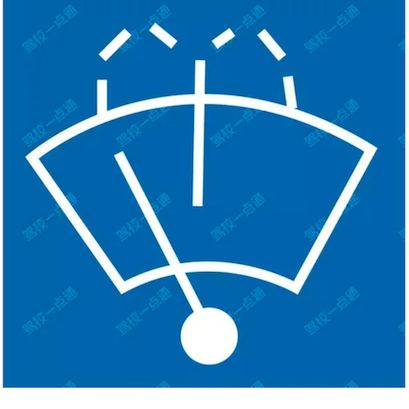

**选项**
- A. 后风窗玻璃除霜或除雾
- B. 前风窗玻璃刮水器及洗涤器
- C. 后风窗玻璃刮水器及洗涤器
- D. 前风窗玻璃除霜或除雾

**答案**：B（前风窗玻璃刮水器及洗涤器）
**秒懂技巧**：扇前矩后
**解释**：此技巧用于区分前风窗和后风窗。 扇前矩后：扇形表示前风窗； 矩形表示后风窗； 指针表示刮水器

##### P3-023｜试卷3 高频100题

**原题**：按下这个开关，后风窗玻璃除霜器开始工作。

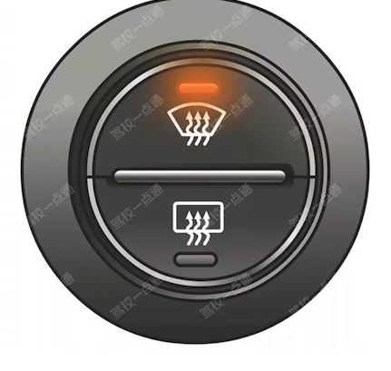

**选项**
- A. 正确
- B. 错误

**答案**：B（错误）
**秒懂技巧**：扇前矩后
**解释**：此技巧用于区分前风窗和后风窗。 扇前矩后：扇形表示前风窗； 矩形表示后风窗； 指针表示刮水器

##### P3-045｜试卷3 高频100题

**原题**：机动车仪表板上如图所示指示灯亮表示启用地板及前风窗玻璃吹风。

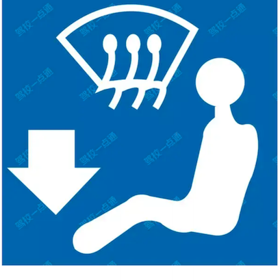

**选项**
- A. 正确
- B. 错误

**答案**：A（正确）
**秒懂技巧**：扇前矩后
**解释**：此技巧用于区分前风窗和后风窗。 扇前矩后：扇形表示前风窗； 矩形表示后风窗； 指针表示刮水器

展开其余 2 道对应原题

##### P3-100｜试卷3 高频100题

**原题**：如下图所示这个符号的开关控制什么装置？

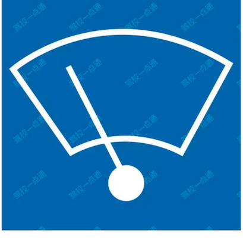

**选项**
- A. 前风窗玻璃刮水器
- B. 后风窗玻璃除霜
- C. 后风窗玻璃刮水器
- D. 前风窗玻璃除霜

**答案**：A（前风窗玻璃刮水器）
**秒懂技巧**：扇前矩后
**解释**：此技巧用于区分前风窗和后风窗。 扇前矩后：扇形表示前风窗； 矩形表示后风窗； 指针表示刮水器

##### P4-043｜试卷4 易错100题

**原题**：如下图所示这个符号的开关控制什么装置？

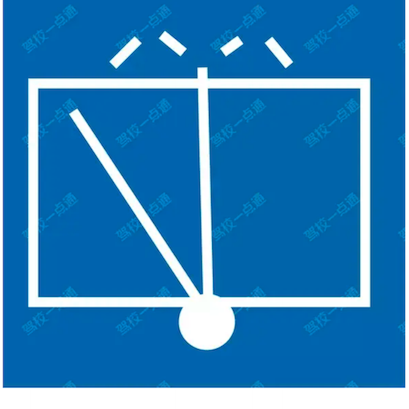

**选项**
- A. 后风窗玻璃除霜或除雾
- B. 前风窗玻璃刮水器及洗涤器
- C. 后风窗玻璃刮水器及洗涤器
- D. 前风窗玻璃除霜或除雾

**答案**：C（后风窗玻璃刮水器及洗涤器）
**秒懂技巧**：扇前矩后
**解释**：此技巧用于区分前风窗和后风窗。 扇前矩后：扇形表示前风窗； 矩形表示后风窗； 指针表示刮水器

### 2. 平远斜近

> 记忆核心：此技巧用于区分远光灯指示灯与近光灯指示灯。 平远：光束是蓝色平行的表示远光灯； 斜近：光束是绿色斜线的表示近光灯
> 使用方法：先看图形特征，再回到题干确认问的是名称、含义还是操作。

- 类型/频次：速记口诀×3；共 3 题；含图 3 题
- 对应题号：P2-100、P3-073、P4-099

#### 代表原题

##### P2-100｜试卷2 高频100题

**原题**：图中指示灯亮表示（）。

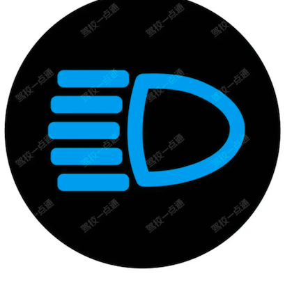

**选项**
- A. 已开启前照灯近光
- B. 已开启前雾灯
- C. 已开启前照灯远光
- D. 已开启后雾灯

**答案**：C（已开启前照灯远光）
**秒懂技巧**：平远斜近
**解释**：此技巧用于区分远光灯指示灯与近光灯指示灯。 平远：光束是蓝色平行的表示远光灯； 斜近：光束是绿色斜线的表示近光灯

##### P3-073｜试卷3 高频100题

**原题**：机动车仪表板上如图所示指示灯亮表示什么 ?

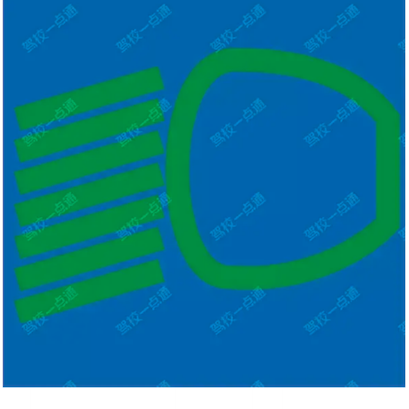

**选项**
- A. 已开启前照灯远光
- B. 已开启前雾灯
- C. 已开启后雾灯
- D. 已开启前照灯近光

**答案**：D（已开启前照灯近光）
**秒懂技巧**：平远斜近
**解释**：此技巧用于区分远光灯指示灯与近光灯指示灯。 平远：光束是蓝色平行的表示远光灯； 斜近：光束是绿色斜线的表示近光灯

##### P4-099｜试卷4 易错100题

**原题**：灯光开关旋转到这个位置时，全车灯光点亮。

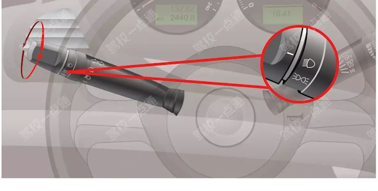

**选项**
- A. 正确
- B. 错误

**答案**：B（错误）
**秒懂技巧**：平远斜近
**解释**：此技巧用于区分远光灯指示灯与近光灯指示灯。 平远：光束是蓝色平行的表示远光灯； 斜近：光束是绿色斜线的表示近光灯

### 3. 看到ABS选紧急制动，有紧急制动选对，没有选错

> 记忆核心：ABS无法有效缩短制动距离。 ABS是防抱死制动系统，作用是保证车辆在任何路面上进行紧急制动时，防止车轮抱死，保持前轮转向能力，避免出现侧滑等现象。
> 使用方法：先圈出题干关键词，再到选项里找口诀提示的答案词。

- 类型/频次：关键字答题×3；共 3 题
- 对应题号：P2-085、P4-005、P5-055

#### 代表原题

##### P2-085｜试卷2 高频100题

**原题**：安装防抱死制动装置（ABS）的机动车制动时，制动距离会大大缩短，因此不必保持安全车距。

**选项**
- A. 正确
- B. 错误

**答案**：B（错误）
**秒懂技巧**：看到ABS选紧急制动，有紧急制动选对，没有选错
**解释**：ABS无法有效缩短制动距离。 ABS是防抱死制动系统，作用是保证车辆在任何路面上进行紧急制动时，防止车轮抱死，保持前轮转向能力，避免出现侧滑等现象。
**相关考点**：安全常识考点总结

##### P4-005｜试卷4 易错100题

**原题**：防抱死制动系统（ABS）在什么情况下可以最大限度发挥制动器效能?

**选项**
- A. 间歇制动
- B. 持续制动
- C. 缓踏制动踏板
- D. 紧急制动

**答案**：D（紧急制动）
**秒懂技巧**：看到ABS选紧急制动，有紧急制动选对，没有选错
**解释**：ABS是防抱死制动系统，作用是保证车辆在任何路面上进行紧急制动时，防止车轮抱死，保持前轮转向能力，避免出现侧滑等现象。
**相关考点**：安全常识考点总结

##### P5-055｜试卷5 冲刺100题

**原题**：驾驶有ABS系统的机动车在紧急制动的同时转向可能会发生侧滑。

**选项**
- A. 正确
- B. 错误

**答案**：A（正确）
**秒懂技巧**：看到ABS选紧急制动，有紧急制动选对，没有选错
**解释**：ABS是防抱死制动系统，作用是保证车辆在任何路面上进行紧急制动时，防止车轮抱死，保持前轮转向能力，避免出现侧滑等现象。 如果制动时同时转向，是有可能发生侧滑的。
**相关考点**：安全常识考点总结

### 4. 从左到右，一切断二接电三接收音四发动

> 记忆核心：从左到右；LOCK：切断电源；ACC：接通附件电源；ON：接通发动机以外的所有电源；START：接通起动机电源，启动发动机。
> 使用方法：从左到右；LOCK：切断电源；ACC：接通附件电源；ON：接通发动机以外的所有电源；START：接通起动机电源，启动发动机。

- 类型/频次：秒懂技巧×2；共 2 题；含图 2 题
- 对应题号：P2-083、P3-046

#### 代表原题

##### P2-083｜试卷2 高频100题

**原题**：将点火开关转到ACC位置起动机工作。

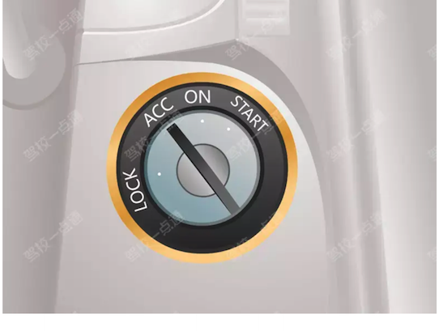

**选项**
- A. 正确
- B. 错误

**答案**：B（错误）
**秒懂技巧**：从左到右，一切断二接电三接收音四发动
**解释**：从左到右；LOCK：切断电源；ACC：接通附件电源；ON：接通发动机以外的所有电源；START：接通起动机电源，启动发动机。

##### P3-046｜试卷3 高频100题

**原题**：点火开关在LOCK位置拔出钥匙转向盘会锁住。

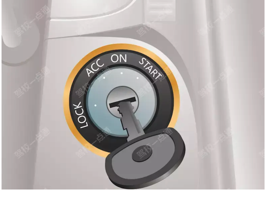

**选项**
- A. 正确
- B. 错误

**答案**：A（正确）
**秒懂技巧**：从左到右，一切断二接电三接收音四发动
**解释**：从左到右；LOCK：切断电源；ACC：接通附件电源；ON：接通发动机以外的所有电源；START：接通起动机电源，启动发动机。

### 5. 前发后行

> 记忆核心：此技巧用于区分发动机舱和行李舱。 前发后行：前面翘起表示发动机盖开启； 后面翘起表示行李舱开启
> 使用方法：先看图形特征，再回到题干确认问的是名称、含义还是操作。

- 类型/频次：速记口诀×2；共 2 题；含图 2 题
- 对应题号：P3-074、P3-086

#### 代表原题

##### P3-074｜试卷3 高频100题

**原题**：机动车仪表板上这个符号如下图表示什么?

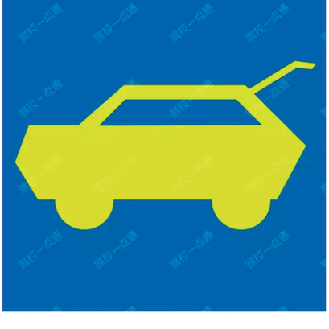

**选项**
- A. 一侧车门开启
- B. 行李舱开启
- C. 发动机舱开启
- D. 燃油箱盖开启

**答案**：B（行李舱开启）
**秒懂技巧**：前发后行
**解释**：此技巧用于区分发动机舱和行李舱。 前发后行：前面翘起表示发动机盖开启； 后面翘起表示行李舱开启

##### P3-086｜试卷3 高频100题

**原题**：机动车仪表板上如图所示指示灯亮，提示发动机舱开启。

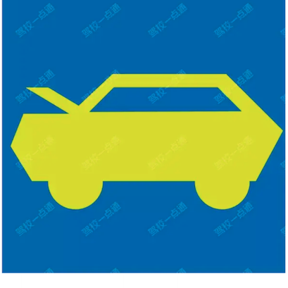

**选项**
- A. 正确
- B. 错误

**答案**：A（正确）
**秒懂技巧**：前发后行
**解释**：此技巧用于区分发动机舱和行李舱。 前发后行：前面翘起表示发动机盖开启； 后面翘起表示行李舱开启

### 6. 安全带，减伤害，头枕护颈不护头

> 记忆核心：此技巧用于说明安全带和安全头枕的使用方法。 行驶前系好安全带，安全带可以减轻伤害； 安全头枕保护颈椎，不到位会对颈椎造成伤害
> 使用方法：此技巧用于说明安全带和安全头枕的使用方法。 行驶前系好安全带，安全带可以减轻伤害； 安全头枕保护颈椎，不到位会对颈椎造成伤害

- 类型/频次：速记口诀×2；共 2 题
- 对应题号：P3-047、P3-075

#### 代表原题

##### P3-047｜试卷3 高频100题

**原题**：安全头枕用于在发生追尾事故时保护驾驶人的头部不受伤害。

**选项**
- A. 正确
- B. 错误

**答案**：B（错误）
**秒懂技巧**：安全带，减伤害，头枕护颈不护头
**解释**：此技巧用于说明安全带和安全头枕的使用方法。 行驶前系好安全带，安全带可以减轻伤害； 安全头枕保护颈椎，不到位会对颈椎造成伤害
**相关考点**：安全常识考点总结

##### P3-075｜试卷3 高频100题

**原题**：安全头枕在发生追尾事故时，能有效保护驾驶人的什么部位？

**选项**
- A. 腰部
- B. 胸部
- C. 颈部
- D. 头部

**答案**：C（颈部）
**秒懂技巧**：安全带，减伤害，头枕护颈不护头
**解释**：此技巧用于说明安全带和安全头枕的使用方法。 行驶前系好安全带，安全带可以减轻伤害； 安全头枕保护颈椎，不到位会对颈椎造成伤害
**相关考点**：安全常识考点总结

### 7. 左灯右水

> 记忆核心：此技巧用于区分灯光开关和刮水器开关。 左灯右水：方向盘左边是灯光开关； 方向盘右边是刮水器开关
> 使用方法：此技巧用于区分灯光开关和刮水器开关。 左灯右水：方向盘左边是灯光开关； 方向盘右边是刮水器开关

- 类型/频次：速记口诀×2；共 2 题；含图 2 题
- 对应题号：P2-046、P3-022

#### 代表原题

##### P2-046｜试卷2 高频100题

**原题**：上下拨动图中开关，前挡风玻璃刮水器开始工作。

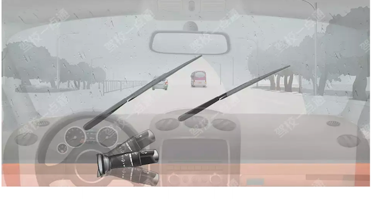

**选项**
- A. 正确
- B. 错误

**答案**：A（正确）
**秒懂技巧**：左灯右水
**解释**：此技巧用于区分灯光开关和刮水器开关。 左灯右水：方向盘左边是灯光开关； 方向盘右边是刮水器开关

##### P3-022｜试卷3 高频100题

**原题**：红圈内的装置是（）。

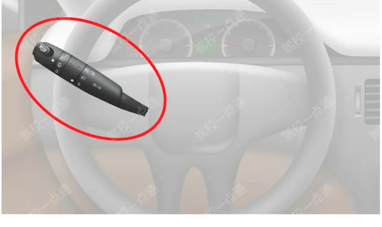

**选项**
- A. 灯光、信号组合开关
- B. 倒车灯开关
- C. 刮水器开关
- D. 危险报警闪光灯开关

**答案**：A（灯光、信号组合开关）
**秒懂技巧**：左灯右水
**解释**：此技巧用于区分灯光开关和刮水器开关。 左灯右水：方向盘左边是灯光开关； 方向盘右边是刮水器开关

### 8. 水温表亮表示温度太高，冷却液不足

> 记忆核心：把口诀对应到题干关键词，优先排除与口诀相反或无关的选项。
> 使用方法：先看图形特征，再回到题干确认问的是名称、含义还是操作。

- 类型/频次：秒懂技巧×2；共 2 题；含图 2 题
- 对应题号：P2-099、P4-045

#### 代表原题

##### P2-099｜试卷2 高频100题

**原题**：图中指示灯亮时提醒发动机需要加注机油。

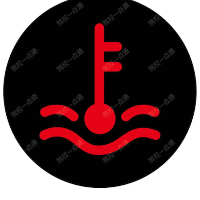

**选项**
- A. 正确
- B. 错误

**答案**：B（错误）
**秒懂技巧**：水温表亮表示温度太高，冷却液不足
**解释**：把口诀对应到题干关键词，优先排除与口诀相反或无关的选项。

##### P4-045｜试卷4 易错100题

**原题**：机动车仪表板上如图所示指示灯亮表示什么？

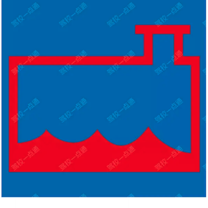

**选项**
- A. 制动液不足
- B. 洗涤液不足
- C. 冷却系统故障
- D. 冷却液不足

**答案**：D（冷却液不足）
**秒懂技巧**：水温表亮表示温度太高，冷却液不足
**解释**：把口诀对应到题干关键词，优先排除与口诀相反或无关的选项。

### 9. 看到会车/起步/跟车/进入隧道时要开启近光灯

> 记忆核心：夜间在没有中心隔离设施或者没有中心线的道路上驾驶机动车会车时，应使用近光灯。所以本题选与对向机动车会车时。 《道路交通安全法实施条例》第四十八条：在没有中心隔离设施或者没有中心线的道路上，夜间会车应当在距相对方向来车150米以外改用近光灯，在窄路、窄桥与非机动车会车时应当使用近光灯。
> 使用方法：先圈出题干关键词，再到选项里找口诀提示的答案词。

- 类型/频次：关键字答题×2；共 2 题；含图 1 题
- 对应题号：P4-051、P4-052

#### 代表原题

##### P4-052｜试卷4 易错100题

**原题**：如图所示，夜间驾驶机动车与同方向行驶的前车距离较近时，以下做法正确的是什么？

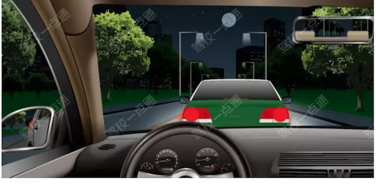

**选项**
- A. 使用远光灯，有利于观察路面情况
- B. 禁止使用远光灯，避免灯光照射至前车后视镜造成前车驾驶人眩目
- C. 使用远光灯，有利于告知前方驾驶人后方有来车
- D. 禁止使用远光灯，避免灯光照射至前车后视镜造成自己眩目

**答案**：B（禁止使用远光灯，避免灯光照射至前车后视镜造成前车驾驶人眩目）
**秒懂技巧**：看到会车/起步/跟车/进入隧道时要开启近光灯
**解释**：适用于速度灯光考点总结相关题。做题时先抓题干关键词，再按口诀定位答案。
**相关考点**：速度灯光考点总结

##### P4-051｜试卷4 易错100题

**原题**：夜间驾驶机动车在没有中心隔离设施或者没有中心线的道路上行驶，以下哪种情况下应当改用近光灯？

**选项**
- A. 接近没有交通信号灯控制的交叉路口时
- B. 与对向机动车会车时
- C. 接近人行横道时
- D. 城市道路照明条件不良时

**答案**：B（与对向机动车会车时）
**秒懂技巧**：看到会车/起步/跟车/进入隧道时要开启近光灯
**解释**：夜间在没有中心隔离设施或者没有中心线的道路上驾驶机动车会车时，应使用近光灯。所以本题选与对向机动车会车时。 《道路交通安全法实施条例》第四十八条：在没有中心隔离设施或者没有中心线的道路上，夜间会车应当在距相对方向来车150米以外改用近光灯，在窄路、窄桥与非机动车会车时应当使用近光灯。
**相关考点**：速度灯光考点总结

### 10. 箭头对地面/人，选地面/迎面

> 记忆核心：这是关键词判断法：题干或选项出现对应词时，按口诀直接定位或排除。
> 使用方法：这类题适合快速直选；但遇到“错误的是、不能、不得”要先看清正反问法。

- 类型/频次：秒懂技巧×2；共 2 题；含图 2 题
- 对应题号：P4-041、P4-042

#### 代表原题

##### P4-041｜试卷4 易错100题

**原题**：机动车仪表板上如下图所示指示灯亮表示什么？

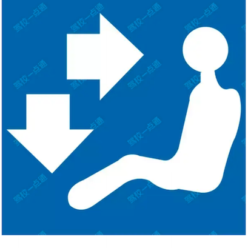

**选项**
- A. 空气内循环
- B. 地板及迎面出风
- C. 空气外循环
- D. 侧面及地板出风

**答案**：B（地板及迎面出风）
**秒懂技巧**：箭头对地面/人，选地面/迎面
**解释**：这是关键词判断法：题干或选项出现对应词时，按口诀直接定位或排除。

##### P4-042｜试卷4 易错100题

**原题**：机动车仪表板上如下图所示指示灯亮表示什么？

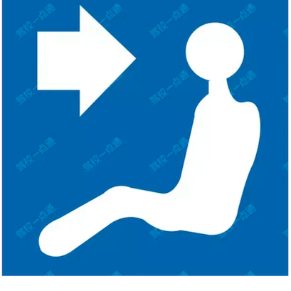

**选项**
- A. 空气内循环
- B. 侧面出风
- C. 空气外循环
- D. 迎面出风

**答案**：D（迎面出风）
**秒懂技巧**：箭头对地面/人，选地面/迎面
**解释**：这是关键词判断法：题干或选项出现对应词时，按口诀直接定位或排除。

### 11. 超车开左转向灯，超车后驶回开右转向灯

> 记忆核心：超车时应提前开启左转向灯，提醒其他车辆即将变道超车。 超车只能从左侧超越，不可从右侧超车； 连续超越多辆车的行为非常危险不可取。 前方车辆正在超车时，我方车辆禁止超车。 《道路交通安全法实施条例》第四十七条：机动车超车时，应当提前开启左转向灯、变换使用远、近光灯或者鸣喇叭。
> 使用方法：超车时应提前开启左转向灯，提醒其他车辆即将变道超车。 超车只能从左侧超越，不可从右侧超车； 连续超越多辆车的行为非常危险不可取。 前方车辆正在超车时，我方车辆禁止超车。 《道路交通安全法实施条例》第四十七条：机动车超车时，应当提前开启左转向灯、变换使用远、近光灯或者鸣喇叭。

- 类型/频次：关键字答题×2；共 2 题
- 对应题号：P5-076、P5-090

#### 代表原题

##### P5-076｜试卷5 冲刺100题

**原题**：驾驶机动车超车时，以下做法正确的是什么？

**选项**
- A. 从同车道前方车辆的右侧超车
- B. 可连续超越多辆机动车
- C. 前方车辆正在超车时，可连续鸣喇叭强行超越
- D. 提前开启左转向灯

**答案**：D（提前开启左转向灯）
**秒懂技巧**：超车开左转向灯，超车后驶回开右转向灯
**解释**：超车时应提前开启左转向灯，提醒其他车辆即将变道超车。 超车只能从左侧超越，不可从右侧超车； 连续超越多辆车的行为非常危险不可取。 前方车辆正在超车时，我方车辆禁止超车。 《道路交通安全法实施条例》第四十七条：机动车超车时，应当提前开启左转向灯、变换使用远、近光灯或者鸣喇叭。
**相关考点**：速度灯光考点总结

##### P5-090｜试卷5 冲刺100题

**原题**：白天驾驶机动车超车时，应提前开启什么灯光？

**选项**
- A. 危险报警闪光灯
- B. 远光灯
- C. 左转向灯
- D. 右转向灯

**答案**：C（左转向灯）
**秒懂技巧**：超车开左转向灯，超车后驶回开右转向灯
**解释**：白天超车应提前开启左转向灯，提醒其他车辆即将变道超车。 远光灯适用于照明条件不好的路段； 右转向灯适用于右转弯的时候开启； 危险报警闪光灯适用于车辆发生故障的时候开启。 《道路交通安全法实施条例》第四十七条：机动车超车时，应当提前开启左转向灯、变换使用远、近光灯或者鸣喇叭。
**相关考点**：速度灯光考点总结

### 12. 踏板从左到右离制加

> 记忆核心：此技巧用于区分不同踏板的名称。 左侧为离合器踏板； 中间为制动踏板； 右侧为加速踏板
> 使用方法：此技巧用于区分不同踏板的名称。 左侧为离合器踏板； 中间为制动踏板； 右侧为加速踏板

- 类型/频次：秒懂技巧×2；共 2 题；含图 2 题
- 对应题号：P4-098、P5-025

#### 代表原题

##### P4-098｜试卷4 易错100题

**原题**：这是什么踏板？

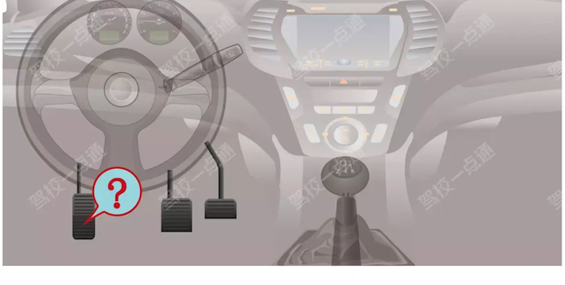

**选项**
- A. 加速踏板
- B. 离合器踏板
- C. 制动踏板
- D. 驻车制动器

**答案**：B（离合器踏板）
**秒懂技巧**：踏板从左到右离制加
**解释**：此技巧用于区分不同踏板的名称。 左侧为离合器踏板； 中间为制动踏板； 右侧为加速踏板

##### P5-025｜试卷5 冲刺100题

**原题**：这是什么踏板？

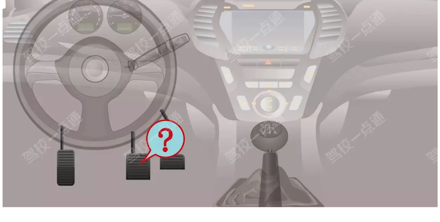

**选项**
- A. 加速踏板
- B. 离合器踏板
- C. 制动踏板
- D. 驻车制动器

**答案**：C（制动踏板）
**秒懂技巧**：踏板从左到右离制加
**解释**：此技巧用于区分不同踏板的名称。 左侧为离合器踏板； 中间为制动踏板； 右侧为加速踏板

### 13. 雾灯前绿后黄

> 记忆核心：此技巧用于区分前雾灯和后雾灯。 前绿：开启雾灯仪表板上绿灯亮起，表示前雾灯； 右后：开启雾灯仪表板上黄灯亮起，表示后雾灯。
> 使用方法：先看图形特征，再回到题干确认问的是名称、含义还是操作。

- 类型/频次：速记口诀×2；共 2 题；含图 2 题
- 对应题号：P3-061、P3-072

#### 代表原题

##### P3-061｜试卷3 高频100题

**原题**：打开前雾灯开关，如下图所示指示灯亮起。

**选项**
- A. 正确
- B. 错误

**答案**：A（正确）
**秒懂技巧**：雾灯前绿后黄
**解释**：此技巧用于区分前雾灯和后雾灯。 前绿：开启雾灯仪表板上绿灯亮起，表示前雾灯； 右后：开启雾灯仪表板上黄灯亮起，表示后雾灯。

##### P3-072｜试卷3 高频100题

**原题**：机动车仪表板上如图所示指示灯亮表示什么？

**选项**
- A. 前雾灯打开
- B. 后雾灯打开
- C. 前照灯近光打开
- D. 前照灯远光打开

**答案**：B（后雾灯打开）
**秒懂技巧**：雾灯前绿后黄
**解释**：此技巧用于区分前雾灯和后雾灯。 前绿：开启雾灯仪表板上绿灯亮起，表示前雾灯； 右后：开启雾灯仪表板上黄灯亮起，表示后雾灯。

### 14. 雾灯左前右后

> 记忆核心：此技巧用于雾灯开关标志相关题目。三条斜线在左边的表示前雾灯，三条斜线在右边表示后雾灯。注意操纵杆上的白色指标对着哪个灯光开关标志。
> 使用方法：此技巧用于雾灯开关标志相关题目。三条斜线在左边的表示前雾灯，三条斜线在右边表示后雾灯。注意操纵杆上的白色指标对着哪个灯光开关标志。

- 类型/频次：秒懂技巧×2；共 2 题；含图 2 题
- 对应题号：P4-013、P4-100

#### 代表原题

##### P4-013｜试卷4 易错100题

**原题**：灯光开关在该位置时，前雾灯点亮。

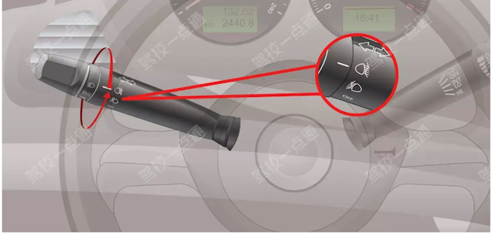

**选项**
- A. 正确
- B. 错误

**答案**：B（错误）
**秒懂技巧**：雾灯左前右后
**解释**：此技巧用于雾灯开关标志相关题目。三条斜线在左边的表示前雾灯，三条斜线在右边表示后雾灯。注意操纵杆上的白色指标对着哪个灯光开关标志。

##### P4-100｜试卷4 易错100题

**原题**：灯光开关在该位置时，前雾灯点亮。

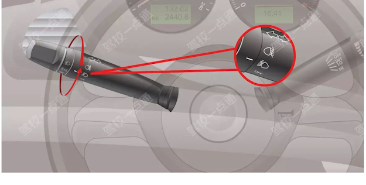

**选项**
- A. 正确
- B. 错误

**答案**：A（正确）
**秒懂技巧**：雾灯左前右后
**解释**：此技巧用于雾灯开关标志相关题目。三条斜线在左边的表示前雾灯，三条斜线在右边表示后雾灯。注意操纵杆上的白色指标对着哪个灯光开关标志。

### 15. 6000对应60，数字不对，选错

> 记忆核心：这是关键词判断法：题干或选项出现对应词时，按口诀直接定位或排除。
> 使用方法：这类题适合快速直选；但遇到“错误的是、不能、不得”要先看清正反问法。

- 类型/频次：秒懂技巧×1；共 1 题；含图 1 题
- 对应题号：P3-099

#### 代表原题

##### P3-099｜试卷3 高频100题

**原题**：仪表显示当前发动机转速是6000转/分钟。

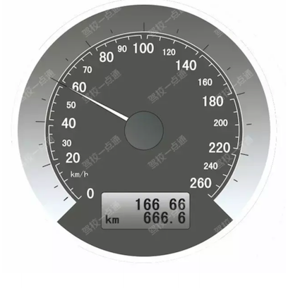

**选项**
- A. 正确
- B. 错误

**答案**：B（错误）
**秒懂技巧**：6000对应60，数字不对，选错
**解释**：这是关键词判断法：题干或选项出现对应词时，按口诀直接定位或排除。

### 16. ABS的作用是防抱死

> 记忆核心：适用于安全常识考点总结相关题。做题时先抓题干关键词，再按口诀定位答案。
> 使用方法：适用于安全常识考点总结相关题。做题时先抓题干关键词，再按口诀定位答案。

- 类型/频次：秒懂技巧×1；共 1 题；含图 1 题
- 对应题号：P3-076

#### 代表原题

##### P3-076｜试卷3 高频100题

**原题**：机动车在紧急制动时ABS系统会起到什么作用？

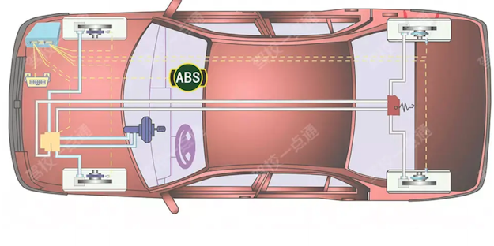

**选项**
- A. 切断动力输出
- B. 自动控制方向
- C. 减轻制动惯性
- D. 防止车轮抱死

**答案**：D（防止车轮抱死）
**秒懂技巧**：ABS的作用是防抱死
**解释**：适用于安全常识考点总结相关题。做题时先抓题干关键词，再按口诀定位答案。
**相关考点**：安全常识考点总结

### 17. ACC巡航的巡很像CC

> 记忆核心：自适应巡航ACC（Adaptive Cruise Control ），又称车辆主动巡航系统。自适应巡航系统能自动锁定前车车速，随前车加速而加速，当然，前车减速也会随之减速。 FCW是前方碰撞预警系统（Forward Collision Warning），BSD是盲点监测系统（Blind Spot Detection），AEB是（Autonomous Emergency Braking）自动紧急制动系统。
> 使用方法：自适应巡航ACC（Adaptive Cruise Control ），又称车辆主动巡航系统。自适应巡航系统能自动锁定前车车速，随前车加速而加速，当然，前车减速也会随之减速。 FCW是前方碰撞预警系统（Forward Collision Warning），BSD是盲点监测系统（Blind Spot Detection），AEB是（Autonomous Emergency Braking）自动紧急制动系统。

- 类型/频次：秒懂技巧×1；共 1 题
- 对应题号：P2-061

#### 代表原题

##### P2-061｜试卷2 高频100题

**原题**：以下缩写中，表示车辆自适应巡航系统缩写的是什么？

**选项**
- A. FCW
- B. BSD
- C. ACC
- D. AEB

**答案**：C（ACC）
**秒懂技巧**：ACC巡航的巡很像CC
**解释**：自适应巡航ACC（Adaptive Cruise Control ），又称车辆主动巡航系统。自适应巡航系统能自动锁定前车车速，随前车加速而加速，当然，前车减速也会随之减速。 FCW是前方碰撞预警系统（Forward Collision Warning），BSD是盲点监测系统（Blind Spot Detection），AEB是（Autonomous Emergency Braking）自动紧急制动系统。

### 18. 三条曲线，选雾

> 记忆核心：这是关键词判断法：题干或选项出现对应词时，按口诀直接定位或排除。
> 使用方法：这类题适合快速直选；但遇到“错误的是、不能、不得”要先看清正反问法。

- 类型/频次：秒懂技巧×1；共 1 题；含图 1 题
- 对应题号：P5-001

#### 代表原题

##### P5-001｜试卷5 冲刺100题

**原题**：这是什么操纵装置？

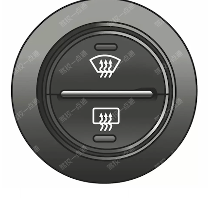

**选项**
- A. 除雾器开关
- B. 转向灯开关
- C. 前照灯开关
- D. 刮水器开关

**答案**：A（除雾器开关）
**秒懂技巧**：三条曲线，选雾
**解释**：这是关键词判断法：题干或选项出现对应词时，按口诀直接定位或排除。

### 19. 上右下左

> 记忆核心：此技巧用于区分右转向灯和左转向灯开关。 上右下左：灯光开关向上掰右转向灯亮起；灯光开关向下掰左转向灯亮起
> 使用方法：此技巧用于区分右转向灯和左转向灯开关。 上右下左：灯光开关向上掰右转向灯亮起；灯光开关向下掰左转向灯亮起

- 类型/频次：速记口诀×1；共 1 题；含图 1 题
- 对应题号：P4-004

#### 代表原题

##### P4-004｜试卷4 易错100题

**原题**：将转向灯开关向上提，左转向灯亮。

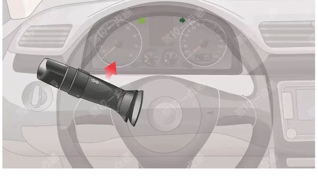

**选项**
- A. 正确
- B. 错误

**答案**：B（错误）
**秒懂技巧**：上右下左
**解释**：此技巧用于区分右转向灯和左转向灯开关。 上右下左：灯光开关向上掰右转向灯亮起；灯光开关向下掰左转向灯亮起

### 20. 两灯相对选雾灯

> 记忆核心：适用于特殊天气考点总结相关题。做题时先抓题干关键词，再按口诀定位答案。
> 使用方法：这类题适合快速直选；但遇到“错误的是、不能、不得”要先看清正反问法。

- 类型/频次：秒懂技巧×1；共 1 题；含图 1 题
- 对应题号：P3-007

#### 代表原题

##### P3-007｜试卷3 高频100题

**原题**：为提示车辆和行人注意，雾天必须开启哪个灯？

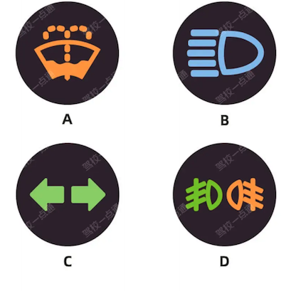

**选项**
- A. 如图中A所示
- B. 如图中B所示
- C. 如图中C所示
- D. 如图中D所示

**答案**：D（如图中D所示）
**秒懂技巧**：两灯相对选雾灯
**解释**：适用于特殊天气考点总结相关题。做题时先抓题干关键词，再按口诀定位答案。
**相关考点**：特殊天气考点总结

### 21. 仪表板上有刺客灯亮，表示未系安全带

> 记忆核心：把口诀对应到题干关键词，优先排除与口诀相反或无关的选项。
> 使用方法：先看图形特征，再回到题干确认问的是名称、含义还是操作。

- 类型/频次：秒懂技巧×1；共 1 题；含图 1 题
- 对应题号：P3-043

#### 代表原题

##### P3-043｜试卷3 高频100题

**原题**：机动车仪表板上如图所示指示灯亮表示什么？

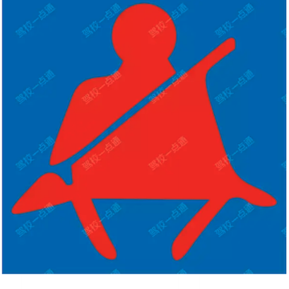

**选项**
- A. 没有系好安全带
- B. 安全带出现故障
- C. 已经系好安全带
- D. 安全带系得过松

**答案**：A（没有系好安全带）
**秒懂技巧**：仪表板上有刺客灯亮，表示未系安全带
**解释**：把口诀对应到题干关键词，优先排除与口诀相反或无关的选项。

### 22. 仪表盘黄色表示提醒，图中两侧门打开

> 记忆核心：把口诀对应到题干关键词，优先排除与口诀相反或无关的选项。
> 使用方法：先看图形特征，再回到题干确认问的是名称、含义还是操作。

- 类型/频次：秒懂技巧×1；共 1 题；含图 1 题
- 对应题号：P3-002

#### 代表原题

##### P3-002｜试卷3 高频100题

**原题**：机动车仪表板上如下图指示灯亮表示什么？

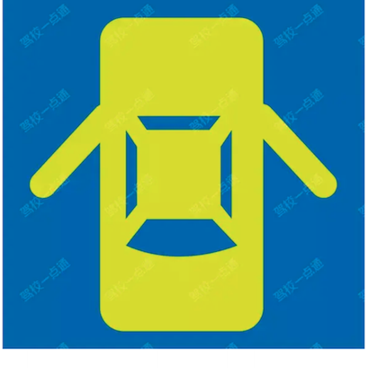

**选项**
- A. 两侧车门开启
- B. 行李舱开启
- C. 发动机舱开启
- D. 燃油箱盖开启

**答案**：A（两侧车门开启）
**秒懂技巧**：仪表盘黄色表示提醒，图中两侧门打开
**解释**：把口诀对应到题干关键词，优先排除与口诀相反或无关的选项。

### 23. 仪表题中看到亮是工作/打开状态选错，有问题才会亮

> 记忆核心：这是关键词判断法：题干或选项出现对应词时，按口诀直接定位或排除。
> 使用方法：先圈出题干关键词，再到选项里找口诀提示的答案词。

- 类型/频次：秒懂技巧×1；共 1 题；含图 1 题
- 对应题号：P3-044

#### 代表原题

##### P3-044｜试卷3 高频100题

**原题**：机动车仪表板上如图所示指示灯一直亮，表示安全气囊处于工作状态。

**选项**
- A. 正确
- B. 错误

**答案**：B（错误）
**秒懂技巧**：仪表题中看到亮是工作/打开状态选错，有问题才会亮
**解释**：这是关键词判断法：题干或选项出现对应词时，按口诀直接定位或排除。

### 24. 仪表题中看到亮表示提醒，图中是右侧车门提醒右侧车门未关闭

> 记忆核心：这是关键词判断法：题干或选项出现对应词时，按口诀直接定位或排除。
> 使用方法：先圈出题干关键词，再到选项里找口诀提示的答案词。

- 类型/频次：秒懂技巧×1；共 1 题；含图 1 题
- 对应题号：P2-047

#### 代表原题

##### P2-047｜试卷2 高频100题

**原题**：机动车仪表板上如图所示指示灯亮，提示右侧车门未关闭。

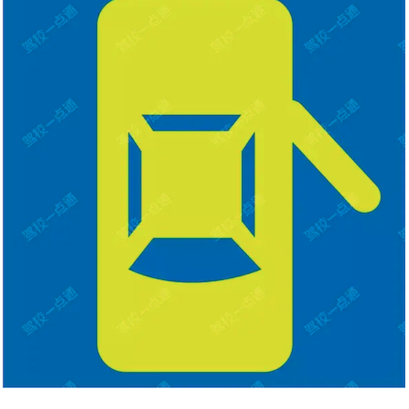

**选项**
- A. 正确
- B. 错误

**答案**：A（正确）
**秒懂技巧**：仪表题中看到亮表示提醒，图中是右侧车门提醒右侧车门未关闭
**解释**：这是关键词判断法：题干或选项出现对应词时，按口诀直接定位或排除。

### 25. 仪表题中看到亮表示提醒，图中是左侧车门提醒左侧车门未关闭

> 记忆核心：这是关键词判断法：题干或选项出现对应词时，按口诀直接定位或排除。
> 使用方法：先圈出题干关键词，再到选项里找口诀提示的答案词。

- 类型/频次：秒懂技巧×1；共 1 题；含图 1 题
- 对应题号：P3-003

#### 代表原题

##### P3-003｜试卷3 高频100题

**原题**：机动车仪表板上如图所示指示灯亮，提示右侧车门未关闭。

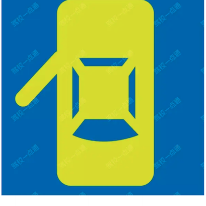

**选项**
- A. 正确
- B. 错误

**答案**：B（错误）
**秒懂技巧**：仪表题中看到亮表示提醒，图中是左侧车门提醒左侧车门未关闭
**解释**：这是关键词判断法：题干或选项出现对应词时，按口诀直接定位或排除。

### 26. 前后一样灯，选前后

> 记忆核心：这是关键词判断法：题干或选项出现对应词时，按口诀直接定位或排除。
> 使用方法：这类题适合快速直选；但遇到“错误的是、不能、不得”要先看清正反问法。

- 类型/频次：秒懂技巧×1；共 1 题；含图 1 题
- 对应题号：P4-003

#### 代表原题

##### P4-003｜试卷4 易错100题

**原题**：旋转开关这一档控制机动车哪个部位？

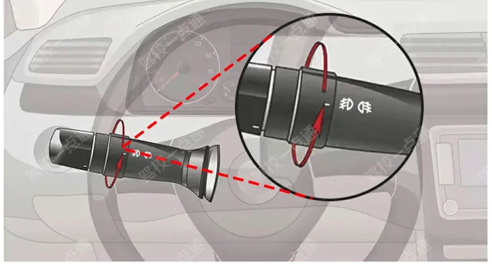

**选项**
- A. 左右转向灯
- B. 近光灯
- C. 前后雾灯
- D. 远光灯

**答案**：C（前后雾灯）
**秒懂技巧**：前后一样灯，选前后
**解释**：这是关键词判断法：题干或选项出现对应词时，按口诀直接定位或排除。

### 27. 发动机工作就是打开，题中说ON位置发动机工作，选对

> 记忆核心：这是关键词判断法：题干或选项出现对应词时，按口诀直接定位或排除。
> 使用方法：这类题适合快速直选；但遇到“错误的是、不能、不得”要先看清正反问法。

- 类型/频次：秒懂技巧×1；共 1 题；含图 1 题
- 对应题号：P4-055

#### 代表原题

##### P4-055｜试卷4 易错100题

**原题**：点火开关在ON位置，发动机工作。

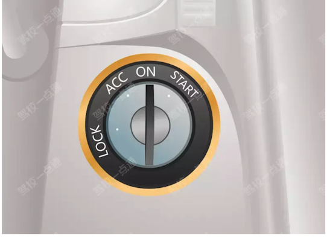

**选项**
- A. 正确
- B. 错误

**答案**：A（正确）
**秒懂技巧**：发动机工作就是打开，题中说ON位置发动机工作，选对
**解释**：这是关键词判断法：题干或选项出现对应词时，按口诀直接定位或排除。

### 28. 变道要开转向灯，确认安全不影响相关车辆行驶。看到迅速变选错

> 记忆核心：本题考点为变更车道安全驾驶相关内容。变更车道时应提前开转向灯，不能影响其他车辆正常行驶。 《道路交通安全法实施条例》规定：在道路同方向划有2条以上机动车道的，变更车道的机动车不得影响相关车道内行驶的机动车的正常行驶。 开启转向灯后，应观察情况，确保安全后再转向，不能迅速转向。
> 使用方法：先圈出题干关键词，再到选项里找口诀提示的答案词。

- 类型/频次：关键字答题×1；共 1 题
- 对应题号：P4-070

#### 代表原题

##### P4-070｜试卷4 易错100题

**原题**：机动车在道路上变更车道需要注意什么？

**选项**
- A. 尽快加速进入左侧车道
- B. 不能影响其他车辆正常行驶
- C. 进入左侧车道时适当减速
- D. 开启转向灯迅速向左转向

**答案**：B（不能影响其他车辆正常行驶）
**秒懂技巧**：变道要开转向灯，确认安全不影响相关车辆行驶。看到迅速变选错
**解释**：本题考点为变更车道安全驾驶相关内容。变更车道时应提前开转向灯，不能影响其他车辆正常行驶。 《道路交通安全法实施条例》规定：在道路同方向划有2条以上机动车道的，变更车道的机动车不得影响相关车道内行驶的机动车的正常行驶。 开启转向灯后，应观察情况，确保安全后再转向，不能迅速转向。
**相关考点**：通行原则考点总结

### 29. 图1是安全带正确系法

> 记忆核心：适用于安全常识考点总结相关题。做题时先抓题干关键词，再按口诀定位答案。
> 使用方法：适用于安全常识考点总结相关题。做题时先抓题干关键词，再按口诀定位答案。

- 类型/频次：秒懂技巧×1；共 1 题；含图 1 题
- 对应题号：P3-025

#### 代表原题

##### P3-025｜试卷3 高频100题

**原题**：以下安全带系法正确的是？

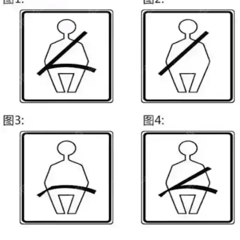

**选项**
- A. 图1
- B. 图2
- C. 图3
- D. 图4

**答案**：A（图1）
**秒懂技巧**：图1是安全带正确系法
**解释**：适用于安全常识考点总结相关题。做题时先抓题干关键词，再按口诀定位答案。
**相关考点**：安全常识考点总结

### 30. 图中右转向灯亮，题中也是右转向灯，选对

> 记忆核心：这是关键词判断法：题干或选项出现对应词时，按口诀直接定位或排除。
> 使用方法：这类题适合快速直选；但遇到“错误的是、不能、不得”要先看清正反问法。

- 类型/频次：秒懂技巧×1；共 1 题；含图 1 题
- 对应题号：P3-011

#### 代表原题

##### P3-011｜试卷3 高频100题

**原题**：打开右转向灯开关，如下图所示指示灯亮起。

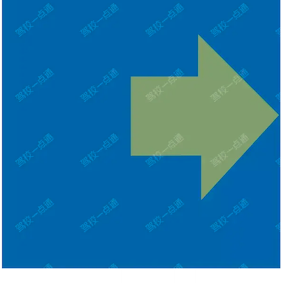

**选项**
- A. 正确
- B. 错误

**答案**：A（正确）
**秒懂技巧**：图中右转向灯亮，题中也是右转向灯，选对
**解释**：这是关键词判断法：题干或选项出现对应词时，按口诀直接定位或排除。

### 31. 图中左右为左右转向灯

> 记忆核心：把口诀对应到题干关键词，优先排除与口诀相反或无关的选项。
> 使用方法：把口诀对应到题干关键词，优先排除与口诀相反或无关的选项。

- 类型/频次：秒懂技巧×1；共 1 题；含图 1 题
- 对应题号：P2-084

#### 代表原题

##### P2-084｜试卷2 高频100题

**原题**：提拉这个开关控制机动车哪个部位？

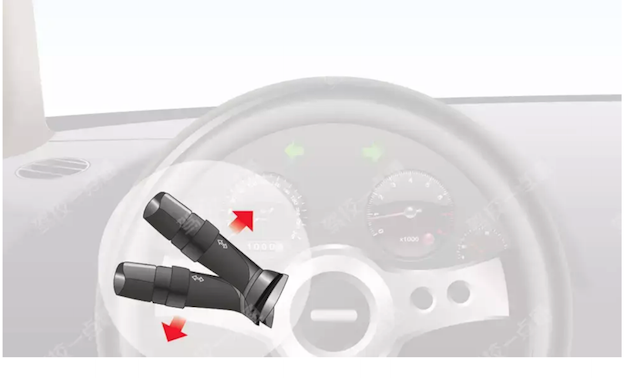

**选项**
- A. 倒车灯
- B. 左右转向灯
- C. 示廓灯
- D. 报警闪光灯

**答案**：B（左右转向灯）
**秒懂技巧**：图中左右为左右转向灯
**解释**：把口诀对应到题干关键词，优先排除与口诀相反或无关的选项。

### 32. 图中有CHECK是发动机故障

> 记忆核心：把口诀对应到题干关键词，优先排除与口诀相反或无关的选项。
> 使用方法：先看图形特征，再回到题干确认问的是名称、含义还是操作。

- 类型/频次：秒懂技巧×1；共 1 题；含图 1 题
- 对应题号：P4-001

#### 代表原题

##### P4-001｜试卷4 易错100题

**原题**：图中指示灯一直亮，表示发动机控制系统故障。

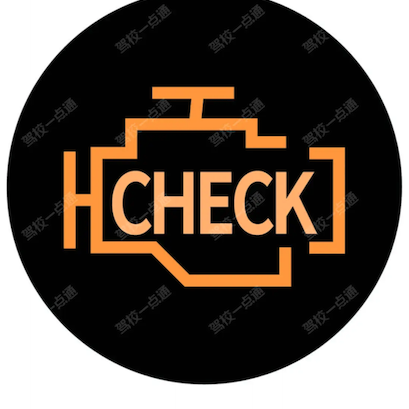

**选项**
- A. 正确
- B. 错误

**答案**：A（正确）
**秒懂技巧**：图中有CHECK是发动机故障
**解释**：把口诀对应到题干关键词，优先排除与口诀相反或无关的选项。

### 33. 图中有一滴水的表示机油压力过低是异常，选图1

> 记忆核心：这是关键词判断法：题干或选项出现对应词时，按口诀直接定位或排除。
> 使用方法：这类题适合快速直选；但遇到“错误的是、不能、不得”要先看清正反问法。

- 类型/频次：秒懂技巧×1；共 1 题；含图 1 题
- 对应题号：P2-069

#### 代表原题

##### P2-069｜试卷2 高频100题

**原题**：以下哪个指示灯亮时，表示发动机机油压力过低？

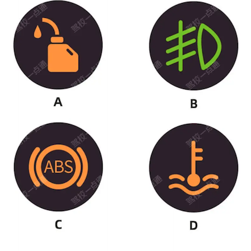

**选项**
- A. 如图中A所示
- B. 如图中B所示
- C. 如图中C所示
- D. 如图中D所示

**答案**：A（如图中A所示）
**秒懂技巧**：图中有一滴水的表示机油压力过低是异常，选图1
**解释**：这是关键词判断法：题干或选项出现对应词时，按口诀直接定位或排除。

### 34. 图中有加减号选电路

> 记忆核心：这是关键词判断法：题干或选项出现对应词时，按口诀直接定位或排除。
> 使用方法：这类题适合快速直选；但遇到“错误的是、不能、不得”要先看清正反问法。

- 类型/频次：秒懂技巧×1；共 1 题；含图 1 题
- 对应题号：P3-018

#### 代表原题

##### P3-018｜试卷3 高频100题

**原题**：机动车仪表板上如图所示指示灯亮表示什么？

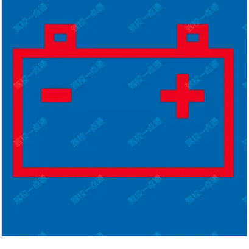

**选项**
- A. 充电电流过大
- B. 蓄电池损坏
- C. 电流表故障
- D. 充电电路故障

**答案**：D（充电电路故障）
**秒懂技巧**：图中有加减号选电路
**解释**：这是关键词判断法：题干或选项出现对应词时，按口诀直接定位或排除。

### 35. 图中有扇叶选风扇

> 记忆核心：这是关键词判断法：题干或选项出现对应词时，按口诀直接定位或排除。
> 使用方法：这类题适合快速直选；但遇到“错误的是、不能、不得”要先看清正反问法。

- 类型/频次：秒懂技巧×1；共 1 题；含图 1 题
- 对应题号：P2-056

#### 代表原题

##### P2-056｜试卷2 高频100题

**原题**：机动车仪表板上这个符号如下图所示表示什么？

**选项**
- A. 冷风暖气风扇
- B. 空调制冷
- C. 空气循环
- D. 雪地起步模式

**答案**：A（冷风暖气风扇）
**秒懂技巧**：图中有扇叶选风扇
**解释**：这是关键词判断法：题干或选项出现对应词时，按口诀直接定位或排除。

### 36. 图中有油箱选燃油最低

> 记忆核心：这是关键词判断法：题干或选项出现对应词时，按口诀直接定位或排除。
> 使用方法：这类题适合快速直选；但遇到“错误的是、不能、不得”要先看清正反问法。

- 类型/频次：秒懂技巧×1；共 1 题；含图 1 题
- 对应题号：P3-017

#### 代表原题

##### P3-017｜试卷3 高频100题

**原题**：图中指示灯亮表示（）

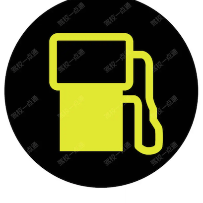

**选项**
- A. 油箱内燃油量低
- B. 油箱盖故障
- C. 发动机点火系统故障
- D. 发动机供油系统故障

**答案**：A（油箱内燃油量低）
**秒懂技巧**：图中有油箱选燃油最低
**解释**：这是关键词判断法：题干或选项出现对应词时，按口诀直接定位或排除。

### 37. 图中有滴表示机油压力异常

> 记忆核心：把口诀对应到题干关键词，优先排除与口诀相反或无关的选项。
> 使用方法：先看图形特征，再回到题干确认问的是名称、含义还是操作。

- 类型/频次：秒懂技巧×1；共 1 题；含图 1 题
- 对应题号：P2-054

#### 代表原题

##### P2-054｜试卷2 高频100题

**原题**：机动车仪表板上如下图所示指示灯亮表示发动机可能机油压力过高。

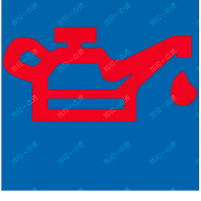

**选项**
- A. 正确
- B. 错误

**答案**：B（错误）
**秒懂技巧**：图中有滴表示机油压力异常
**解释**：把口诀对应到题干关键词，优先排除与口诀相反或无关的选项。

### 38. 图中有钥匙选开锁

> 记忆核心：这是关键词判断法：题干或选项出现对应词时，按口诀直接定位或排除。
> 使用方法：这类题适合快速直选；但遇到“错误的是、不能、不得”要先看清正反问法。

- 类型/频次：秒懂技巧×1；共 1 题；含图 1 题
- 对应题号：P4-044

#### 代表原题

##### P4-044｜试卷4 易错100题

**原题**：如下图所示这个符号的开关控制什么装置？

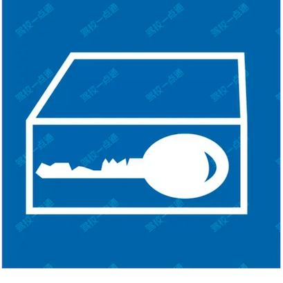

**选项**
- A. 儿童安全锁
- B. 两侧车窗玻璃
- C. 电动车门
- D. 车门锁住开锁

**答案**：D（车门锁住开锁）
**秒懂技巧**：图中有钥匙选开锁
**解释**：这是关键词判断法：题干或选项出现对应词时，按口诀直接定位或排除。

### 39. 图中没系安全带，选安全带

> 记忆核心：适用于安全常识考点总结相关题。做题时先抓题干关键词，再按口诀定位答案。
> 使用方法：这类题适合快速直选；但遇到“错误的是、不能、不得”要先看清正反问法。

- 类型/频次：秒懂技巧×1；共 1 题；含图 1 题
- 对应题号：P4-024

#### 代表原题

##### P4-024｜试卷4 易错100题

**原题**：这位驾驶人违反法律规定的行为是什么？

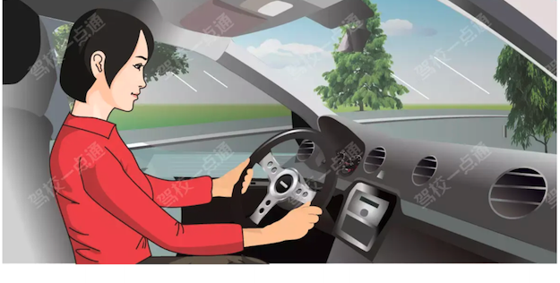

**选项**
- A. 没按规定握转向盘
- B. 座椅角度不对
- C. 没系安全带
- D. 驾驶姿势不正确

**答案**：C（没系安全带）
**秒懂技巧**：图中没系安全带，选安全带
**解释**：适用于安全常识考点总结相关题。做题时先抓题干关键词，再按口诀定位答案。
**相关考点**：安全常识考点总结

### 40. 图片像太阳，选总字

> 记忆核心：这是关键词判断法：题干或选项出现对应词时，按口诀直接定位或排除。
> 使用方法：这类题适合快速直选；但遇到“错误的是、不能、不得”要先看清正反问法。

- 类型/频次：秒懂技巧×1；共 1 题；含图 1 题
- 对应题号：P4-097

#### 代表原题

##### P4-097｜试卷4 易错100题

**原题**：机动车仪表板上这个符号如图所示表示什么？

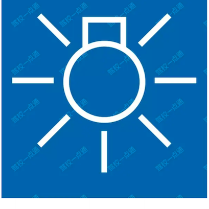

**选项**
- A. 近光灯开关
- B. 远光灯开关
- C. 车灯总开关
- D. 后雾灯开关

**答案**：C（车灯总开关）
**秒懂技巧**：图片像太阳，选总字
**解释**：这是关键词判断法：题干或选项出现对应词时，按口诀直接定位或排除。

### 41. 圈里有小孩选儿童

> 记忆核心：这是关键词判断法：题干或选项出现对应词时，按口诀直接定位或排除。
> 使用方法：这类题适合快速直选；但遇到“错误的是、不能、不得”要先看清正反问法。

- 类型/频次：秒懂技巧×1；共 1 题；含图 1 题
- 对应题号：P3-020

#### 代表原题

##### P3-020｜试卷3 高频100题

**原题**：如下图所示这个符号的开关控制什么装置？

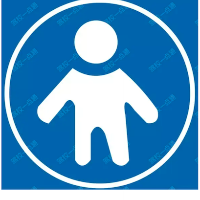

**选项**
- A. 儿童安全锁
- B. 两侧车窗玻璃
- C. 电动车门
- D. 车门锁住开锁

**答案**：A（儿童安全锁）
**秒懂技巧**：圈里有小孩选儿童
**解释**：这是关键词判断法：题干或选项出现对应词时，按口诀直接定位或排除。

### 42. 夜晚通过特殊道路，选交替使用远近光灯，没有交替选近光灯

> 记忆核心：适用于速度灯光考点总结相关题。做题时先抓题干关键词，再按口诀定位答案。
> 使用方法：这类题适合快速直选；但遇到“错误的是、不能、不得”要先看清正反问法。

- 类型/频次：秒懂技巧×1；共 1 题；含图 1 题
- 对应题号：P5-034

#### 代表原题

##### P5-034｜试卷5 冲刺100题

**原题**：在这种环境下通过路口如何使用灯光？

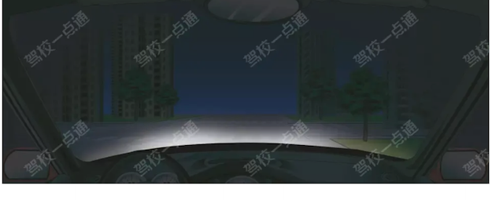

**选项**
- A. 关闭远光灯
- B. 使用危险报警闪光灯
- C. 使用远光灯
- D. 交替使用远近光灯

**答案**：D（交替使用远近光灯）
**秒懂技巧**：夜晚通过特殊道路，选交替使用远近光灯，没有交替选近光灯
**解释**：适用于速度灯光考点总结相关题。做题时先抓题干关键词，再按口诀定位答案。
**相关考点**：速度灯光考点总结

### 43. 安全气囊加安全带的双重保护增加安全

> 记忆核心：适用于安全常识考点总结相关题。做题时先抓题干关键词，再按口诀定位答案。
> 使用方法：适用于安全常识考点总结相关题。做题时先抓题干关键词，再按口诀定位答案。

- 类型/频次：秒懂技巧×1；共 1 题；含图 1 题
- 对应题号：P3-048

#### 代表原题

##### P3-048｜试卷3 高频100题

**原题**：正面安全气囊与什么配合才能充分发挥保护作用？

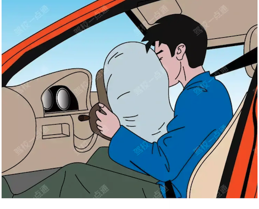

**选项**
- A. 座椅安全带
- B. 防抱死制动系统
- C. 座椅安全头枕
- D. 安全玻璃

**答案**：A（座椅安全带）
**秒懂技巧**：安全气囊加安全带的双重保护增加安全
**解释**：适用于安全常识考点总结相关题。做题时先抓题干关键词，再按口诀定位答案。
**相关考点**：安全常识考点总结

### 44. 安全气囊是辅助驾乘人员保护系统

> 记忆核心：安全气囊是辅助驾乘人员保护系统。 当车辆发生碰撞时，气囊会迅速膨胀，在驾驶人、乘车人的正面和侧面形成保护气垫，从而降低驾乘人员伤害程度。
> 使用方法：安全气囊是辅助驾乘人员保护系统。 当车辆发生碰撞时，气囊会迅速膨胀，在驾驶人、乘车人的正面和侧面形成保护气垫，从而降低驾乘人员伤害程度。

- 类型/频次：秒懂技巧×1；共 1 题
- 对应题号：P2-066

#### 代表原题

##### P2-066｜试卷2 高频100题

**原题**：安全气囊是一种什么装置？

**选项**
- A. 驾驶人头颈保护系统
- B. 防抱死制动系统
- C. 电子制动力分配系统
- D. 辅助驾乘人员保护系统

**答案**：D（辅助驾乘人员保护系统）
**秒懂技巧**：安全气囊是辅助驾乘人员保护系统
**解释**：安全气囊是辅助驾乘人员保护系统。 当车辆发生碰撞时，气囊会迅速膨胀，在驾驶人、乘车人的正面和侧面形成保护气垫，从而降低驾乘人员伤害程度。
**相关考点**：安全常识考点总结

### 45. 开灯为的是提醒前后车

> 记忆核心：本题考点为超车。超车时应当提前开启左转向灯，变换使用远近光灯或鸣喇叭，提醒前后车辆我方即将变换驾驶路线，防止发生事故。
> 使用方法：本题考点为超车。超车时应当提前开启左转向灯，变换使用远近光灯或鸣喇叭，提醒前后车辆我方即将变换驾驶路线，防止发生事故。

- 类型/频次：秒懂技巧×1；共 1 题
- 对应题号：P5-057

#### 代表原题

##### P5-057｜试卷5 冲刺100题

**原题**：在超越前车时，提前开启左转向灯，变换使用远、近光灯或者鸣喇叭是为了什么?

**选项**
- A. 仅提醒前车
- B. 仅提醒后车
- C. 提醒后车以及前车
- D. 提醒行人

**答案**：C（提醒后车以及前车）
**秒懂技巧**：开灯为的是提醒前后车
**解释**：本题考点为超车。超车时应当提前开启左转向灯，变换使用远近光灯或鸣喇叭，提醒前后车辆我方即将变换驾驶路线，防止发生事故。
**相关考点**：通行原则考点总结

### 46. 循环箭头在外是外循环，在内是内循环

> 记忆核心：把口诀对应到题干关键词，优先排除与口诀相反或无关的选项。
> 使用方法：先看图形特征，再回到题干确认问的是名称、含义还是操作。

- 类型/频次：秒懂技巧×1；共 1 题；含图 1 题
- 对应题号：P3-019

#### 代表原题

##### P3-019｜试卷3 高频100题

**原题**：机动车仪表板上如下图指示灯亮表示什么？

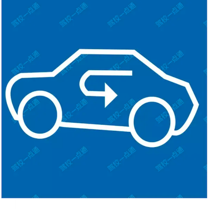

**选项**
- A. 迎面出风
- B. 空气外循环
- C. 空气内循环
- D. 风窗玻璃除霜

**答案**：C（空气内循环）
**秒懂技巧**：循环箭头在外是外循环，在内是内循环
**解释**：把口诀对应到题干关键词，优先排除与口诀相反或无关的选项。

### 47. 指针在红线内就是警告线内，油量不足

> 记忆核心：把口诀对应到题干关键词，优先排除与口诀相反或无关的选项。
> 使用方法：把口诀对应到题干关键词，优先排除与口诀相反或无关的选项。

- 类型/频次：秒懂技巧×1；共 1 题；含图 1 题
- 对应题号：P3-042

#### 代表原题

##### P3-042｜试卷3 高频100题

**原题**：仪表显示油箱内存油量已在警告线以内。

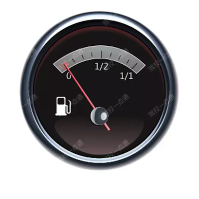

**选项**
- A. 正确
- B. 错误

**答案**：A（正确）
**秒懂技巧**：指针在红线内就是警告线内，油量不足
**解释**：把口诀对应到题干关键词，优先排除与口诀相反或无关的选项。

### 48. 方向盘正确握法，双手握在转向盘两侧盘缘，保持在一条直线上

> 记忆核心：适用于安全常识考点总结相关题。做题时先抓题干关键词，再按口诀定位答案。
> 使用方法：适用于安全常识考点总结相关题。做题时先抓题干关键词，再按口诀定位答案。

- 类型/频次：秒懂技巧×1；共 1 题；含图 1 题
- 对应题号：P4-002

#### 代表原题

##### P4-002｜试卷4 易错100题

**原题**：这种握转向盘的动作是正确的。

**选项**
- A. 正确
- B. 错误

**答案**：B（错误）
**秒懂技巧**：方向盘正确握法，双手握在转向盘两侧盘缘，保持在一条直线上
**解释**：适用于安全常识考点总结相关题。做题时先抓题干关键词，再按口诀定位答案。
**相关考点**：安全常识考点总结

### 49. 未开灯就变更车道，选错

> 记忆核心：本题考点为变更车道。变更车道时要提前开启转向灯，并且要观察周围情况，只有在确认安全的情况下才能驶入需要变更的车道。即使后方无来车也要提前开启转向灯后再变更车道，所以选择错误。
> 使用方法：这类题适合快速直选；但遇到“错误的是、不能、不得”要先看清正反问法。

- 类型/频次：秒懂技巧×1；共 1 题
- 对应题号：P5-084

#### 代表原题

##### P5-084｜试卷5 冲刺100题

**原题**：驾驶人在观察后方无来车的情况下，未开转向灯就变更车道也是合理的。

**选项**
- A. 正确
- B. 错误

**答案**：B（错误）
**秒懂技巧**：未开灯就变更车道，选错
**解释**：本题考点为变更车道。变更车道时要提前开启转向灯，并且要观察周围情况，只有在确认安全的情况下才能驶入需要变更的车道。即使后方无来车也要提前开启转向灯后再变更车道，所以选择错误。
**相关考点**：速度灯光考点总结

### 50. 此图可以比喻成抽烟（出去抽烟），红烟选出（制动系统出现异常）

> 记忆核心：这是关键词判断法：题干或选项出现对应词时，按口诀直接定位或排除。
> 使用方法：这类题适合快速直选；但遇到“错误的是、不能、不得”要先看清正反问法。

- 类型/频次：秒懂技巧×1；共 1 题；含图 1 题
- 对应题号：P2-082

#### 代表原题

##### P2-082｜试卷2 高频100题

**原题**：机动车仪表板上如图所示指示灯亮表示什么？

**选项**
- A. 制动踏板没回位
- B. 驻车制动解除
- C. 行车制动器失效
- D. 制动系统出现异常

**答案**：D（制动系统出现异常）
**秒懂技巧**：此图可以比喻成抽烟（出去抽烟），红烟选出（制动系统出现异常）
**解释**：这是关键词判断法：题干或选项出现对应词时，按口诀直接定位或排除。

### 51. 每个功能都不能被替代

> 记忆核心：超车应开启转向灯，不得用鸣喇叭代替。所以本题选错误。 《道路交通安全法实施条例》第五十七条：机动车准备超车时，应当提前开启左转向灯。
> 使用方法：超车应开启转向灯，不得用鸣喇叭代替。所以本题选错误。 《道路交通安全法实施条例》第五十七条：机动车准备超车时，应当提前开启左转向灯。

- 类型/频次：秒懂技巧×1；共 1 题
- 对应题号：P5-098

#### 代表原题

##### P5-098｜试卷5 冲刺100题

**原题**：驾驶机动车超车时，可以鸣喇叭替代开启转向灯。

**选项**
- A. 正确
- B. 错误

**答案**：B（错误）
**秒懂技巧**：每个功能都不能被替代
**解释**：超车应开启转向灯，不得用鸣喇叭代替。所以本题选错误。 《道路交通安全法实施条例》第五十七条：机动车准备超车时，应当提前开启左转向灯。
**相关考点**：速度灯光考点总结

### 52. 看到ABS选防抱死

> 记忆核心：这是关键词判断法：题干或选项出现对应词时，按口诀直接定位或排除。
> 使用方法：先圈出题干关键词，再到选项里找口诀提示的答案词。

- 类型/频次：关键字答题×1；共 1 题；含图 1 题
- 对应题号：P2-055

#### 代表原题

##### P2-055｜试卷2 高频100题

**原题**：图中指示灯亮表示（）。

**选项**
- A. 防抱死制动系统故障
- B. 驻车制动解除
- C. 防抱死制动系统开启
- D. 行车制动系统故障

**答案**：A（防抱死制动系统故障）
**秒懂技巧**：看到ABS选防抱死
**解释**：这是关键词判断法：题干或选项出现对应词时，按口诀直接定位或排除。

### 53. 看到下陡坡，选不空挡/不熄火

> 记忆核心：下陡坡时不准空挡或熄火，因为车辆失去了发动机的牵制，只能靠刹车来控制车速，会造成刹车片温度升高，影响制动效果，有极大的安全隐患。
> 使用方法：先圈出题干关键词，再到选项里找口诀提示的答案词。

- 类型/频次：关键字答题×1；共 1 题
- 对应题号：P3-080

#### 代表原题

##### P3-080｜试卷3 高频100题

**原题**：驾驶机动车下陡坡时，以下说法正确的是？

**选项**
- A. 空挡但不准熄火
- B. 熄火、空挡
- C. 熄火但不准空挡
- D. 不准空挡或熄火

**答案**：D（不准空挡或熄火）
**秒懂技巧**：看到下陡坡，选不空挡/不熄火
**解释**：下陡坡时不准空挡或熄火，因为车辆失去了发动机的牵制，只能靠刹车来控制车速，会造成刹车片温度升高，影响制动效果，有极大的安全隐患。
**相关考点**：通行原则考点总结

### 54. 看到交替使用，选对

> 记忆核心：适用于速度灯光考点总结相关题。做题时先抓题干关键词，再按口诀定位答案。
> 使用方法：先圈出题干关键词，再到选项里找口诀提示的答案词。

- 类型/频次：关键字答题×1；共 1 题；含图 1 题
- 对应题号：P5-049

#### 代表原题

##### P5-049｜试卷5 冲刺100题

**原题**：夜间在急弯行车时，交替使用远、近光灯。

**选项**
- A. 正确
- B. 错误

**答案**：A（正确）
**秒懂技巧**：看到交替使用，选对
**解释**：适用于速度灯光考点总结相关题。做题时先抓题干关键词，再按口诀定位答案。
**相关考点**：速度灯光考点总结

### 55. 看到仪表盘数字不超过10选发动机转速表

> 记忆核心：这是关键词判断法：题干或选项出现对应词时，按口诀直接定位或排除。
> 使用方法：先圈出题干关键词，再到选项里找口诀提示的答案词。

- 类型/频次：秒懂技巧×1；共 1 题；含图 1 题
- 对应题号：P2-068

#### 代表原题

##### P2-068｜试卷2 高频100题

**原题**：以下哪个仪表表示发动机转速表？

**选项**
- A. 如图A所示
- B. 如图B所示
- C. 如图C所示
- D. 如图D所示

**答案**：A（如图A所示）
**秒懂技巧**：看到仪表盘数字不超过10选发动机转速表
**解释**：这是关键词判断法：题干或选项出现对应词时，按口诀直接定位或排除。

### 56. 看到前后灯光都亮表示前后位置灯，也叫示廓灯

> 记忆核心：这是关键词判断法：题干或选项出现对应词时，按口诀直接定位或排除。
> 使用方法：先圈出题干关键词，再到选项里找口诀提示的答案词。

- 类型/频次：秒懂技巧×1；共 1 题；含图 1 题
- 对应题号：P3-028

#### 代表原题

##### P3-028｜试卷3 高频100题

**原题**：打开前后雾灯开关，如下图所示指示灯亮起。

**选项**
- A. 正确
- B. 错误

**答案**：B（错误）
**秒懂技巧**：看到前后灯光都亮表示前后位置灯，也叫示廓灯
**解释**：这是关键词判断法：题干或选项出现对应词时，按口诀直接定位或排除。

### 57. 看到只需/只有/只要，选错

> 记忆核心：本题考点为变更车道。变更车道时要提前开启转向灯，并且要观察周围情况，只有在确认安全的情况下才能驶入需要变更的车道，不得随意驶入相应车道，所以选择错误。
> 使用方法：先圈出题干关键词，再到选项里找口诀提示的答案词。

- 类型/频次：关键字答题×1；共 1 题
- 对应题号：P5-071

#### 代表原题

##### P5-071｜试卷5 冲刺100题

**原题**：变更车道时只需开启转向灯，驶入相应的车道，不得妨碍同车道机动车正常行驶。

**选项**
- A. 正确
- B. 错误

**答案**：B（错误）
**秒懂技巧**：看到只需/只有/只要，选错
**解释**：本题考点为变更车道。变更车道时要提前开启转向灯，并且要观察周围情况，只有在确认安全的情况下才能驶入需要变更的车道，不得随意驶入相应车道，所以选择错误。
**相关考点**：通行原则考点总结

### 58. 看到开远光/使用远光，选错

> 记忆核心：夜间会车应使用近光灯，不要开远光灯，远光灯易干扰对向驾驶员视线。 《道路交通安全法实施条例》第四十八条：在没有中心隔离设施或者没有中心线的道路上，夜间会车应当在距相对方向来车150米以外改用近光灯，在窄路、窄桥与非机动车会车时应当使用近光灯。
> 使用方法：先圈出题干关键词，再到选项里找口诀提示的答案词。

- 类型/频次：关键字答题×1；共 1 题
- 对应题号：P5-037

#### 代表原题

##### P5-037｜试卷5 冲刺100题

**原题**：夜间驾驶机动车在窄路、窄桥会车时正确的做法是使用远光灯。

**选项**
- A. 正确
- B. 错误

**答案**：B（错误）
**秒懂技巧**：看到开远光/使用远光，选错
**解释**：夜间会车应使用近光灯，不要开远光灯，远光灯易干扰对向驾驶员视线。 《道路交通安全法实施条例》第四十八条：在没有中心隔离设施或者没有中心线的道路上，夜间会车应当在距相对方向来车150米以外改用近光灯，在窄路、窄桥与非机动车会车时应当使用近光灯。
**相关考点**：速度灯光考点总结

### 59. 看到有ABS采取紧急制动，选用力

> 记忆核心：ABS是汽车防抱死制动系统，在使用时需要用力踩制动踏板才能够启动ABS系统，踩太轻是不能够启动ABS系统，从而在关键时刻减少伤害。
> 使用方法：先圈出题干关键词，再到选项里找口诀提示的答案词。

- 类型/频次：关键字答题×1；共 1 题
- 对应题号：P3-010

#### 代表原题

##### P3-010｜试卷3 高频100题

**原题**：驾驶装有ABS系统的汽车怎样采取紧急制动?

**选项**
- A. 逐渐踏下制动踏板
- B. 用力踏制动踏板
- C. 缓慢踏制动踏板
- D. 间歇踏制动踏板

**答案**：B（用力踏制动踏板）
**秒懂技巧**：看到有ABS采取紧急制动，选用力
**解释**：ABS是汽车防抱死制动系统，在使用时需要用力踩制动踏板才能够启动ABS系统，踩太轻是不能够启动ABS系统，从而在关键时刻减少伤害。
**相关考点**：安全常识考点总结

### 60. 看到避免追撞，选转弯前提前打开相应的转向灯

> 记忆核心：转弯前提前打开相应的转向灯，告知后车我方即将转弯，便于提前准备，以避免追撞。 车辆行驶中，驾驶人要充分借助车辆照明及信号装置向其他交通参与者发出信号，表明自己的行驶意图和行驶状态，让其他车辆和行人及时地注意到自己。
> 使用方法：先圈出题干关键词，再到选项里找口诀提示的答案词。

- 类型/频次：关键字答题×1；共 1 题
- 对应题号：P3-052

#### 代表原题

##### P3-052｜试卷3 高频100题

**原题**：下面哪种做法能帮助您避免被其他车辆从后方追撞？

**选项**
- A. 在任何时候都打开转向灯
- B. 在转弯前提前打开相应的转向灯
- C. 一直打开双闪
- D. 转弯前鸣笛示意

**答案**：B（在转弯前提前打开相应的转向灯）
**秒懂技巧**：看到避免追撞，选转弯前提前打开相应的转向灯
**解释**：转弯前提前打开相应的转向灯，告知后车我方即将转弯，便于提前准备，以避免追撞。 车辆行驶中，驾驶人要充分借助车辆照明及信号装置向其他交通参与者发出信号，表明自己的行驶意图和行驶状态，让其他车辆和行人及时地注意到自己。
**相关考点**：速度灯光考点总结

### 61. 箭头指哪个方向就选哪边

> 记忆核心：这是关键词判断法：题干或选项出现对应词时，按口诀直接定位或排除。
> 使用方法：这类题适合快速直选；但遇到“错误的是、不能、不得”要先看清正反问法。

- 类型/频次：秒懂技巧×1；共 1 题；含图 1 题
- 对应题号：P3-001

#### 代表原题

##### P3-001｜试卷3 高频100题

**原题**：机动车仪表板上如图所示指示灯亮表示什么？

**选项**
- A. 车前后位置灯亮起
- B. 右转向指示灯闪烁
- C. 左转向指示灯闪烁
- D. 车前后示宽灯亮起

**答案**：C（左转向指示灯闪烁）
**秒懂技巧**：箭头指哪个方向就选哪边
**解释**：这是关键词判断法：题干或选项出现对应词时，按口诀直接定位或排除。

### 62. 红色P选两个制动

> 记忆核心：这是关键词判断法：题干或选项出现对应词时，按口诀直接定位或排除。
> 使用方法：这类题适合快速直选；但遇到“错误的是、不能、不得”要先看清正反问法。

- 类型/频次：秒懂技巧×1；共 1 题；含图 1 题
- 对应题号：P4-040

#### 代表原题

##### P4-040｜试卷4 易错100题

**原题**：机动车仪表板上如图所示指示灯亮表示什么？

**选项**
- A. 行车制动系统出现故障
- B. 驻车制动器处于制动状态
- C. 防抱死制动系统出现故障
- D. 驻车制动器处于解除状态

**答案**：B（驻车制动器处于制动状态）
**秒懂技巧**：红色P选两个制动
**解释**：这是关键词判断法：题干或选项出现对应词时，按口诀直接定位或排除。

### 63. 转向灯的作用是提示其他车辆

> 记忆核心：本题考点为变更车道。变更车道时不得影响其他车辆正常行驶，开启转向灯是为了提示其他车辆我方准备变更车道，防止发生事故。
> 使用方法：本题考点为变更车道。变更车道时不得影响其他车辆正常行驶，开启转向灯是为了提示其他车辆我方准备变更车道，防止发生事故。

- 类型/频次：秒懂技巧×1；共 1 题
- 对应题号：P5-003

#### 代表原题

##### P5-003｜试卷5 冲刺100题

**原题**：驾驶机动车变更车道为什么要提前开启转向灯?

**选项**
- A. 提示前车让行
- B. 提示行人让行
- C. 开阔视野，便于观察路面情况
- D. 提示其他车辆我方准备变更车道

**答案**：D（提示其他车辆我方准备变更车道）
**秒懂技巧**：转向灯的作用是提示其他车辆
**解释**：本题考点为变更车道。变更车道时不得影响其他车辆正常行驶，开启转向灯是为了提示其他车辆我方准备变更车道，防止发生事故。
**相关考点**：速度灯光考点总结

### 64. 选项中看到挂低挡挡位/利用发动机，直接选

> 记忆核心：驾车通过颠簸路段，要挂低挡挡位缓抬加速踏板。缓抬加速踏板是因为凹凸不平的路面极易发生颠簸，速度越快颠簸越严重，容易损伤轮胎，还会影响安全驾驶。挂低挡是为了获得更多的发动机牵引力。
> 使用方法：先圈出题干关键词，再到选项里找口诀提示的答案词。

- 类型/频次：关键字答题×1；共 1 题
- 对应题号：P4-011

#### 代表原题

##### P4-011｜试卷4 易错100题

**原题**：假如你驾车行驶在颠簸路段时，以下做法正确的是什么？

**选项**
- A. 稳住加速踏板
- B. 挂低挡挡位缓抬加速踏板
- C. 挂高挡位缓抬加速踏板
- D. 挂低挡踏满加速踏板

**答案**：B（挂低挡挡位缓抬加速踏板）
**秒懂技巧**：选项中看到挂低挡挡位/利用发动机，直接选
**解释**：驾车通过颠簸路段，要挂低挡挡位缓抬加速踏板。缓抬加速踏板是因为凹凸不平的路面极易发生颠簸，速度越快颠簸越严重，容易损伤轮胎，还会影响安全驾驶。挂低挡是为了获得更多的发动机牵引力。
**相关考点**：通行原则考点总结

### 65. 题中是制动系统出现异常，图中选有感叹号！的标志，选图C

> 记忆核心：这是关键词判断法：题干或选项出现对应词时，按口诀直接定位或排除。
> 使用方法：这类题适合快速直选；但遇到“错误的是、不能、不得”要先看清正反问法。

- 类型/频次：秒懂技巧×1；共 1 题；含图 1 题
- 对应题号：P3-026

#### 代表原题

##### P3-026｜试卷3 高频100题

**原题**：行车中下列哪个灯亮，提示驾驶人车辆制动系统出现异常？

**选项**
- A. 如图中A所示
- B. 如图中B所示
- C. 如图中C所示
- D. 如图中D所示

**答案**：C（如图中C所示）
**秒懂技巧**：题中是制动系统出现异常，图中选有感叹号！的标志，选图C
**解释**：这是关键词判断法：题干或选项出现对应词时，按口诀直接定位或排除。

### 66. 题中说水，图中找有水的答案，选图3

> 记忆核心：这是关键词判断法：题干或选项出现对应词时，按口诀直接定位或排除。
> 使用方法：先圈出题干关键词，再到选项里找口诀提示的答案词。

- 类型/频次：秒懂技巧×1；共 1 题；含图 1 题
- 对应题号：P2-058

#### 代表原题

##### P2-058｜试卷2 高频100题

**原题**：以下哪个仪表表示水温表？

**选项**
- A. 如图A所示
- B. 如图B所示
- C. 如图C所示
- D. 如图D所示

**答案**：C（如图C所示）
**秒懂技巧**：题中说水，图中找有水的答案，选图3
**解释**：这是关键词判断法：题干或选项出现对应词时，按口诀直接定位或排除。

### 67. 驶出环岛，开启右转向灯

> 记忆核心：适用于速度灯光考点总结相关题。做题时先抓题干关键词，再按口诀定位答案。
> 使用方法：适用于速度灯光考点总结相关题。做题时先抓题干关键词，再按口诀定位答案。

- 类型/频次：秒懂技巧×1；共 1 题；含图 1 题
- 对应题号：P5-028

#### 代表原题

##### P5-028｜试卷5 冲刺100题

**原题**：驾车驶出环岛时，如何使用灯光？

**选项**
- A. 提前开启右转向灯
- B. 提前开启危险报警闪光灯
- C. 无需开启转向灯
- D. 提前开启左转向灯

**答案**：A（提前开启右转向灯）
**秒懂技巧**：驶出环岛，开启右转向灯
**解释**：适用于速度灯光考点总结相关题。做题时先抓题干关键词，再按口诀定位答案。
**相关考点**：速度灯光考点总结

### 68. 黄灯亮，越过停止线的车辆可以继续通行

> 记忆核心：把口诀对应到题干关键词，优先排除与口诀相反或无关的选项。
> 使用方法：先看图形特征，再回到题干确认问的是名称、含义还是操作。

- 类型/频次：秒懂技巧×1；共 1 题；含图 1 题
- 对应题号：P5-015

#### 代表原题

##### P5-015｜试卷5 冲刺100题

**原题**：如图所示，这种情形下，A车可以继续通行。

**选项**
- A. 正确
- B. 错误

**答案**：A（正确）
**秒懂技巧**：黄灯亮，越过停止线的车辆可以继续通行
**解释**：把口诀对应到题干关键词，优先排除与口诀相反或无关的选项。
