# 标志标线与交警手势

学习重点：识别颜色、形状、线型、箭头和交警身体朝向。

- 覆盖口诀：43 条
- 覆盖原题：51 题
- 含图原题：47 题

## 本章速背

| 出现 | 口诀/技巧 | 怎么用 | 代表原题 |
|---:|---|---|---|
| 3 | [红灯禁止通行，绿灯准许通行，黄灯警示](#05_标志标线与交警手势-tip-001) | 先看图形特征，再回到题干确认问的是名称、含义还是操作。 | P4-071：驾驶机动车不能进入红色叉形灯或者红色箭头灯亮的车道。 |
| 3 | [红高蓝低黄建议黑解除](#05_标志标线与交警手势-tip-002) | 先看图形特征，再回到题干确认问的是名称、含义还是操作。 | P3-094：这个标志是何含义？ |
| 2 | [两只手一高一低是转弯，左手在下左转弯，右手在下右转弯](#05_标志标线与交警手势-tip-003) | 先看图形特征，再回到题干确认问的是名称、含义还是操作。 | P3-040：这一组交通警察手势是什么信号？ |
| 2 | [箭头向上上坡，箭头向下下坡，2个箭头连续](#05_标志标线与交警手势-tip-004) | 先看图形特征，再回到题干确认问的是名称、含义还是操作。 | P4-079：这个标志是何含义？ |
| 2 | [红灯停，绿灯行，黄灯亮了等一等](#05_标志标线与交警手势-tip-005) | 此技巧用于区分不同颜色指示灯的含义。 红灯停：红灯亮起时表示停车； 绿灯行：绿灯亮起时表示可以通行； 黄灯亮起时已越过停止线的车辆可以继续通行，未越过停止线的车辆应当停在停车线以内等候 | P4-026：驾驶机动车在路口直行遇到这种信号灯应该怎样行驶？ |
| 2 | [虚可跨，实不跨](#05_标志标线与交警手势-tip-006) | 先看图形特征，再回到题干确认问的是名称、含义还是操作。 | P4-048：如图所示，以下哪种情况可以超车? |
| 1 | [半圆找障碍，需要左绕行](#05_标志标线与交警手势-tip-007) | 先圈出题干关键词，再到选项里找口诀提示的答案词。 | P4-085：这个标志是何含义？ |
| 1 | [四个箭头围绕一个圈，选中心圈](#05_标志标线与交警手势-tip-008) | 这类题适合快速直选；但遇到“错误的是、不能、不得”要先看清正反问法。 | P4-093：这个路面标记是什么标线？ |
| 1 | [图中小客车，选小客车](#05_标志标线与交警手势-tip-009) | 这类题适合快速直选；但遇到“错误的是、不能、不得”要先看清正反问法。 | P4-028：这个标志提示哪种车型禁止通行驶入？ |
| 1 | [图中斑马线，选人行横道](#05_标志标线与交警手势-tip-010) | 这类题适合快速直选；但遇到“错误的是、不能、不得”要先看清正反问法。 | P3-097：图中圈内的路面标记是什么标线？ |
| 1 | [图中有ETC，选ETC](#05_标志标线与交警手势-tip-011) | 这类题适合快速直选；但遇到“错误的是、不能、不得”要先看清正反问法。 | P3-069：这个标志是何含义？ |
| 1 | [图中有地点/数字，选距离](#05_标志标线与交警手势-tip-012) | 这类题适合快速直选；但遇到“错误的是、不能、不得”要先看清正反问法。 | P4-092：这个标志是何含义？ |
| 1 | [图中有多乘员，选多乘员](#05_标志标线与交警手势-tip-013) | 这类题适合快速直选；但遇到“错误的是、不能、不得”要先看清正反问法。 | P4-094：道路最左侧白色虚线区域是何含义？ |
| 1 | [图中有标志像啥选啥，T是T型路口](#05_标志标线与交警手势-tip-014) | 这类题适合快速直选；但遇到“错误的是、不能、不得”要先看清正反问法。 | P4-027：这个标志是何含义？ |
| 1 | [图中标志像个丁字，选丁字](#05_标志标线与交警手势-tip-015) | 这类题适合快速直选；但遇到“错误的是、不能、不得”要先看清正反问法。 | P4-089：这个标志是何含义？ |
| 1 | [图中标志圆圈上面有挡位的，选变速器操纵杆](#05_标志标线与交警手势-tip-016) | 这类题适合快速直选；但遇到“错误的是、不能、不得”要先看清正反问法。 | P3-021：这是什么操纵装置？ |
| 1 | [图中标志有出口，箭头指哪个方向就选哪边](#05_标志标线与交警手势-tip-017) | 这类题适合快速直选；但遇到“错误的是、不能、不得”要先看清正反问法。 | P4-030：这个标志是何含义？ |
| 1 | [图中标志表示驻车制动](#05_标志标线与交警手势-tip-018) | 把口诀对应到题干关键词，优先排除与口诀相反或无关的选项。 | P4-046：这是什么操纵装置？ |
| 1 | [图中看到G选国，“G”为“国guo”的拼音首字母](#05_标志标线与交警手势-tip-019) | 先圈出题干关键词，再到选项里找口诀提示的答案词。 | P4-090：这个标志是何含义？ |
| 1 | [图中看到一个人在行走，是行人标志，表示仅供行人步行](#05_标志标线与交警手势-tip-020) | 先圈出题干关键词，再到选项里找口诀提示的答案词。 | P4-035：图中交通标志是指（）。 |
| 1 | [图中看到圆形信号灯不限制车辆右转](#05_标志标线与交警手势-tip-021) | 先圈出题干关键词，再到选项里找口诀提示的答案词。 | P4-061：在路口这个位置时可以右转通过路口。 |
| 1 | [图中箭头上下双向，为不分离双向行驶路段](#05_标志标线与交警手势-tip-022) | 把违法行为和数字绑定记忆，题干变换时只要认出行为即可。 | P3-068：这个标志的含义是提醒前方道路变为不分离双向行驶路段。 |
| 1 | [图中路面宽度变化，选路面宽度渐变](#05_标志标线与交警手势-tip-023) | 这类题适合快速直选；但遇到“错误的是、不能、不得”要先看清正反问法。 | P3-039：路面上的黄色标线是何含义？ |
| 1 | [弯路标志1急2反3连续](#05_标志标线与交警手势-tip-024) | 先看图形特征，再回到题干确认问的是名称、含义还是操作。 | P4-031：下列哪个标志提示驾驶人连续弯路？ |
| 1 | [斜杠蓝色指哪边就选哪个方向行驶](#05_标志标线与交警手势-tip-025) | 这类题适合快速直选；但遇到“错误的是、不能、不得”要先看清正反问法。 | P4-087：这个标志是何含义？ |
| 1 | [方形箭头选单行路，有虚线的方形箭头选直行车道，圆形箭头选只准直行](#05_标志标线与交警手势-tip-026) | 这类题适合快速直选；但遇到“错误的是、不能、不得”要先看清正反问法。 | P3-096：以下交通标志表示单行线的是哪一项？ |
| 1 | [有齿可变，无齿导向](#05_标志标线与交警手势-tip-027) | 先看图形特征，再回到题干确认问的是名称、含义还是操作。 | P4-037：图中圈内的锯齿状白色实线是什么标线？ |
| 1 | [看到指示标线的作用，选指示行进](#05_标志标线与交警手势-tip-028) | 先圈出题干关键词，再到选项里找口诀提示的答案词。 | P2-081：指示标线的作用是什么？ |
| 1 | [看到指路，选方向](#05_标志标线与交警手势-tip-029) | 先圈出题干关键词，再到选项里找口诀提示的答案词。 | P3-095：指路标志的作用是什么？ |
| 1 | [看到正向车头，选机动车](#05_标志标线与交警手势-tip-030) | 先圈出题干关键词，再到选项里找口诀提示的答案词。 | P4-088：这个标志是何含义？ |
| 1 | [看到电动自行车，选电动自行车](#05_标志标线与交警手势-tip-031) | 先圈出题干关键词，再到选项里找口诀提示的答案词。 | P4-032：这个标志的含义是禁止电动自行车进入。 |
| 1 | [看到谨慎通行，选对](#05_标志标线与交警手势-tip-032) | 先圈出题干关键词，再到选项里找口诀提示的答案词。 | P3-067：这种标志的作用是警告车辆驾驶人前方有危险，谨慎通行。 |
| 1 | [看到车轮起来，选滑](#05_标志标线与交警手势-tip-033) | 先圈出题干关键词，再到选项里找口诀提示的答案词。 | P4-083：这个标志是何含义？ |
| 1 | [红色代表禁止，箭头指哪个方向就选哪边](#05_标志标线与交警手势-tip-034) | 这类题适合快速直选；但遇到“错误的是、不能、不得”要先看清正反问法。 | P4-029：这个标志是何含义？ |
| 1 | [路中间标志代表接近障碍物](#05_标志标线与交警手势-tip-035) | 先看图形特征，再回到题干确认问的是名称、含义还是操作。 | P3-098：路面上的黄色填充标线是何含义？ |
| 1 | [路口线都是导向线，有导向优先选](#05_标志标线与交警手势-tip-036) | 这类题适合快速直选；但遇到“错误的是、不能、不得”要先看清正反问法。 | P4-036：图中圈内白色虚线是什么标线？ |
| 1 | [车前轮越过不能走，整个车越过可以走](#05_标志标线与交警手势-tip-037) | 先看图形特征，再回到题干确认问的是名称、含义还是操作。 | P5-019：如图所示，驾驶机动车行驶到这个位置时，如果车前轮已越过停止线不得继续通过。 |
| 1 | [骆驼背高起的桥，选驼峰桥](#05_标志标线与交警手势-tip-038) | 这类题适合快速直选；但遇到“错误的是、不能、不得”要先看清正反问法。 | P4-084：这个标志是何含义？ |
| 1 | [黄色是警告标志，提醒注意儿童](#05_标志标线与交警手势-tip-039) | 先看图形特征，再回到题干确认问的是名称、含义还是操作。 | P4-082：这个标志是何含义？ |
| 1 | [黄色是警告标志，提醒注意，看到黄色选注意行人](#05_标志标线与交警手势-tip-040) | 先圈出题干关键词，再到选项里找口诀提示的答案词。 | P4-081：这个标志是何含义？ |
| 1 | [黄色网格线/人行横道不得停车](#05_标志标线与交警手势-tip-041) | 先看图形特征，再回到题干确认问的是名称、含义还是操作。 | P5-072：如图所示，驾驶机动车直行遇前方道路堵塞时，车辆可以在黄色网格线区域临时停车等待，但不得在人行横道停车。 |
| 1 | [黄色闪光警告信号灯，确认安全后通过](#05_标志标线与交警手势-tip-042) | 黄色闪光警告信号灯亮起，驾驶人要停车注意瞭望，在确认安全后通过。所以本题选正确。 《道路交通安全法实施条例》第四十二条：闪光警告信号灯为持续闪烁的黄灯，提示车辆、行人通行时注意瞭望，确认安全后通过。 | P5-046：黄色闪光警告信号灯，表示机动车可以在确认安全后通过。 |
| 1 | [黑色箭头在两侧表示宽度，黑色箭头在上下表示高度](#05_标志标线与交警手势-tip-043) | 先看图形特征，再回到题干确认问的是名称、含义还是操作。 | P4-091：这个标志是何含义？ |

## 口诀卡片

### 1. 红灯禁止通行，绿灯准许通行，黄灯警示

> 记忆核心：本题考点为道路交通信号相关内容。红色代表禁止，绿色代表准许。 《道路交通安全法实施条例》规定：红色叉形灯或者箭头灯亮时，禁止本车道车辆进入、通行。
> 使用方法：先看图形特征，再回到题干确认问的是名称、含义还是操作。

- 类型/频次：秒懂技巧×3；共 3 题；含图 2 题
- 对应题号：P4-071、P5-040、P5-091

#### 代表原题

##### P5-040｜试卷5 冲刺100题

**原题**：驾驶机动车在路口遇到这种信号灯表示什么意思？

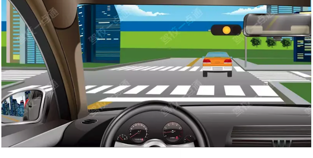

**选项**
- A. 路口警示
- B. 禁止右转
- C. 准许直行
- D. 加速通过

**答案**：A（路口警示）
**秒懂技巧**：红灯禁止通行，绿灯准许通行，黄灯警示
**解释**：把口诀对应到题干关键词，优先排除与口诀相反或无关的选项。

##### P5-091｜试卷5 冲刺100题

**原题**：如图所示，遇到这种情况的铁路道口，禁止车辆通行。

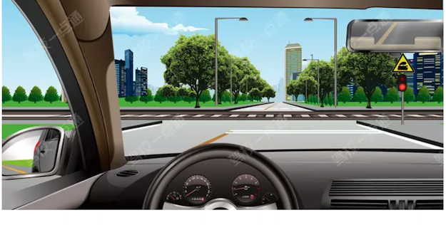

**选项**
- A. 正确
- B. 错误

**答案**：A（正确）
**秒懂技巧**：红灯禁止通行，绿灯准许通行，黄灯警示
**解释**：适用于通行原则考点总结相关题。做题时先抓题干关键词，再按口诀定位答案。
**相关考点**：通行原则考点总结

##### P4-071｜试卷4 易错100题

**原题**：驾驶机动车不能进入红色叉形灯或者红色箭头灯亮的车道。

**选项**
- A. 正确
- B. 错误

**答案**：A（正确）
**秒懂技巧**：红灯禁止通行，绿灯准许通行，黄灯警示
**解释**：本题考点为道路交通信号相关内容。红色代表禁止，绿色代表准许。 《道路交通安全法实施条例》规定：红色叉形灯或者箭头灯亮时，禁止本车道车辆进入、通行。

### 2. 红高蓝低黄建议黑解除

> 记忆核心：此技巧用于区分不同颜色的限速标志所代表的含义。 红色表示最高限速； 蓝色表示最低限速； 黄色表示建议速度； 黑色表示解除限速
> 使用方法：先看图形特征，再回到题干确认问的是名称、含义还是操作。

- 类型/频次：速记口诀×3；共 3 题；含图 3 题
- 对应题号：P3-094、P4-075、P4-086

#### 代表原题

##### P3-094｜试卷3 高频100题

**原题**：这个标志是何含义？

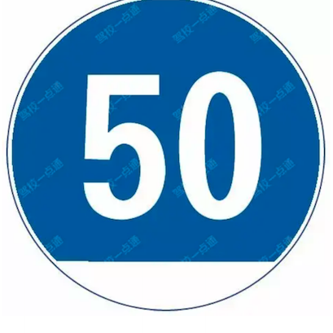

**选项**
- A. 高度限速50公里/小时
- B. 最低限速50公里/小时
- C. 水平高度50米
- D. 海拔高度50米

**答案**：B（最低限速50公里/小时）
**秒懂技巧**：红高蓝低黄建议黑解除
**解释**：此技巧用于区分不同颜色的限速标志所代表的含义。 红色表示最高限速； 蓝色表示最低限速； 黄色表示建议速度； 黑色表示解除限速

##### P4-075｜试卷4 易错100题

**原题**：在图中高速公路这条车道行驶，车速不得高于（）。

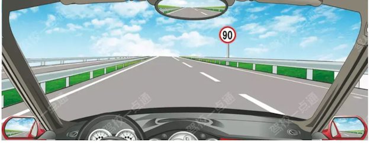

**选项**
- A. 120km/h
- B. 110km/h
- C. 100km/h
- D. 90km/h

**答案**：D（90km/h）
**秒懂技巧**：红高蓝低黄建议黑解除
**解释**：此技巧用于区分不同颜色的限速标志所代表的含义。 红色表示最高限速； 蓝色表示最低限速； 黄色表示建议速度； 黑色表示解除限速
**相关考点**：速度灯光考点总结

##### P4-086｜试卷4 易错100题

**原题**：这个标志是何含义？

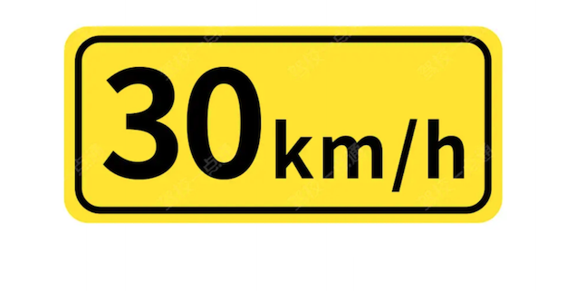

**选项**
- A. 建议速度
- B. 最低速度
- C. 最高速度
- D. 限制速度

**答案**：A（建议速度）
**秒懂技巧**：红高蓝低黄建议黑解除
**解释**：此技巧用于区分不同颜色的限速标志所代表的含义。 红色表示最高限速； 蓝色表示最低限速； 黄色表示建议速度； 黑色表示解除限速

### 3. 两只手一高一低是转弯，左手在下左转弯，右手在下右转弯

> 记忆核心：适用于交警手势考点总结相关题。做题时先抓题干关键词，再按口诀定位答案。
> 使用方法：先看图形特征，再回到题干确认问的是名称、含义还是操作。

- 类型/频次：秒懂技巧×2；共 2 题；含图 2 题
- 对应题号：P3-040、P3-070

#### 代表原题

##### P3-040｜试卷3 高频100题

**原题**：这一组交通警察手势是什么信号？

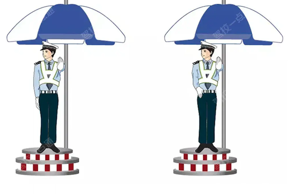

**选项**
- A. 靠边停车信号
- B. 减速慢行信号
- C. 停止信号
- D. 右转弯信号

**答案**：D（右转弯信号）
**秒懂技巧**：两只手一高一低是转弯，左手在下左转弯，右手在下右转弯
**解释**：适用于交警手势考点总结相关题。做题时先抓题干关键词，再按口诀定位答案。
**相关考点**：交警手势考点总结

##### P3-070｜试卷3 高频100题

**原题**：这一组交通警察手势是什么信号？

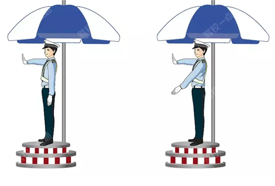

**选项**
- A. 靠边停车信号
- B. 左转弯待转信号
- C. 左转弯信号
- D. 右转弯信号

**答案**：C（左转弯信号）
**秒懂技巧**：两只手一高一低是转弯，左手在下左转弯，右手在下右转弯
**解释**：适用于交警手势考点总结相关题。做题时先抓题干关键词，再按口诀定位答案。
**相关考点**：交警手势考点总结

### 4. 箭头向上上坡，箭头向下下坡，2个箭头连续

> 记忆核心：把口诀对应到题干关键词，优先排除与口诀相反或无关的选项。
> 使用方法：先看图形特征，再回到题干确认问的是名称、含义还是操作。

- 类型/频次：秒懂技巧×2；共 2 题；含图 2 题
- 对应题号：P4-079、P4-080

#### 代表原题

##### P4-079｜试卷4 易错100题

**原题**：这个标志是何含义？

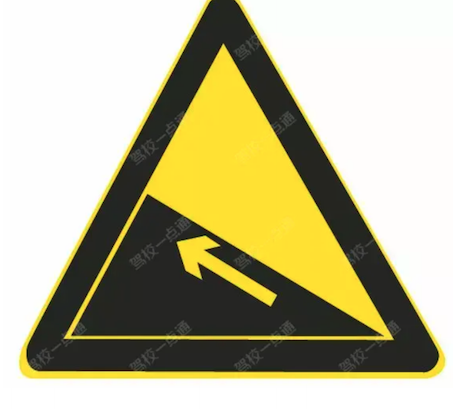

**选项**
- A. 提醒车辆驾驶人前方道路沿水库、湖泊、河流
- B. 提醒车辆驾驶人前方有向上的陡坡路段
- C. 提醒车辆驾驶人前方有两个及以上的连续上坡路段
- D. 提醒车辆驾驶人前方有向下的陡坡路段

**答案**：B（提醒车辆驾驶人前方有向上的陡坡路段）
**秒懂技巧**：箭头向上上坡，箭头向下下坡，2个箭头连续
**解释**：把口诀对应到题干关键词，优先排除与口诀相反或无关的选项。

##### P4-080｜试卷4 易错100题

**原题**：图中交通标志是指（）。

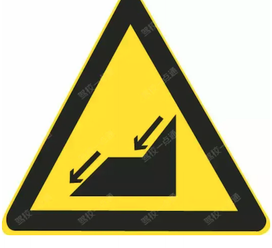

**选项**
- A. 连续上坡
- B. 上陡坡
- C. 下陡坡
- D. 连续下坡

**答案**：D（连续下坡）
**秒懂技巧**：箭头向上上坡，箭头向下下坡，2个箭头连续
**解释**：把口诀对应到题干关键词，优先排除与口诀相反或无关的选项。

### 5. 红灯停，绿灯行，黄灯亮了等一等

> 记忆核心：此技巧用于区分不同颜色指示灯的含义。 红灯停：红灯亮起时表示停车； 绿灯行：绿灯亮起时表示可以通行； 黄灯亮起时已越过停止线的车辆可以继续通行，未越过停止线的车辆应当停在停车线以内等候
> 使用方法：此技巧用于区分不同颜色指示灯的含义。 红灯停：红灯亮起时表示停车； 绿灯行：绿灯亮起时表示可以通行； 黄灯亮起时已越过停止线的车辆可以继续通行，未越过停止线的车辆应当停在停车线以内等候

- 类型/频次：速记口诀×2；共 2 题；含图 2 题
- 对应题号：P4-026、P4-063

#### 代表原题

##### P4-026｜试卷4 易错100题

**原题**：驾驶机动车在路口直行遇到这种信号灯应该怎样行驶？

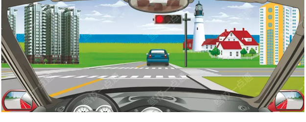

**选项**
- A. 不得越过停止线
- B. 加速直行通过
- C. 左转弯行驶
- D. 进入路口等待

**答案**：A（不得越过停止线）
**秒懂技巧**：红灯停，绿灯行，黄灯亮了等一等
**解释**：此技巧用于区分不同颜色指示灯的含义。 红灯停：红灯亮起时表示停车； 绿灯行：绿灯亮起时表示可以通行； 黄灯亮起时已越过停止线的车辆可以继续通行，未越过停止线的车辆应当停在停车线以内等候

##### P4-063｜试卷4 易错100题

**原题**：图中信号灯亮起时，黑色车辆可以通过。

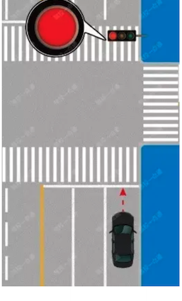

**选项**
- A. 正确
- B. 错误

**答案**：B（错误）
**秒懂技巧**：红灯停，绿灯行，黄灯亮了等一等
**解释**：把口诀对应到题干关键词，优先排除与口诀相反或无关的选项。

### 6. 虚可跨，实不跨

> 记忆核心：此技巧用于说明虚线和实线是否可跨越。 实不跨：道路中心是实线的，机动车不能跨越中间实线； 虚可跨：道路中心是虚线的，机动车可以跨越中间虚线
> 使用方法：先看图形特征，再回到题干确认问的是名称、含义还是操作。

- 类型/频次：秒懂技巧×2；共 2 题；含图 2 题
- 对应题号：P4-048、P5-068

#### 代表原题

##### P4-048｜试卷4 易错100题

**原题**：如图所示，以下哪种情况可以超车?

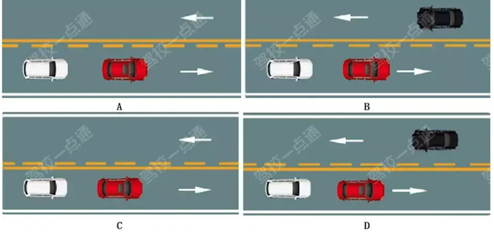

**选项**
- A. 如图中A所示
- B. 如图中B所示
- C. 如图中C所示
- D. 如图中D所示

**答案**：A（如图中A所示）
**秒懂技巧**：虚可跨，实不跨
**解释**：此技巧用于说明虚线和实线是否可跨越。 实不跨：道路中心是实线的，机动车不能跨越中间实线； 虚可跨：道路中心是虚线的，机动车可以跨越中间虚线
**相关考点**：通行原则考点总结

##### P5-068｜试卷5 冲刺100题

**原题**：路中心黄色虚线的含义是分隔对向交通流，在保证安全的前提下，可越线超车或转弯。

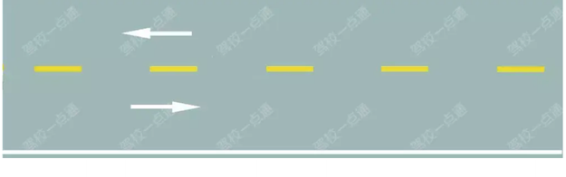

**选项**
- A. 正确
- B. 错误

**答案**：A（正确）
**秒懂技巧**：虚可跨，实不跨
**解释**：此技巧用于说明虚线和实线是否可跨越。 实不跨：道路中心是实线的，机动车不能跨越中间实线； 虚可跨：道路中心是虚线的，机动车可以跨越中间虚线

### 7. 半圆找障碍，需要左绕行

> 记忆核心：这是关键词判断法：题干或选项出现对应词时，按口诀直接定位或排除。
> 使用方法：先圈出题干关键词，再到选项里找口诀提示的答案词。

- 类型/频次：秒懂技巧×1；共 1 题；含图 1 题
- 对应题号：P4-085

#### 代表原题

##### P4-085｜试卷4 易错100题

**原题**：这个标志是何含义？

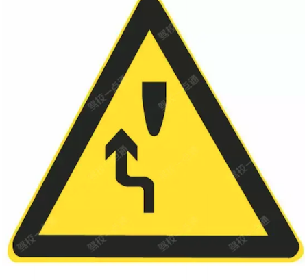

**选项**
- A. 左侧绕行
- B. 单向通行
- C. 注意危险
- D. 右侧绕行

**答案**：A（左侧绕行）
**秒懂技巧**：半圆找障碍，需要左绕行
**解释**：这是关键词判断法：题干或选项出现对应词时，按口诀直接定位或排除。

### 8. 四个箭头围绕一个圈，选中心圈

> 记忆核心：这是关键词判断法：题干或选项出现对应词时，按口诀直接定位或排除。
> 使用方法：这类题适合快速直选；但遇到“错误的是、不能、不得”要先看清正反问法。

- 类型/频次：秒懂技巧×1；共 1 题；含图 1 题
- 对应题号：P4-093

#### 代表原题

##### P4-093｜试卷4 易错100题

**原题**：这个路面标记是什么标线？

**选项**
- A. 禁驶区
- B. 网状线
- C. 导流线
- D. 中心圈

**答案**：D（中心圈）
**秒懂技巧**：四个箭头围绕一个圈，选中心圈
**解释**：这是关键词判断法：题干或选项出现对应词时，按口诀直接定位或排除。

### 9. 图中小客车，选小客车

> 记忆核心：这是关键词判断法：题干或选项出现对应词时，按口诀直接定位或排除。
> 使用方法：这类题适合快速直选；但遇到“错误的是、不能、不得”要先看清正反问法。

- 类型/频次：秒懂技巧×1；共 1 题；含图 1 题
- 对应题号：P4-028

#### 代表原题

##### P4-028｜试卷4 易错100题

**原题**：这个标志提示哪种车型禁止通行驶入？

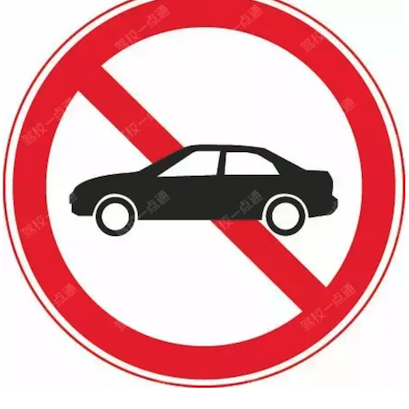

**选项**
- A. 中型客车
- B. 小型货车
- C. 各种车辆
- D. 小型客车

**答案**：D（小型客车）
**秒懂技巧**：图中小客车，选小客车
**解释**：这是关键词判断法：题干或选项出现对应词时，按口诀直接定位或排除。

### 10. 图中斑马线，选人行横道

> 记忆核心：这是关键词判断法：题干或选项出现对应词时，按口诀直接定位或排除。
> 使用方法：这类题适合快速直选；但遇到“错误的是、不能、不得”要先看清正反问法。

- 类型/频次：秒懂技巧×1；共 1 题；含图 1 题
- 对应题号：P3-097

#### 代表原题

##### P3-097｜试卷3 高频100题

**原题**：图中圈内的路面标记是什么标线？

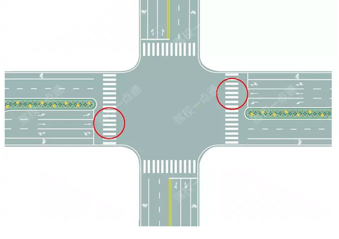

**选项**
- A. 路口示意线
- B. 停车让行线
- C. 减速让行线
- D. 人行横道线

**答案**：D（人行横道线）
**秒懂技巧**：图中斑马线，选人行横道
**解释**：这是关键词判断法：题干或选项出现对应词时，按口诀直接定位或排除。

### 11. 图中有ETC，选ETC

> 记忆核心：这是关键词判断法：题干或选项出现对应词时，按口诀直接定位或排除。
> 使用方法：这类题适合快速直选；但遇到“错误的是、不能、不得”要先看清正反问法。

- 类型/频次：秒懂技巧×1；共 1 题；含图 1 题
- 对应题号：P3-069

#### 代表原题

##### P3-069｜试卷3 高频100题

**原题**：这个标志是何含义？

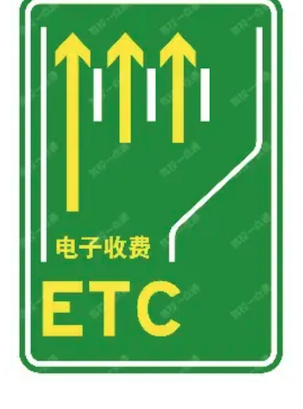

**选项**
- A. 高速公路ETC车道指引
- B. 高速公路领卡车道指引
- C. 高速公路缴费车道指引
- D. 高速公路检查车道指引

**答案**：A（高速公路ETC车道指引）
**秒懂技巧**：图中有ETC，选ETC
**解释**：这是关键词判断法：题干或选项出现对应词时，按口诀直接定位或排除。

### 12. 图中有地点/数字，选距离

> 记忆核心：这是关键词判断法：题干或选项出现对应词时，按口诀直接定位或排除。
> 使用方法：这类题适合快速直选；但遇到“错误的是、不能、不得”要先看清正反问法。

- 类型/频次：秒懂技巧×1；共 1 题；含图 1 题
- 对应题号：P4-092

#### 代表原题

##### P4-092｜试卷4 易错100题

**原题**：这个标志是何含义？

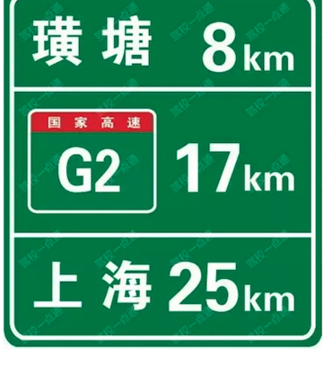

**选项**
- A. 高速公路终点地名预告
- B. 高速公路行驶路线预告
- C. 高速公路行驶方向预告
- D. 高速公路地点距离预告

**答案**：D（高速公路地点距离预告）
**秒懂技巧**：图中有地点/数字，选距离
**解释**：这是关键词判断法：题干或选项出现对应词时，按口诀直接定位或排除。

### 13. 图中有多乘员，选多乘员

> 记忆核心：这是关键词判断法：题干或选项出现对应词时，按口诀直接定位或排除。
> 使用方法：这类题适合快速直选；但遇到“错误的是、不能、不得”要先看清正反问法。

- 类型/频次：秒懂技巧×1；共 1 题；含图 1 题
- 对应题号：P4-094

#### 代表原题

##### P4-094｜试卷4 易错100题

**原题**：道路最左侧白色虚线区域是何含义？

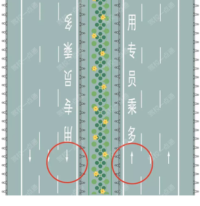

**选项**
- A. 多乘员车辆专用车道
- B. 小型客车专用车道
- C. 未载客出租车专用车道
- D. 大型客车专用车道

**答案**：A（多乘员车辆专用车道）
**秒懂技巧**：图中有多乘员，选多乘员
**解释**：这是关键词判断法：题干或选项出现对应词时，按口诀直接定位或排除。

### 14. 图中有标志像啥选啥，T是T型路口

> 记忆核心：这是关键词判断法：题干或选项出现对应词时，按口诀直接定位或排除。
> 使用方法：这类题适合快速直选；但遇到“错误的是、不能、不得”要先看清正反问法。

- 类型/频次：秒懂技巧×1；共 1 题；含图 1 题
- 对应题号：P4-027

#### 代表原题

##### P4-027｜试卷4 易错100题

**原题**：这个标志是何含义？

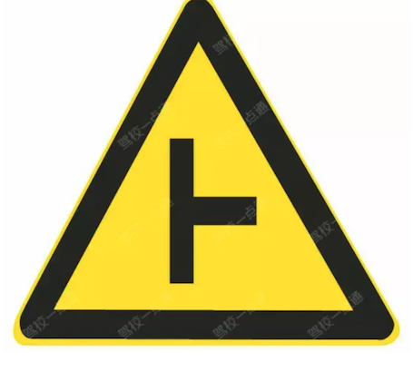

**选项**
- A. T型交叉路口
- B. Y型交叉路口
- C. 十字交叉路口
- D. 环行交叉路口

**答案**：A（T型交叉路口）
**秒懂技巧**：图中有标志像啥选啥，T是T型路口
**解释**：这是关键词判断法：题干或选项出现对应词时，按口诀直接定位或排除。

### 15. 图中标志像个丁字，选丁字

> 记忆核心：图中标志为方形蓝色底，有白色丁字，并标注各方向的路名信息，是指路标志中的丁字交叉路口预告。 白色丁字代表丁字路口，该标志用以预告前方丁字交叉路口形式、编号、名称或交叉道路的名称、通往方向信息、地理方向信息以及距前方交叉路口的距离。
> 使用方法：这类题适合快速直选；但遇到“错误的是、不能、不得”要先看清正反问法。

- 类型/频次：秒懂技巧×1；共 1 题；含图 1 题
- 对应题号：P4-089

#### 代表原题

##### P4-089｜试卷4 易错100题

**原题**：这个标志是何含义？

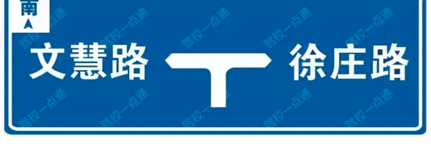

**选项**
- A. Y型交叉路口预告
- B. 十字交叉路口预告
- C. 丁字交叉路口预告
- D. 道路分叉处预告

**答案**：C（丁字交叉路口预告）
**秒懂技巧**：图中标志像个丁字，选丁字
**解释**：图中标志为方形蓝色底，有白色丁字，并标注各方向的路名信息，是指路标志中的丁字交叉路口预告。 白色丁字代表丁字路口，该标志用以预告前方丁字交叉路口形式、编号、名称或交叉道路的名称、通往方向信息、地理方向信息以及距前方交叉路口的距离。

### 16. 图中标志圆圈上面有挡位的，选变速器操纵杆

> 记忆核心：这是关键词判断法：题干或选项出现对应词时，按口诀直接定位或排除。
> 使用方法：这类题适合快速直选；但遇到“错误的是、不能、不得”要先看清正反问法。

- 类型/频次：秒懂技巧×1；共 1 题；含图 1 题
- 对应题号：P3-021

#### 代表原题

##### P3-021｜试卷3 高频100题

**原题**：这是什么操纵装置？

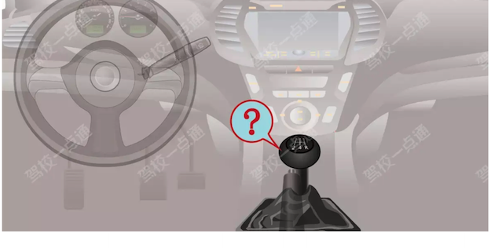

**选项**
- A. 节气门操纵杆
- B. 驻车制动器操纵杆
- C. 变速器操纵杆
- D. 离合器操纵杆

**答案**：C（变速器操纵杆）
**秒懂技巧**：图中标志圆圈上面有挡位的，选变速器操纵杆
**解释**：这是关键词判断法：题干或选项出现对应词时，按口诀直接定位或排除。

### 17. 图中标志有出口，箭头指哪个方向就选哪边

> 记忆核心：这是关键词判断法：题干或选项出现对应词时，按口诀直接定位或排除。
> 使用方法：这类题适合快速直选；但遇到“错误的是、不能、不得”要先看清正反问法。

- 类型/频次：秒懂技巧×1；共 1 题；含图 1 题
- 对应题号：P4-030

#### 代表原题

##### P4-030｜试卷4 易错100题

**原题**：这个标志是何含义？

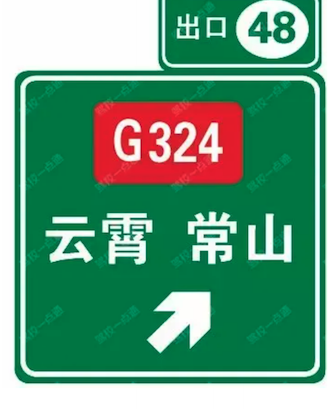

**选项**
- A. 高速公路下一出口预告
- B. 高速公路右侧出口预告
- C. 高速公路目的地预告
- D. 高速公路左侧出口预告

**答案**：B（高速公路右侧出口预告）
**秒懂技巧**：图中标志有出口，箭头指哪个方向就选哪边
**解释**：这是关键词判断法：题干或选项出现对应词时，按口诀直接定位或排除。

### 18. 图中标志表示驻车制动

> 记忆核心：把口诀对应到题干关键词，优先排除与口诀相反或无关的选项。
> 使用方法：把口诀对应到题干关键词，优先排除与口诀相反或无关的选项。

- 类型/频次：秒懂技巧×1；共 1 题；含图 1 题
- 对应题号：P4-046

#### 代表原题

##### P4-046｜试卷4 易错100题

**原题**：这是什么操纵装置？

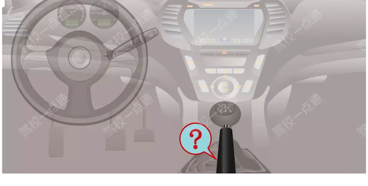

**选项**
- A. 驻车制动器操纵杆
- B. 节气门操纵杆
- C. 变速器操纵杆
- D. 离合器操纵杆

**答案**：A（驻车制动器操纵杆）
**秒懂技巧**：图中标志表示驻车制动
**解释**：把口诀对应到题干关键词，优先排除与口诀相反或无关的选项。

### 19. 图中看到G选国，“G”为“国guo”的拼音首字母

> 记忆核心：这是关键词判断法：题干或选项出现对应词时，按口诀直接定位或排除。
> 使用方法：先圈出题干关键词，再到选项里找口诀提示的答案词。

- 类型/频次：秒懂技巧×1；共 1 题；含图 1 题
- 对应题号：P4-090

#### 代表原题

##### P4-090｜试卷4 易错100题

**原题**：这个标志是何含义？

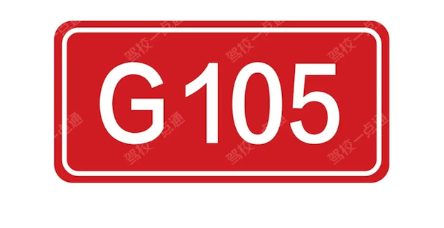

**选项**
- A. 国道编号
- B. 省道编号
- C. 县道编号
- D. 乡道编号

**答案**：A（国道编号）
**秒懂技巧**：图中看到G选国，“G”为“国guo”的拼音首字母
**解释**：这是关键词判断法：题干或选项出现对应词时，按口诀直接定位或排除。

### 20. 图中看到一个人在行走，是行人标志，表示仅供行人步行

> 记忆核心：这是关键词判断法：题干或选项出现对应词时，按口诀直接定位或排除。
> 使用方法：先圈出题干关键词，再到选项里找口诀提示的答案词。

- 类型/频次：秒懂技巧×1；共 1 题；含图 1 题
- 对应题号：P4-035

#### 代表原题

##### P4-035｜试卷4 易错100题

**原题**：图中交通标志是指（）。

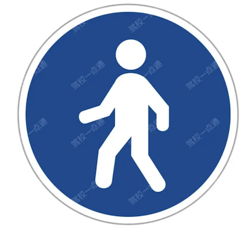

**选项**
- A. 人行横道
- B. 无障碍设施
- C. 行人
- D. 应急避难设施

**答案**：C（行人）
**秒懂技巧**：图中看到一个人在行走，是行人标志，表示仅供行人步行
**解释**：这是关键词判断法：题干或选项出现对应词时，按口诀直接定位或排除。

### 21. 图中看到圆形信号灯不限制车辆右转

> 记忆核心：信号灯虽然是红灯，但在不妨碍其他车辆与行人的情况下，可以右转。所以本题选正确。 《道路交通安全法实施条例》规定：红灯亮时，右转弯的车辆在不妨碍被放行的车辆、行人通行的情况下，可以通行。
> 使用方法：先圈出题干关键词，再到选项里找口诀提示的答案词。

- 类型/频次：秒懂技巧×1；共 1 题；含图 1 题
- 对应题号：P4-061

#### 代表原题

##### P4-061｜试卷4 易错100题

**原题**：在路口这个位置时可以右转通过路口。

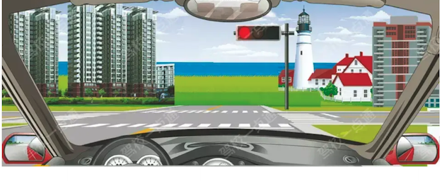

**选项**
- A. 正确
- B. 错误

**答案**：A（正确）
**秒懂技巧**：图中看到圆形信号灯不限制车辆右转
**解释**：信号灯虽然是红灯，但在不妨碍其他车辆与行人的情况下，可以右转。所以本题选正确。 《道路交通安全法实施条例》规定：红灯亮时，右转弯的车辆在不妨碍被放行的车辆、行人通行的情况下，可以通行。

### 22. 图中箭头上下双向，为不分离双向行驶路段

> 记忆核心：把口诀对应到题干关键词，优先排除与口诀相反或无关的选项。
> 使用方法：把违法行为和数字绑定记忆，题干变换时只要认出行为即可。

- 类型/频次：秒懂技巧×1；共 1 题；含图 1 题
- 对应题号：P3-068

#### 代表原题

##### P3-068｜试卷3 高频100题

**原题**：这个标志的含义是提醒前方道路变为不分离双向行驶路段。

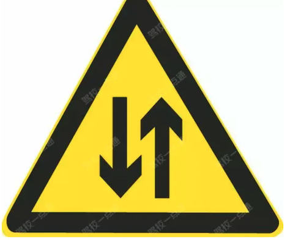

**选项**
- A. 正确
- B. 错误

**答案**：A（正确）
**秒懂技巧**：图中箭头上下双向，为不分离双向行驶路段
**解释**：把口诀对应到题干关键词，优先排除与口诀相反或无关的选项。

### 23. 图中路面宽度变化，选路面宽度渐变

> 记忆核心：图中红色圈内标线是路面宽度渐变标线。标线颜色为黄色，在路宽缩窄的一侧应划车行道边缘线，并应配合设置窄路标志，用以警告车辆驾驶人路宽和车道数变化，应谨慎行车，并禁止超车。 GB5768.3-2009《道路交通标志和标线第3部分：道路交通标线》6.1路面（车行道）宽度渐变段标线：用以警告车辆驾驶人路宽或车道数变化，应谨慎行车，并禁止超车。标线颜色为黄色。
> 使用方法：这类题适合快速直选；但遇到“错误的是、不能、不得”要先看清正反问法。

- 类型/频次：秒懂技巧×1；共 1 题；含图 1 题
- 对应题号：P3-039

#### 代表原题

##### P3-039｜试卷3 高频100题

**原题**：路面上的黄色标线是何含义？

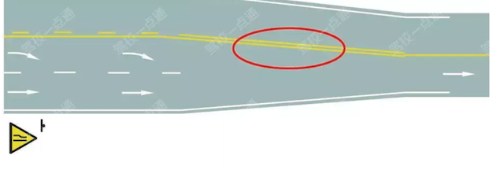

**选项**
- A. 车行道变多标线
- B. 路面宽度渐变标线
- C. 接近障碍物标线
- D. 施工路段提示线

**答案**：B（路面宽度渐变标线）
**秒懂技巧**：图中路面宽度变化，选路面宽度渐变
**解释**：图中红色圈内标线是路面宽度渐变标线。标线颜色为黄色，在路宽缩窄的一侧应划车行道边缘线，并应配合设置窄路标志，用以警告车辆驾驶人路宽和车道数变化，应谨慎行车，并禁止超车。 GB5768.3-2009《道路交通标志和标线第3部分：道路交通标线》6.1路面（车行道）宽度渐变段标线：用以警告车辆驾驶人路宽或车道数变化，应谨慎行车，并禁止超车。标线颜色为黄色。

### 24. 弯路标志1急2反3连续

> 记忆核心：此技巧用于帮助区分急转弯标志、反向弯路标志、连续转弯标志。 1急：表示急转弯，箭头指向哪边就是向哪边急转弯； 2反：表示反向弯路； 3连续：表示连续转弯
> 使用方法：先看图形特征，再回到题干确认问的是名称、含义还是操作。

- 类型/频次：速记口诀×1；共 1 题；含图 1 题
- 对应题号：P4-031

#### 代表原题

##### P4-031｜试卷4 易错100题

**原题**：下列哪个标志提示驾驶人连续弯路？

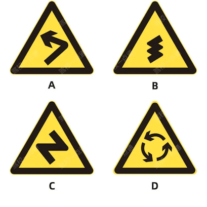

**选项**
- A. 如图中A所示
- B. 如图中B所示
- C. 如图中C所示
- D. 如图中D所示

**答案**：B（如图中B所示）
**秒懂技巧**：弯路标志1急2反3连续
**解释**：此技巧用于帮助区分急转弯标志、反向弯路标志、连续转弯标志。 1急：表示急转弯，箭头指向哪边就是向哪边急转弯； 2反：表示反向弯路； 3连续：表示连续转弯

### 25. 斜杠蓝色指哪边就选哪个方向行驶

> 记忆核心：这是关键词判断法：题干或选项出现对应词时，按口诀直接定位或排除。
> 使用方法：这类题适合快速直选；但遇到“错误的是、不能、不得”要先看清正反问法。

- 类型/频次：秒懂技巧×1；共 1 题；含图 1 题
- 对应题号：P4-087

#### 代表原题

##### P4-087｜试卷4 易错100题

**原题**：这个标志是何含义？

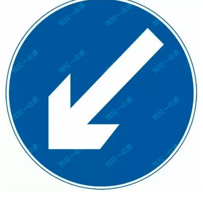

**选项**
- A. 分隔带左侧行驶
- B. 只准向左转弯
- C. 左侧是下坡路段
- D. 靠道路左侧停车

**答案**：A（分隔带左侧行驶）
**秒懂技巧**：斜杠蓝色指哪边就选哪个方向行驶
**解释**：这是关键词判断法：题干或选项出现对应词时，按口诀直接定位或排除。

### 26. 方形箭头选单行路，有虚线的方形箭头选直行车道，圆形箭头选只准直行

> 记忆核心：这是关键词判断法：题干或选项出现对应词时，按口诀直接定位或排除。
> 使用方法：这类题适合快速直选；但遇到“错误的是、不能、不得”要先看清正反问法。

- 类型/频次：秒懂技巧×1；共 1 题；含图 1 题
- 对应题号：P3-096

#### 代表原题

##### P3-096｜试卷3 高频100题

**原题**：以下交通标志表示单行线的是哪一项？

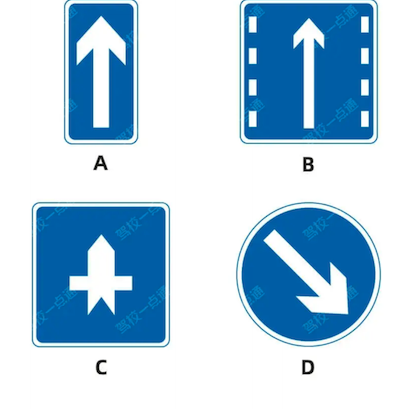

**选项**
- A. 如图中B所示
- B. 如图中D所示
- C. 如图中C所示
- D. 如图中A所示

**答案**：D（如图中A所示）
**秒懂技巧**：方形箭头选单行路，有虚线的方形箭头选直行车道，圆形箭头选只准直行
**解释**：这是关键词判断法：题干或选项出现对应词时，按口诀直接定位或排除。

### 27. 有齿可变，无齿导向

> 记忆核心：此技巧用于区分可变导向车道和导向车道线。 有齿可变：路口地面标线两侧带有锯齿的是可变导向车道线； 无齿导向：路口地面标线不带锯齿的是导向车道线
> 使用方法：先看图形特征，再回到题干确认问的是名称、含义还是操作。

- 类型/频次：速记口诀×1；共 1 题；含图 1 题
- 对应题号：P4-037

#### 代表原题

##### P4-037｜试卷4 易错100题

**原题**：图中圈内的锯齿状白色实线是什么标线？

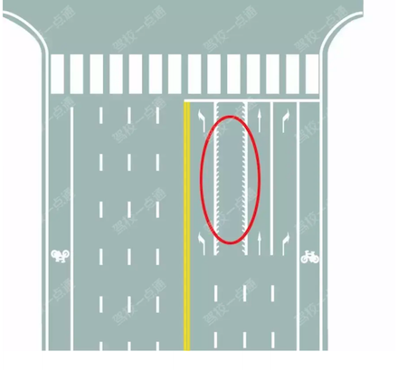

**选项**
- A. 导向车道线
- B. 方向引导线
- C. 可变导向车道线
- D. 单向行驶线

**答案**：C（可变导向车道线）
**秒懂技巧**：有齿可变，无齿导向
**解释**：此技巧用于区分可变导向车道和导向车道线。 有齿可变：路口地面标线两侧带有锯齿的是可变导向车道线； 无齿导向：路口地面标线不带锯齿的是导向车道线

### 28. 看到指示标线的作用，选指示行进

> 记忆核心：指示标线主要起指示通行的作用。引导你正确的行驶，安全行驶，遵守法律法规。 GB5768.3-2009《道路交通标志和标线第3部分：道路交通标线》3.1指示标线：指示车行道、行车方向、路面边缘、人行道、停车位、停靠站及减速丘等的标线。
> 使用方法：先圈出题干关键词，再到选项里找口诀提示的答案词。

- 类型/频次：关键字答题×1；共 1 题
- 对应题号：P2-081

#### 代表原题

##### P2-081｜试卷2 高频100题

**原题**：指示标线的作用是什么？

**选项**
- A. 禁止通行
- B. 指示通行
- C. 限制通行
- D. 警告提醒

**答案**：B（指示通行）
**秒懂技巧**：看到指示标线的作用，选指示行进
**解释**：指示标线主要起指示通行的作用。引导你正确的行驶，安全行驶，遵守法律法规。 GB5768.3-2009《道路交通标志和标线第3部分：道路交通标线》3.1指示标线：指示车行道、行车方向、路面边缘、人行道、停车位、停靠站及减速丘等的标线。

### 29. 看到指路，选方向

> 记忆核心：指路表示道路信息的指引，为驾驶人提供去往目的地所经过的道路、沿途相关城镇、重要公共设施、服务设施、地点、距离和行车方向等信息。指路标志不应指引私人专属或商用目的地信息。所以选择提供方向信息。
> 使用方法：先圈出题干关键词，再到选项里找口诀提示的答案词。

- 类型/频次：关键字答题×1；共 1 题
- 对应题号：P3-095

#### 代表原题

##### P3-095｜试卷3 高频100题

**原题**：指路标志的作用是什么？

**选项**
- A. 限制车辆通行
- B. 提示限速信息
- C. 提供方向信息
- D. 警告前方危险

**答案**：C（提供方向信息）
**秒懂技巧**：看到指路，选方向
**解释**：指路表示道路信息的指引，为驾驶人提供去往目的地所经过的道路、沿途相关城镇、重要公共设施、服务设施、地点、距离和行车方向等信息。指路标志不应指引私人专属或商用目的地信息。所以选择提供方向信息。

### 30. 看到正向车头，选机动车

> 记忆核心：这是关键词判断法：题干或选项出现对应词时，按口诀直接定位或排除。
> 使用方法：先圈出题干关键词，再到选项里找口诀提示的答案词。

- 类型/频次：秒懂技巧×1；共 1 题；含图 1 题
- 对应题号：P4-088

#### 代表原题

##### P4-088｜试卷4 易错100题

**原题**：这个标志是何含义？

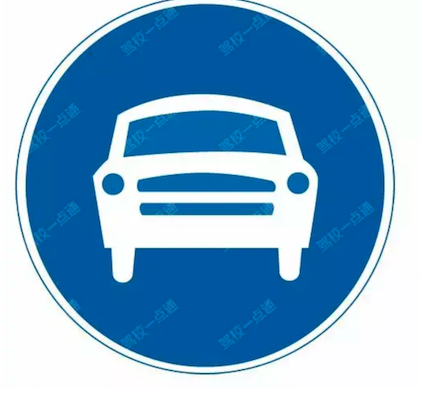

**选项**
- A. 禁止小型车行驶
- B. 机动车行驶
- C. 只准小型车行驶
- D. 不准小型车通行

**答案**：B（机动车行驶）
**秒懂技巧**：看到正向车头，选机动车
**解释**：这是关键词判断法：题干或选项出现对应词时，按口诀直接定位或排除。

### 31. 看到电动自行车，选电动自行车

> 记忆核心：这是关键词判断法：题干或选项出现对应词时，按口诀直接定位或排除。
> 使用方法：先圈出题干关键词，再到选项里找口诀提示的答案词。

- 类型/频次：秒懂技巧×1；共 1 题；含图 1 题
- 对应题号：P4-032

#### 代表原题

##### P4-032｜试卷4 易错100题

**原题**：这个标志的含义是禁止电动自行车进入。

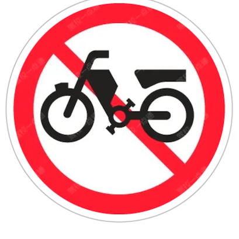

**选项**
- A. 正确
- B. 错误

**答案**：A（正确）
**秒懂技巧**：看到电动自行车，选电动自行车
**解释**：这是关键词判断法：题干或选项出现对应词时，按口诀直接定位或排除。

### 32. 看到谨慎通行，选对

> 记忆核心：图中标志为三角形黑边黄色底，是警告标志。警告标志的作用是警告驾驶员前方路段有复杂的交通状况出现，可能会有危险，需要谨慎通行而不是绝对禁止通行。 GB5768.2-2022《道路交通标志和标线第2部分：道路交通标志》7.1警告标志一般规定：警告标志警告车辆驾驶人应注意前方有难以发现的情况、需减速慢行或采取其他安全行动的情况。
> 使用方法：先圈出题干关键词，再到选项里找口诀提示的答案词。

- 类型/频次：关键字答题×1；共 1 题；含图 1 题
- 对应题号：P3-067

#### 代表原题

##### P3-067｜试卷3 高频100题

**原题**：这种标志的作用是警告车辆驾驶人前方有危险，谨慎通行。

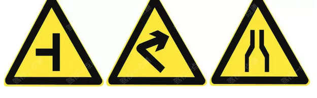

**选项**
- A. 正确
- B. 错误

**答案**：A（正确）
**秒懂技巧**：看到谨慎通行，选对
**解释**：图中标志为三角形黑边黄色底，是警告标志。警告标志的作用是警告驾驶员前方路段有复杂的交通状况出现，可能会有危险，需要谨慎通行而不是绝对禁止通行。 GB5768.2-2022《道路交通标志和标线第2部分：道路交通标志》7.1警告标志一般规定：警告标志警告车辆驾驶人应注意前方有难以发现的情况、需减速慢行或采取其他安全行动的情况。

### 33. 看到车轮起来，选滑

> 记忆核心：这是关键词判断法：题干或选项出现对应词时，按口诀直接定位或排除。
> 使用方法：先圈出题干关键词，再到选项里找口诀提示的答案词。

- 类型/频次：秒懂技巧×1；共 1 题；含图 1 题
- 对应题号：P4-083

#### 代表原题

##### P4-083｜试卷4 易错100题

**原题**：这个标志是何含义？

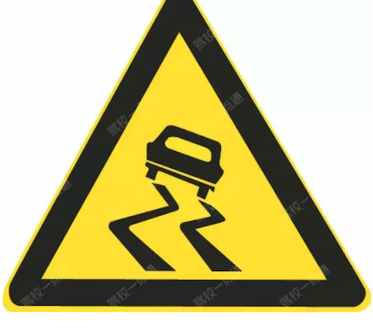

**选项**
- A. 急转弯路
- B. 易滑路段
- C. 试车路段
- D. 曲线路段

**答案**：B（易滑路段）
**秒懂技巧**：看到车轮起来，选滑
**解释**：这是关键词判断法：题干或选项出现对应词时，按口诀直接定位或排除。

### 34. 红色代表禁止，箭头指哪个方向就选哪边

> 记忆核心：这是关键词判断法：题干或选项出现对应词时，按口诀直接定位或排除。
> 使用方法：这类题适合快速直选；但遇到“错误的是、不能、不得”要先看清正反问法。

- 类型/频次：秒懂技巧×1；共 1 题；含图 1 题
- 对应题号：P4-029

#### 代表原题

##### P4-029｜试卷4 易错100题

**原题**：这个标志是何含义？

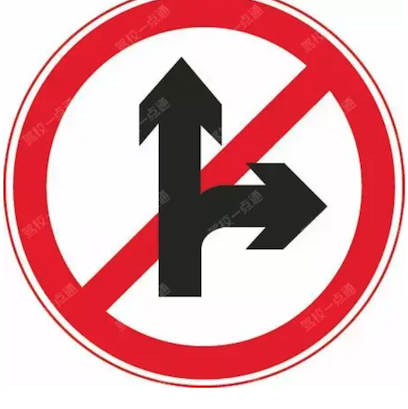

**选项**
- A. 禁止直行和向左转弯
- B. 禁止直行和向左变道
- C. 允许直行和向左变道
- D. 禁止直行和向右转弯

**答案**：D（禁止直行和向右转弯）
**秒懂技巧**：红色代表禁止，箭头指哪个方向就选哪边
**解释**：这是关键词判断法：题干或选项出现对应词时，按口诀直接定位或排除。

### 35. 路中间标志代表接近障碍物

> 记忆核心：把口诀对应到题干关键词，优先排除与口诀相反或无关的选项。
> 使用方法：先看图形特征，再回到题干确认问的是名称、含义还是操作。

- 类型/频次：秒懂技巧×1；共 1 题；含图 1 题
- 对应题号：P3-098

#### 代表原题

##### P3-098｜试卷3 高频100题

**原题**：路面上的黄色填充标线是何含义？

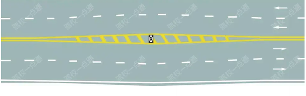

**选项**
- A. 接近移动障碍物标线
- B. 远离狭窄路面标线
- C. 接近障碍物标线
- D. 接近狭窄路面标线

**答案**：C（接近障碍物标线）
**秒懂技巧**：路中间标志代表接近障碍物
**解释**：把口诀对应到题干关键词，优先排除与口诀相反或无关的选项。

### 36. 路口线都是导向线，有导向优先选

> 记忆核心：这是关键词判断法：题干或选项出现对应词时，按口诀直接定位或排除。
> 使用方法：这类题适合快速直选；但遇到“错误的是、不能、不得”要先看清正反问法。

- 类型/频次：秒懂技巧×1；共 1 题；含图 1 题
- 对应题号：P4-036

#### 代表原题

##### P4-036｜试卷4 易错100题

**原题**：图中圈内白色虚线是什么标线？

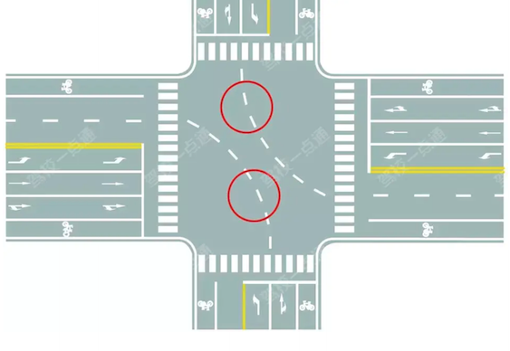

**选项**
- A. 小型车转弯线
- B. 车道连接线
- C. 非机动车引导线
- D. 路口导向线

**答案**：D（路口导向线）
**秒懂技巧**：路口线都是导向线，有导向优先选
**解释**：这是关键词判断法：题干或选项出现对应词时，按口诀直接定位或排除。

### 37. 车前轮越过不能走，整个车越过可以走

> 记忆核心：图中信号灯是红灯，红灯禁止通行。即便车前轮已越过停止线，也必须停车等待。所以本题选正确。 《道路交通安全法》第二十六条：红灯表示禁止通行。遇到有红灯的路口，应停车等待。
> 使用方法：先看图形特征，再回到题干确认问的是名称、含义还是操作。

- 类型/频次：秒懂技巧×1；共 1 题；含图 1 题
- 对应题号：P5-019

#### 代表原题

##### P5-019｜试卷5 冲刺100题

**原题**：如图所示，驾驶机动车行驶到这个位置时，如果车前轮已越过停止线不得继续通过。

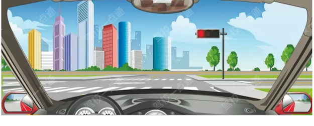

**选项**
- A. 正确
- B. 错误

**答案**：A（正确）
**秒懂技巧**：车前轮越过不能走，整个车越过可以走
**解释**：图中信号灯是红灯，红灯禁止通行。即便车前轮已越过停止线，也必须停车等待。所以本题选正确。 《道路交通安全法》第二十六条：红灯表示禁止通行。遇到有红灯的路口，应停车等待。

### 38. 骆驼背高起的桥，选驼峰桥

> 记忆核心：这是关键词判断法：题干或选项出现对应词时，按口诀直接定位或排除。
> 使用方法：这类题适合快速直选；但遇到“错误的是、不能、不得”要先看清正反问法。

- 类型/频次：秒懂技巧×1；共 1 题；含图 1 题
- 对应题号：P4-084

#### 代表原题

##### P4-084｜试卷4 易错100题

**原题**：这个标志是何含义？

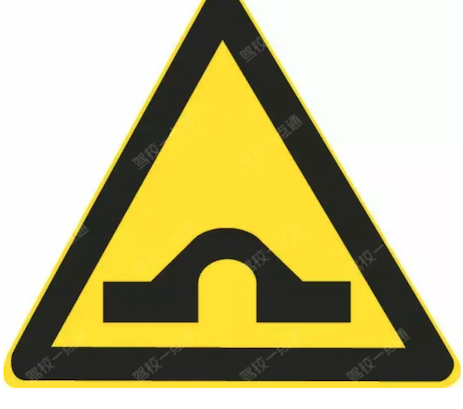

**选项**
- A. 不平路面
- B. 驼峰桥
- C. 路面高突
- D. 路面低洼

**答案**：B（驼峰桥）
**秒懂技巧**：骆驼背高起的桥，选驼峰桥
**解释**：这是关键词判断法：题干或选项出现对应词时，按口诀直接定位或排除。

### 39. 黄色是警告标志，提醒注意儿童

> 记忆核心：把口诀对应到题干关键词，优先排除与口诀相反或无关的选项。
> 使用方法：先看图形特征，再回到题干确认问的是名称、含义还是操作。

- 类型/频次：秒懂技巧×1；共 1 题；含图 1 题
- 对应题号：P4-082

#### 代表原题

##### P4-082｜试卷4 易错100题

**原题**：这个标志是何含义？

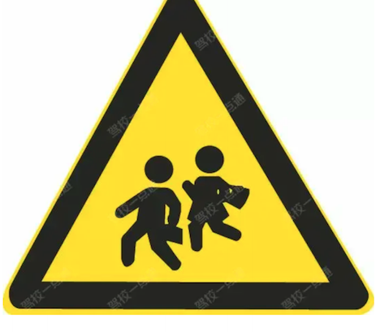

**选项**
- A. 注意行人
- B. 人行横道
- C. 注意儿童
- D. 学校区域

**答案**：C（注意儿童）
**秒懂技巧**：黄色是警告标志，提醒注意儿童
**解释**：把口诀对应到题干关键词，优先排除与口诀相反或无关的选项。

### 40. 黄色是警告标志，提醒注意，看到黄色选注意行人

> 记忆核心：这是关键词判断法：题干或选项出现对应词时，按口诀直接定位或排除。
> 使用方法：先圈出题干关键词，再到选项里找口诀提示的答案词。

- 类型/频次：秒懂技巧×1；共 1 题；含图 1 题
- 对应题号：P4-081

#### 代表原题

##### P4-081｜试卷4 易错100题

**原题**：这个标志是何含义？

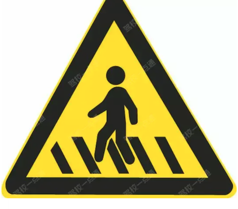

**选项**
- A. 人行横道
- B. 注意行人
- C. 注意儿童
- D. 学校区域

**答案**：B（注意行人）
**秒懂技巧**：黄色是警告标志，提醒注意，看到黄色选注意行人
**解释**：这是关键词判断法：题干或选项出现对应词时，按口诀直接定位或排除。

### 41. 黄色网格线/人行横道不得停车

> 记忆核心：如图所示，驾驶机动车直行遇前方道路堵塞时，车辆可以在黄色网格线区域临时停车等待，但不得在人行横道停车。
> 使用方法：先看图形特征，再回到题干确认问的是名称、含义还是操作。

- 类型/频次：秒懂技巧×1；共 1 题；含图 1 题
- 对应题号：P5-072

#### 代表原题

##### P5-072｜试卷5 冲刺100题

**原题**：如图所示，驾驶机动车直行遇前方道路堵塞时，车辆可以在黄色网格线区域临时停车等待，但不得在人行横道停车。

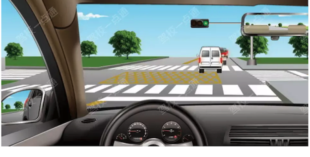

**选项**
- A. 正确
- B. 错误

**答案**：B（错误）
**秒懂技巧**：黄色网格线/人行横道不得停车
**解释**：如图所示，驾驶机动车直行遇前方道路堵塞时，车辆可以在黄色网格线区域临时停车等待，但不得在人行横道停车。
**相关考点**：安全常识考点总结

### 42. 黄色闪光警告信号灯，确认安全后通过

> 记忆核心：黄色闪光警告信号灯亮起，驾驶人要停车注意瞭望，在确认安全后通过。所以本题选正确。 《道路交通安全法实施条例》第四十二条：闪光警告信号灯为持续闪烁的黄灯，提示车辆、行人通行时注意瞭望，确认安全后通过。
> 使用方法：黄色闪光警告信号灯亮起，驾驶人要停车注意瞭望，在确认安全后通过。所以本题选正确。 《道路交通安全法实施条例》第四十二条：闪光警告信号灯为持续闪烁的黄灯，提示车辆、行人通行时注意瞭望，确认安全后通过。

- 类型/频次：秒懂技巧×1；共 1 题
- 对应题号：P5-046

#### 代表原题

##### P5-046｜试卷5 冲刺100题

**原题**：黄色闪光警告信号灯，表示机动车可以在确认安全后通过。

**选项**
- A. 正确
- B. 错误

**答案**：A（正确）
**秒懂技巧**：黄色闪光警告信号灯，确认安全后通过
**解释**：黄色闪光警告信号灯亮起，驾驶人要停车注意瞭望，在确认安全后通过。所以本题选正确。 《道路交通安全法实施条例》第四十二条：闪光警告信号灯为持续闪烁的黄灯，提示车辆、行人通行时注意瞭望，确认安全后通过。

### 43. 黑色箭头在两侧表示宽度，黑色箭头在上下表示高度

> 记忆核心：此技巧用于区分限制高度标志和限制宽度标志。 标志中黑色箭头在两侧，水平方向表示宽度，中间的数字表示限制宽度 标志中黑色箭头在上下，竖直方向表示高度，中间的数字表示限制高度
> 使用方法：先看图形特征，再回到题干确认问的是名称、含义还是操作。

- 类型/频次：秒懂技巧×1；共 1 题；含图 1 题
- 对应题号：P4-091

#### 代表原题

##### P4-091｜试卷4 易错100题

**原题**：这个标志是何含义？

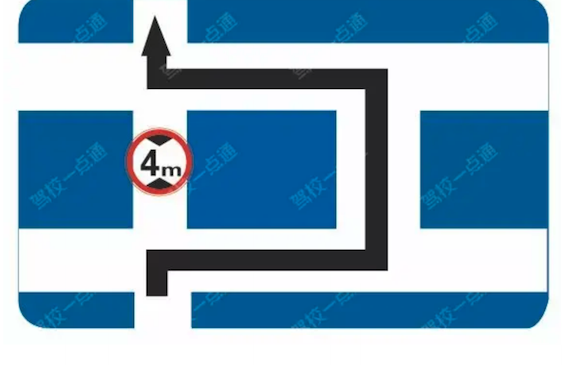

**选项**
- A. 禁止左转
- B. 此路不通
- C. 禁止通行
- D. 超高绕行

**答案**：D（超高绕行）
**秒懂技巧**：黑色箭头在两侧表示宽度，黑色箭头在上下表示高度
**解释**：此技巧用于区分限制高度标志和限制宽度标志。 标志中黑色箭头在两侧，水平方向表示宽度，中间的数字表示限制宽度 标志中黑色箭头在上下，竖直方向表示高度，中间的数字表示限制高度
