# 速度高速与车距车道

学习重点：把速度、能见度、车距、车道和高速场景连成一套数字表。

- 覆盖口诀：35 条
- 覆盖原题：42 题
- 含图原题：17 题

## 本章速背

| 出现 | 口诀/技巧 | 怎么用 | 代表原题 |
|---:|---|---|---|
| 3 | [城3公4；城5公7](#06_速度高速与车距车道-tip-001) | 先看图形特征，再回到题干确认问的是名称、含义还是操作。 | P4-021：如图所示，驾驶机动车在同方向只有1条机动车道的城市道路上行驶，最高行驶速度不得超过每小时多少公里? |
| 3 | [高速3条车道从右往左6-9/9-11/11-12](#06_速度高速与车距车道-tip-002) | 先看图形特征，再回到题干确认问的是名称、含义还是操作。 | P4-047：在图中所示，同向三车道高速公路上行车，车速高于每小时110公里的车辆应在哪条车道上行驶？ |
| 3 | [高速能见度145、261、52离](#06_速度高速与车距车道-tip-003) | 此技巧用于说明高速公路上能见度、行车速度与车距的对应关系。 145：能见度低于100米，速度不超40公里/小时，车距50米以上； 261：能见度低于200米，速度不超60公里/小时，车距100米以上； 52离：能见度低于50米，速度不超20公里/小时，尽快驶离高速公路。 | P4-067：驾驶机动车在高速公路上行驶，遇能见度小于50米的恶劣气象条件时，车速不得超过每小时多少公里，并尽快驶离？ |
| 2 | [非机动车道/窄路/弯路/弯道/窄桥/陡坡/冰雪路/泥泞路/掉头/转弯/铁路道口/牵引故障车，最高速度不超30](#06_速度高速与车距车道-tip-004) | 本题考点为牵引机动车车速。《道路交通安全法实施条例》第四十六条：机动车牵引发生故障的机动车时，最高行驶速度不得超过每小时30公里。 | P5-004：牵引发生故障的机动车时，最高车速是（）。 |
| 1 | [LDW车道偏离道路离（L）开道(D)](#06_速度高速与车距车道-tip-005) | 车道偏离预警系统LDW（Lane Departure Warning），是一种通过报警的方式辅助驾驶员减少汽车因车道偏离而发生交通事故的系统。 TSR是汽车安全系统的交通标志识别系统（Traffic Sign Recognition），TMC是交通信息频道（Traffic Message Channel），ALC是（Auto Lane Change）是车辆提供的一种辅助驾驶系统。 | P3-012：以下缩写中，表示车道偏离预警系统缩写的是什么？ |
| 1 | [专用车道有其他车辆进入会影响通行](#06_速度高速与车距车道-tip-006) | 本题考点为专用车道。专用车道在规定时间内只准许规定的车辆通行，其他车辆不得进入，是为了保证专用车辆的正常通行，所以选择正确。 《道路交通安全法》第三十七条：道路划设专用车道的，在专用车道内，只准许规定的车辆通行，其他车辆不得进入专用车道内行驶。 | P4-006：其他车辆不准进入专用车道行驶，其目的是为了不影响专用车的正常通行。 |
| 1 | [图中我们的车行驶在直行/右转车道，选直行/右转](#06_速度高速与车距车道-tip-007) | 这类题适合快速直选；但遇到“错误的是、不能、不得”要先看清正反问法。 | P4-057：如图所示，驾驶机动车在路口遇到这种信号灯可以怎样行驶？ |
| 1 | [图中线条变少表示车道变少](#06_速度高速与车距车道-tip-008) | 先看图形特征，再回到题干确认问的是名称、含义还是操作。 | P3-064：这个标志是何含义？ |
| 1 | [图中车道是左转或直行车道，选左转或者直行](#06_速度高速与车距车道-tip-009) | 这类题适合快速直选；但遇到“错误的是、不能、不得”要先看清正反问法。 | P4-012：如图所示，车辆此时可以怎么行驶？ |
| 1 | [控制车速不能单凭感觉](#06_速度高速与车距车道-tip-010) | 本题考点为行车速度的确认。机动车从高速公路驶入减速车道后，要通过观察车速表来判断车速，观察与前后车的距离来控制车速，不能单凭感觉。所以本题选正确。 因为驾驶人长期在高速行驶对速度的感知能力会下降，可能误判车速造成事故。 | P5-092：从高速公路进入减速车道后，应通过观察与前后车的距离来控制车速，不能单纯凭感觉。 |
| 1 | [未划分车道机动车在中间通行](#06_速度高速与车距车道-tip-011) | 把违法行为和数字绑定记忆，题干变换时只要认出行为即可。 | P3-031：驾驶机动车通过未划分车道的道路时，机动车在道路中间通行，非机动车和行人在道路两侧通行。 |
| 1 | [特殊天气降低车速为了保障安全，与降低车辆的损害无直接关系](#06_速度高速与车距车道-tip-012) | 雨雪天气降低车速、保持安全距离的目的，主要是保障行车安全，与降低车辆的损害并无直接关系。 驾驶机动车在高速公路上遇到雨雪天气时，能见度下降，驾驶人难以及时发现前方车辆。 在此类天气条件下的道路上，车辆的制动距离变长，需要降低车速，为车辆安全行驶提供足够的安全距离。 | P5-006：驾驶机动车在高速公路上遇到雨雪天气时，需要降低车速、保持安全距离的原因，以下说法错误的是什么？ |
| 1 | [特殊道路不得超过30公里/小时](#06_速度高速与车距车道-tip-013) | 先看图形特征，再回到题干确认问的是名称、含义还是操作。 | P3-087：如图所示，在这个弯道上行驶时的最高速度不能超过多少？ |
| 1 | [看到中间通行为给两侧留充足空间](#06_速度高速与车距车道-tip-014) | 先圈出题干关键词，再到选项里找口诀提示的答案词。 | P5-094：机动车在没有划分机动车道、非机动车道和人行道的道路中间通行，是要给两侧的非机动车和行人留出通行空间。 |
| 1 | [看到加速变道，选错](#06_速度高速与车距车道-tip-015) | 先圈出题干关键词，再到选项里找口诀提示的答案词。 | P5-051：驾车遇到图中情形要加速从左侧灰色车辆前变更车道。 |
| 1 | [看到加速车道停车等待，选错](#06_速度高速与车距车道-tip-016) | 先圈出题干关键词，再到选项里找口诀提示的答案词。 | P5-064：驾驶机动车进入加速车道后，可临时停车等待同行的其他车辆。 |
| 1 | [看到加速车道车速60以上，选对](#06_速度高速与车距车道-tip-017) | 先圈出题干关键词，再到选项里找口诀提示的答案词。 | P4-068：驾驶机动车在高速公路加速车道上行驶，应尽快将车速提高到60km/h以上。 |
| 1 | [看到按照限速标志行驶，选对](#06_速度高速与车距车道-tip-018) | 先圈出题干关键词，再到选项里找口诀提示的答案词。 | P5-038：驾驶机动车在高速公路要按照限速标志标明的车速行驶。 |
| 1 | [看到直接驶入/压实线，选错](#06_速度高速与车距车道-tip-019) | 先圈出题干关键词，再到选项里找口诀提示的答案词。 | P5-093：可以从这个位置直接驶入高速公路行车道。 |
| 1 | [看到驶出匝道后直接驶入行车道，选错](#06_速度高速与车距车道-tip-020) | 先圈出题干关键词，再到选项里找口诀提示的答案词。 | P5-029：如图所示，驾驶机动车驶出匝道后可以直接驶入行车道。 |
| 1 | [看到驶离高速应减速，选对](#06_速度高速与车距车道-tip-021) | 先圈出题干关键词，再到选项里找口诀提示的答案词。 | P5-070：车辆驶离高速公路时，应当经减速车道减速后进入匝道。 |
| 1 | [看到高速以100公里速度行驶，跟车距离保持100米以上](#06_速度高速与车距车道-tip-022) | 先圈出题干关键词，再到选项里找口诀提示的答案词。 | P5-085：车辆在高速公路以每小时100公里的速度行驶时，距同车道前车100米以上为安全距离。 |
| 1 | [进入减速车道就是要离开高速，灯光找左进右出/入左出右，出高速找右转向灯](#06_速度高速与车距车道-tip-023) | 先圈出题干关键词，再到选项里找口诀提示的答案词。 | P2-094：这辆小型载客汽车驶离高速公路行车道的方法是正确的。 |
| 1 | [进入减速车道就是要离开高速，灯光选左进右出/入左出右，出高速选右转向灯](#06_速度高速与车距车道-tip-024) | 这类题适合快速直选；但遇到“错误的是、不能、不得”要先看清正反问法。 | P5-052：进入高速公路减速车道时怎样使用灯光？ |
| 1 | [速度题看到大于100选100，低于100选50](#06_速度高速与车距车道-tip-025) | 先圈出题干关键词，再到选项里找口诀提示的答案词。 | P4-077：驾驶小型载客汽车在高速公路上时速低于100公里时的最小跟车距离是多少？ |
| 1 | [非机动车道/窄路/弯路/弯道/窄桥/陡坡/冰雪路/泥泞路/掉头/转弯/铁路道口/牵引故障车,最高速度不超30](#06_速度高速与车距车道-tip-026) | 本题考点为特殊路段限速规定相关内容。机动车掉头、转弯、下陡坡时的最高速度不能超过每小时30公里，题中说不能超过每小时40公里，选择错误。 《道路交通安全法实施条例》第四十六条： 机动车行驶中在冰雪、泥泞的道路上行驶时，最高行驶速度不得超过每小时30公里。 | P5-036：掉头、转弯、下陡坡时的最高车速是40km/h。 |
| 1 | [非紧急情况不得在应急车道停车](#06_速度高速与车距车道-tip-027) | 当高速公路上感到疲劳时，正确的做法是驶入服务区休息，不能在应急车道内停车休息。在应急车道上随意停车休息是违法的，并且非常危险，而且会阻碍紧急救援车辆的通行，可能会导致其他车辆在紧急情况下无法及时停靠。 | P5-100：在高速公路上驾驶机动车感觉疲劳时，应驶入最近的服务区休息，不得在应急车道内停车休息。 |
| 1 | [题中看到车流，选车流](#06_速度高速与车距车道-tip-028) | 先圈出题干关键词，再到选项里找口诀提示的答案词。 | P5-061：驾驶机动车在高速公路上遇前方车流缓行时，以下做法正确的是什么？ |
| 1 | [题目看到进入高速错误的，选直接](#06_速度高速与车距车道-tip-029) | 先圈出题干关键词，再到选项里找口诀提示的答案词。 | P4-010：以下从加速车道驶入高速公路的做法错误的是（）。 |
| 1 | [题目问最高速度不能超过多少？没有配图的就选30](#06_速度高速与车距车道-tip-030) | 这类题适合快速直选；但遇到“错误的是、不能、不得”要先看清正反问法。 | P5-067：驾驶机动车在冰雪道路行驶时，最高速度不能超过多少？ |
| 1 | [高速2条车道从右往左6-10/10-12](#06_速度高速与车距车道-tip-031) | 先看图形特征，再回到题干确认问的是名称、含义还是操作。 | P5-026：如图所示，在高速公路同方向两条机动车道左侧车道行驶，应保持什么车速? |
| 1 | [高速公路上错过出口只能向前行驶，从下一出口驶出](#06_速度高速与车距车道-tip-032) | 适用于通行原则考点总结相关题。做题时先抓题干关键词，再按口诀定位答案。 | P5-023：在高速公路上驾驶机动车，以下做法正确的是什么？ |
| 1 | [高速公路左进右出](#06_速度高速与车距车道-tip-033) | 此技巧用于说明进出高速公路时开启的转向灯方向。 左进：表示机动车进入高速公路时，开启左转向灯进入； 右出：表示机动车驶出高速公路时，开启右转向灯驶出。 | P3-030：驾驶机动车从高速公路匝道进入加速车道应当如何正确使用灯光？ |
| 1 | [高速公路速度最快120，最慢60](#06_速度高速与车距车道-tip-034) | 适用于速度灯光考点总结相关题。做题时先抓题干关键词，再按口诀定位答案。 | P4-076：驾驶小型载客汽车在高速公路行驶的最低车速为90公里/小时。 |
| 1 | [高速随时借用应急车道，选错](#06_速度高速与车距车道-tip-035) | 这类题适合快速直选；但遇到“错误的是、不能、不得”要先看清正反问法。 | P5-013：在高速公路可以随时借用应急车道超车。 |

## 口诀卡片

### 1. 城3公4；城5公7

> 记忆核心：此技巧用于说明在有/无中心线的城市道路或公路上的行驶速度规定。 城3公4：无中心线的城市道路，速度不超过30公里/小时； 无中心线的公路上，速度不超过40公里/小时； 城5公7：有中心线的城市道路，速度不超过50公里/小时； 有中心线的公路上，速度不超过70公里/小时。
> 使用方法：先看图形特征，再回到题干确认问的是名称、含义还是操作。

- 类型/频次：速记口诀×3；共 3 题；含图 3 题
- 对应题号：P4-021、P4-022、P5-012

#### 代表原题

##### P4-021｜试卷4 易错100题

**原题**：如图所示，驾驶机动车在同方向只有1条机动车道的城市道路上行驶，最高行驶速度不得超过每小时多少公里?

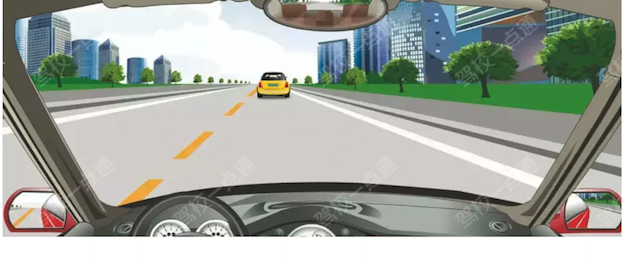

**选项**
- A. 40
- B. 60
- C. 70
- D. 50

**答案**：D（50）
**秒懂技巧**：城3公4；城5公7
**解释**：此技巧用于说明在有/无中心线的城市道路或公路上的行驶速度规定。 城3公4：无中心线的城市道路，速度不超过30公里/小时； 无中心线的公路上，速度不超过40公里/小时； 城5公7：有中心线的城市道路，速度不超过50公里/小时； 有中心线的公路上，速度不超过70公里/小时。
**相关考点**：速度灯光考点总结

##### P4-022｜试卷4 易错100题

**原题**：驾驶机动车在没有中心线的城市道路上，最高速度不能超过每小时50公里。

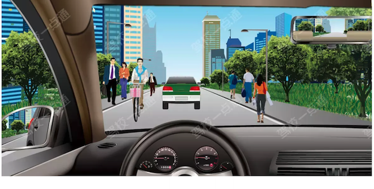

**选项**
- A. 正确
- B. 错误

**答案**：B（错误）
**秒懂技巧**：城3公4；城5公7
**解释**：此技巧用于说明在有/无中心线的城市道路或公路上的行驶速度规定。 城3公4：无中心线的城市道路，速度不超过30公里/小时； 无中心线的公路上，速度不超过40公里/小时； 城5公7：有中心线的城市道路，速度不超过50公里/小时； 有中心线的公路上，速度不超过70公里/小时。
**相关考点**：速度灯光考点总结

##### P5-012｜试卷5 冲刺100题

**原题**：在没有道路中心线的公路行驶，最高车速是（）。

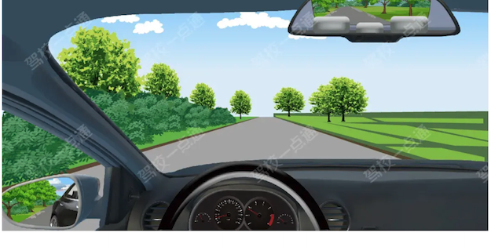

**选项**
- A. 40km/h
- B. 50km/h
- C. 30km/h
- D. 20km/h

**答案**：A（40km/h）
**秒懂技巧**：城3公4；城5公7
**解释**：此技巧用于说明在有/无中心线的城市道路或公路上的行驶速度规定。 城3公4：无中心线的城市道路，速度不超过30公里/小时； 无中心线的公路上，速度不超过40公里/小时； 城5公7：有中心线的城市道路，速度不超过50公里/小时； 有中心线的公路上，速度不超过70公里/小时。
**相关考点**：速度灯光考点总结

### 2. 高速3条车道从右往左6-9/9-11/11-12

> 记忆核心：此技巧用于说明高速公路同向三条及以上车道时各车道限速范围。 6-9：最右侧车道行驶速度60-90km/h； 9-11：中间车道行驶速度90-110km/h； 11-12：最左侧车道行驶速度110-120km/h
> 使用方法：先看图形特征，再回到题干确认问的是名称、含义还是操作。

- 类型/频次：速记口诀×3；共 3 题；含图 3 题
- 对应题号：P4-047、P5-031、P5-042

#### 代表原题

##### P4-047｜试卷4 易错100题

**原题**：在图中所示，同向三车道高速公路上行车，车速高于每小时110公里的车辆应在哪条车道上行驶？

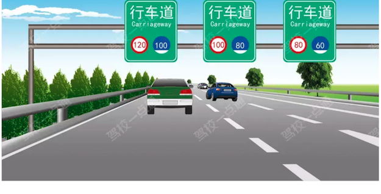

**选项**
- A. 最右侧车道
- B. 哪条都行
- C. 中间车道
- D. 最左侧车道

**答案**：D（最左侧车道）
**秒懂技巧**：高速3条车道从右往左6-9/9-11/11-12
**解释**：此技巧用于说明高速公路同向三条及以上车道时各车道限速范围。 6-9：最右侧车道行驶速度60-90km/h； 9-11：中间车道行驶速度90-110km/h； 11-12：最左侧车道行驶速度110-120km/h
**相关考点**：速度灯光考点总结

##### P5-031｜试卷5 冲刺100题

**原题**：在图中高速公路这条车道行驶，车速不得低于（）。

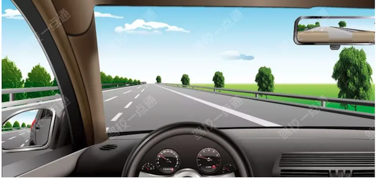

**选项**
- A. 80km/h
- B. 100km/h
- C. 110km/h
- D. 60km/h

**答案**：D（60km/h）
**秒懂技巧**：高速3条车道从右往左6-9/9-11/11-12
**解释**：此技巧用于说明高速公路同向三条及以上车道时各车道限速范围。 6-9：最右侧车道行驶速度60-90km/h； 9-11：中间车道行驶速度90-110km/h； 11-12：最左侧车道行驶速度110-120km/h
**相关考点**：速度灯光考点总结

##### P5-042｜试卷5 冲刺100题

**原题**：如图所示，在同方向三条机动车道的高速公路中间车道行驶，车速不能低于多少公里？

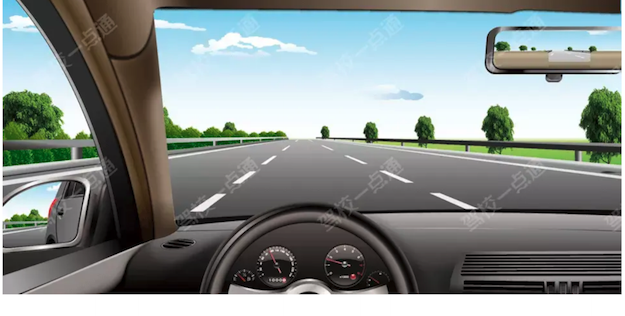

**选项**
- A. 100公里/小时
- B. 90公里/小时
- C. 110公里/小时
- D. 60公里/小时

**答案**：B（90公里/小时）
**秒懂技巧**：高速3条车道从右往左6-9/9-11/11-12
**解释**：此技巧用于说明高速公路同向三条及以上车道时各车道限速范围。 6-9：最右侧车道行驶速度60-90km/h； 9-11：中间车道行驶速度90-110km/h； 11-12：最左侧车道行驶速度110-120km/h
**相关考点**：速度灯光考点总结

### 3. 高速能见度145、261、52离

> 记忆核心：此技巧用于说明高速公路上能见度、行车速度与车距的对应关系。 145：能见度低于100米，速度不超40公里/小时，车距50米以上； 261：能见度低于200米，速度不超60公里/小时，车距100米以上； 52离：能见度低于50米，速度不超20公里/小时，尽快驶离高速公路。
> 使用方法：此技巧用于说明高速公路上能见度、行车速度与车距的对应关系。 145：能见度低于100米，速度不超40公里/小时，车距50米以上； 261：能见度低于200米，速度不超60公里/小时，车距100米以上； 52离：能见度低于50米，速度不超20公里/小时，尽快驶离高速公路。

- 类型/频次：速记口诀×3；共 3 题
- 对应题号：P4-067、P5-008、P5-022

#### 代表原题

##### P4-067｜试卷4 易错100题

**原题**：驾驶机动车在高速公路上行驶，遇能见度小于50米的恶劣气象条件时，车速不得超过每小时多少公里，并尽快驶离？

**选项**
- A. 30
- B. 40
- C. 10
- D. 20

**答案**：D（20）
**秒懂技巧**：高速能见度145、261、52离
**解释**：此技巧用于说明高速公路上能见度、行车速度与车距的对应关系。 145：能见度低于100米，速度不超40公里/小时，车距50米以上； 261：能见度低于200米，速度不超60公里/小时，车距100米以上； 52离：能见度低于50米，速度不超20公里/小时，尽快驶离高速公路。
**相关考点**：特殊天气考点总结

##### P5-008｜试卷5 冲刺100题

**原题**：雪天在高速公路上驾驶时，关于安全车距错误的说法是什么？

**选项**
- A. 雪天路滑，制动距离比干燥柏油路更长
- B. 雪天能见度低，应该根据能见度控制安全距离
- C. 能见度小于200m时，与前车至少保持50m的安全距离
- D. 能见度小于50m时，应该驶离高速公路

**答案**：C（能见度小于200m时，与前车至少保持50m的安全距离）
**秒懂技巧**：高速能见度145、261、52离
**解释**：此技巧用于说明高速公路上能见度、行车速度与车距的对应关系。 145：能见度低于100米，速度不超40公里/小时，车距50米以上； 261：能见度低于200米，速度不超60公里/小时，车距100米以上； 52离：能见度低于50米，速度不超20公里/小时，尽快驶离高速公路。
**相关考点**：特殊天气考点总结

##### P5-022｜试卷5 冲刺100题

**原题**：驾驶机动车在高速公路上行驶，能见度小于100米时，车速不得超过每小时60公里。

**选项**
- A. 正确
- B. 错误

**答案**：B（错误）
**秒懂技巧**：高速能见度145、261、52离
**解释**：此技巧用于说明高速公路上能见度、行车速度与车距的对应关系。 145：能见度低于100米，速度不超40公里/小时，车距50米以上； 261：能见度低于200米，速度不超60公里/小时，车距100米以上； 52离：能见度低于50米，速度不超20公里/小时，尽快驶离高速公路。
**相关考点**：特殊天气考点总结

### 4. 非机动车道/窄路/弯路/弯道/窄桥/陡坡/冰雪路/泥泞路/掉头/转弯/铁路道口/牵引故障车，最高速度不超30

> 记忆核心：本题考点为牵引机动车车速。《道路交通安全法实施条例》第四十六条：机动车牵引发生故障的机动车时，最高行驶速度不得超过每小时30公里。
> 使用方法：本题考点为牵引机动车车速。《道路交通安全法实施条例》第四十六条：机动车牵引发生故障的机动车时，最高行驶速度不得超过每小时30公里。

- 类型/频次：秒懂技巧×2；共 2 题
- 对应题号：P5-004、P5-077

#### 代表原题

##### P5-004｜试卷5 冲刺100题

**原题**：牵引发生故障的机动车时，最高车速是（）。

**选项**
- A. 20km/h
- B. 30km/h
- C. 40km/h
- D. 50km/h

**答案**：B（30km/h）
**秒懂技巧**：非机动车道/窄路/弯路/弯道/窄桥/陡坡/冰雪路/泥泞路/掉头/转弯/铁路道口/牵引故障车，最高速度不超30
**解释**：本题考点为牵引机动车车速。《道路交通安全法实施条例》第四十六条：机动车牵引发生故障的机动车时，最高行驶速度不得超过每小时30公里。
**相关考点**：速度灯光考点总结

##### P5-077｜试卷5 冲刺100题

**原题**：驾驶机动车通过窄路、窄桥时的最高速度不能超过每小时50公里。

**选项**
- A. 正确
- B. 错误

**答案**：B（错误）
**秒懂技巧**：非机动车道/窄路/弯路/弯道/窄桥/陡坡/冰雪路/泥泞路/掉头/转弯/铁路道口/牵引故障车，最高速度不超30
**解释**：本题考点为特殊路段限速规定相关内容。窄路、窄桥等特殊路段限速30km/h。 《道路交通安全法实施条例》第四十六条：机动车行驶中遇到进出非机动车道，通过铁路道口、急弯路、窄路、窄桥时，最高行驶速度不得超过每小时30公里。
**相关考点**：速度灯光考点总结

### 5. LDW车道偏离道路离（L）开道(D)

> 记忆核心：车道偏离预警系统LDW（Lane Departure Warning），是一种通过报警的方式辅助驾驶员减少汽车因车道偏离而发生交通事故的系统。 TSR是汽车安全系统的交通标志识别系统（Traffic Sign Recognition），TMC是交通信息频道（Traffic Message Channel），ALC是（Auto Lane Change）是车辆提供的一种辅助驾驶系统。
> 使用方法：车道偏离预警系统LDW（Lane Departure Warning），是一种通过报警的方式辅助驾驶员减少汽车因车道偏离而发生交通事故的系统。 TSR是汽车安全系统的交通标志识别系统（Traffic Sign Recognition），TMC是交通信息频道（Traffic Message Channel），ALC是（Auto Lane Change）是车辆提供的一种辅助驾驶系统。

- 类型/频次：秒懂技巧×1；共 1 题
- 对应题号：P3-012

#### 代表原题

##### P3-012｜试卷3 高频100题

**原题**：以下缩写中，表示车道偏离预警系统缩写的是什么？

**选项**
- A. TSR
- B. TMC
- C. LDW
- D. ALC

**答案**：C（LDW）
**秒懂技巧**：LDW车道偏离道路离（L）开道(D)
**解释**：车道偏离预警系统LDW（Lane Departure Warning），是一种通过报警的方式辅助驾驶员减少汽车因车道偏离而发生交通事故的系统。 TSR是汽车安全系统的交通标志识别系统（Traffic Sign Recognition），TMC是交通信息频道（Traffic Message Channel），ALC是（Auto Lane Change）是车辆提供的一种辅助驾驶系统。

### 6. 专用车道有其他车辆进入会影响通行

> 记忆核心：本题考点为专用车道。专用车道在规定时间内只准许规定的车辆通行，其他车辆不得进入，是为了保证专用车辆的正常通行，所以选择正确。 《道路交通安全法》第三十七条：道路划设专用车道的，在专用车道内，只准许规定的车辆通行，其他车辆不得进入专用车道内行驶。
> 使用方法：本题考点为专用车道。专用车道在规定时间内只准许规定的车辆通行，其他车辆不得进入，是为了保证专用车辆的正常通行，所以选择正确。 《道路交通安全法》第三十七条：道路划设专用车道的，在专用车道内，只准许规定的车辆通行，其他车辆不得进入专用车道内行驶。

- 类型/频次：秒懂技巧×1；共 1 题
- 对应题号：P4-006

#### 代表原题

##### P4-006｜试卷4 易错100题

**原题**：其他车辆不准进入专用车道行驶，其目的是为了不影响专用车的正常通行。

**选项**
- A. 正确
- B. 错误

**答案**：A（正确）
**秒懂技巧**：专用车道有其他车辆进入会影响通行
**解释**：本题考点为专用车道。专用车道在规定时间内只准许规定的车辆通行，其他车辆不得进入，是为了保证专用车辆的正常通行，所以选择正确。 《道路交通安全法》第三十七条：道路划设专用车道的，在专用车道内，只准许规定的车辆通行，其他车辆不得进入专用车道内行驶。
**相关考点**：通行原则考点总结

### 7. 图中我们的车行驶在直行/右转车道，选直行/右转

> 记忆核心：这是关键词判断法：题干或选项出现对应词时，按口诀直接定位或排除。
> 使用方法：这类题适合快速直选；但遇到“错误的是、不能、不得”要先看清正反问法。

- 类型/频次：秒懂技巧×1；共 1 题；含图 1 题
- 对应题号：P4-057

#### 代表原题

##### P4-057｜试卷4 易错100题

**原题**：如图所示，驾驶机动车在路口遇到这种信号灯可以怎样行驶？

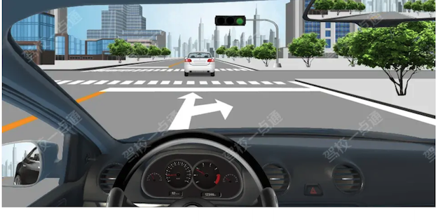

**选项**
- A. 向左或向右转弯
- B. 直行或向左转弯
- C. 向左转弯
- D. 直行或向右转弯

**答案**：D（直行或向右转弯）
**秒懂技巧**：图中我们的车行驶在直行/右转车道，选直行/右转
**解释**：这是关键词判断法：题干或选项出现对应词时，按口诀直接定位或排除。

### 8. 图中线条变少表示车道变少

> 记忆核心：把口诀对应到题干关键词，优先排除与口诀相反或无关的选项。
> 使用方法：先看图形特征，再回到题干确认问的是名称、含义还是操作。

- 类型/频次：秒懂技巧×1；共 1 题；含图 1 题
- 对应题号：P3-064

#### 代表原题

##### P3-064｜试卷3 高频100题

**原题**：这个标志是何含义？

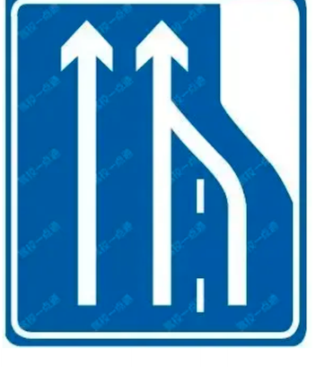

**选项**
- A. 向左变道
- B. 车道数变少
- C. 合流处
- D. 应急车道

**答案**：B（车道数变少）
**秒懂技巧**：图中线条变少表示车道变少
**解释**：把口诀对应到题干关键词，优先排除与口诀相反或无关的选项。

### 9. 图中车道是左转或直行车道，选左转或者直行

> 记忆核心：适用于通行原则考点总结相关题。做题时先抓题干关键词，再按口诀定位答案。
> 使用方法：这类题适合快速直选；但遇到“错误的是、不能、不得”要先看清正反问法。

- 类型/频次：秒懂技巧×1；共 1 题；含图 1 题
- 对应题号：P4-012

#### 代表原题

##### P4-012｜试卷4 易错100题

**原题**：如图所示，车辆此时可以怎么行驶？

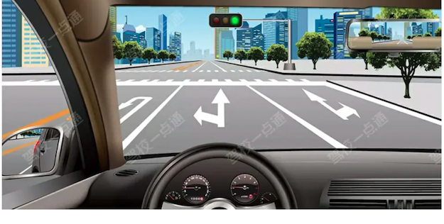

**选项**
- A. 只能直行
- B. 左转或者直行
- C. 左转或右转
- D. 直行或右转

**答案**：B（左转或者直行）
**秒懂技巧**：图中车道是左转或直行车道，选左转或者直行
**解释**：适用于通行原则考点总结相关题。做题时先抓题干关键词，再按口诀定位答案。
**相关考点**：通行原则考点总结

### 10. 控制车速不能单凭感觉

> 记忆核心：本题考点为行车速度的确认。机动车从高速公路驶入减速车道后，要通过观察车速表来判断车速，观察与前后车的距离来控制车速，不能单凭感觉。所以本题选正确。 因为驾驶人长期在高速行驶对速度的感知能力会下降，可能误判车速造成事故。
> 使用方法：本题考点为行车速度的确认。机动车从高速公路驶入减速车道后，要通过观察车速表来判断车速，观察与前后车的距离来控制车速，不能单凭感觉。所以本题选正确。 因为驾驶人长期在高速行驶对速度的感知能力会下降，可能误判车速造成事故。

- 类型/频次：秒懂技巧×1；共 1 题
- 对应题号：P5-092

#### 代表原题

##### P5-092｜试卷5 冲刺100题

**原题**：从高速公路进入减速车道后，应通过观察与前后车的距离来控制车速，不能单纯凭感觉。

**选项**
- A. 正确
- B. 错误

**答案**：A（正确）
**秒懂技巧**：控制车速不能单凭感觉
**解释**：本题考点为行车速度的确认。机动车从高速公路驶入减速车道后，要通过观察车速表来判断车速，观察与前后车的距离来控制车速，不能单凭感觉。所以本题选正确。 因为驾驶人长期在高速行驶对速度的感知能力会下降，可能误判车速造成事故。

### 11. 未划分车道机动车在中间通行

> 记忆核心：《道路交通安全法》第三十六条：没有划分机动车道、非机动车道和人行道的，机动车在道路中间通行，非机动车和行人在道路两侧通行。
> 使用方法：把违法行为和数字绑定记忆，题干变换时只要认出行为即可。

- 类型/频次：秒懂技巧×1；共 1 题
- 对应题号：P3-031

#### 代表原题

##### P3-031｜试卷3 高频100题

**原题**：驾驶机动车通过未划分车道的道路时，机动车在道路中间通行，非机动车和行人在道路两侧通行。

**选项**
- A. 正确
- B. 错误

**答案**：A（正确）
**秒懂技巧**：未划分车道机动车在中间通行
**解释**：《道路交通安全法》第三十六条：没有划分机动车道、非机动车道和人行道的，机动车在道路中间通行，非机动车和行人在道路两侧通行。
**相关考点**：通行原则考点总结

### 12. 特殊天气降低车速为了保障安全，与降低车辆的损害无直接关系

> 记忆核心：雨雪天气降低车速、保持安全距离的目的，主要是保障行车安全，与降低车辆的损害并无直接关系。 驾驶机动车在高速公路上遇到雨雪天气时，能见度下降，驾驶人难以及时发现前方车辆。 在此类天气条件下的道路上，车辆的制动距离变长，需要降低车速，为车辆安全行驶提供足够的安全距离。
> 使用方法：雨雪天气降低车速、保持安全距离的目的，主要是保障行车安全，与降低车辆的损害并无直接关系。 驾驶机动车在高速公路上遇到雨雪天气时，能见度下降，驾驶人难以及时发现前方车辆。 在此类天气条件下的道路上，车辆的制动距离变长，需要降低车速，为车辆安全行驶提供足够的安全距离。

- 类型/频次：秒懂技巧×1；共 1 题
- 对应题号：P5-006

#### 代表原题

##### P5-006｜试卷5 冲刺100题

**原题**：驾驶机动车在高速公路上遇到雨雪天气时，需要降低车速、保持安全距离的原因，以下说法错误的是什么？

**选项**
- A. 能见度下降，驾驶人难以及时发现前方车辆
- B. 此类天气条件下的道路上，车辆的制动距离变长
- C. 为车辆安全行驶提供足够的安全距离
- D. 降低恶劣天气对车辆造成的损害

**答案**：D（降低恶劣天气对车辆造成的损害）
**秒懂技巧**：特殊天气降低车速为了保障安全，与降低车辆的损害无直接关系
**解释**：雨雪天气降低车速、保持安全距离的目的，主要是保障行车安全，与降低车辆的损害并无直接关系。 驾驶机动车在高速公路上遇到雨雪天气时，能见度下降，驾驶人难以及时发现前方车辆。 在此类天气条件下的道路上，车辆的制动距离变长，需要降低车速，为车辆安全行驶提供足够的安全距离。
**相关考点**：特殊天气考点总结

### 13. 特殊道路不得超过30公里/小时

> 记忆核心：适用于速度灯光考点总结相关题。做题时先抓题干关键词，再按口诀定位答案。
> 使用方法：先看图形特征，再回到题干确认问的是名称、含义还是操作。

- 类型/频次：秒懂技巧×1；共 1 题；含图 1 题
- 对应题号：P3-087

#### 代表原题

##### P3-087｜试卷3 高频100题

**原题**：如图所示，在这个弯道上行驶时的最高速度不能超过多少？

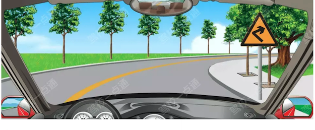

**选项**
- A. 30公里/小时
- B. 40公里/小时
- C. 50公里/小时
- D. 70公里/小时

**答案**：A（30公里/小时）
**秒懂技巧**：特殊道路不得超过30公里/小时
**解释**：适用于速度灯光考点总结相关题。做题时先抓题干关键词，再按口诀定位答案。
**相关考点**：速度灯光考点总结

### 14. 看到中间通行为给两侧留充足空间

> 记忆核心：适用于通行原则考点总结相关题。做题时先抓题干关键词，再按口诀定位答案。
> 使用方法：先圈出题干关键词，再到选项里找口诀提示的答案词。

- 类型/频次：秒懂技巧×1；共 1 题；含图 1 题
- 对应题号：P5-094

#### 代表原题

##### P5-094｜试卷5 冲刺100题

**原题**：机动车在没有划分机动车道、非机动车道和人行道的道路中间通行，是要给两侧的非机动车和行人留出通行空间。

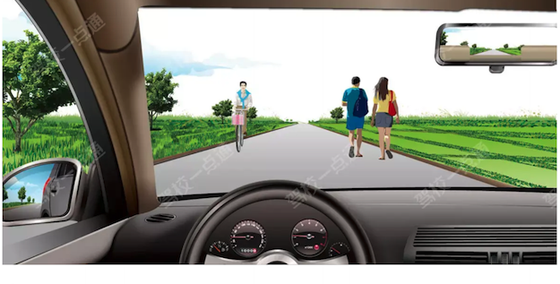

**选项**
- A. 正确
- B. 错误

**答案**：A（正确）
**秒懂技巧**：看到中间通行为给两侧留充足空间
**解释**：适用于通行原则考点总结相关题。做题时先抓题干关键词，再按口诀定位答案。
**相关考点**：通行原则考点总结

### 15. 看到加速变道，选错

> 记忆核心：适用于通行原则考点总结相关题。做题时先抓题干关键词，再按口诀定位答案。
> 使用方法：先圈出题干关键词，再到选项里找口诀提示的答案词。

- 类型/频次：关键字答题×1；共 1 题；含图 1 题
- 对应题号：P5-051

#### 代表原题

##### P5-051｜试卷5 冲刺100题

**原题**：驾车遇到图中情形要加速从左侧灰色车辆前变更车道。

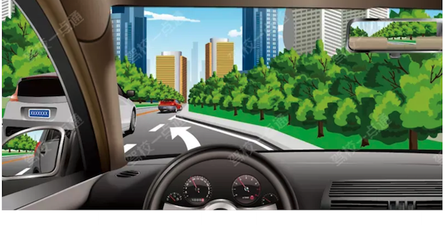

**选项**
- A. 正确
- B. 错误

**答案**：B（错误）
**秒懂技巧**：看到加速变道，选错
**解释**：适用于通行原则考点总结相关题。做题时先抓题干关键词，再按口诀定位答案。
**相关考点**：通行原则考点总结

### 16. 看到加速车道停车等待，选错

> 记忆核心：加速车道上禁止停车，题中说临时停车，所以本题选错误。 《道路交通安全法实施条例》第八十二条：机动车在高速公路上行驶，不得有下列行为：（一）倒车、逆行、穿越中央分隔带掉头或者在车道内停车；（二）在匝道、加速车道或者减速车道上超车；（三）骑、轧车行道分界线或者在路肩上行驶；（四）非紧急情况时在应急车道行驶或者停车；（五）试车或者学习驾驶机动车。
> 使用方法：先圈出题干关键词，再到选项里找口诀提示的答案词。

- 类型/频次：关键字答题×1；共 1 题
- 对应题号：P5-064

#### 代表原题

##### P5-064｜试卷5 冲刺100题

**原题**：驾驶机动车进入加速车道后，可临时停车等待同行的其他车辆。

**选项**
- A. 正确
- B. 错误

**答案**：B（错误）
**秒懂技巧**：看到加速车道停车等待，选错
**解释**：加速车道上禁止停车，题中说临时停车，所以本题选错误。 《道路交通安全法实施条例》第八十二条：机动车在高速公路上行驶，不得有下列行为：（一）倒车、逆行、穿越中央分隔带掉头或者在车道内停车；（二）在匝道、加速车道或者减速车道上超车；（三）骑、轧车行道分界线或者在路肩上行驶；（四）非紧急情况时在应急车道行驶或者停车；（五）试车或者学习驾驶机动车。
**相关考点**：通行原则考点总结

### 17. 看到加速车道车速60以上，选对

> 记忆核心：车辆驶入高速公路加速车道后，应尽快将车速提高到每小时60公里以上。 在高速公路上车辆行驶速度较快，如果车速过低，会影响其他车辆正常行驶。 《道路交通安全法实施条例》第七十八条：高速公路最低车速不得低于每小时60公里。所以车辆进入加速车道后，应尽快提高车速至每小时60公里以上。
> 使用方法：先圈出题干关键词，再到选项里找口诀提示的答案词。

- 类型/频次：关键字答题×1；共 1 题
- 对应题号：P4-068

#### 代表原题

##### P4-068｜试卷4 易错100题

**原题**：驾驶机动车在高速公路加速车道上行驶，应尽快将车速提高到60km/h以上。

**选项**
- A. 正确
- B. 错误

**答案**：A（正确）
**秒懂技巧**：看到加速车道车速60以上，选对
**解释**：车辆驶入高速公路加速车道后，应尽快将车速提高到每小时60公里以上。 在高速公路上车辆行驶速度较快，如果车速过低，会影响其他车辆正常行驶。 《道路交通安全法实施条例》第七十八条：高速公路最低车速不得低于每小时60公里。所以车辆进入加速车道后，应尽快提高车速至每小时60公里以上。
**相关考点**：速度灯光考点总结

### 18. 看到按照限速标志行驶，选对

> 记忆核心：高速公路上都有限速标志，要按限速标志行驶。 红圈白底限制最高速度，蓝底限制最低速度。 《道路交通安全法实施条例》第七十八条：在高速公路上驾驶机动车应按照道路限速标志标明的车速行驶。
> 使用方法：先圈出题干关键词，再到选项里找口诀提示的答案词。

- 类型/频次：关键字答题×1；共 1 题
- 对应题号：P5-038

#### 代表原题

##### P5-038｜试卷5 冲刺100题

**原题**：驾驶机动车在高速公路要按照限速标志标明的车速行驶。

**选项**
- A. 正确
- B. 错误

**答案**：A（正确）
**秒懂技巧**：看到按照限速标志行驶，选对
**解释**：高速公路上都有限速标志，要按限速标志行驶。 红圈白底限制最高速度，蓝底限制最低速度。 《道路交通安全法实施条例》第七十八条：在高速公路上驾驶机动车应按照道路限速标志标明的车速行驶。
**相关考点**：速度灯光考点总结

### 19. 看到直接驶入/压实线，选错

> 记忆核心：适用于通行原则考点总结相关题。做题时先抓题干关键词，再按口诀定位答案。
> 使用方法：先圈出题干关键词，再到选项里找口诀提示的答案词。

- 类型/频次：秒懂技巧×1；共 1 题；含图 1 题
- 对应题号：P5-093

#### 代表原题

##### P5-093｜试卷5 冲刺100题

**原题**：可以从这个位置直接驶入高速公路行车道。

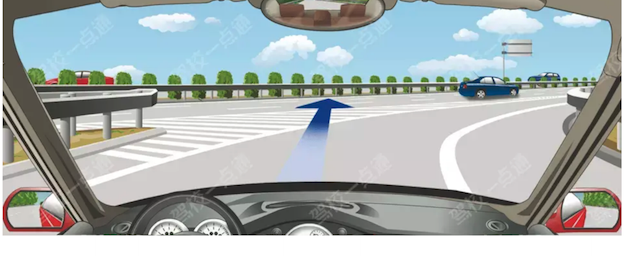

**选项**
- A. 正确
- B. 错误

**答案**：B（错误）
**秒懂技巧**：看到直接驶入/压实线，选错
**解释**：适用于通行原则考点总结相关题。做题时先抓题干关键词，再按口诀定位答案。
**相关考点**：通行原则考点总结

### 20. 看到驶出匝道后直接驶入行车道，选错

> 记忆核心：适用于通行原则考点总结相关题。做题时先抓题干关键词，再按口诀定位答案。
> 使用方法：先圈出题干关键词，再到选项里找口诀提示的答案词。

- 类型/频次：关键字答题×1；共 1 题；含图 1 题
- 对应题号：P5-029

#### 代表原题

##### P5-029｜试卷5 冲刺100题

**原题**：如图所示，驾驶机动车驶出匝道后可以直接驶入行车道。

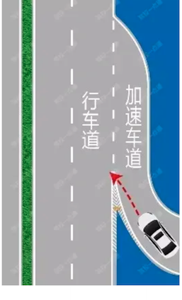

**选项**
- A. 正确
- B. 错误

**答案**：B（错误）
**秒懂技巧**：看到驶出匝道后直接驶入行车道，选错
**解释**：适用于通行原则考点总结相关题。做题时先抓题干关键词，再按口诀定位答案。
**相关考点**：通行原则考点总结

### 21. 看到驶离高速应减速，选对

> 记忆核心：本题考点为驶离高速公路。《道路交通安全法实施条例》第七十九条：机动车驶离高速公路时，应驶入减速车道，降低车速后从匝道驶离。
> 使用方法：先圈出题干关键词，再到选项里找口诀提示的答案词。

- 类型/频次：关键字答题×1；共 1 题
- 对应题号：P5-070

#### 代表原题

##### P5-070｜试卷5 冲刺100题

**原题**：车辆驶离高速公路时，应当经减速车道减速后进入匝道。

**选项**
- A. 正确
- B. 错误

**答案**：A（正确）
**秒懂技巧**：看到驶离高速应减速，选对
**解释**：本题考点为驶离高速公路。《道路交通安全法实施条例》第七十九条：机动车驶离高速公路时，应驶入减速车道，降低车速后从匝道驶离。
**相关考点**：通行原则考点总结

### 22. 看到高速以100公里速度行驶，跟车距离保持100米以上

> 记忆核心：本题考点为安全距离。《道路交通安全法实施条例》第八十条：机动车在高速公路上行驶，车速超过每小时100公里时，应当与同车道前车保持100米以上的距离。车速低于每小时100公里时，与同车道前车至少保持50米以上的距离。
> 使用方法：先圈出题干关键词，再到选项里找口诀提示的答案词。

- 类型/频次：关键字答题×1；共 1 题
- 对应题号：P5-085

#### 代表原题

##### P5-085｜试卷5 冲刺100题

**原题**：车辆在高速公路以每小时100公里的速度行驶时，距同车道前车100米以上为安全距离。

**选项**
- A. 正确
- B. 错误

**答案**：A（正确）
**秒懂技巧**：看到高速以100公里速度行驶，跟车距离保持100米以上
**解释**：本题考点为安全距离。《道路交通安全法实施条例》第八十条：机动车在高速公路上行驶，车速超过每小时100公里时，应当与同车道前车保持100米以上的距离。车速低于每小时100公里时，与同车道前车至少保持50米以上的距离。

### 23. 进入减速车道就是要离开高速，灯光找左进右出/入左出右，出高速找右转向灯

> 记忆核心：适用于速度灯光考点总结相关题。做题时先抓题干关键词，再按口诀定位答案。
> 使用方法：先圈出题干关键词，再到选项里找口诀提示的答案词。

- 类型/频次：速记口诀×1；共 1 题；含图 1 题
- 对应题号：P2-094

#### 代表原题

##### P2-094｜试卷2 高频100题

**原题**：这辆小型载客汽车驶离高速公路行车道的方法是正确的。

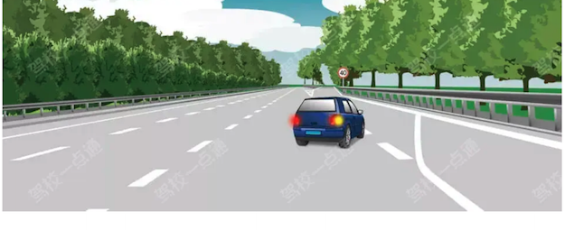

**选项**
- A. 正确
- B. 错误

**答案**：A（正确）
**秒懂技巧**：进入减速车道就是要离开高速，灯光找左进右出/入左出右，出高速找右转向灯
**解释**：适用于速度灯光考点总结相关题。做题时先抓题干关键词，再按口诀定位答案。
**相关考点**：速度灯光考点总结

### 24. 进入减速车道就是要离开高速，灯光选左进右出/入左出右，出高速选右转向灯

> 记忆核心：适用于速度灯光考点总结相关题。做题时先抓题干关键词，再按口诀定位答案。
> 使用方法：这类题适合快速直选；但遇到“错误的是、不能、不得”要先看清正反问法。

- 类型/频次：速记口诀×1；共 1 题；含图 1 题
- 对应题号：P5-052

#### 代表原题

##### P5-052｜试卷5 冲刺100题

**原题**：进入高速公路减速车道时怎样使用灯光？

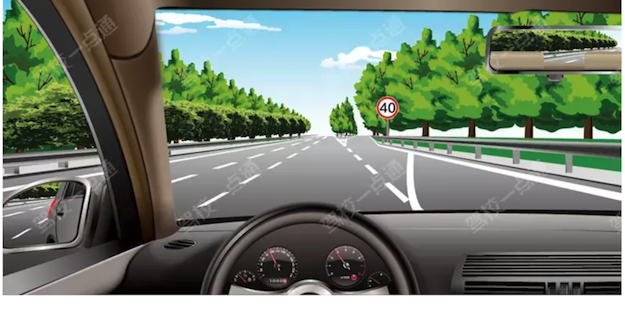

**选项**
- A. 开启左转向灯
- B. 开启右转向灯
- C. 开启危险报警闪光灯
- D. 开启前照灯

**答案**：B（开启右转向灯）
**秒懂技巧**：进入减速车道就是要离开高速，灯光选左进右出/入左出右，出高速选右转向灯
**解释**：适用于速度灯光考点总结相关题。做题时先抓题干关键词，再按口诀定位答案。
**相关考点**：速度灯光考点总结

### 25. 速度题看到大于100选100，低于100选50

> 记忆核心：在高速公路行驶时，车辆速度超过100km每小时，要保持100米以上跟车距离。当车速低于100km每小时，可以适当缩短跟车距离，但最小不得少于50米。 《道路交通安全法实施条例》第八十条：机动车在高速公路上行驶，车速低于每小时100公里时，与同车道前车距离可以适当缩短，但最小距离不得少于50米。
> 使用方法：先圈出题干关键词，再到选项里找口诀提示的答案词。

- 类型/频次：秒懂技巧×1；共 1 题
- 对应题号：P4-077

#### 代表原题

##### P4-077｜试卷4 易错100题

**原题**：驾驶小型载客汽车在高速公路上时速低于100公里时的最小跟车距离是多少？

**选项**
- A. 不得少于50米
- B. 不得少于30米
- C. 不得少于20米
- D. 不得少于10米

**答案**：A（不得少于50米）
**秒懂技巧**：速度题看到大于100选100，低于100选50
**解释**：在高速公路行驶时，车辆速度超过100km每小时，要保持100米以上跟车距离。当车速低于100km每小时，可以适当缩短跟车距离，但最小不得少于50米。 《道路交通安全法实施条例》第八十条：机动车在高速公路上行驶，车速低于每小时100公里时，与同车道前车距离可以适当缩短，但最小距离不得少于50米。

### 26. 非机动车道/窄路/弯路/弯道/窄桥/陡坡/冰雪路/泥泞路/掉头/转弯/铁路道口/牵引故障车,最高速度不超30

> 记忆核心：本题考点为特殊路段限速规定相关内容。机动车掉头、转弯、下陡坡时的最高速度不能超过每小时30公里，题中说不能超过每小时40公里，选择错误。 《道路交通安全法实施条例》第四十六条： 机动车行驶中在冰雪、泥泞的道路上行驶时，最高行驶速度不得超过每小时30公里。
> 使用方法：本题考点为特殊路段限速规定相关内容。机动车掉头、转弯、下陡坡时的最高速度不能超过每小时30公里，题中说不能超过每小时40公里，选择错误。 《道路交通安全法实施条例》第四十六条： 机动车行驶中在冰雪、泥泞的道路上行驶时，最高行驶速度不得超过每小时30公里。

- 类型/频次：秒懂技巧×1；共 1 题
- 对应题号：P5-036

#### 代表原题

##### P5-036｜试卷5 冲刺100题

**原题**：掉头、转弯、下陡坡时的最高车速是40km/h。

**选项**
- A. 正确
- B. 错误

**答案**：B（错误）
**秒懂技巧**：非机动车道/窄路/弯路/弯道/窄桥/陡坡/冰雪路/泥泞路/掉头/转弯/铁路道口/牵引故障车,最高速度不超30
**解释**：本题考点为特殊路段限速规定相关内容。机动车掉头、转弯、下陡坡时的最高速度不能超过每小时30公里，题中说不能超过每小时40公里，选择错误。 《道路交通安全法实施条例》第四十六条： 机动车行驶中在冰雪、泥泞的道路上行驶时，最高行驶速度不得超过每小时30公里。
**相关考点**：速度灯光考点总结

### 27. 非紧急情况不得在应急车道停车

> 记忆核心：当高速公路上感到疲劳时，正确的做法是驶入服务区休息，不能在应急车道内停车休息。在应急车道上随意停车休息是违法的，并且非常危险，而且会阻碍紧急救援车辆的通行，可能会导致其他车辆在紧急情况下无法及时停靠。
> 使用方法：当高速公路上感到疲劳时，正确的做法是驶入服务区休息，不能在应急车道内停车休息。在应急车道上随意停车休息是违法的，并且非常危险，而且会阻碍紧急救援车辆的通行，可能会导致其他车辆在紧急情况下无法及时停靠。

- 类型/频次：秒懂技巧×1；共 1 题
- 对应题号：P5-100

#### 代表原题

##### P5-100｜试卷5 冲刺100题

**原题**：在高速公路上驾驶机动车感觉疲劳时，应驶入最近的服务区休息，不得在应急车道内停车休息。

**选项**
- A. 正确
- B. 错误

**答案**：A（正确）
**秒懂技巧**：非紧急情况不得在应急车道停车
**解释**：当高速公路上感到疲劳时，正确的做法是驶入服务区休息，不能在应急车道内停车休息。在应急车道上随意停车休息是违法的，并且非常危险，而且会阻碍紧急救援车辆的通行，可能会导致其他车辆在紧急情况下无法及时停靠。
**相关考点**：通行原则考点总结

### 28. 题中看到车流，选车流

> 记忆核心：高速公路上遇前方车流缓行，应跟随车流行驶，保持安全车距。 在高速公路上立即停车是非常危险的，容易导致后方车辆追尾； 高速公路上倒车是违法行为，而且可能引发重大交通事故； 在高速公路上行驶如果没有紧急的情况机动车不得在应急车道上行驶。
> 使用方法：先圈出题干关键词，再到选项里找口诀提示的答案词。

- 类型/频次：关键字答题×1；共 1 题
- 对应题号：P5-061

#### 代表原题

##### P5-061｜试卷5 冲刺100题

**原题**：驾驶机动车在高速公路上遇前方车流缓行时，以下做法正确的是什么？

**选项**
- A. 跟随车流行驶，保持安全车距
- B. 进入应急车道行驶
- C. 可以倒车
- D. 立即停车

**答案**：A（跟随车流行驶，保持安全车距）
**秒懂技巧**：题中看到车流，选车流
**解释**：高速公路上遇前方车流缓行，应跟随车流行驶，保持安全车距。 在高速公路上立即停车是非常危险的，容易导致后方车辆追尾； 高速公路上倒车是违法行为，而且可能引发重大交通事故； 在高速公路上行驶如果没有紧急的情况机动车不得在应急车道上行驶。
**相关考点**：通行原则考点总结

### 29. 题目看到进入高速错误的，选直接

> 记忆核心：机动车由加速车道驶入行车道，在加速车道上加速，同时要开启左转向灯； 密切注意左侧行车道的车流状态，同时用后视镜观察后方的情况； 充分利用加速车道的长度加速，确认安全后，平顺地进入行车道。 不得直接驶入最左侧车道。题中问错误的，答案选直接驶入最左侧车道。
> 使用方法：先圈出题干关键词，再到选项里找口诀提示的答案词。

- 类型/频次：关键字答题×1；共 1 题
- 对应题号：P4-010

#### 代表原题

##### P4-010｜试卷4 易错100题

**原题**：以下从加速车道驶入高速公路的做法错误的是（）。

**选项**
- A. 开启左转向灯
- B. 直接驶入最左侧车道
- C. 注意左侧车道的车流状态
- D. 充分利用加速车道的长度加速

**答案**：B（直接驶入最左侧车道）
**秒懂技巧**：题目看到进入高速错误的，选直接
**解释**：机动车由加速车道驶入行车道，在加速车道上加速，同时要开启左转向灯； 密切注意左侧行车道的车流状态，同时用后视镜观察后方的情况； 充分利用加速车道的长度加速，确认安全后，平顺地进入行车道。 不得直接驶入最左侧车道。题中问错误的，答案选直接驶入最左侧车道。
**相关考点**：通行原则考点总结

### 30. 题目问最高速度不能超过多少？没有配图的就选30

> 记忆核心：本题考点为特殊路段限速规定相关内容。冰雪、泥泞等道路，路况复杂，要减速慢行，限速30公里/小时。 《道路交通安全法实施条例》第四十六条： 机动车行驶中在冰雪、泥泞的道路上行驶时，最高行驶速度不得超过每小时30公里。
> 使用方法：这类题适合快速直选；但遇到“错误的是、不能、不得”要先看清正反问法。

- 类型/频次：秒懂技巧×1；共 1 题
- 对应题号：P5-067

#### 代表原题

##### P5-067｜试卷5 冲刺100题

**原题**：驾驶机动车在冰雪道路行驶时，最高速度不能超过多少？

**选项**
- A. 20公里/小时
- B. 30公里/小时
- C. 40公里/小时
- D. 50公里/小时

**答案**：B（30公里/小时）
**秒懂技巧**：题目问最高速度不能超过多少？没有配图的就选30
**解释**：本题考点为特殊路段限速规定相关内容。冰雪、泥泞等道路，路况复杂，要减速慢行，限速30公里/小时。 《道路交通安全法实施条例》第四十六条： 机动车行驶中在冰雪、泥泞的道路上行驶时，最高行驶速度不得超过每小时30公里。
**相关考点**：特殊天气考点总结

### 31. 高速2条车道从右往左6-10/10-12

> 记忆核心：此技巧用于说明高速公路同向有两条车道时各车道限速范围。 6-10：最右侧车道行驶速度60-100km/h； 10-12：最左侧车道行驶速度100-120km/h
> 使用方法：先看图形特征，再回到题干确认问的是名称、含义还是操作。

- 类型/频次：速记口诀×1；共 1 题；含图 1 题
- 对应题号：P5-026

#### 代表原题

##### P5-026｜试卷5 冲刺100题

**原题**：如图所示，在高速公路同方向两条机动车道左侧车道行驶，应保持什么车速?

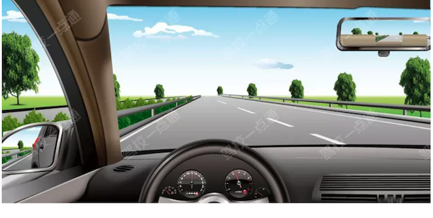

**选项**
- A. 110公里/小时～130公里/小时
- B. 100 公里/小时～120公里/小时
- C. 90 公里/小时～110公里/小时
- D. 60 公里/小时～120公里/小时

**答案**：B（100 公里/小时～120公里/小时）
**秒懂技巧**：高速2条车道从右往左6-10/10-12
**解释**：此技巧用于说明高速公路同向有两条车道时各车道限速范围。 6-10：最右侧车道行驶速度60-100km/h； 10-12：最左侧车道行驶速度100-120km/h
**相关考点**：速度灯光考点总结

### 32. 高速公路上错过出口只能向前行驶，从下一出口驶出

> 记忆核心：适用于通行原则考点总结相关题。做题时先抓题干关键词，再按口诀定位答案。
> 使用方法：适用于通行原则考点总结相关题。做题时先抓题干关键词，再按口诀定位答案。

- 类型/频次：秒懂技巧×1；共 1 题
- 对应题号：P5-023

#### 代表原题

##### P5-023｜试卷5 冲刺100题

**原题**：在高速公路上驾驶机动车，以下做法正确的是什么？

**选项**
- A. 一次变更两条车道
- B. 在行车道停车
- C. 遇前车行驶缓慢使用应急车道通行
- D. 错过出口后继续行驶，从下一出口驶出

**答案**：D（错过出口后继续行驶，从下一出口驶出）
**秒懂技巧**：高速公路上错过出口只能向前行驶，从下一出口驶出
**解释**：适用于通行原则考点总结相关题。做题时先抓题干关键词，再按口诀定位答案。
**相关考点**：通行原则考点总结

### 33. 高速公路左进右出

> 记忆核心：此技巧用于说明进出高速公路时开启的转向灯方向。 左进：表示机动车进入高速公路时，开启左转向灯进入； 右出：表示机动车驶出高速公路时，开启右转向灯驶出。
> 使用方法：此技巧用于说明进出高速公路时开启的转向灯方向。 左进：表示机动车进入高速公路时，开启左转向灯进入； 右出：表示机动车驶出高速公路时，开启右转向灯驶出。

- 类型/频次：速记口诀×1；共 1 题
- 对应题号：P3-030

#### 代表原题

##### P3-030｜试卷3 高频100题

**原题**：驾驶机动车从高速公路匝道进入加速车道应当如何正确使用灯光？

**选项**
- A. 开启右转向灯
- B. 不用开启转向灯
- C. 开启危险报警闪光灯
- D. 开启左转向灯

**答案**：D（开启左转向灯）
**秒懂技巧**：高速公路左进右出
**解释**：此技巧用于说明进出高速公路时开启的转向灯方向。 左进：表示机动车进入高速公路时，开启左转向灯进入； 右出：表示机动车驶出高速公路时，开启右转向灯驶出。
**相关考点**：速度灯光考点总结

### 34. 高速公路速度最快120，最慢60

> 记忆核心：适用于速度灯光考点总结相关题。做题时先抓题干关键词，再按口诀定位答案。
> 使用方法：适用于速度灯光考点总结相关题。做题时先抓题干关键词，再按口诀定位答案。

- 类型/频次：速记口诀×1；共 1 题
- 对应题号：P4-076

#### 代表原题

##### P4-076｜试卷4 易错100题

**原题**：驾驶小型载客汽车在高速公路行驶的最低车速为90公里/小时。

**选项**
- A. 正确
- B. 错误

**答案**：B（错误）
**秒懂技巧**：高速公路速度最快120，最慢60
**解释**：适用于速度灯光考点总结相关题。做题时先抓题干关键词，再按口诀定位答案。
**相关考点**：速度灯光考点总结

### 35. 高速随时借用应急车道，选错

> 记忆核心：非紧急情况下机动车不能占用应急车道行驶。所以本题选错误。 《道路交通安全法实施条例》第八十二条：机动车在高速公路上行驶，不得有下列行为：非紧急情况时在应急车道行驶或者停车。
> 使用方法：这类题适合快速直选；但遇到“错误的是、不能、不得”要先看清正反问法。

- 类型/频次：关键字答题×1；共 1 题
- 对应题号：P5-013

#### 代表原题

##### P5-013｜试卷5 冲刺100题

**原题**：在高速公路可以随时借用应急车道超车。

**选项**
- A. 正确
- B. 错误

**答案**：B（错误）
**秒懂技巧**：高速随时借用应急车道，选错
**解释**：非紧急情况下机动车不能占用应急车道行驶。所以本题选错误。 《道路交通安全法实施条例》第八十二条：机动车在高速公路上行驶，不得有下列行为：非紧急情况时在应急车道行驶或者停车。
**相关考点**：通行原则考点总结
