# 通行规则与安全驾驶

学习重点：遇到路口、转弯、会车、超车、行人和特殊车辆，默认减速让行、保证安全。

- 覆盖口诀：48 条
- 覆盖原题：66 题
- 含图原题：34 题

## 本章速背

| 出现 | 口诀/技巧 | 怎么用 | 代表原题 |
|---:|---|---|---|
| 5 | [选项中看到依次/顺序/礼让，直接选](#07_通行规则与安全驾驶-tip-001) | 先圈出题干关键词，再到选项里找口诀提示的答案词。 | P4-073：如图所示，遇有这种排队等候的情形怎么做？ |
| 4 | [选项中看到减速或停车，直接选](#07_通行规则与安全驾驶-tip-002) | 先圈出题干关键词，再到选项里找口诀提示的答案词。 | P4-007：通过前方路口时，以下做法正确的是（）。 |
| 3 | [口五站三](#07_通行规则与安全驾驶-tip-003) | 先看图形特征，再回到题干确认问的是名称、含义还是操作。 | P5-073：图中标注车辆在该地点停车是可以的。 |
| 3 | [选项中看到停止超车/放弃超车，直接选](#07_通行规则与安全驾驶-tip-004) | 先圈出题干关键词，再到选项里找口诀提示的答案词。 | P3-041：超车时如已驶入左侧道路，但无法保证与前车的横向安全距离，以下做法正确的是（）。 |
| 2 | [1停2看3通过](#07_通行规则与安全驾驶-tip-005) | 先看图形特征，再回到题干确认问的是名称、含义还是操作。 | P4-050：驾驶机动车行经漫水路或者漫水桥时，应当停车察明水情。 |
| 2 | [不按规定避让校车/行人，记3分](#07_通行规则与安全驾驶-tip-006) | 把违法行为和数字绑定记忆，题干变换时只要认出行为即可。 | P2-072：驾驶机动车行经人行横道，不按规定减速、停车、避让行人的，一次记3分。 |
| 2 | [前方车有向左动作（左转弯/掉头/超车）的时候不得超车](#07_通行规则与安全驾驶-tip-007) | 本题考点为超车相关内容。超车只能从前车的左侧超越。前车正在掉头时，不得超车。 《道路交通安全法实施条例》第四十七条：机动车超车时，后车应当在确认有充足的安全距离后，从前车的左侧超越。 | P4-023：同车道行驶的车辆遇前车有下列哪种情形时不得超车？ |
| 2 | [看到依次/顺序/礼让，选对](#07_通行规则与安全驾驶-tip-008) | 先圈出题干关键词，再到选项里找口诀提示的答案词。 | P3-082：驾驶机动车通过高速公路收费口时，应按规定依次排队进入，不得争道抢行。 |
| 2 | [看到可以不/可不，选错](#07_通行规则与安全驾驶-tip-009) | 先圈出题干关键词，再到选项里找口诀提示的答案词。 | P4-038：当行人出现交通安全违法行为时，车辆可以不给行人让行。 |
| 2 | [看到有减速含义的减速靠右/减速避让/降低车速，选对](#07_通行规则与安全驾驶-tip-010) | 先圈出题干关键词，再到选项里找口诀提示的答案词。 | P4-065：如图所示，在没有划分道路中心线的道路上行驶会车时必须减速靠右通过。 |
| 2 | [转弯让直行、右转让左转、同样直行让右方来车先行](#07_通行规则与安全驾驶-tip-011) | 先看图形特征，再回到题干确认问的是名称、含义还是操作。 | P3-078：在没有交通信号指示的交叉路口，转弯的机动车让直行的车辆和行人先行。 |
| 1 | [人行横道禁止停车](#07_通行规则与安全驾驶-tip-012) | 适用于安全常识考点总结相关题。做题时先抓题干关键词，再按口诀定位答案。 | P5-010：图中深色车辆在该地点临时停车是可以的。 |
| 1 | [向右变更车道使用转向灯](#07_通行规则与安全驾驶-tip-013) | 驾驶机动车向右变更车道时应当提前开启右转向灯，提醒后方车辆注意本车动向。所以本题选择正确。 《道路交通安全法实施条例》第五十七条：机动车向左转弯、向左变更车道、准备超车、驶离停车地点或者掉头时，应当提前开启左转向灯。向右变更车道时，应当开启右转向灯。 | P5-032：驾驶机动车在道路上向右变更车道应使用转向灯。 |
| 1 | [图中B车转弯撞到A车，通行原则中转弯让直行，所以B车负全部责任](#07_通行规则与安全驾驶-tip-014) | 适用于安全常识考点总结相关题。做题时先抓题干关键词，再按口诀定位答案。 | P5-059：关于图中交通事故，以下说法正确的是（） |
| 1 | [图中和题中都是停车点](#07_通行规则与安全驾驶-tip-015) | 先看图形特征，再回到题干确认问的是名称、含义还是操作。 | P4-034：这个标志是什么? |
| 1 | [图中有公交车，选公交车](#07_通行规则与安全驾驶-tip-016) | 这类题适合快速直选；但遇到“错误的是、不能、不得”要先看清正反问法。 | P4-020：道路上划设这种标线的车道内允许下列哪类车辆通行？ |
| 1 | [图中禁止掉头标志，不得掉头](#07_通行规则与安全驾驶-tip-017) | 先看图形特征，再回到题干确认问的是名称、含义还是操作。 | P4-033：如图所示，驾驶机动车行驶至此路段时，可以直接掉头。 |
| 1 | [有让无](#07_通行规则与安全驾驶-tip-018) | 先看图形特征，再回到题干确认问的是名称、含义还是操作。 | P5-080：如图所示，遇到这种情况可以优先通行。 |
| 1 | [没有分界线走中间，为两侧行人非机动车让行](#07_通行规则与安全驾驶-tip-019) | 把违法行为和数字绑定记忆，题干变换时只要认出行为即可。 | P5-033：驾驶机动车在这种道路上如何通行？ |
| 1 | [流量大/人行横道/交叉路口/窄桥，均不得超车](#07_通行规则与安全驾驶-tip-020) | 本题考点为超车相关内容。窄桥、弯道无法保持足够的安全距离，不具备超车条件，不得超车。 《道路交通安全法》第四十三条：行经铁路道口、交叉路口、窄桥、弯道、陡坡、隧道、人行横道、市区交通流量大的路段等没有超车条件的，不得超车。 | P5-024：驾驶机动车在下列哪种路段不得超车？ |
| 1 | [特殊道路50米内不得停车](#07_通行规则与安全驾驶-tip-021) | 《道路交通安全法实施条例》第六十三条：交叉路口、铁路道口、急弯路、宽度不足4米的窄路、桥梁、陡坡、隧道以及距离上述地点50米以内的路段，不得停车。 | P4-058：驾驶机动车不得在交叉路口，铁路道口，急弯路，宽度不足4米的窄路，桥梁，陡坡，隧道以及距离上述地点多少米内的路段不得停车？ |
| 1 | [特殊道路不得掉头/超车/停车](#07_通行规则与安全驾驶-tip-022) | 先看图形特征，再回到题干确认问的是名称、含义还是操作。 | P5-079：如图所示，在这个路段可以掉头。 |
| 1 | [看到不用，选错](#07_通行规则与安全驾驶-tip-023) | 先圈出题干关键词，再到选项里找口诀提示的答案词。 | P5-005：如图所示，驾驶机动车遇到没有行人通过的人行横道时不用减速慢行。 |
| 1 | [看到低速挡，选对](#07_通行规则与安全驾驶-tip-024) | 先圈出题干关键词，再到选项里找口诀提示的答案词。 | P5-053：车辆通过铁道路口前，换入低速挡，避免中途换挡导致发动机熄火。 |
| 1 | [看到便于观察，选对](#07_通行规则与安全驾驶-tip-025) | 先圈出题干关键词，再到选项里找口诀提示的答案词。 | P4-008：超车时应从前车的左侧超越，是因为左侧超车便于观察，有利于安全。 |
| 1 | [看到保持安全距离，选对](#07_通行规则与安全驾驶-tip-026) | 先圈出题干关键词，再到选项里找口诀提示的答案词。 | P4-049：驾驶机动车超车时，前方车辆不减速让路，应停止超车并适当减速，与前方车辆保持安全距离。 |
| 1 | [看到前方有警车，不能超车](#07_通行规则与安全驾驶-tip-027) | 先圈出题干关键词，再到选项里找口诀提示的答案词。 | P4-015：遇前方为执行紧急任务的警车时，可超车。 |
| 1 | [看到占用公交专用道，选错](#07_通行规则与安全驾驶-tip-028) | 先圈出题干关键词，再到选项里找口诀提示的答案词。 | P5-095：如图所示，驾驶机动车遇前方交通拥堵，可占用公交专用道行驶。 |
| 1 | [看到小型汽车科二考试包括坡起，选对](#07_通行规则与安全驾驶-tip-029) | 先圈出题干关键词，再到选项里找口诀提示的答案词。 | P2-060：小型汽车科目二考试内容包括倒车入库，坡道定点停车和起步、侧方停车、曲线行驶、直角转弯。 |
| 1 | [看到左侧有车正在超车可以等待，选对](#07_通行规则与安全驾驶-tip-030) | 先圈出题干关键词，再到选项里找口诀提示的答案词。 | P4-014：如图所示，驾驶机动车遇左侧车道有车辆正在超车时，可以等待左侧车辆完成超车后再寻找时机超车。 |
| 1 | [看到强行变道应减速，选对](#07_通行规则与安全驾驶-tip-031) | 先圈出题干关键词，再到选项里找口诀提示的答案词。 | P5-086：如图所示，驾驶机动车遇到右侧车辆强行变道，应减速慢行，让右前方车辆顺利变道。 |
| 1 | [看到掉头，选提前开灯](#07_通行规则与安全驾驶-tip-032) | 先圈出题干关键词，再到选项里找口诀提示的答案词。 | P5-075：驾驶机动车掉头时，以下做法正确的是什么? |
| 1 | [看到放弃超车的原因，选易刮擦、相撞](#07_通行规则与安全驾驶-tip-033) | 先圈出题干关键词，再到选项里找口诀提示的答案词。 | P5-056：如图所示，在超车过程中，遇对向有来车时要放弃超车是因为什么? |
| 1 | [看到注意避让，选对](#07_通行规则与安全驾驶-tip-034) | 先圈出题干关键词，再到选项里找口诀提示的答案词。 | P5-097：如图所示，驾驶机动车遇到这种情况时，A车应当注意避让。 |
| 1 | [看到行人故意车辆不承担责任，选对](#07_通行规则与安全驾驶-tip-035) | 先圈出题干关键词，再到选项里找口诀提示的答案词。 | P2-020：非机动车驾驶人、行人故意碰撞机动车造成交通事故的，机动车一方不承担赔偿责任。 |
| 1 | [看到行人，选停车让](#07_通行规则与安全驾驶-tip-036) | 先圈出题干关键词，再到选项里找口诀提示的答案词。 | P5-088：如图所示，蓝色车辆遇到图中情形时，下列做法正确的是? |
| 1 | [看到避让行人，选对](#07_通行规则与安全驾驶-tip-037) | 先圈出题干关键词，再到选项里找口诀提示的答案词。 | P5-081：遇到这种情形时要停车避让行人。 |
| 1 | [看到靠边停车选右转向灯](#07_通行规则与安全驾驶-tip-038) | 先圈出题干关键词，再到选项里找口诀提示的答案词。 | P5-048：驾驶机动车在道路上靠路边停车过程中如何使用灯光？ |
| 1 | [看见T型路口，不需减速是错误的](#07_通行规则与安全驾驶-tip-039) | 适用于通行原则考点总结相关题。做题时先抓题干关键词，再按口诀定位答案。 | P3-077：图中驾车驶近路口时，以下说法错误的是（）。 |
| 1 | [看见降速靠右，直接选](#07_通行规则与安全驾驶-tip-040) | 这类题适合快速直选；但遇到“错误的是、不能、不得”要先看清正反问法。 | P3-071：行车中遇到后方车辆要求超车时，应怎样做？ |
| 1 | [绿灯准许通行，只有1车道，左右转弯均可](#07_通行规则与安全驾驶-tip-041) | 先看图形特征，再回到题干确认问的是名称、含义还是操作。 | P5-063：如图所示，驾驶机动车在路口遇到这种信号灯可以左转或右转。 |
| 1 | [超车只能左侧超车，不得借用专用车道超车](#07_通行规则与安全驾驶-tip-042) | 适用于通行原则考点总结相关题。做题时先抓题干关键词，再按口诀定位答案。 | P5-066：在这种情况下可以借右侧公交车道超车。 |
| 1 | [路口内不得停车等，可以在路口外](#07_通行规则与安全驾驶-tip-043) | 遇交通阻塞时不得在路口内停车等待，避免加重道路拥堵所以本题选错误。 《道路交通安全法实施条例》第五十三条：机动车遇有前方交叉路口交通阻塞时，应当依次停在路口以外等候，不得进入路口。 | P5-087：驾驶机动车遇前方交叉路口交通阻塞时，路口内无网状线的，可停在路口内等候。 |
| 1 | [路口外的车让路口内的车优先行驶](#07_通行规则与安全驾驶-tip-044) | 适用于通行原则考点总结相关题。做题时先抓题干关键词，再按口诀定位答案。 | P5-096：以下做法正确的是（）。 |
| 1 | [选项中看到有减速含义的减速慢行/减速靠右/减速让行/减速避让/降低速度/提前减速/及时减速，直接选](#07_通行规则与安全驾驶-tip-045) | 先圈出题干关键词，再到选项里找口诀提示的答案词。 | P3-036：驾驶机动车通过没有交通信号的交叉路口怎样行驶？ |
| 1 | [通行原则中转弯让直行，图中B车未让A车，所以B车全责](#07_通行规则与安全驾驶-tip-046) | 先看图形特征，再回到题干确认问的是名称、含义还是操作。 | P5-089：如下图所示的交通事故中，有关事故责任认定，正确的说法是什么？ |
| 1 | [铁路道口禁止掉头的原因，会引发事故](#07_通行规则与安全驾驶-tip-047) | 先看图形特征，再回到题干确认问的是名称、含义还是操作。 | P5-027：如图所示，铁路道口禁止掉头的原因是什么? |
| 1 | [题目看到有信号灯路口错误的，选加速](#07_通行规则与安全驾驶-tip-048) | 先圈出题干关键词，再到选项里找口诀提示的答案词。 | P5-062：驾驶机动车通过有交通信号灯控制的交叉路口，以下做法错误的是什么？ |

## 口诀卡片

### 1. 选项中看到依次/顺序/礼让，直接选

> 记忆核心：适用于通行原则考点总结相关题。做题时先抓题干关键词，再按口诀定位答案。
> 使用方法：先圈出题干关键词，再到选项里找口诀提示的答案词。

- 类型/频次：关键字答题×5；共 5 题；含图 1 题
- 对应题号：P4-073、P4-074、P5-020、P5-050、P5-065

#### 代表原题

##### P4-073｜试卷4 易错100题

**原题**：如图所示，遇有这种排队等候的情形怎么做？

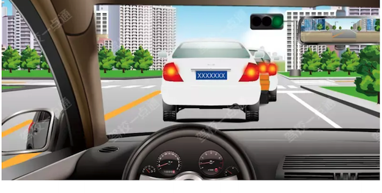

**选项**
- A. 依次排队等候
- B. 从右侧借道超越
- C. 从左侧跨越实线超越
- D. 从两侧随意超越

**答案**：A（依次排队等候）
**秒懂技巧**：选项中看到依次/顺序/礼让，直接选
**解释**：适用于通行原则考点总结相关题。做题时先抓题干关键词，再按口诀定位答案。
**相关考点**：通行原则考点总结

##### P4-074｜试卷4 易错100题

**原题**：遇前方交叉路口交通拥堵时，以下做法正确的是（）。

**选项**
- A. 依次停在路口外等候
- B. 从前方车辆两侧穿插
- C. 从前方车辆两侧超越
- D. 在人行横道、网状线区域内停车等候

**答案**：A（依次停在路口外等候）
**秒懂技巧**：选项中看到依次/顺序/礼让，直接选
**解释**：当前方交叉路口交通阻塞时，如果穿插、借道可能造成更严重的拥堵，应依次停在路口外等候。 《道路交通安全法实施条例》第五十三条：机动车遇有前方交叉路口交通阻塞时，应当依次停在路口外等候，不得进入路口。
**相关考点**：通行原则考点总结

##### P5-020｜试卷5 冲刺100题

**原题**：遇前方路段车道减少行驶缓慢，为保证安全有序应该怎样做？

**选项**
- A. 依次交替通行
- B. 穿插到前方排队车辆中通过
- C. 从前车左右超越
- D. 借对向车道通过

**答案**：A（依次交替通行）
**秒懂技巧**：选项中看到依次/顺序/礼让，直接选
**解释**：本题考点为通过缓行、拥堵路段或路口的通行规定。 《道路交通安全法》第四十五条：在车道减少的路段、路口，或者在没有交通信号灯、交通标志、交通标线或者交通警察指挥的交叉路口遇到停车排队等候或者缓慢行驶时，机动车应当依次交替通行。
**相关考点**：通行原则考点总结

展开其余 2 道对应原题

##### P5-050｜试卷5 冲刺100题

**原题**：驾驶机动车遇到前方车辆停车排队等候或缓慢行驶时怎么办？

**选项**
- A. 可借道超车
- B. 占用对面车道
- C. 穿插等候的车辆
- D. 依次行驶

**答案**：D（依次行驶）
**秒懂技巧**：选项中看到依次/顺序/礼让，直接选
**解释**：当前方车辆缓慢行驶时，如果穿插、借道可能造成更严重的拥堵，所以要依次行驶。 《道路交通安全法》第四十五条：机动车遇有前方车辆停车排队等候或者缓慢行驶时，不得借道超车或者占用对面车道，不得穿插等候的车辆。
**相关考点**：通行原则考点总结

##### P5-065｜试卷5 冲刺100题

**原题**：驾驶机动车驶出地下车库，遇车流量较大时，以下做法正确的是什么？

**选项**
- A. 鸣喇叭提醒其他车辆让行
- B. 在确认安全的情况下从车库入口驶出
- C. 依次排队等候通过
- D. 穿插车流尽快驶出

**答案**：C（依次排队等候通过）
**秒懂技巧**：选项中看到依次/顺序/礼让，直接选
**解释**：注意题中说的是驶出地下车时，遇车流较大，此时应依次排队等候通过。 此时车流量较大就算鸣喇叭提醒其他车辆让行，也不一定起到有效作用。 在确认安全的情况下从车库入口驶出，可能会加重拥堵，扰乱交通秩序。 穿插车流的做法是非常危险。
**相关考点**：通行原则考点总结

### 2. 选项中看到减速或停车，直接选

> 记忆核心：适用于通行原则考点总结相关题。做题时先抓题干关键词，再按口诀定位答案。
> 使用方法：先圈出题干关键词，再到选项里找口诀提示的答案词。

- 类型/频次：关键字答题×4；共 4 题；含图 2 题
- 对应题号：P4-007、P4-095、P4-096、P5-043

#### 代表原题

##### P4-007｜试卷4 易错100题

**原题**：通过前方路口时，以下做法正确的是（）。

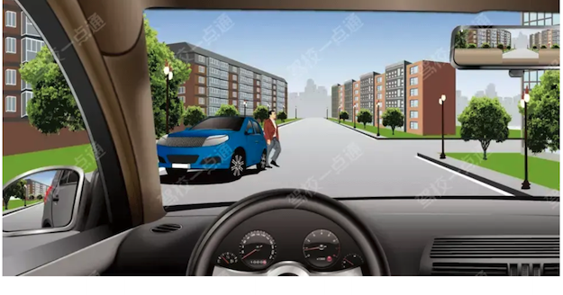

**选项**
- A. 靠左侧行驶
- B. 减速或停车避让行人
- C. 加速通过
- D. 赶在行人前通过

**答案**：B（减速或停车避让行人）
**秒懂技巧**：选项中看到减速或停车，直接选
**解释**：适用于通行原则考点总结相关题。做题时先抓题干关键词，再按口诀定位答案。
**相关考点**：通行原则考点总结

##### P5-043｜试卷5 冲刺100题

**原题**：图中车辆在拥堵路段排队行驶时，遇其他车辆强行穿插行驶，为保证安全，以下做法正确的是（）。

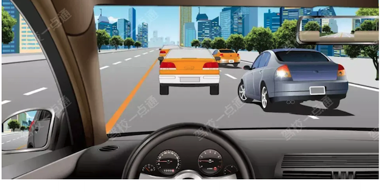

**选项**
- A. 持续鸣喇叭警告
- B. 提高车速阻止其穿插
- C. 突然转向躲避
- D. 减速或停车让行

**答案**：D（减速或停车让行）
**秒懂技巧**：选项中看到减速或停车，直接选
**解释**：适用于通行原则考点总结相关题。做题时先抓题干关键词，再按口诀定位答案。
**相关考点**：通行原则考点总结

##### P4-095｜试卷4 易错100题

**原题**：驶近没有人行横道的交叉路口时，发现有人横穿道路，应怎样做？

**选项**
- A. 减速或停车让行
- B. 鸣喇叭示意其让道
- C. 抢在行人之前通过
- D. 立即变道绕过行人

**答案**：A（减速或停车让行）
**秒懂技巧**：选项中看到减速或停车，直接选
**解释**：本题考点为避让行人。交叉路口交通情况复杂，行车时只要遇到行人横穿道路，就必须减速或停车让行。 《道路交通安全法》第四十七条：机动车行经人行横道时，应当减速行驶；遇行人正在通过人行横道，应当停车让行。
**相关考点**：通行原则考点总结

展开其余 1 道对应原题

##### P4-096｜试卷4 易错100题

**原题**：行车中遇抢救伤员的救护车从本车道逆向驶来时，应怎样做？

**选项**
- A. 靠边减速或停车让行
- B. 占用其他车道行驶
- C. 加速变更车道避让
- D. 在原车道内继续行驶

**答案**：A（靠边减速或停车让行）
**秒懂技巧**：选项中看到减速或停车，直接选
**解释**：本题考点为避让特种车辆。行车中遇抢救伤员的救护车要靠边减速或停车让行。 《道路交通安全法》第五十三条：警车、消防车、救护车、工程救险车执行紧急任务时，可以使用警报器、标志灯具；在确保安全的前提下，不受行驶路线、行驶方向、行驶速度和信号灯的限制，其他车辆和行人应当让行。
**相关考点**：通行原则考点总结

### 3. 口五站三

> 记忆核心：此技巧用于说明在路口和站点临时停车的距离规定。 路口50米以内，不得停车； 加油站/公交车站/消防站等30米以内，不能停车。
> 使用方法：先看图形特征，再回到题干确认问的是名称、含义还是操作。

- 类型/频次：速记口诀×3；共 3 题；含图 3 题
- 对应题号：P5-073、P5-078、P5-099

#### 代表原题

##### P5-073｜试卷5 冲刺100题

**原题**：图中标注车辆在该地点停车是可以的。

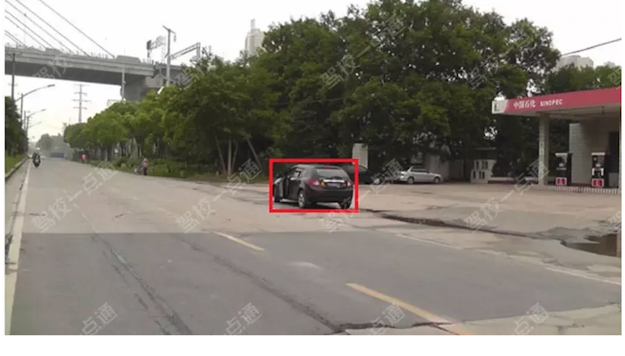

**选项**
- A. 正确
- B. 错误

**答案**：B（错误）
**秒懂技巧**：口五站三
**解释**：此技巧用于说明在路口和站点临时停车的距离规定。 路口50米以内，不得停车； 加油站/公交车站/消防站等30米以内，不能停车。
**相关考点**：安全常识考点总结

##### P5-078｜试卷5 冲刺100题

**原题**：图中小型汽车的停车地点是正确的。

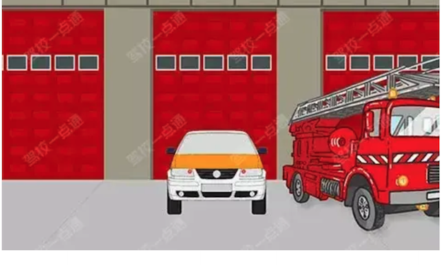

**选项**
- A. 正确
- B. 错误

**答案**：B（错误）
**秒懂技巧**：口五站三
**解释**：此技巧用于说明在路口和站点临时停车的距离规定。 路口50米以内，不得停车； 加油站/公交车站/消防站等30米以内，不能停车。
**相关考点**：安全常识考点总结

##### P5-099｜试卷5 冲刺100题

**原题**：如图所示，这样停放机动车有什么违法行为？

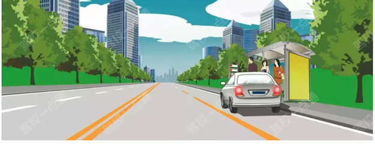

**选项**
- A. 停车占用人行道
- B. 在公共汽车站停车
- C. 在有禁停标志路段停车
- D. 在非机动车道停车

**答案**：B（在公共汽车站停车）
**秒懂技巧**：口五站三
**解释**：此技巧用于说明在路口和站点临时停车的距离规定。 路口50米以内，不得停车； 加油站/公交车站/消防站等30米以内，不能停车。
**相关考点**：安全常识考点总结

### 4. 选项中看到停止超车/放弃超车，直接选

> 记忆核心：本题考点为超车。超车时要有足够的安全距离，如果无法保证与正常行驶前车的横向安全间距，没有超车条件，应当放弃超车，另寻合适机会超车。 并行一段距离后再超越容易发生事故，是错误的。
> 使用方法：先圈出题干关键词，再到选项里找口诀提示的答案词。

- 类型/频次：关键字答题×3；共 3 题；含图 1 题
- 对应题号：P3-041、P5-007、P5-069

#### 代表原题

##### P5-007｜试卷5 冲刺100题

**原题**：如图所示，驾驶机动车在这种情况下，当C车减速让超车时，A车应该如何行驶？

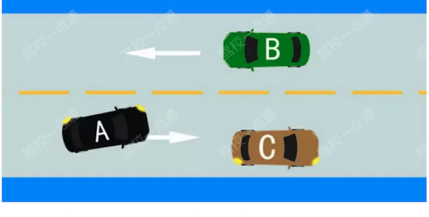

**选项**
- A. 放弃超越C车
- B. 加速超越C车
- C. 鸣喇叭示意B车让行后超车
- D. 直接向左变更车道，迫使B车让行

**答案**：A（放弃超越C车）
**秒懂技巧**：选项中看到停止超车/放弃超车，直接选
**解释**：适用于通行原则考点总结相关题。做题时先抓题干关键词，再按口诀定位答案。
**相关考点**：通行原则考点总结

##### P3-041｜试卷3 高频100题

**原题**：超车时如已驶入左侧道路，但无法保证与前车的横向安全距离，以下做法正确的是（）。

**选项**
- A. 加速超越
- B. 并行一段距离后再超越
- C. 放弃超车
- D. 谨慎超越

**答案**：C（放弃超车）
**秒懂技巧**：选项中看到停止超车/放弃超车，直接选
**解释**：本题考点为超车。超车时要有足够的安全距离，如果无法保证与正常行驶前车的横向安全间距，没有超车条件，应当放弃超车，另寻合适机会超车。 并行一段距离后再超越容易发生事故，是错误的。
**相关考点**：通行原则考点总结

##### P5-069｜试卷5 冲刺100题

**原题**：驾驶人在超车时，前方车辆不减速、不让道，应怎样做？

**选项**
- A. 连续鸣喇叭加速超越
- B. 加速继续超越
- C. 停止继续超车
- D. 紧跟其后，伺机再超

**答案**：C（停止继续超车）
**秒懂技巧**：选项中看到停止超车/放弃超车，直接选
**解释**：本题考点为超车。超车时遇前方车辆不减速、不让道，如果再强行超越，容易造成事故，所以要停止继续超车，再选择适当时机超越前车。 不得加速超越，也不得紧跟其后，要保持安全距离。
**相关考点**：通行原则考点总结

### 5. 1停2看3通过

> 记忆核心：此技巧用于说明行经漫水路/漫水桥/铁路道口时正确通过的步骤。 1停车，2观察水情，3低速通过
> 使用方法：先看图形特征，再回到题干确认问的是名称、含义还是操作。

- 类型/频次：速记口诀×2；共 2 题；含图 1 题
- 对应题号：P4-050、P4-056

#### 代表原题

##### P4-056｜试卷4 易错100题

**原题**：如图所示，驾驶机动车行驶至铁路道口时，以下做法正确的是什么？

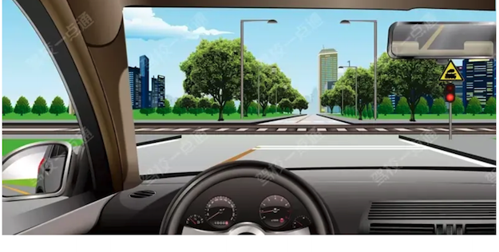

**选项**
- A. 在铁路道口倒车
- B. 无需观察，加速通过
- C. 在铁路道口掉头
- D. 停车等待

**答案**：D（停车等待）
**秒懂技巧**：1停2看3通过
**解释**：此技巧用于说明行经漫水路/漫水桥/铁路道口时正确通过的步骤。 1停车，2观察水情，3低速通过
**相关考点**：通行原则考点总结

##### P4-050｜试卷4 易错100题

**原题**：驾驶机动车行经漫水路或者漫水桥时，应当停车察明水情。

**选项**
- A. 正确
- B. 错误

**答案**：A（正确）
**秒懂技巧**：1停2看3通过
**解释**：此技巧用于说明行经漫水路/漫水桥/铁路道口时正确通过的步骤。 1停车，2观察水情，3低速通过
**相关考点**：通行原则考点总结

### 6. 不按规定避让校车/行人，记3分

> 记忆核心：《道路交通安全违法行为记分管理办法》第十一条：驾驶机动车行经人行横道不按规定减速、停车、避让行人的，一次记3分。
> 使用方法：把违法行为和数字绑定记忆，题干变换时只要认出行为即可。

- 类型/频次：关键字答题×2；共 2 题
- 对应题号：P2-072、P3-059

#### 代表原题

##### P2-072｜试卷2 高频100题

**原题**：驾驶机动车行经人行横道，不按规定减速、停车、避让行人的，一次记3分。

**选项**
- A. 正确
- B. 错误

**答案**：A（正确）
**秒懂技巧**：不按规定避让校车/行人，记3分
**解释**：《道路交通安全违法行为记分管理办法》第十一条：驾驶机动车行经人行横道不按规定减速、停车、避让行人的，一次记3分。
**相关考点**：扣分题考点总结

##### P3-059｜试卷3 高频100题

**原题**：驾驶机动车不按规定避让校车的，一次记6分。

**选项**
- A. 正确
- B. 错误

**答案**：B（错误）
**秒懂技巧**：不按规定避让校车/行人，记3分
**解释**：校车在道路上行驶时享有一定的交通优先权，其他车辆在遇到校车停车放学或上学的情况时，需采取相应的避让措施。如果不按规定避让校车，一次记3分。 《道路交通安全违法行为记分管理办法》第十一条：驾驶机动车不按规定避让校车的，一次记3分。
**相关考点**：扣分题考点总结

### 7. 前方车有向左动作（左转弯/掉头/超车）的时候不得超车

> 记忆核心：本题考点为超车相关内容。超车只能从前车的左侧超越。前车正在掉头时，不得超车。 《道路交通安全法实施条例》第四十七条：机动车超车时，后车应当在确认有充足的安全距离后，从前车的左侧超越。
> 使用方法：本题考点为超车相关内容。超车只能从前车的左侧超越。前车正在掉头时，不得超车。 《道路交通安全法实施条例》第四十七条：机动车超车时，后车应当在确认有充足的安全距离后，从前车的左侧超越。

- 类型/频次：秒懂技巧×2；共 2 题；含图 1 题
- 对应题号：P4-023、P5-074

#### 代表原题

##### P5-074｜试卷5 冲刺100题

**原题**：驾驶机动车在遇这种情况时，我方车辆不能超越是因为？

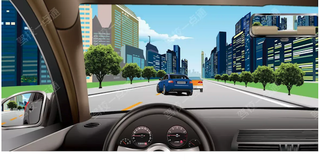

**选项**
- A. 前车速度过快
- B. 我方车速不足以超越前车
- C. 路中心为黄线
- D. 前车正在超车

**答案**：D（前车正在超车）
**秒懂技巧**：前方车有向左动作（左转弯/掉头/超车）的时候不得超车
**解释**：秒懂技巧: 前方车有向左动作（左转弯/掉头/超车）的时候不得超车
**相关考点**：通行原则考点总结

##### P4-023｜试卷4 易错100题

**原题**：同车道行驶的车辆遇前车有下列哪种情形时不得超车？

**选项**
- A. 正在停车
- B. 减速让行
- C. 正在掉头
- D. 正常行驶

**答案**：C（正在掉头）
**秒懂技巧**：前方车有向左动作（左转弯/掉头/超车）的时候不得超车
**解释**：本题考点为超车相关内容。超车只能从前车的左侧超越。前车正在掉头时，不得超车。 《道路交通安全法实施条例》第四十七条：机动车超车时，后车应当在确认有充足的安全距离后，从前车的左侧超越。
**相关考点**：通行原则考点总结

### 8. 看到依次/顺序/礼让，选对

> 记忆核心：遇高速公路收费口拥堵，应按序排队等候，不得抢行。所以本题选正确。 《道路交通安全法》第四十五条：机动车遇有前方车辆停车排队等候或者缓慢行驶时，不得借道超车或者占用对面车道，不得穿插等候的车辆。
> 使用方法：先圈出题干关键词，再到选项里找口诀提示的答案词。

- 类型/频次：关键字答题×2；共 2 题
- 对应题号：P3-082、P5-041

#### 代表原题

##### P3-082｜试卷3 高频100题

**原题**：驾驶机动车通过高速公路收费口时，应按规定依次排队进入，不得争道抢行。

**选项**
- A. 正确
- B. 错误

**答案**：A（正确）
**秒懂技巧**：看到依次/顺序/礼让，选对
**解释**：遇高速公路收费口拥堵，应按序排队等候，不得抢行。所以本题选正确。 《道路交通安全法》第四十五条：机动车遇有前方车辆停车排队等候或者缓慢行驶时，不得借道超车或者占用对面车道，不得穿插等候的车辆。
**相关考点**：通行原则考点总结

##### P5-041｜试卷5 冲刺100题

**原题**：驾车在高速公路上遇前方拥堵时，应跟随前车顺序排队，并开启危险报警闪光灯。

**选项**
- A. 正确
- B. 错误

**答案**：A（正确）
**秒懂技巧**：看到依次/顺序/礼让，选对
**解释**：本题考点为高速公路拥堵。在高速公路上行驶时遇前方有拥堵，此时车辆速度都较快，应迅速降低车速，为了提醒后车防止追尾，需要开启危险报警闪光灯，所以选择正确。
**相关考点**：通行原则考点总结

### 9. 看到可以不/可不，选错

> 记忆核心：本题考点为礼让行人。在任何情况下，出于安全考虑，机动车都要礼让行人。题中说可以不给行人让行，所以选择错误。 《道路交通安全法》第四十七条：机动车遇行人横过道路，应当避让。
> 使用方法：先圈出题干关键词，再到选项里找口诀提示的答案词。

- 类型/频次：关键字答题×2；共 2 题
- 对应题号：P4-038、P4-039

#### 代表原题

##### P4-038｜试卷4 易错100题

**原题**：当行人出现交通安全违法行为时，车辆可以不给行人让行。

**选项**
- A. 正确
- B. 错误

**答案**：B（错误）
**秒懂技巧**：看到可以不/可不，选错
**解释**：本题考点为礼让行人。在任何情况下，出于安全考虑，机动车都要礼让行人。题中说可以不给行人让行，所以选择错误。 《道路交通安全法》第四十七条：机动车遇行人横过道路，应当避让。
**相关考点**：通行原则考点总结

##### P4-039｜试卷4 易错100题

**原题**：机动车在环形路口内行驶，遇有其他车辆强行驶入时，只要有优先权就可以不避让。

**选项**
- A. 正确
- B. 错误

**答案**：B（错误）
**秒懂技巧**：看到可以不/可不，选错
**解释**：本题考点为减速避让。在环形路口内突遇其他车辆强行占据自己车道，无论是否有优先权，驾驶人要减速避让、直至停车，来确保安全驾驶。题中说只要有优先权就可以不避让，所以选择错误。
**相关考点**：通行原则考点总结

### 10. 看到有减速含义的减速靠右/减速避让/降低车速，选对

> 记忆核心：适用于通行原则考点总结相关题。做题时先抓题干关键词，再按口诀定位答案。
> 使用方法：先圈出题干关键词，再到选项里找口诀提示的答案词。

- 类型/频次：关键字答题×2；共 2 题；含图 1 题
- 对应题号：P4-065、P5-054

#### 代表原题

##### P4-065｜试卷4 易错100题

**原题**：如图所示，在没有划分道路中心线的道路上行驶会车时必须减速靠右通过。

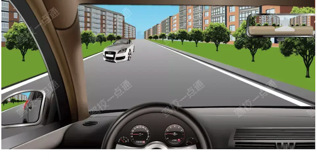

**选项**
- A. 正确
- B. 错误

**答案**：A（正确）
**秒懂技巧**：看到有减速含义的减速靠右/减速避让/降低车速，选对
**解释**：适用于通行原则考点总结相关题。做题时先抓题干关键词，再按口诀定位答案。
**相关考点**：通行原则考点总结

##### P5-054｜试卷5 冲刺100题

**原题**：小型客车行驶在平坦的高速公路上，突然有颠簸感觉时，应迅速降低车速，防止爆胎。

**选项**
- A. 正确
- B. 错误

**答案**：A（正确）
**秒懂技巧**：看到有减速含义的减速靠右/减速避让/降低车速，选对
**解释**：道路本身是平坦的，有颠簸感可能是车出现了故障，要迅速反应，及时减速，找到合适的地点停车检查。 题干中是“迅速降低车速”，而不是“迅速停车”，所以正确。
**相关考点**：安全常识考点总结

### 11. 转弯让直行、右转让左转、同样直行让右方来车先行

> 记忆核心：此技巧用于说明机动车通过没有信号灯控制也没有交警指挥的交叉路口时，应当遵守的通行原则。 转弯让直行：转弯的车辆让直行的车辆先行； 右转让左转：右转弯的车辆让左转弯的车辆先行； 同样直行的车辆让右方来车先行：两辆车均为直行让右方路口车道内的车辆先行
> 使用方法：先看图形特征，再回到题干确认问的是名称、含义还是操作。

- 类型/频次：速记口诀×2；共 2 题；含图 1 题
- 对应题号：P3-078、P4-069

#### 代表原题

##### P4-069｜试卷4 易错100题

**原题**：如图所示，驾驶机动车在路口右转弯时，遇相对方向行驶的车辆左转弯时以下做法正确的是什么？

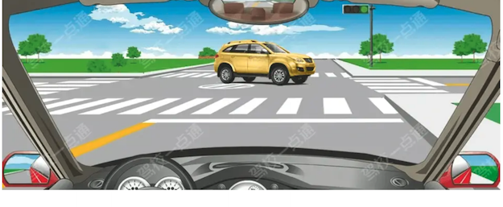

**选项**
- A. 直接右转弯
- B. 抢在对面车前右转弯
- C. 先让对面车左转弯
- D. 连续鸣喇叭催促

**答案**：C（先让对面车左转弯）
**秒懂技巧**：转弯让直行、右转让左转、同样直行让右方来车先行
**解释**：此技巧用于说明机动车通过没有信号灯控制也没有交警指挥的交叉路口时，应当遵守的通行原则。 转弯让直行：转弯的车辆让直行的车辆先行； 右转让左转：右转弯的车辆让左转弯的车辆先行； 同样直行的车辆让右方来车先行：两辆车均为直行让右方路口车道内的车辆先行
**相关考点**：通行原则考点总结

##### P3-078｜试卷3 高频100题

**原题**：在没有交通信号指示的交叉路口，转弯的机动车让直行的车辆和行人先行。

**选项**
- A. 正确
- B. 错误

**答案**：A（正确）
**秒懂技巧**：转弯让直行、右转让左转、同样直行让右方来车先行
**解释**：此技巧用于说明机动车通过没有信号灯控制也没有交警指挥的交叉路口时，应当遵守的通行原则。 转弯让直行：转弯的车辆让直行的车辆先行； 右转让左转：右转弯的车辆让左转弯的车辆先行； 同样直行的车辆让右方来车先行：两辆车均为直行让右方路口车道内的车辆先行
**相关考点**：通行原则考点总结

### 12. 人行横道禁止停车

> 记忆核心：适用于安全常识考点总结相关题。做题时先抓题干关键词，再按口诀定位答案。
> 使用方法：适用于安全常识考点总结相关题。做题时先抓题干关键词，再按口诀定位答案。

- 类型/频次：秒懂技巧×1；共 1 题；含图 1 题
- 对应题号：P5-010

#### 代表原题

##### P5-010｜试卷5 冲刺100题

**原题**：图中深色车辆在该地点临时停车是可以的。

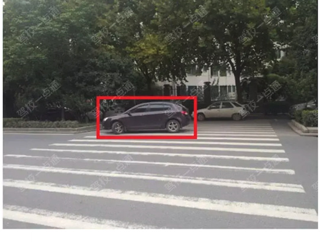

**选项**
- A. 正确
- B. 错误

**答案**：B（错误）
**秒懂技巧**：人行横道禁止停车
**解释**：适用于安全常识考点总结相关题。做题时先抓题干关键词，再按口诀定位答案。
**相关考点**：安全常识考点总结

### 13. 向右变更车道使用转向灯

> 记忆核心：驾驶机动车向右变更车道时应当提前开启右转向灯，提醒后方车辆注意本车动向。所以本题选择正确。 《道路交通安全法实施条例》第五十七条：机动车向左转弯、向左变更车道、准备超车、驶离停车地点或者掉头时，应当提前开启左转向灯。向右变更车道时，应当开启右转向灯。
> 使用方法：驾驶机动车向右变更车道时应当提前开启右转向灯，提醒后方车辆注意本车动向。所以本题选择正确。 《道路交通安全法实施条例》第五十七条：机动车向左转弯、向左变更车道、准备超车、驶离停车地点或者掉头时，应当提前开启左转向灯。向右变更车道时，应当开启右转向灯。

- 类型/频次：秒懂技巧×1；共 1 题
- 对应题号：P5-032

#### 代表原题

##### P5-032｜试卷5 冲刺100题

**原题**：驾驶机动车在道路上向右变更车道应使用转向灯。

**选项**
- A. 正确
- B. 错误

**答案**：A（正确）
**秒懂技巧**：向右变更车道使用转向灯
**解释**：驾驶机动车向右变更车道时应当提前开启右转向灯，提醒后方车辆注意本车动向。所以本题选择正确。 《道路交通安全法实施条例》第五十七条：机动车向左转弯、向左变更车道、准备超车、驶离停车地点或者掉头时，应当提前开启左转向灯。向右变更车道时，应当开启右转向灯。
**相关考点**：速度灯光考点总结

### 14. 图中B车转弯撞到A车，通行原则中转弯让直行，所以B车负全部责任

> 记忆核心：适用于安全常识考点总结相关题。做题时先抓题干关键词，再按口诀定位答案。
> 使用方法：适用于安全常识考点总结相关题。做题时先抓题干关键词，再按口诀定位答案。

- 类型/频次：秒懂技巧×1；共 1 题；含图 1 题
- 对应题号：P5-059

#### 代表原题

##### P5-059｜试卷5 冲刺100题

**原题**：关于图中交通事故，以下说法正确的是（）

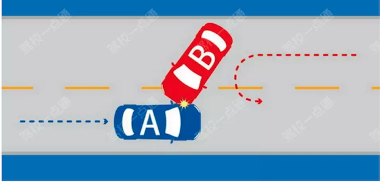

**选项**
- A. A车负全部责任
- B. B车负全部责任
- C. 都无责任，后果自行承担
- D. 各负一半责任

**答案**：B（B车负全部责任）
**秒懂技巧**：图中B车转弯撞到A车，通行原则中转弯让直行，所以B车负全部责任
**解释**：适用于安全常识考点总结相关题。做题时先抓题干关键词，再按口诀定位答案。
**相关考点**：安全常识考点总结

### 15. 图中和题中都是停车点

> 记忆核心：把口诀对应到题干关键词，优先排除与口诀相反或无关的选项。
> 使用方法：先看图形特征，再回到题干确认问的是名称、含义还是操作。

- 类型/频次：秒懂技巧×1；共 1 题；含图 1 题
- 对应题号：P4-034

#### 代表原题

##### P4-034｜试卷4 易错100题

**原题**：这个标志是什么?

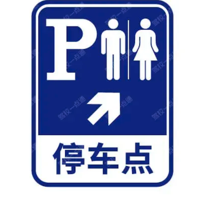

**选项**
- A. 服务站
- B. 停车点
- C. 停车场
- D. 应急避难场所

**答案**：B（停车点）
**秒懂技巧**：图中和题中都是停车点
**解释**：把口诀对应到题干关键词，优先排除与口诀相反或无关的选项。

### 16. 图中有公交车，选公交车

> 记忆核心：适用于通行原则考点总结相关题。做题时先抓题干关键词，再按口诀定位答案。
> 使用方法：这类题适合快速直选；但遇到“错误的是、不能、不得”要先看清正反问法。

- 类型/频次：秒懂技巧×1；共 1 题；含图 1 题
- 对应题号：P4-020

#### 代表原题

##### P4-020｜试卷4 易错100题

**原题**：道路上划设这种标线的车道内允许下列哪类车辆通行？

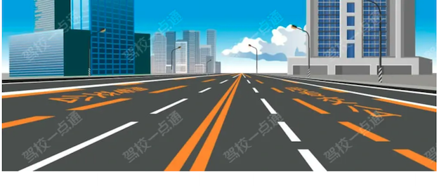

**选项**
- A. 出租车
- B. 公务用车
- C. 公交车
- D. 私家车

**答案**：C（公交车）
**秒懂技巧**：图中有公交车，选公交车
**解释**：适用于通行原则考点总结相关题。做题时先抓题干关键词，再按口诀定位答案。
**相关考点**：通行原则考点总结

### 17. 图中禁止掉头标志，不得掉头

> 记忆核心：本题考点为道路交通标志相关内容。红色表示禁止。图中标志表示禁止掉头。 机动车行驶至此路段时禁止掉头。所以本题选错误。 禁止掉头：表示前方路口禁止一切车辆掉头。此标志设在禁止掉头的路口前适当位置。
> 使用方法：先看图形特征，再回到题干确认问的是名称、含义还是操作。

- 类型/频次：秒懂技巧×1；共 1 题；含图 1 题
- 对应题号：P4-033

#### 代表原题

##### P4-033｜试卷4 易错100题

**原题**：如图所示，驾驶机动车行驶至此路段时，可以直接掉头。

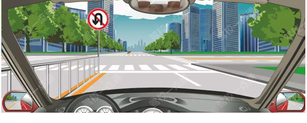

**选项**
- A. 正确
- B. 错误

**答案**：B（错误）
**秒懂技巧**：图中禁止掉头标志，不得掉头
**解释**：本题考点为道路交通标志相关内容。红色表示禁止。图中标志表示禁止掉头。 机动车行驶至此路段时禁止掉头。所以本题选错误。 禁止掉头：表示前方路口禁止一切车辆掉头。此标志设在禁止掉头的路口前适当位置。

### 18. 有让无

> 记忆核心：此技巧用于说明障碍路段的通行原则。 有障碍的路段，无障碍的一方先行； 但有障碍的一方已驶入障碍路段而无障碍的一方未驶入的，有障碍的一方先行
> 使用方法：先看图形特征，再回到题干确认问的是名称、含义还是操作。

- 类型/频次：速记口诀×1；共 1 题；含图 1 题
- 对应题号：P5-080

#### 代表原题

##### P5-080｜试卷5 冲刺100题

**原题**：如图所示，遇到这种情况可以优先通行。

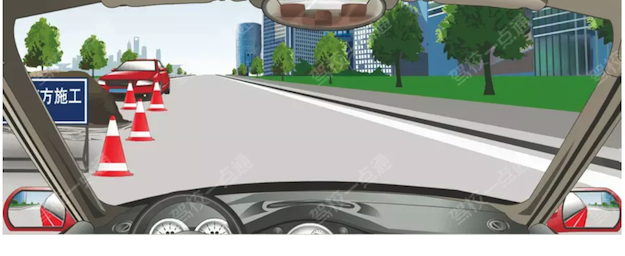

**选项**
- A. 正确
- B. 错误

**答案**：A（正确）
**秒懂技巧**：有让无
**解释**：此技巧用于说明障碍路段的通行原则。 有障碍的路段，无障碍的一方先行； 但有障碍的一方已驶入障碍路段而无障碍的一方未驶入的，有障碍的一方先行
**相关考点**：通行原则考点总结

### 19. 没有分界线走中间，为两侧行人非机动车让行

> 记忆核心：适用于通行原则考点总结相关题。做题时先抓题干关键词，再按口诀定位答案。
> 使用方法：把违法行为和数字绑定记忆，题干变换时只要认出行为即可。

- 类型/频次：速记口诀×1；共 1 题；含图 1 题
- 对应题号：P5-033

#### 代表原题

##### P5-033｜试卷5 冲刺100题

**原题**：驾驶机动车在这种道路上如何通行？

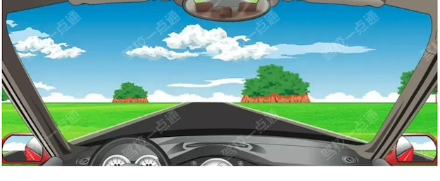

**选项**
- A. 在道路两边通行
- B. 在道路中间通行
- C. 实行分道通行
- D. 可随意通行

**答案**：B（在道路中间通行）
**秒懂技巧**：没有分界线走中间，为两侧行人非机动车让行
**解释**：适用于通行原则考点总结相关题。做题时先抓题干关键词，再按口诀定位答案。
**相关考点**：通行原则考点总结

### 20. 流量大/人行横道/交叉路口/窄桥，均不得超车

> 记忆核心：本题考点为超车相关内容。窄桥、弯道无法保持足够的安全距离，不具备超车条件，不得超车。 《道路交通安全法》第四十三条：行经铁路道口、交叉路口、窄桥、弯道、陡坡、隧道、人行横道、市区交通流量大的路段等没有超车条件的，不得超车。
> 使用方法：本题考点为超车相关内容。窄桥、弯道无法保持足够的安全距离，不具备超车条件，不得超车。 《道路交通安全法》第四十三条：行经铁路道口、交叉路口、窄桥、弯道、陡坡、隧道、人行横道、市区交通流量大的路段等没有超车条件的，不得超车。

- 类型/频次：秒懂技巧×1；共 1 题
- 对应题号：P5-024

#### 代表原题

##### P5-024｜试卷5 冲刺100题

**原题**：驾驶机动车在下列哪种路段不得超车？

**选项**
- A. 山区道路
- B. 城市高架路
- C. 城市快速路
- D. 窄桥、弯道

**答案**：D（窄桥、弯道）
**秒懂技巧**：流量大/人行横道/交叉路口/窄桥，均不得超车
**解释**：本题考点为超车相关内容。窄桥、弯道无法保持足够的安全距离，不具备超车条件，不得超车。 《道路交通安全法》第四十三条：行经铁路道口、交叉路口、窄桥、弯道、陡坡、隧道、人行横道、市区交通流量大的路段等没有超车条件的，不得超车。
**相关考点**：通行原则考点总结

### 21. 特殊道路50米内不得停车

> 记忆核心：《道路交通安全法实施条例》第六十三条：交叉路口、铁路道口、急弯路、宽度不足4米的窄路、桥梁、陡坡、隧道以及距离上述地点50米以内的路段，不得停车。
> 使用方法：《道路交通安全法实施条例》第六十三条：交叉路口、铁路道口、急弯路、宽度不足4米的窄路、桥梁、陡坡、隧道以及距离上述地点50米以内的路段，不得停车。

- 类型/频次：秒懂技巧×1；共 1 题
- 对应题号：P4-058

#### 代表原题

##### P4-058｜试卷4 易错100题

**原题**：驾驶机动车不得在交叉路口，铁路道口，急弯路，宽度不足4米的窄路，桥梁，陡坡，隧道以及距离上述地点多少米内的路段不得停车？

**选项**
- A. 30
- B. 80
- C. 50
- D. 100

**答案**：C（50）
**秒懂技巧**：特殊道路50米内不得停车
**解释**：《道路交通安全法实施条例》第六十三条：交叉路口、铁路道口、急弯路、宽度不足4米的窄路、桥梁、陡坡、隧道以及距离上述地点50米以内的路段，不得停车。
**相关考点**：安全常识考点总结

### 22. 特殊道路不得掉头/超车/停车

> 记忆核心：适用于通行原则考点总结相关题。做题时先抓题干关键词，再按口诀定位答案。
> 使用方法：先看图形特征，再回到题干确认问的是名称、含义还是操作。

- 类型/频次：秒懂技巧×1；共 1 题；含图 1 题
- 对应题号：P5-079

#### 代表原题

##### P5-079｜试卷5 冲刺100题

**原题**：如图所示，在这个路段可以掉头。

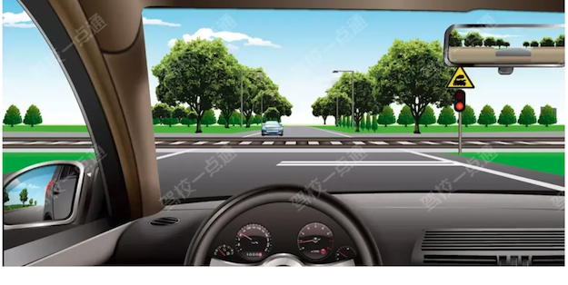

**选项**
- A. 正确
- B. 错误

**答案**：B（错误）
**秒懂技巧**：特殊道路不得掉头/超车/停车
**解释**：适用于通行原则考点总结相关题。做题时先抓题干关键词，再按口诀定位答案。
**相关考点**：通行原则考点总结

### 23. 看到不用，选错

> 记忆核心：适用于通行原则考点总结相关题。做题时先抓题干关键词，再按口诀定位答案。
> 使用方法：先圈出题干关键词，再到选项里找口诀提示的答案词。

- 类型/频次：关键字答题×1；共 1 题；含图 1 题
- 对应题号：P5-005

#### 代表原题

##### P5-005｜试卷5 冲刺100题

**原题**：如图所示，驾驶机动车遇到没有行人通过的人行横道时不用减速慢行。

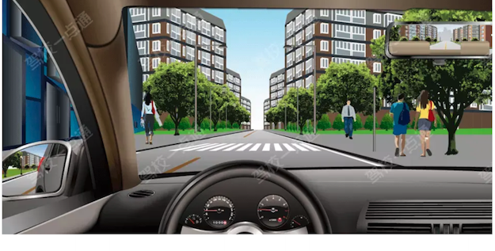

**选项**
- A. 正确
- B. 错误

**答案**：B（错误）
**秒懂技巧**：看到不用，选错
**解释**：适用于通行原则考点总结相关题。做题时先抓题干关键词，再按口诀定位答案。
**相关考点**：通行原则考点总结

### 24. 看到低速挡，选对

> 记忆核心：本题考点为铁路道口。铁路道口的道路一般都比较颠簸，要用低速挡安全通过，中途不得换挡。如果中途换挡发生熄火，一旦火车驶来，后果不堪设想。所以本题选择正确。
> 使用方法：先圈出题干关键词，再到选项里找口诀提示的答案词。

- 类型/频次：关键字答题×1；共 1 题
- 对应题号：P5-053

#### 代表原题

##### P5-053｜试卷5 冲刺100题

**原题**：车辆通过铁道路口前，换入低速挡，避免中途换挡导致发动机熄火。

**选项**
- A. 正确
- B. 错误

**答案**：A（正确）
**秒懂技巧**：看到低速挡，选对
**解释**：本题考点为铁路道口。铁路道口的道路一般都比较颠簸，要用低速挡安全通过，中途不得换挡。如果中途换挡发生熄火，一旦火车驶来，后果不堪设想。所以本题选择正确。
**相关考点**：通行原则考点总结

### 25. 看到便于观察，选对

> 记忆核心：本题考点为左侧超车。超车时应从前车的左侧超车，方便观察周围路况，有利于安全驾驶，防止事故发生。
> 使用方法：先圈出题干关键词，再到选项里找口诀提示的答案词。

- 类型/频次：关键字答题×1；共 1 题
- 对应题号：P4-008

#### 代表原题

##### P4-008｜试卷4 易错100题

**原题**：超车时应从前车的左侧超越，是因为左侧超车便于观察，有利于安全。

**选项**
- A. 正确
- B. 错误

**答案**：A（正确）
**秒懂技巧**：看到便于观察，选对
**解释**：本题考点为左侧超车。超车时应从前车的左侧超车，方便观察周围路况，有利于安全驾驶，防止事故发生。
**相关考点**：通行原则考点总结

### 26. 看到保持安全距离，选对

> 记忆核心：超车时遇前方车辆不让路的，应停止超车并适当减速，所以本题选正确。 超车时遇前方车辆不减速让路，如果再强行超越，容易造成事故，所以要停止超车，并适当减速，保持安全车距。
> 使用方法：先圈出题干关键词，再到选项里找口诀提示的答案词。

- 类型/频次：关键字答题×1；共 1 题
- 对应题号：P4-049

#### 代表原题

##### P4-049｜试卷4 易错100题

**原题**：驾驶机动车超车时，前方车辆不减速让路，应停止超车并适当减速，与前方车辆保持安全距离。

**选项**
- A. 正确
- B. 错误

**答案**：A（正确）
**秒懂技巧**：看到保持安全距离，选对
**解释**：超车时遇前方车辆不让路的，应停止超车并适当减速，所以本题选正确。 超车时遇前方车辆不减速让路，如果再强行超越，容易造成事故，所以要停止超车，并适当减速，保持安全车距。
**相关考点**：通行原则考点总结

### 27. 看到前方有警车，不能超车

> 记忆核心：适用于通行原则考点总结相关题。做题时先抓题干关键词，再按口诀定位答案。
> 使用方法：先圈出题干关键词，再到选项里找口诀提示的答案词。

- 类型/频次：秒懂技巧×1；共 1 题；含图 1 题
- 对应题号：P4-015

#### 代表原题

##### P4-015｜试卷4 易错100题

**原题**：遇前方为执行紧急任务的警车时，可超车。

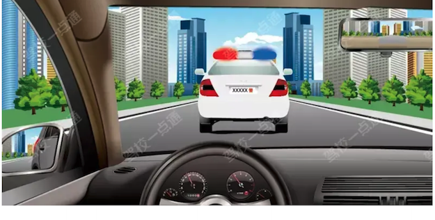

**选项**
- A. 正确
- B. 错误

**答案**：B（错误）
**秒懂技巧**：看到前方有警车，不能超车
**解释**：适用于通行原则考点总结相关题。做题时先抓题干关键词，再按口诀定位答案。
**相关考点**：通行原则考点总结

### 28. 看到占用公交专用道，选错

> 记忆核心：适用于通行原则考点总结相关题。做题时先抓题干关键词，再按口诀定位答案。
> 使用方法：先圈出题干关键词，再到选项里找口诀提示的答案词。

- 类型/频次：关键字答题×1；共 1 题；含图 1 题
- 对应题号：P5-095

#### 代表原题

##### P5-095｜试卷5 冲刺100题

**原题**：如图所示，驾驶机动车遇前方交通拥堵，可占用公交专用道行驶。

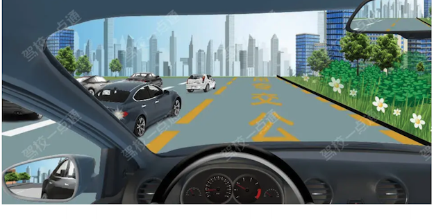

**选项**
- A. 正确
- B. 错误

**答案**：B（错误）
**秒懂技巧**：看到占用公交专用道，选错
**解释**：适用于通行原则考点总结相关题。做题时先抓题干关键词，再按口诀定位答案。
**相关考点**：通行原则考点总结

### 29. 看到小型汽车科二考试包括坡起，选对

> 记忆核心：小型汽车即小型手动挡汽车。小型手动挡汽车科目二的考试项目有：倒车入库、坡道定点停车和起步、侧方停车、曲线行驶、直角转弯。 《机动车驾驶证申领和使用规定》：小型汽车科目二考试内容包括：倒车入库、坡道定点停车和起步、侧方停车、曲线行驶、直角转弯。另据考试学员反馈，本题选正确
> 使用方法：先圈出题干关键词，再到选项里找口诀提示的答案词。

- 类型/频次：关键字答题×1；共 1 题
- 对应题号：P2-060

#### 代表原题

##### P2-060｜试卷2 高频100题

**原题**：小型汽车科目二考试内容包括倒车入库，坡道定点停车和起步、侧方停车、曲线行驶、直角转弯。

**选项**
- A. 正确
- B. 错误

**答案**：A（正确）
**秒懂技巧**：看到小型汽车科二考试包括坡起，选对
**解释**：小型汽车即小型手动挡汽车。小型手动挡汽车科目二的考试项目有：倒车入库、坡道定点停车和起步、侧方停车、曲线行驶、直角转弯。 《机动车驾驶证申领和使用规定》：小型汽车科目二考试内容包括：倒车入库、坡道定点停车和起步、侧方停车、曲线行驶、直角转弯。另据考试学员反馈，本题选正确
**相关考点**：驾驶证考点总结

### 30. 看到左侧有车正在超车可以等待，选对

> 记忆核心：适用于通行原则考点总结相关题。做题时先抓题干关键词，再按口诀定位答案。
> 使用方法：先圈出题干关键词，再到选项里找口诀提示的答案词。

- 类型/频次：关键字答题×1；共 1 题；含图 1 题
- 对应题号：P4-014

#### 代表原题

##### P4-014｜试卷4 易错100题

**原题**：如图所示，驾驶机动车遇左侧车道有车辆正在超车时，可以等待左侧车辆完成超车后再寻找时机超车。

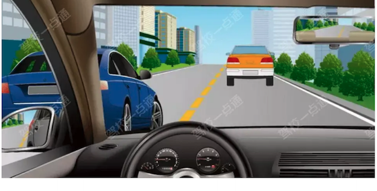

**选项**
- A. 正确
- B. 错误

**答案**：A（正确）
**秒懂技巧**：看到左侧有车正在超车可以等待，选对
**解释**：适用于通行原则考点总结相关题。做题时先抓题干关键词，再按口诀定位答案。
**相关考点**：通行原则考点总结

### 31. 看到强行变道应减速，选对

> 记忆核心：适用于通行原则考点总结相关题。做题时先抓题干关键词，再按口诀定位答案。
> 使用方法：先圈出题干关键词，再到选项里找口诀提示的答案词。

- 类型/频次：关键字答题×1；共 1 题；含图 1 题
- 对应题号：P5-086

#### 代表原题

##### P5-086｜试卷5 冲刺100题

**原题**：如图所示，驾驶机动车遇到右侧车辆强行变道，应减速慢行，让右前方车辆顺利变道。

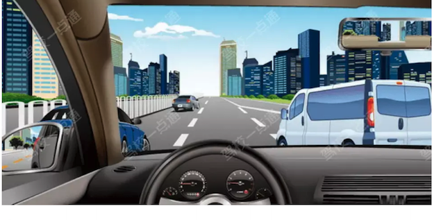

**选项**
- A. 正确
- B. 错误

**答案**：A（正确）
**秒懂技巧**：看到强行变道应减速，选对
**解释**：适用于通行原则考点总结相关题。做题时先抓题干关键词，再按口诀定位答案。
**相关考点**：通行原则考点总结

### 32. 看到掉头，选提前开灯

> 记忆核心：驾驶机动车掉头时应当提前开启左转向灯，提醒后方车辆注意本车动向。所以本题选应当提前开启左转向灯。 《道路交通安全法实施条例》第五十七条：机动车向左转弯、向左变更车道、准备超车、驶离停车地点或者掉头时，应当提前开启左转向灯。
> 使用方法：先圈出题干关键词，再到选项里找口诀提示的答案词。

- 类型/频次：关键字答题×1；共 1 题
- 对应题号：P5-075

#### 代表原题

##### P5-075｜试卷5 冲刺100题

**原题**：驾驶机动车掉头时，以下做法正确的是什么?

**选项**
- A. 在设有禁止左转标志的交叉口内掉头
- B. 驶过高速公路出口时，可掉头驶回
- C. 应当提前开启左转向灯
- D. 隧道车流少时，可以在隧道内掉头

**答案**：C（应当提前开启左转向灯）
**秒懂技巧**：看到掉头，选提前开灯
**解释**：驾驶机动车掉头时应当提前开启左转向灯，提醒后方车辆注意本车动向。所以本题选应当提前开启左转向灯。 《道路交通安全法实施条例》第五十七条：机动车向左转弯、向左变更车道、准备超车、驶离停车地点或者掉头时，应当提前开启左转向灯。
**相关考点**：速度灯光考点总结

### 33. 看到放弃超车的原因，选易刮擦、相撞

> 记忆核心：适用于通行原则考点总结相关题。做题时先抓题干关键词，再按口诀定位答案。
> 使用方法：先圈出题干关键词，再到选项里找口诀提示的答案词。

- 类型/频次：关键字答题×1；共 1 题；含图 1 题
- 对应题号：P5-056

#### 代表原题

##### P5-056｜试卷5 冲刺100题

**原题**：如图所示，在超车过程中，遇对向有来车时要放弃超车是因为什么?

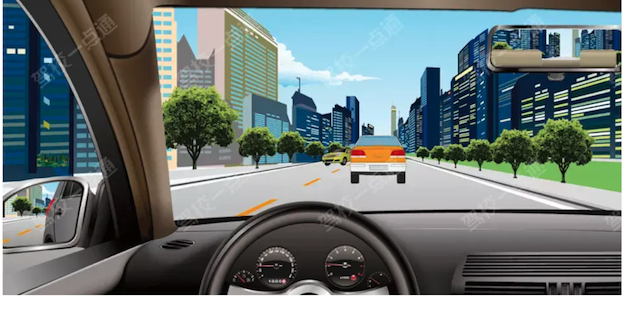

**选项**
- A. 如继续超车，易与对面机动车发生刮擦、相撞
- B. 前车车速快
- C. 对向来车车速快
- D. 我方车辆提速太慢

**答案**：A（如继续超车，易与对面机动车发生刮擦、相撞）
**秒懂技巧**：看到放弃超车的原因，选易刮擦、相撞
**解释**：适用于通行原则考点总结相关题。做题时先抓题干关键词，再按口诀定位答案。
**相关考点**：通行原则考点总结

### 34. 看到注意避让，选对

> 记忆核心：适用于通行原则考点总结相关题。做题时先抓题干关键词，再按口诀定位答案。
> 使用方法：先圈出题干关键词，再到选项里找口诀提示的答案词。

- 类型/频次：关键字答题×1；共 1 题；含图 1 题
- 对应题号：P5-097

#### 代表原题

##### P5-097｜试卷5 冲刺100题

**原题**：如图所示，驾驶机动车遇到这种情况时，A车应当注意避让。

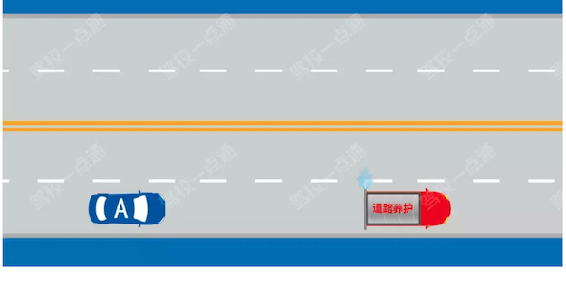

**选项**
- A. 正确
- B. 错误

**答案**：A（正确）
**秒懂技巧**：看到注意避让，选对
**解释**：适用于通行原则考点总结相关题。做题时先抓题干关键词，再按口诀定位答案。
**相关考点**：通行原则考点总结

### 35. 看到行人故意车辆不承担责任，选对

> 记忆核心：非机动车驾驶人、行人故意碰撞机动车造成交通事故的，机动车一方不承担赔偿责任。所以本题选正确。 《道路交通安全法》第七十六条：交通事故的损失是由非机动车驾驶人、行人故意碰撞机动车造成的，机动车一方不承担赔偿责任。
> 使用方法：先圈出题干关键词，再到选项里找口诀提示的答案词。

- 类型/频次：关键字答题×1；共 1 题
- 对应题号：P2-020

#### 代表原题

##### P2-020｜试卷2 高频100题

**原题**：非机动车驾驶人、行人故意碰撞机动车造成交通事故的，机动车一方不承担赔偿责任。

**选项**
- A. 正确
- B. 错误

**答案**：A（正确）
**秒懂技巧**：看到行人故意车辆不承担责任，选对
**解释**：非机动车驾驶人、行人故意碰撞机动车造成交通事故的，机动车一方不承担赔偿责任。所以本题选正确。 《道路交通安全法》第七十六条：交通事故的损失是由非机动车驾驶人、行人故意碰撞机动车造成的，机动车一方不承担赔偿责任。
**相关考点**：安全常识考点总结

### 36. 看到行人，选停车让

> 记忆核心：适用于通行原则考点总结相关题。做题时先抓题干关键词，再按口诀定位答案。
> 使用方法：先圈出题干关键词，再到选项里找口诀提示的答案词。

- 类型/频次：秒懂技巧×1；共 1 题；含图 1 题
- 对应题号：P5-088

#### 代表原题

##### P5-088｜试卷5 冲刺100题

**原题**：如图所示，蓝色车辆遇到图中情形时，下列做法正确的是?

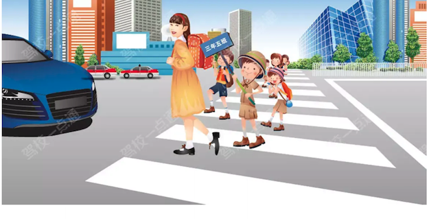

**选项**
- A. 按照前方交通信号灯指示直接通行
- B. 鸣喇叭提醒，让学生队伍中空出一个缺口，从缺口中穿行过去
- C. 停车等待，直到学生队伍完全通过
- D. 鸣喇叭，催促还未通过的学生加快速度通过

**答案**：C（停车等待，直到学生队伍完全通过）
**秒懂技巧**：看到行人，选停车让
**解释**：适用于通行原则考点总结相关题。做题时先抓题干关键词，再按口诀定位答案。
**相关考点**：通行原则考点总结

### 37. 看到避让行人，选对

> 记忆核心：适用于通行原则考点总结相关题。做题时先抓题干关键词，再按口诀定位答案。
> 使用方法：先圈出题干关键词，再到选项里找口诀提示的答案词。

- 类型/频次：关键字答题×1；共 1 题；含图 1 题
- 对应题号：P5-081

#### 代表原题

##### P5-081｜试卷5 冲刺100题

**原题**：遇到这种情形时要停车避让行人。

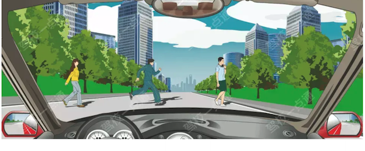

**选项**
- A. 正确
- B. 错误

**答案**：A（正确）
**秒懂技巧**：看到避让行人，选对
**解释**：适用于通行原则考点总结相关题。做题时先抓题干关键词，再按口诀定位答案。
**相关考点**：通行原则考点总结

### 38. 看到靠边停车选右转向灯

> 记忆核心：本题考点为灯光的使用相关内容。靠路边停车时要将车辆靠右侧停，方向向右，应提前打开右转向灯，提醒后方来车我方将要停车。 《道路交通安全法实施条例》第五十七条：机动车向右转弯、向右变更车道、超车完毕驶回原车道、靠路边停车时，应当提前开启右转向灯。
> 使用方法：先圈出题干关键词，再到选项里找口诀提示的答案词。

- 类型/频次：关键字答题×1；共 1 题
- 对应题号：P5-048

#### 代表原题

##### P5-048｜试卷5 冲刺100题

**原题**：驾驶机动车在道路上靠路边停车过程中如何使用灯光？

**选项**
- A. 变换使用远近光灯
- B. 不用指示灯提示
- C. 开启危险报警闪光灯
- D. 提前开启右转向灯

**答案**：D（提前开启右转向灯）
**秒懂技巧**：看到靠边停车选右转向灯
**解释**：本题考点为灯光的使用相关内容。靠路边停车时要将车辆靠右侧停，方向向右，应提前打开右转向灯，提醒后方来车我方将要停车。 《道路交通安全法实施条例》第五十七条：机动车向右转弯、向右变更车道、超车完毕驶回原车道、靠路边停车时，应当提前开启右转向灯。
**相关考点**：速度灯光考点总结

### 39. 看见T型路口，不需减速是错误的

> 记忆核心：适用于通行原则考点总结相关题。做题时先抓题干关键词，再按口诀定位答案。
> 使用方法：适用于通行原则考点总结相关题。做题时先抓题干关键词，再按口诀定位答案。

- 类型/频次：秒懂技巧×1；共 1 题；含图 1 题
- 对应题号：P3-077

#### 代表原题

##### P3-077｜试卷3 高频100题

**原题**：图中驾车驶近路口时，以下说法错误的是（）。

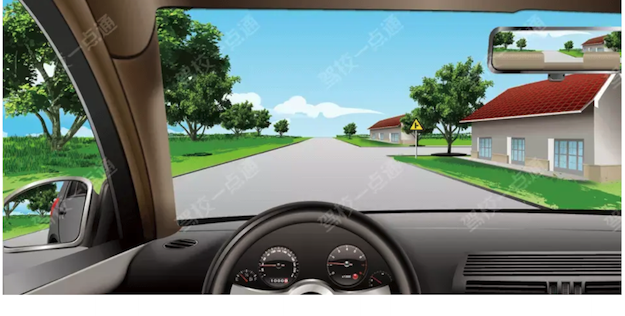

**选项**
- A. 右前方视野受阻，如有车辆冲出易引发事故
- B. 为避免车辆从路口冲出，应降低车速
- C. 己车有优先通行权，无需减速
- D. 因视野受阻，应鸣喇叭提醒侧方来车

**答案**：C（己车有优先通行权，无需减速）
**秒懂技巧**：看见T型路口，不需减速是错误的
**解释**：适用于通行原则考点总结相关题。做题时先抓题干关键词，再按口诀定位答案。
**相关考点**：通行原则考点总结

### 40. 看见降速靠右，直接选

> 记忆核心：本题考点为后车要求超车时的操作。超车要从左侧超车，因此当后车要求超车时，应当在条件允许情况下减速靠右让行，为后车留出超车空间。 要在条件允许时减速靠右，不得影响其他交通参与者。
> 使用方法：这类题适合快速直选；但遇到“错误的是、不能、不得”要先看清正反问法。

- 类型/频次：关键字答题×1；共 1 题
- 对应题号：P3-071

#### 代表原题

##### P3-071｜试卷3 高频100题

**原题**：行车中遇到后方车辆要求超车时，应怎样做？

**选项**
- A. 保持原有车速行驶
- B. 在条件许可的情况下，降低速度靠右让路
- C. 立即减速，靠右侧行驶
- D. 不让行

**答案**：B（在条件许可的情况下，降低速度靠右让路）
**秒懂技巧**：看见降速靠右，直接选
**解释**：本题考点为后车要求超车时的操作。超车要从左侧超车，因此当后车要求超车时，应当在条件允许情况下减速靠右让行，为后车留出超车空间。 要在条件允许时减速靠右，不得影响其他交通参与者。
**相关考点**：通行原则考点总结

### 41. 绿灯准许通行，只有1车道，左右转弯均可

> 记忆核心：图中信号灯是圆形绿灯，圆形灯可以直行、左转和右转。所以本题选正确。 《道路交通安全实施条例》第三十八条：绿灯亮时，准许车辆通行，但转弯的车辆不得妨碍被放行的直行车辆、行人通行。
> 使用方法：先看图形特征，再回到题干确认问的是名称、含义还是操作。

- 类型/频次：秒懂技巧×1；共 1 题；含图 1 题
- 对应题号：P5-063

#### 代表原题

##### P5-063｜试卷5 冲刺100题

**原题**：如图所示，驾驶机动车在路口遇到这种信号灯可以左转或右转。

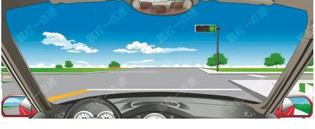

**选项**
- A. 正确
- B. 错误

**答案**：A（正确）
**秒懂技巧**：绿灯准许通行，只有1车道，左右转弯均可
**解释**：图中信号灯是圆形绿灯，圆形灯可以直行、左转和右转。所以本题选正确。 《道路交通安全实施条例》第三十八条：绿灯亮时，准许车辆通行，但转弯的车辆不得妨碍被放行的直行车辆、行人通行。

### 42. 超车只能左侧超车，不得借用专用车道超车

> 记忆核心：适用于通行原则考点总结相关题。做题时先抓题干关键词，再按口诀定位答案。
> 使用方法：适用于通行原则考点总结相关题。做题时先抓题干关键词，再按口诀定位答案。

- 类型/频次：秒懂技巧×1；共 1 题；含图 1 题
- 对应题号：P5-066

#### 代表原题

##### P5-066｜试卷5 冲刺100题

**原题**：在这种情况下可以借右侧公交车道超车。

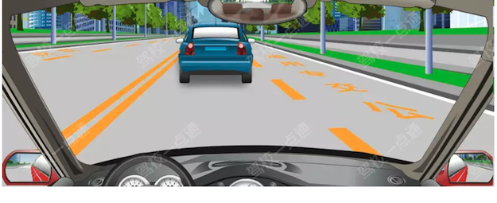

**选项**
- A. 正确
- B. 错误

**答案**：B（错误）
**秒懂技巧**：超车只能左侧超车，不得借用专用车道超车
**解释**：适用于通行原则考点总结相关题。做题时先抓题干关键词，再按口诀定位答案。
**相关考点**：通行原则考点总结

### 43. 路口内不得停车等，可以在路口外

> 记忆核心：遇交通阻塞时不得在路口内停车等待，避免加重道路拥堵所以本题选错误。 《道路交通安全法实施条例》第五十三条：机动车遇有前方交叉路口交通阻塞时，应当依次停在路口以外等候，不得进入路口。
> 使用方法：遇交通阻塞时不得在路口内停车等待，避免加重道路拥堵所以本题选错误。 《道路交通安全法实施条例》第五十三条：机动车遇有前方交叉路口交通阻塞时，应当依次停在路口以外等候，不得进入路口。

- 类型/频次：秒懂技巧×1；共 1 题
- 对应题号：P5-087

#### 代表原题

##### P5-087｜试卷5 冲刺100题

**原题**：驾驶机动车遇前方交叉路口交通阻塞时，路口内无网状线的，可停在路口内等候。

**选项**
- A. 正确
- B. 错误

**答案**：B（错误）
**秒懂技巧**：路口内不得停车等，可以在路口外
**解释**：遇交通阻塞时不得在路口内停车等待，避免加重道路拥堵所以本题选错误。 《道路交通安全法实施条例》第五十三条：机动车遇有前方交叉路口交通阻塞时，应当依次停在路口以外等候，不得进入路口。
**相关考点**：通行原则考点总结

### 44. 路口外的车让路口内的车优先行驶

> 记忆核心：适用于通行原则考点总结相关题。做题时先抓题干关键词，再按口诀定位答案。
> 使用方法：适用于通行原则考点总结相关题。做题时先抓题干关键词，再按口诀定位答案。

- 类型/频次：秒懂技巧×1；共 1 题；含图 1 题
- 对应题号：P5-096

#### 代表原题

##### P5-096｜试卷5 冲刺100题

**原题**：以下做法正确的是（）。

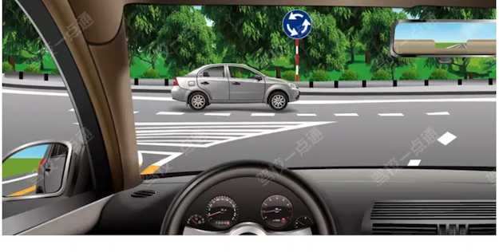

**选项**
- A. 交替变换远近光灯提醒路口内车辆让行
- B. 从路口内车辆前迅速插入
- C. 让已在路口内的车辆先行
- D. 鸣喇叭直接进入路口

**答案**：C（让已在路口内的车辆先行）
**秒懂技巧**：路口外的车让路口内的车优先行驶
**解释**：适用于通行原则考点总结相关题。做题时先抓题干关键词，再按口诀定位答案。
**相关考点**：通行原则考点总结

### 45. 选项中看到有减速含义的减速慢行/减速靠右/减速让行/减速避让/降低速度/提前减速/及时减速，直接选

> 记忆核心：没有交通信号的交叉路口，要减速慢行。同时还需观察周围情况，确认安全后通过。 《道路交通安全法》第四十四条：机动车通过没有交通信号灯、交通标志、交通标线或者交通警察指挥的交叉路口时，应当减速慢行，并让行人和优先通行的车辆先行。
> 使用方法：先圈出题干关键词，再到选项里找口诀提示的答案词。

- 类型/频次：关键字答题×1；共 1 题
- 对应题号：P3-036

#### 代表原题

##### P3-036｜试卷3 高频100题

**原题**：驾驶机动车通过没有交通信号的交叉路口怎样行驶？

**选项**
- A. 减速慢行
- B. 加速通过
- C. 大型车先行
- D. 左侧车辆先行

**答案**：A（减速慢行）
**秒懂技巧**：选项中看到有减速含义的减速慢行/减速靠右/减速让行/减速避让/降低速度/提前减速/及时减速，直接选
**解释**：没有交通信号的交叉路口，要减速慢行。同时还需观察周围情况，确认安全后通过。 《道路交通安全法》第四十四条：机动车通过没有交通信号灯、交通标志、交通标线或者交通警察指挥的交叉路口时，应当减速慢行，并让行人和优先通行的车辆先行。
**相关考点**：通行原则考点总结

### 46. 通行原则中转弯让直行，图中B车未让A车，所以B车全责

> 记忆核心：适用于安全常识考点总结相关题。做题时先抓题干关键词，再按口诀定位答案。
> 使用方法：先看图形特征，再回到题干确认问的是名称、含义还是操作。

- 类型/频次：秒懂技巧×1；共 1 题；含图 1 题
- 对应题号：P5-089

#### 代表原题

##### P5-089｜试卷5 冲刺100题

**原题**：如下图所示的交通事故中，有关事故责任认定，正确的说法是什么？

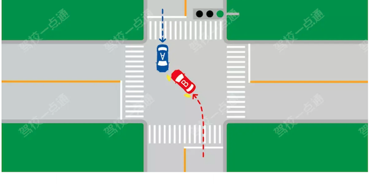

**选项**
- A. B车违反交通信号，所以B负全责
- B. B车不得妨碍被放行的车辆，所以B车负全责
- C. 直行车辆不得妨碍左转车辆，所以A车负全责
- D. 右侧方向的车辆具有优先通行权，故B车负全责

**答案**：B（B车不得妨碍被放行的车辆，所以B车负全责）
**秒懂技巧**：通行原则中转弯让直行，图中B车未让A车，所以B车全责
**解释**：适用于安全常识考点总结相关题。做题时先抓题干关键词，再按口诀定位答案。
**相关考点**：安全常识考点总结

### 47. 铁路道口禁止掉头的原因，会引发事故

> 记忆核心：适用于通行原则考点总结相关题。做题时先抓题干关键词，再按口诀定位答案。
> 使用方法：先看图形特征，再回到题干确认问的是名称、含义还是操作。

- 类型/频次：秒懂技巧×1；共 1 题；含图 1 题
- 对应题号：P5-027

#### 代表原题

##### P5-027｜试卷5 冲刺100题

**原题**：如图所示，铁路道口禁止掉头的原因是什么?

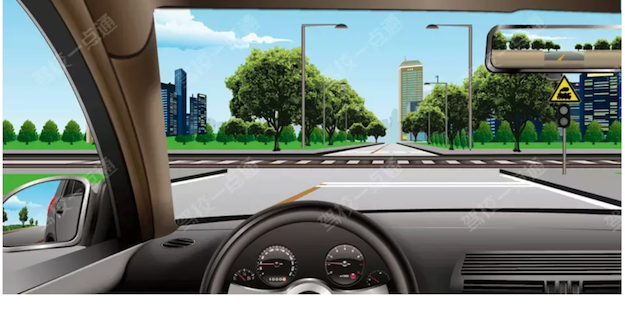

**选项**
- A. 有铁路道口标志
- B. 有铁路道口信号灯
- C. 铁路道口车流量大
- D. 容易引发事故

**答案**：D（容易引发事故）
**秒懂技巧**：铁路道口禁止掉头的原因，会引发事故
**解释**：适用于通行原则考点总结相关题。做题时先抓题干关键词，再按口诀定位答案。
**相关考点**：通行原则考点总结

### 48. 题目看到有信号灯路口错误的，选加速

> 记忆核心：黄色信号灯亮起，驾驶人要停车注意瞭望，在确认安全后通过，不得加速通过。注意题中问错误的，所以本题选黄灯亮起时应加速通过。 《道路交通安全法实施条例》第四十二条：闪光警告信号灯为持续闪烁的黄灯，提示车辆、行人通行时注意瞭望，确认安全后通过。
> 使用方法：先圈出题干关键词，再到选项里找口诀提示的答案词。

- 类型/频次：关键字答题×1；共 1 题
- 对应题号：P5-062

#### 代表原题

##### P5-062｜试卷5 冲刺100题

**原题**：驾驶机动车通过有交通信号灯控制的交叉路口，以下做法错误的是什么？

**选项**
- A. 黄灯亮起时应加速通过
- B. 向右转弯时开启右转向灯
- C. 遇放行信号时，依次通过
- D. 向左转弯时，靠路口中心点左侧转弯

**答案**：A（黄灯亮起时应加速通过）
**秒懂技巧**：题目看到有信号灯路口错误的，选加速
**解释**：黄色信号灯亮起，驾驶人要停车注意瞭望，在确认安全后通过，不得加速通过。注意题中问错误的，所以本题选黄灯亮起时应加速通过。 《道路交通安全法实施条例》第四十二条：闪光警告信号灯为持续闪烁的黄灯，提示车辆、行人通行时注意瞭望，确认安全后通过。
