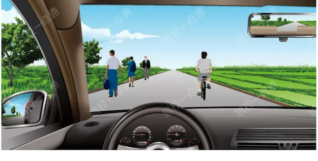
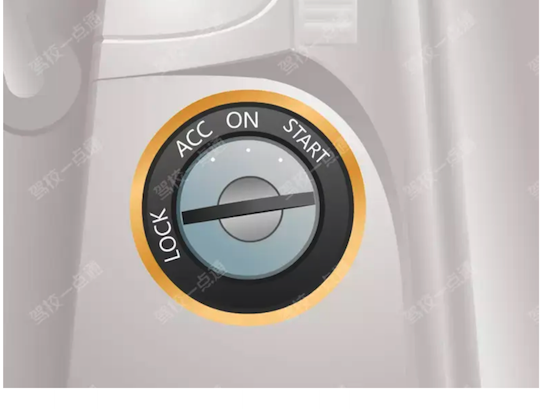
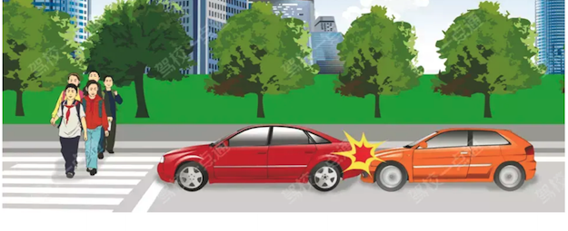

# 其他关键词技巧

学习重点：收纳跨主题关键词、判断题陷阱和少量不易归类的口诀。

- 覆盖口诀：6 条
- 覆盖原题：6 题
- 含图原题：3 题

## 本章速背

| 出现 | 口诀/技巧 | 怎么用 | 代表原题 |
|---:|---|---|---|
| 1 | [无中心线选在中间行驶，中间行驶是为了给两侧留有通行空间](#08_其他关键词技巧-tip-001) | 这类题适合快速直选；但遇到“错误的是、不能、不得”要先看清正反问法。 | P5-002：如图所示，机动车在这种道路上行驶，在道路中间通行的原因是什么? |
| 1 | [此图为点火装置](#08_其他关键词技巧-tip-002) | 把口诀对应到题干关键词，优先排除与口诀相反或无关的选项。 | P3-004：这是什么操纵装置？ |
| 1 | [电动车不能用普通灭火器](#08_其他关键词技巧-tip-003) | 电动汽车应该配备专用的车载灭火器。 电动汽车的电池着火后，普通灭火器是无法进行灭火的。 驾驶电动车出车前应先检查车辆的剩余电量，避免中途出现电量缺少耽误出行；充电时不应在车上存放易燃易爆物，当电量出现不足时要及时充电。 | P5-018：驾驶电动汽车，以下说法错误的是什么？ |
| 1 | [看到抛撒物品、不正确的，选保持整洁](#08_其他关键词技巧-tip-004) | 先圈出题干关键词，再到选项里找口诀提示的答案词。 | P5-009：驾驶车辆时在道路上抛撒物品，以下说法不正确的是？ |
| 1 | [看到预热电池，选对](#08_其他关键词技巧-tip-005) | 先圈出题干关键词，再到选项里找口诀提示的答案词。 | P3-032：冬季给电动汽车充电前，应提前预热电池。 |
| 1 | [看见两车追尾，选未保持安全距离](#08_其他关键词技巧-tip-006) | 这类题适合快速直选；但遇到“错误的是、不能、不得”要先看清正反问法。 | P4-072：这两辆车发生追尾的主要原因是什么？ |

## 口诀卡片

### 1. 无中心线选在中间行驶，中间行驶是为了给两侧留有通行空间

> 记忆核心：适用于通行原则考点总结相关题。做题时先抓题干关键词，再按口诀定位答案。
> 使用方法：这类题适合快速直选；但遇到“错误的是、不能、不得”要先看清正反问法。

- 类型/频次：秒懂技巧×1；共 1 题；含图 1 题
- 对应题号：P5-002

#### 代表原题

##### P5-002｜试卷5 冲刺100题

**原题**：如图所示，机动车在这种道路上行驶，在道路中间通行的原因是什么?

**选项**
- A. 在道路中间通行速度快
- B. 在道路中间通行视线好
- C. 给两侧的非机动车和行人留有充足的通行空间
- D. 防止车辆冲出路外

**答案**：C（给两侧的非机动车和行人留有充足的通行空间）
**秒懂技巧**：无中心线选在中间行驶，中间行驶是为了给两侧留有通行空间
**解释**：适用于通行原则考点总结相关题。做题时先抓题干关键词，再按口诀定位答案。
**相关考点**：通行原则考点总结

### 2. 此图为点火装置

> 记忆核心：把口诀对应到题干关键词，优先排除与口诀相反或无关的选项。
> 使用方法：把口诀对应到题干关键词，优先排除与口诀相反或无关的选项。

- 类型/频次：秒懂技巧×1；共 1 题；含图 1 题
- 对应题号：P3-004

#### 代表原题

##### P3-004｜试卷3 高频100题

**原题**：这是什么操纵装置？

**选项**
- A. 灯光开关
- B. 空调开关
- C. 点火开关
- D. 雨刷开关

**答案**：C（点火开关）
**秒懂技巧**：此图为点火装置
**解释**：把口诀对应到题干关键词，优先排除与口诀相反或无关的选项。

### 3. 电动车不能用普通灭火器

> 记忆核心：电动汽车应该配备专用的车载灭火器。 电动汽车的电池着火后，普通灭火器是无法进行灭火的。 驾驶电动车出车前应先检查车辆的剩余电量，避免中途出现电量缺少耽误出行；充电时不应在车上存放易燃易爆物，当电量出现不足时要及时充电。
> 使用方法：电动汽车应该配备专用的车载灭火器。 电动汽车的电池着火后，普通灭火器是无法进行灭火的。 驾驶电动车出车前应先检查车辆的剩余电量，避免中途出现电量缺少耽误出行；充电时不应在车上存放易燃易爆物，当电量出现不足时要及时充电。

- 类型/频次：秒懂技巧×1；共 1 题
- 对应题号：P5-018

#### 代表原题

##### P5-018｜试卷5 冲刺100题

**原题**：驾驶电动汽车，以下说法错误的是什么？

**选项**
- A. 出行前，应确认剩余电量
- B. 充电时不应在车上存放易燃易爆物
- C. 电量不足要及时充电
- D. 车辆上应配备普通灭火器

**答案**：D（车辆上应配备普通灭火器）
**秒懂技巧**：电动车不能用普通灭火器
**解释**：电动汽车应该配备专用的车载灭火器。 电动汽车的电池着火后，普通灭火器是无法进行灭火的。 驾驶电动车出车前应先检查车辆的剩余电量，避免中途出现电量缺少耽误出行；充电时不应在车上存放易燃易爆物，当电量出现不足时要及时充电。
**相关考点**：安全常识考点总结

### 4. 看到抛撒物品、不正确的，选保持整洁

> 记忆核心：行车过程中随意乱抛物品，并不能减少油耗，反而会破坏环境，影响后方车辆正常行驶。 《道路交通安全法实施条例》第六十二条：驾驶机动车不得向道路上抛撒物品。
> 使用方法：先圈出题干关键词，再到选项里找口诀提示的答案词。

- 类型/频次：关键字答题×1；共 1 题
- 对应题号：P5-009

#### 代表原题

##### P5-009｜试卷5 冲刺100题

**原题**：驾驶车辆时在道路上抛撒物品，以下说法不正确的是？

**选项**
- A. 抛洒纸张等轻质物品会阻挡驾驶人视线，分散驾驶人注意力
- B. 有可能引起其他驾驶人紧急躲避等应激反应，进而引发事故
- C. 破坏环境，影响环境整洁，甚至造成路面的损坏
- D. 保持车内整洁，减少燃油消耗

**答案**：D（保持车内整洁，减少燃油消耗）
**秒懂技巧**：看到抛撒物品、不正确的，选保持整洁
**解释**：行车过程中随意乱抛物品，并不能减少油耗，反而会破坏环境，影响后方车辆正常行驶。 《道路交通安全法实施条例》第六十二条：驾驶机动车不得向道路上抛撒物品。
**相关考点**：安全常识考点总结

### 5. 看到预热电池，选对

> 记忆核心：冬季在为电动汽车充电之前，要提前预热电池。 因为冬季气温较低，充电时电池会先给电池电芯加热，当电池电芯达到一定温度后才会开始给车辆充电。
> 使用方法：先圈出题干关键词，再到选项里找口诀提示的答案词。

- 类型/频次：关键字答题×1；共 1 题
- 对应题号：P3-032

#### 代表原题

##### P3-032｜试卷3 高频100题

**原题**：冬季给电动汽车充电前，应提前预热电池。

**选项**
- A. 正确
- B. 错误

**答案**：A（正确）
**秒懂技巧**：看到预热电池，选对
**解释**：冬季在为电动汽车充电之前，要提前预热电池。 因为冬季气温较低，充电时电池会先给电池电芯加热，当电池电芯达到一定温度后才会开始给车辆充电。
**相关考点**：安全常识考点总结

### 6. 看见两车追尾，选未保持安全距离

> 记忆核心：适用于通行原则考点总结相关题。做题时先抓题干关键词，再按口诀定位答案。
> 使用方法：这类题适合快速直选；但遇到“错误的是、不能、不得”要先看清正反问法。

- 类型/频次：秒懂技巧×1；共 1 题；含图 1 题
- 对应题号：P4-072

#### 代表原题

##### P4-072｜试卷4 易错100题

**原题**：这两辆车发生追尾的主要原因是什么？

**选项**
- A. 后车未与前车保持安全距离
- B. 后车超车时距离前车太近
- C. 前车采取制动过急
- D. 前车采取制动时没看后视镜

**答案**：A（后车未与前车保持安全距离）
**秒懂技巧**：看见两车追尾，选未保持安全距离
**解释**：适用于通行原则考点总结相关题。做题时先抓题干关键词，再按口诀定位答案。
**相关考点**：通行原则考点总结
